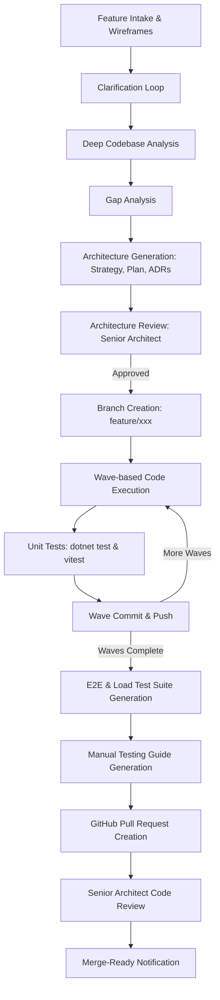

# HomeCare Agentic Framework

> **Automated End-to-End Feature Development Pipeline for Enterprise Clean Architecture Platforms**

The **HomeCare Agentic Framework** is an autonomous engineering system powered by **LangGraph**, **OpenRouter (BYOK)**, and **Langfuse Tracing**. It transforms natural language feature requests and UI wireframes into production-grade enterprise software following strict Clean Architecture, CQRS, and HIPAA/multi-tenant isolation standards.

---

## Key Features

- **Bring Your Own Key (BYOK):** Seamless OpenRouter integration allowing you to use Claude Sonnet, GPT-4o, DeepSeek, or any open/closed-source model.
- **Multimodal UI Intake:** Accepts UI mockups/wireframes and automatically extracts UI components, route requirements, and entity structures.
- **Full Observability (Langfuse):** Complete tracing of every LLM call, token consumption, latency, cost, and workflow step execution.
- **Clean Architecture & Enterprise Standards:** Enforces strict boundary separation (Domain, Application, Infrastructure, API, Frontend), zero placeholders, complete code generation, and audit logging.
- **Automated Verification Loop:** Iteratively runs `.NET` and `npm` builds, generates and runs unit tests (xUnit & Vitest), and retries on failures.
- **Dual Interface:** Interactive Rich terminal CLI with live progress tracking or browser-based Gradio Web UI.
- **Automated Pull Requests & Review:** Opens GitHub PRs, commits code wave-by-wave, and performs rigorous automated code reviews with a Senior Architect persona.

---

## Workflow Overview



### The 18 Steps Automated by the Framework

1. **Feature Intake:** Parses natural language requirements and wireframe images.
2. **Interactive Clarification:** Generates targeted technical questions to resolve ambiguities before coding.
3. **Deep Codebase Analysis:** Inspects solution structure, domain entities, CQRS commands/queries, API controllers, and frontend routes.
4. **Gap Analysis:** Maps what exists against what is needed.
5. **Strategy Generation:** Produces an enterprise-grade `STRATEGY.md` with C4 views and sequence diagrams.
6. **Tactical Plan Generation:** Produces `TACTICAL-PLAN.md` breaking work into dependency-ordered waves.
7. **Architectural Decision Records (ADRs):** Drafts formal MADR-format architectural records.
8. **Architecture Review:** Rigorous pre-implementation review with a 20+ year architect persona.
9. **Git Branching:** Checks out and pushes `feature/<module-name-kebab-case>`.
10. **Wave Execution:** Synthesizes 100% complete files across Domain, Application, Infrastructure, API, and Frontend.
11. **Unit Testing:** Generates xUnit and Vitest suites and runs `dotnet test` / `npm test`.
12. **Wave Commits:** Stages and commits code incrementally per wave.
13. **E2E Testing:** Generates Page-Object Playwright test specs.
14. **Load Testing:** Creates k6 performance benchmarks for new API endpoints.
15. **Documentation Commit:** Commits architecture artifacts and manual testing guides.
16. **Pull Request Creation:** Opens a GitHub PR with comprehensive descriptions and test badges.
17. **Code Review:** Performs an exhaustive line-by-line review verifying type safety, security, and Clean Architecture.
18. **Ready-for-Merge:** Posts review findings and notifies the team.

---

## Installation & Setup

### Prerequisites

- Python 3.10+
- [.NET SDK 8 or 9](https://dotnet.microsoft.com/download) (for backend testing/building)
- [Node.js 18+](https://nodejs.org/) (for frontend testing/building)
- Git

### Install via uv or pip

```bash
# Clone the repository
git clone https://github.com/organization/homecare-af.git
cd homecare-af

# Install with pip / uv
pip install -e .
```

### Configure Environment

Copy `.env.example` to `.env`:

```bash
cp .env.example .env
```

Set your required keys:
```env
OPENROUTER_API_KEY=sk-or-v1-your-openrouter-key
GITHUB_TOKEN=ghp_your_github_token
REPO_PATH=c:/WorkingFolder/HomeCare
REPO_URL=https://github.com/organization/HomeCare
```

---

## Usage

### Interactive Setup Wizard

Configure keys and test connections interactively:

```bash
homecare-agent setup
```

### Run Full Pipeline via CLI

Run the complete pipeline interactively from your terminal:

```bash
homecare-agent run
```

Or pass options directly:
```bash
homecare-agent run \
  --name "Order Service Request Fulfillment Workflow" \
  --description "Vendor order triage queue, acceptance/rejection, and shipment tracking" \
  --model "anthropic/claude-sonnet-4" \
  --repo-path "c:/WorkingFolder/HomeCare" \
  --parallel
```

### Launch Web Interface (Gradio)

Launch the browser interface with chat intake, live progress boards, and document previewers:

```bash
homecare-agent web --port 7860
```

Then open `http://localhost:7860` in your browser.

### Generate Architecture Documents Only

If you want to generate only the Strategy, Tactical Plan, and ADR documents without writing code:

```bash
homecare-agent generate --output-dir ./Architecture/NewFeature
```

---

## Project Structure

```
homecare-af/
├── src/homecare_agent/
│   ├── config.py             # Validated configuration & settings
│   ├── main.py               # Typer CLI entry point
│   ├── models/               # Pydantic schemas
│   ├── knowledge/            # Architecture patterns & template manager
│   ├── llm/                  # OpenRouter BYOK & Langfuse integration
│   │   └── prompts/          # Enterprise prompt templates
│   ├── tools/                # Git, GitHub, Codebase, Build, Image, Mermaid
│   ├── graph/                # LangGraph StateGraph, nodes, and routing edges
│   └── ui/                   # Rich CLI & Gradio Web interfaces
├── templates/                # Standard document templates
├── tests/                    # Test suite (pytest)
├── docs/                     # Framework architecture and configuration docs
├── Dockerfile                # Container deployment
└── docker-compose.yml        # Docker Compose configuration
```

---

## Testing

Run unit and integration tests for the framework:

```bash
pytest tests/ -v
```

---

## Documentation

- [System Architecture](file:///c:/WorkingFolder/homecare-af/docs/ARCHITECTURE.md): Comprehensive system architecture and node topology.
- [Configuration Reference](file:///c:/WorkingFolder/homecare-af/docs/CONFIGURATION.md): Complete guide to environment variables, multi-tier models, and GitHub credentials.
- [Workflow Guide](file:///c:/WorkingFolder/homecare-af/docs/WORKFLOW.md): Detailed 18-step SDLC automation lifecycle.
- [LLM Model Trade-Off Analysis](file:///c:/WorkingFolder/homecare-af/docs/LLM_MODEL_TRADEOFF_ANALYSIS.md): Extensive trade-off study evaluating high-cost vs low-cost models across Architecture Analysis, Code Generation, Latency, and Economics.

---

## License

Enterprise Proprietary — HomeCare Platform.
