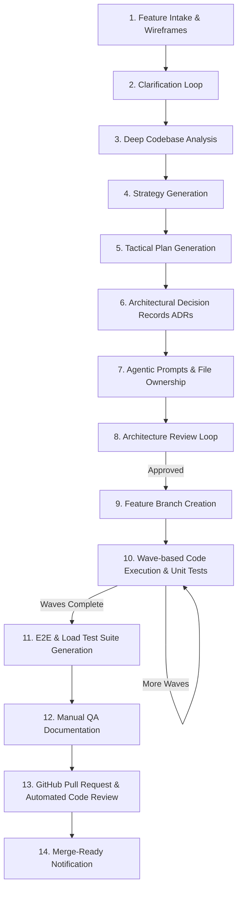

# HomeCare Agentic Framework

> **Automated End-to-End Feature Development Pipeline for Enterprise Clean Architecture Platforms**

The **HomeCare Agentic Framework** is an autonomous engineering system powered by **LangGraph**, **OpenRouter (BYOK)**, **Local LLM Support (Ollama/vLLM)**, and **Langfuse Tracing**. It transforms natural language feature requests and UI wireframes into production-grade enterprise software following strict Clean Architecture, CQRS, and HIPAA/multi-tenant isolation standards.

---

## Key Features

- **Bring Your Own Key (BYOK):** Seamless OpenRouter integration allowing you to use Claude Sonnet/Opus, GPT-4o, DeepSeek, or any frontier model.
- **Optional Local LLM for Code Generation:** Zero-token-cost local execution for code synthesis and test generation using Ollama, vLLM, or LM Studio (e.g. `qwen2.5-coder:32b`, `deepseek-coder`), while keeping high-reasoning models on OpenRouter for architecture.
- **State Checkpointing & Resumption (Resume from Step 4):** Automatic disk persistence after every pipeline step (`.homecare/checkpoints/`). If interrupted or halted after Step 3 (`analyze_codebase`), resume directly from Step 4 (`generate_strategy`) without repeating earlier steps.
- **Automated Observability (Langfuse):** Self-provisioned headless local Langfuse container with OpenTelemetry-compliant 32-character unified `trace_id` linking all LangGraph nodes, spans, and LLM generations.
- **Multimodal UI Intake:** Accepts UI mockups and wireframes, automatically extracting UI components, route requirements, and entity structures.
- **Strict Clean Architecture & Enterprise Standards:** Enforces strict boundary separation (Domain, Application, Infrastructure, API, Frontend), zero placeholders, complete code generation, and audit logging.
- **Enterprise Guardrails & Security:**
  - HTTP 402/insufficient credit fail-fast with transient rate limit retries (exponential backoff).
  - Path traversal sandboxing (`validate_safe_path`).
  - Secret scanning and auto-scrubbing in git staging and logs (`SecretMaskingFilter`).
  - Basic authentication for the Gradio Web UI.
- **Dual Interface:** Interactive Rich terminal CLI with live progress tracking or browser-based Gradio Web UI.
- **Automated Pull Requests & Review:** Opens GitHub PRs, commits code wave-by-wave, and performs automated code reviews with a Senior Architect persona.

---

## Workflow Overview



### The 14 Canonical Pipeline Steps

| Step # | Node Name | Description | Resumption Point |
|---|---|---|---|
| **1** | `intake_feature` | Parses natural language requirements and wireframe images | Initial Entry |
| **2** | `ask_clarifications` | Interactive technical Q&A loop to eliminate ambiguities | Step 2 |
| **3** | `analyze_codebase` | AST/symbol analysis of Domain, CQRS, API, and Frontend | Step 3 |
| **4** | `generate_strategy` | Produces enterprise `STRATEGY.md` with C4 views & diagrams | **Step 4 (Resume Point)** |
| **5** | `generate_tactical_plan` | Produces `TACTICAL-PLAN.md` breaking work into waves | Step 5 |
| **6** | `generate_adrs` | Drafts formal MADR-format architectural records | Step 6 |
| **7** | `generate_agentic_prompts` | Prompts engineering & file ownership matrix | Step 7 |
| **8** | `review_architecture` | Multi-agent review with a 20+ year Senior Architect | Step 8 |
| **9** | `create_branch` | Checks out and pushes `feature/<feature-name>` | Step 9 |
| **10** | `execute_wave` | Synthesizes complete code, writes files, runs unit tests | Step 10 |
| **11** | `run_e2e_tests` | Generates & executes Playwright E2E and k6 load tests | Step 11 |
| **12** | `generate_manual_test_doc` | QA manual testing guides committed to repo | Step 12 |
| **13** | `create_pr` | Opens GitHub PR and performs automated line-by-line review | Step 13 |
| **14** | `notify_ready_for_merge` | Posts review comments and notifies team of merge readiness | Step 14 |

---

## Installation & Setup

### Prerequisites

- **Python:** 3.10 or 3.11
- **Docker & Docker Compose:** For running the local Langfuse tracing server (optional, recommended)
- **.NET SDK:** [.NET SDK 8 or 9](https://dotnet.microsoft.com/download) (for backend testing/building)
- **Node.js:** [Node.js 18+](https://nodejs.org/) (for frontend testing/building)
- **Git:** Installed and available in PATH

### 1. Clone and Install Dependencies

```bash
# Clone the repository
git clone https://github.com/organization/homecare-af.git
cd homecare-af

# Install with pip / uv in editable mode
pip install -e .
```

### 2. Configure Environment Variables

Copy `.env.example` to `.env`:

```bash
cp .env.example .env
```

Configure your API keys and target repository:

```env
# ─── OpenRouter BYOK (Required for Cloud LLMs) ─────────────────────────
OPENROUTER_API_KEY=sk-or-v1-your-openrouter-key
OPENROUTER_MODEL=anthropic/claude-sonnet-4

# Multi-Tier Routing (High-reasoning for arch, cost-effective for code)
MODEL_ARCHITECTURE=anthropic/claude-sonnet-4
MODEL_CODE=deepseek/deepseek-coder
MODEL_REVIEW=anthropic/claude-sonnet-4

# ─── Optional: Local LLM for Code Generation (Zero Token Cost) ─────────
LOCAL_LLM_ENABLED=false
LOCAL_LLM_BASE_URL=http://localhost:11434/v1
LOCAL_LLM_CODE_MODEL=qwen2.5-coder:32b
LOCAL_LLM_TIMEOUT=180

# ─── Target Repository & GitHub ────────────────────────────────────────
REPO_PATH=c:/WorkingFolder/HomeCare
REPO_URL=https://github.com/organization/HomeCare
GITHUB_TOKEN=ghp_your_github_token

# ─── Langfuse Tracing (Self-Provisioning Local Instance) ────────────────
LANGFUSE_ENABLED=true
LANGFUSE_HOST=http://localhost:13000
LANGFUSE_PUBLIC_KEY=pk-lf-homecare-local
LANGFUSE_SECRET_KEY=sk-lf-homecare-local

# ─── Web UI Security (Optional) ────────────────────────────────────────
GRADIO_AUTH_USER=admin
GRADIO_AUTH_PASSWORD=YourSecurePassword123!
```

### 3. Start Local Langfuse Tracing (Optional)

The framework includes a Docker Compose setup that **automatically provisions** a local Langfuse server with pre-configured project credentials:

```bash
docker compose up -d
```

- **Langfuse Web UI:** `http://localhost:13000`
- **Pre-configured Login:** `admin@homecare.local` / `HomeCareAdmin123!`
- **PostgreSQL Database:** Running on port `15432` (avoids port collisions with local databases)

---

## Usage Guide

### 1. Interactive Setup Wizard

Configure keys, models, and test connections interactively:

```bash
homecare-agent setup
```

---

### 2. Run Full Pipeline via CLI

Start a feature run interactively:

```bash
homecare-agent run
```

Or pass all parameters via CLI flags:

```bash
homecare-agent run \
  --name "Order Service Request Fulfillment Workflow" \
  --desc "Vendor order triage queue, acceptance/rejection, and shipment tracking" \
  --repo "c:/WorkingFolder/HomeCare" \
  --wireframe "docs/mockups/order_queue.png" \
  --model-arch "anthropic/claude-sonnet-4" \
  --model-code "deepseek/deepseek-coder"
```

#### Routing Code Generation to Local LLM:

To direct code generation and unit testing to a locally hosted LLM (Ollama, vLLM, LM Studio) at zero token cost while keeping architecture on OpenRouter:

```bash
homecare-agent run \
  --name "Caregiver Shift Schedule" \
  --desc "Weekly scheduling and shift assignment" \
  --local-code \
  --local-llm-url "http://localhost:11434/v1" \
  --local-llm-model "qwen2.5-coder:32b"
```

---

### 3. Resuming Execution from Step 4 (or Any Step)

If a run stops or fails (e.g. after Step 3 `analyze_codebase` due to rate limits or interruption), you **do not need to start over from Step 1**. All context is preserved in `.homecare/checkpoints/`.

#### List Saved Checkpoints:
```bash
homecare-agent resume --list
```
Displays a table showing trace IDs, feature names, last completed steps, and next recommended steps.

#### Auto-Resume Latest Run:
```bash
# Automatically resumes from the next pending step (e.g. Step 4: generate_strategy)
homecare-agent resume
```

#### Resume a Specific Run from Step 4:
```bash
# By step number
homecare-agent resume --trace-id <trace_id> --from-step 4

# By node name
homecare-agent resume --trace-id <trace_id> --from-step generate_strategy

# Or resume using the run command directly
homecare-agent run --resume <trace_id> --from-step 4
```

---

### 4. Launch Gradio Web Interface

Launch the browser interface with chat intake, document previewers, and a dedicated checkpoint resumption tab:

```bash
homecare-agent web --port 7860
```

Open `http://localhost:7860` in your browser.

- **Tab 1: Feature Request:** Submit feature name, description, multi-tier models, local LLM toggles, and wireframe uploads.
- **Tab 2: Clarification:** Answer interactive clarification questions from the agent.
- **Tab 3: Architecture:** Live view of Strategy, Tactical Plan, ADRs, and Architecture Review.
- **Tab 4: Execution:** Real-time log and wave progress slider.
- **Tab 5: Code Review:** Senior Architect PR review feedback and findings.
- **Tab 6: 🔄 Resume Pipeline:** Select any past run from a dropdown and resume execution from Step 4 (or any chosen step) with one click!

---

### 5. Generate Architecture Documents Only

To generate only `STRATEGY.md`, `TACTICAL-PLAN.md`, and `ADR-xxx.md` without modifying code or creating git branches:

```bash
homecare-agent generate \
  --name "Patient Intake Flow" \
  --desc "Comprehensive patient intake with medical history forms" \
  --output ./Architecture/PatientIntake
```

---

## Project Structure

```
homecare-af/
├── src/homecare_agent/
│   ├── config.py                 # Validated Pydantic settings & environment
│   ├── main.py                   # Typer CLI entry point (run, resume, web, setup)
│   ├── models/                   # Pydantic schemas
│   ├── knowledge/                # Architecture patterns, templates & conventions
│   ├── llm/                      # OpenRouter & Local LLM multi-endpoint provider
│   │   ├── provider.py           # Multi-endpoint caching & Langfuse integration
│   │   └── prompts/              # Enterprise prompt templates
│   ├── security/                 # Path sandboxing, secret masking & git safety
│   │   └── redaction.py          # SecretMaskingFilter & regex scrubbing
│   ├── tools/                    # File sandboxing, git ops, build, mermaid
│   ├── graph/                    # LangGraph StateGraph assembly
│   │   ├── checkpoint.py         # CheckpointManager, 14-step sequencer & resumption
│   │   ├── state.py              # AgentState TypedDict with trace_id & resume_from_step
│   │   ├── main_graph.py         # Dynamic entry routing & compiled StateGraph
│   │   ├── nodes/                # Individual node implementations (intake, arch, etc.)
│   │   └── edges/                # Conditional routing & guardrail loop limits
│   └── ui/                       # Rich CLI & Gradio Web interfaces
│       ├── cli.py                # Rich banners, tables, and progress display
│       └── web.py                # Gradio UI with Resume Pipeline tab
├── templates/                    # Enterprise document templates (Strategy, ADR, etc.)
├── tests/                        # Automated test suite (78 tests)
│   ├── test_checkpoint_resume.py # Tests for Step 4 resumption & checkpointing
│   ├── test_local_llm.py         # Tests for local LLM routing & caching
│   ├── test_security.py          # Tests for secret masking & path traversal
│   └── ...
├── docker-compose.yml            # Self-provisioning local Langfuse & PostgreSQL setup
└── pyproject.toml                # Project metadata and dependencies
```

---

## Running the Automated Test Suite

Run the full automated test suite (78 unit & integration tests):

```bash
pytest tests/ -v
```

To run checkpoint and resumption tests specifically:

```bash
pytest tests/test_checkpoint_resume.py -v
```

---

## Documentation

- [System Architecture](docs/ARCHITECTURE.md): Comprehensive system architecture and node topology.
- [Configuration Reference](docs/CONFIGURATION.md): Complete guide to environment variables, multi-tier models, and GitHub credentials.
- [Workflow Guide](docs/WORKFLOW.md): Detailed 14-step SDLC automation lifecycle.
- [LLM Model Trade-Off Analysis](docs/LLM_MODEL_TRADEOFF_ANALYSIS.md): Trade-off evaluation comparing frontier vs cost-effective models.
- [Pipeline Resumption Architecture](walkthrough_implementation_plan/pipeline_resumption_implementation_plan.md): Deep-dive into state checkpointing and resuming from Step 4.

---

## License

Enterprise Proprietary — HomeCare Platform.
