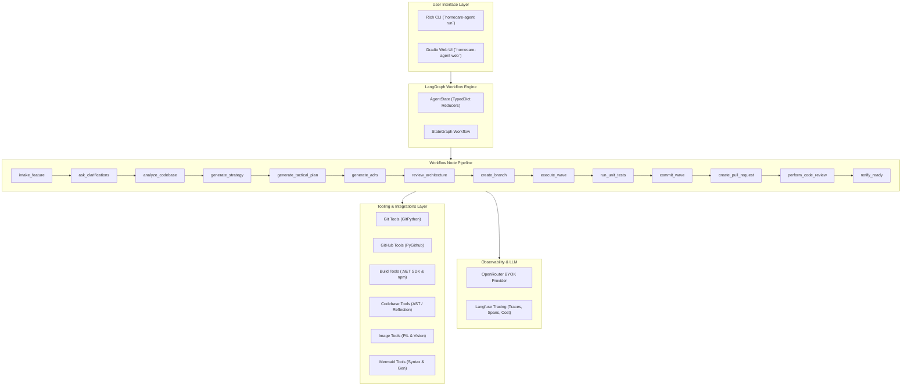

# Architecture: HomeCare Agentic Framework

## 1. System Overview

The **HomeCare Agentic Framework** is an autonomous AI-driven engineering pipeline built on **LangGraph**, designed specifically to implement complex features within enterprise healthcare platforms. It takes natural language requirements and UI wireframe screenshots, conducts automated architectural analysis, drafts strategy and tactical documents, breaks the work into dependency-ordered waves, writes production-ready code complying with Clean Architecture, executes test suites, and opens peer-reviewed Pull Requests.

---

## 2. Core Architectural Principles

### 2.1 State-Driven Orchestration (LangGraph)
All workflow progress is tracked in a centralized immutable `AgentState` object. Nodes receive the current state and return partial updates which are merged using specialized reducer functions (`merge_dicts`, `append_list`).

### 2.2 Bring Your Own Key (BYOK)
The framework connects to **OpenRouter**, enabling developers to leverage the best model for each task (e.g. Claude 3.5 Sonnet for architectural reasoning, GPT-4o for multimodal vision analysis, DeepSeek for code synthesis).

### 2.3 Comprehensive Tracing (Langfuse)
Every LLM call, prompt iteration, token count, cost, and latency measurement is automatically piped to Langfuse. This guarantees complete transparency during code generation.

### 2.4 Separation of Concerns
- **`src/homecare_agent/models/`**: Strongly-typed domain contracts and Pydantic schemas.
- **`src/homecare_agent/knowledge/`**: Enterprise conventions, Clean Architecture invariants, and template renderers.
- **`src/homecare_agent/llm/`**: OpenRouter client, retry policies, and structured prompt definitions.
- **`src/homecare_agent/tools/`**: Deterministic subprocess execution, file I/O, Git, and GitHub interactions.
- **`src/homecare_agent/graph/`**: LangGraph StateGraph, node implementations, and conditional routing edges.
- **`src/homecare_agent/ui/`**: Rich CLI and Gradio UI.
