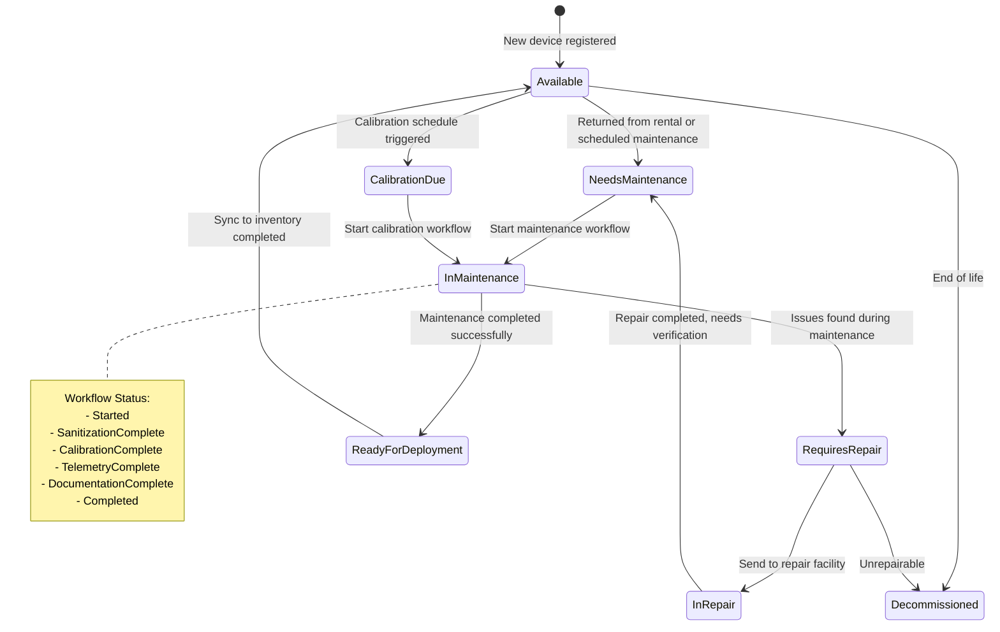
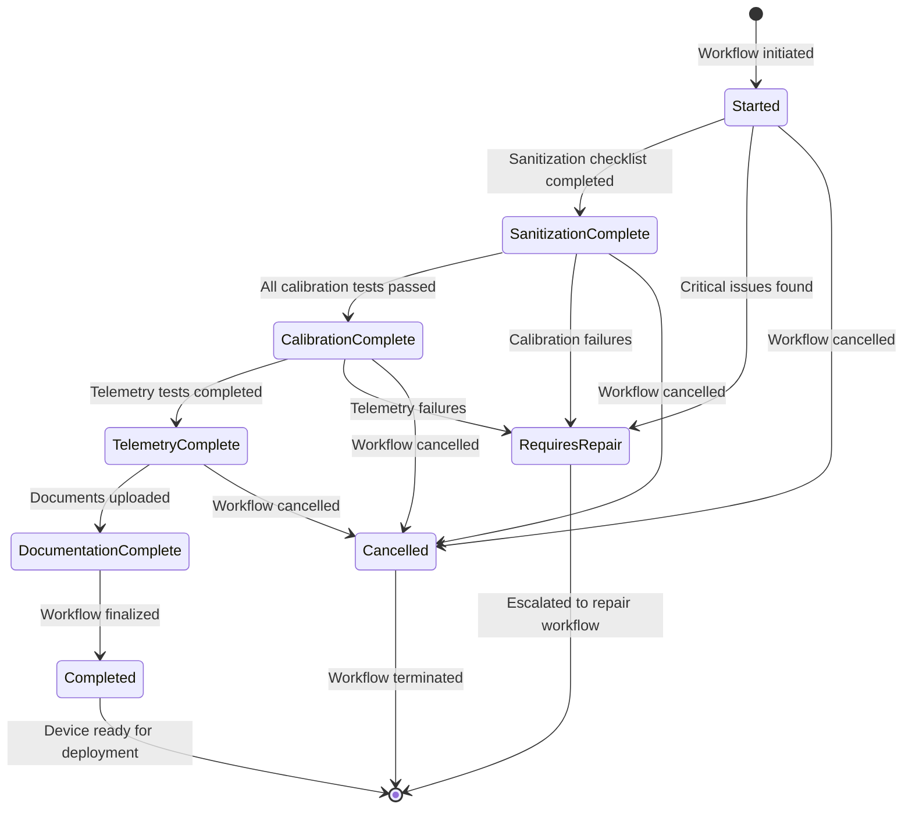
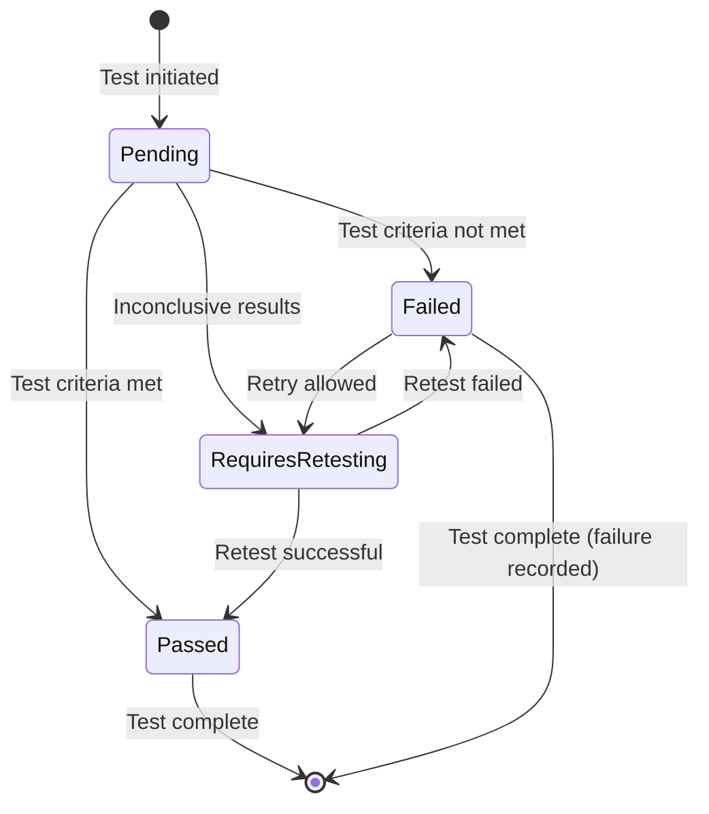
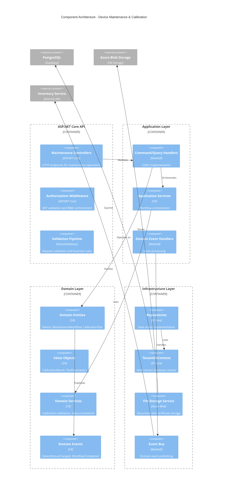

# Tactical Plan: Device Maintenance & Calibration Workflow

**Document type:** Tactical plan  
**Author:** Enterprise Solution Architecture  
**Date:** 2024-12-19  
**Status:** Proposed  
**Companion:** [STRATEGY-DeviceMaintenanceCalibration.md](STRATEGY-DeviceMaintenanceCalibration.md)  

---

## Table of Contents

1. [Entity Relationship Diagram](#1-entity-relationship-diagram)
2. [Database Schema Details](#2-database-schema-details)
3. [Status Vocabularies and State Machines](#3-status-vocabularies-and-state-machines)
4. [Migration Plan](#4-migration-plan)
5. [High-Level Design & Component Architecture](#5-high-level-design--component-architecture)
6. [API Endpoints & Contracts](#6-api-endpoints--contracts)
7. [Data Transfer Objects (DTOs)](#7-data-transfer-objects-dtos)
8. [Frontend Route and Component Map](#8-frontend-route-and-component-map)
9. [Work Package Breakdown by Waves](#9-work-package-breakdown-by-waves)
10. [Test Strategy & Test Suites](#10-test-strategy--test-suites)
11. [Observability & Error Handling](#11-observability--error-handling)
12. [Definition of Done](#12-definition-of-done)

---

## 1. Entity Relationship Diagram

```mermaid
erDiagram
    Device ||--o{ MaintenanceWorkflow : "undergoes"
    Device ||--o{ CalibrationSchedule : "has"
    Device ||--o{ DeviceStatusHistory : "tracks"
    MaintenanceWorkflow ||--|| SanitizationChecklist : "includes"
    MaintenanceWorkflow ||--o{ CalibrationTest : "performs"
    MaintenanceWorkflow ||--o{ TelemetryTest : "executes"
    MaintenanceWorkflow ||--o{ MaintenanceDocument : "uploads"
    MaintenanceWorkflow }|--|| Technician : "performed_by"
    CalibrationTest ||--o{ CalibrationResult : "produces"
    TelemetryTest ||--|| ConnectivityResult : "generates"
    TelemetryTest ||--|| BatteryHealthResult : "measures"
    
    Device {
        uuid Id PK
        string SerialNumber UK "NOT NULL"
        string DeviceName "NOT NULL"
        string ModelId "NOT NULL"
        string Manufacturer "NOT NULL"
        enum DeviceStatus "NOT NULL DEFAULT 'Available'"
        datetime LastMaintenanceDate
        datetime NextCalibrationDue
        uuid TenantId FK "NOT NULL"
        timestamp CreatedAt "NOT NULL DEFAULT NOW()"
        timestamp UpdatedAt "NOT NULL DEFAULT NOW()"
        bytea XminVersion "Concurrency Token"
        bool IsDeleted "NOT NULL DEFAULT FALSE"
        datetime DeletedAt
    }
    
    MaintenanceWorkflow {
        uuid Id PK
        uuid DeviceId FK "NOT NULL"
        uuid TechnicianId FK "NOT NULL"
        enum WorkflowStatus "NOT NULL DEFAULT 'Started'"
        datetime StartedAt "NOT NULL DEFAULT NOW()"
        datetime CompletedAt
        text Notes
        bool RequiresDeepRepair "NOT NULL DEFAULT FALSE"
        decimal EstimatedCostUsd "CHECK (EstimatedCostUsd >= 0)"
        uuid TenantId FK "NOT NULL"
        timestamp CreatedAt "NOT NULL DEFAULT NOW()"
        timestamp UpdatedAt "NOT NULL DEFAULT NOW()"
        bytea XminVersion "Concurrency Token"
        bool IsDeleted "NOT NULL DEFAULT FALSE"
        datetime DeletedAt
    }
    
    SanitizationChecklist {
        uuid Id PK
        uuid MaintenanceWorkflowId FK "NOT NULL UNIQUE"
        bool ChemicalCleaningCompleted "NOT NULL DEFAULT FALSE"
        string ChemicalUsed "CHECK (LENGTH(ChemicalUsed) <= 100)"
        bool HepaFilterReplaced "NOT NULL DEFAULT FALSE"
        string FilterPartNumber "CHECK (LENGTH(FilterPartNumber) <= 50)"
        bool CasingInspectionPassed "NOT NULL DEFAULT FALSE"
        bool ComponentsInspected "NOT NULL DEFAULT FALSE"
        datetime SanitizationDate "NOT NULL DEFAULT NOW()"
        text InspectionNotes "CHECK (LENGTH(InspectionNotes) <= 2000)"
        string InspectionPhotoPath "ENCRYPTED"
        uuid CompletedByTechnicianId FK "NOT NULL"
        uuid TenantId FK "NOT NULL"
        timestamp CreatedAt "NOT NULL DEFAULT NOW()"
        timestamp UpdatedAt "NOT NULL DEFAULT NOW()"
    }
    
    CalibrationTest {
        uuid Id PK
        uuid MaintenanceWorkflowId FK "NOT NULL"
        enum TestType "NOT NULL"
        jsonb TestParameters "NOT NULL"
        enum TestResult "NOT NULL DEFAULT 'Pending'"
        datetime TestDate "NOT NULL DEFAULT NOW()"
        text ResultNotes "CHECK (LENGTH(ResultNotes) <= 1000)"
        uuid PerformedByTechnicianId FK "NOT NULL"
        uuid TenantId FK "NOT NULL"
        timestamp CreatedAt "NOT NULL DEFAULT NOW()"
        timestamp UpdatedAt "NOT NULL DEFAULT NOW()"
    }
    
    CalibrationResult {
        uuid Id PK
        uuid CalibrationTestId FK "NOT NULL"
        string MetricName "NOT NULL CHECK (LENGTH(MetricName) <= 100)"
        decimal MeasuredValue "NOT NULL"
        decimal TargetValue "NOT NULL"
        decimal ToleranceRange "NOT NULL CHECK (ToleranceRange >= 0)"
        bool WithinTolerance "NOT NULL"
        string Units "NOT NULL CHECK (LENGTH(Units) <= 20)"
        decimal DeviationPercentage "GENERATED ALWAYS AS (ABS((MeasuredValue - TargetValue) / TargetValue * 100)) STORED"
        uuid TenantId FK "NOT NULL"
        timestamp CreatedAt "NOT NULL DEFAULT NOW()"
    }
    
    TelemetryTest {
        uuid Id PK
        uuid MaintenanceWorkflowId FK "NOT NULL"
        enum ConnectivityType "NOT NULL"
        enum TestResult "NOT NULL DEFAULT 'Pending'"
        datetime TestDate "NOT NULL DEFAULT NOW()"
        jsonb TestResults "NOT NULL"
        int TestDurationSeconds "CHECK (TestDurationSeconds > 0)"
        uuid PerformedByTechnicianId FK "NOT NULL"
        uuid TenantId FK "NOT NULL"
        timestamp CreatedAt "NOT NULL DEFAULT NOW()"
        timestamp UpdatedAt "NOT NULL DEFAULT NOW()"
    }
    
    ConnectivityResult {
        uuid Id PK
        uuid TelemetryTestId FK "NOT NULL UNIQUE"
        string NetworkType "NOT NULL CHECK (LENGTH(NetworkType) <= 50)"
        int SignalStrength "CHECK (SignalStrength BETWEEN -120 AND 0)"
        decimal DataTransmissionRate "CHECK (DataTransmissionRate >= 0)"
        bool ConnectionSuccessful "NOT NULL"
        text ErrorDetails "CHECK (LENGTH(ErrorDetails) <= 1000)"
        int LatencyMs "CHECK (LatencyMs >= 0)"
        decimal PacketLossPercentage "CHECK (PacketLossPercentage BETWEEN 0 AND 100)"
        uuid TenantId FK "NOT NULL"
        timestamp CreatedAt "NOT NULL DEFAULT NOW()"
    }
    
    BatteryHealthResult {
        uuid Id PK
        uuid TelemetryTestId FK "NOT NULL UNIQUE"
        decimal CapacityPercentage "NOT NULL CHECK (CapacityPercentage BETWEEN 0 AND 100)"
        int CycleCount "CHECK (CycleCount >= 0)"
        decimal Voltage "NOT NULL CHECK (Voltage > 0)"
        decimal Temperature "CHECK (Temperature BETWEEN -40 AND 85)"
        enum HealthStatus "NOT NULL"
        datetime TestTimestamp "NOT NULL DEFAULT NOW()"
        int EstimatedRemainingHours "CHECK (EstimatedRemainingHours >= 0)"
        uuid TenantId FK "NOT NULL"
        timestamp CreatedAt "NOT NULL DEFAULT NOW()"
    }
    
    MaintenanceDocument {
        uuid Id PK
        uuid MaintenanceWorkflowId FK "NOT NULL"
        enum DocumentType "NOT NULL"
        string FileName "NOT NULL CHECK (LENGTH(FileName) <= 255)"
        string FilePath "ENCRYPTED NOT NULL"
        string ContentType "NOT NULL CHECK (LENGTH(ContentType) <= 100)"
        bigint FileSize "NOT NULL CHECK (FileSize > 0 AND FileSize <= 52428800)"
        string DocumentHash "NOT NULL CHECK (LENGTH(DocumentHash) = 64)"
        datetime UploadedAt "NOT NULL DEFAULT NOW()"
        uuid UploadedByUserId FK "NOT NULL"
        bool IsDigitallySigned "NOT NULL DEFAULT FALSE"
        datetime ExpirationDate
        uuid TenantId FK "NOT NULL"
        timestamp CreatedAt "NOT NULL DEFAULT NOW()"
        bool IsDeleted "NOT NULL DEFAULT FALSE"
        datetime DeletedAt
    }
    
    CalibrationSchedule {
        uuid Id PK
        uuid DeviceId FK "NOT NULL"
        int CalibrationIntervalDays "NOT NULL CHECK (CalibrationIntervalDays > 0)"
        datetime LastCalibrationDate
        datetime NextCalibrationDue "NOT NULL"
        bool IsActive "NOT NULL DEFAULT TRUE"
        enum ScheduleType "NOT NULL DEFAULT 'Periodic'"
        text ScheduleNotes "CHECK (LENGTH(ScheduleNotes) <= 500)"
        uuid TenantId FK "NOT NULL"
        timestamp CreatedAt "NOT NULL DEFAULT NOW()"
        timestamp UpdatedAt "NOT NULL DEFAULT NOW()"
    }
    
    DeviceStatusHistory {
        uuid Id PK
        uuid DeviceId FK "NOT NULL"
        enum PreviousStatus "NOT NULL"
        enum NewStatus "NOT NULL"
        datetime StatusChangeDate "NOT NULL DEFAULT NOW()"
        uuid ChangedByUserId FK "NOT NULL"
        text ChangeReason "CHECK (LENGTH(ChangeReason) <= 500)"
        jsonb StatusChangeMetadata
        uuid TenantId FK "NOT NULL"
        timestamp CreatedAt "NOT NULL DEFAULT NOW()"
    }
    
    Technician {
        uuid Id PK
        string EmployeeId "NOT NULL CHECK (LENGTH(EmployeeId) <= 50)"
        string FirstName "ENCRYPTED NOT NULL"
        string LastName "ENCRYPTED NOT NULL"
        string Email "ENCRYPTED NOT NULL"
        string CertificationNumber "ENCRYPTED"
        datetime CertificationExpiry
        bool IsActive "NOT NULL DEFAULT TRUE"
        jsonb Specializations
        uuid TenantId FK "NOT NULL"
        timestamp CreatedAt "NOT NULL DEFAULT NOW()"
        timestamp UpdatedAt "NOT NULL DEFAULT NOW()"
        bool IsDeleted "NOT NULL DEFAULT FALSE"
        datetime DeletedAt
    }
```



---

## 2. Database Schema Details

### Device Table
```sql
CREATE TABLE Device (
    Id uuid PRIMARY KEY DEFAULT gen_random_uuid(),
    SerialNumber varchar(100) NOT NULL,
    DeviceName varchar(200) NOT NULL,
    ModelId varchar(100) NOT NULL,
    Manufacturer varchar(100) NOT NULL,
    DeviceStatus device_status_enum NOT NULL DEFAULT 'Available',
    LastMaintenanceDate timestamp,
    NextCalibrationDue timestamp,
    TenantId uuid NOT NULL,
    CreatedAt timestamp NOT NULL DEFAULT NOW(),
    UpdatedAt timestamp NOT NULL DEFAULT NOW(),
    XminVersion bytea,
    IsDeleted boolean NOT NULL DEFAULT FALSE,
    DeletedAt timestamp,
    
    CONSTRAINT UK_Device_SerialNumber_Tenant UNIQUE (SerialNumber, TenantId),
    CONSTRAINT FK_Device_TenantId FOREIGN KEY (TenantId) REFERENCES Tenant(Id),
    CONSTRAINT CK_Device_CalibrationDate CHECK (NextCalibrationDue IS NULL OR NextCalibrationDue > LastMaintenanceDate)
);

CREATE INDEX IX_Device_TenantId_Status ON Device (TenantId, DeviceStatus) WHERE IsDeleted = FALSE;
CREATE INDEX IX_Device_NextCalibrationDue ON Device (NextCalibrationDue) WHERE IsDeleted = FALSE AND NextCalibrationDue IS NOT NULL;
```

### MaintenanceWorkflow Table
```sql
CREATE TABLE MaintenanceWorkflow (
    Id uuid PRIMARY KEY DEFAULT gen_random_uuid(),
    DeviceId uuid NOT NULL,
    TechnicianId uuid NOT NULL,
    WorkflowStatus workflow_status_enum NOT NULL DEFAULT 'Started',
    StartedAt timestamp NOT NULL DEFAULT NOW(),
    CompletedAt timestamp,
    Notes text,
    RequiresDeepRepair boolean NOT NULL DEFAULT FALSE,
    EstimatedCostUsd decimal(10,2),
    TenantId uuid NOT NULL,
    CreatedAt timestamp NOT NULL DEFAULT NOW(),
    UpdatedAt timestamp NOT NULL DEFAULT NOW(),
    XminVersion bytea,
    IsDeleted boolean NOT NULL DEFAULT FALSE,
    DeletedAt timestamp,
    
    CONSTRAINT FK_MaintenanceWorkflow_DeviceId FOREIGN KEY (DeviceId) REFERENCES Device(Id),
    CONSTRAINT FK_MaintenanceWorkflow_TechnicianId FOREIGN KEY (TechnicianId) REFERENCES Technician(Id),
    CONSTRAINT FK_MaintenanceWorkflow_TenantId FOREIGN KEY (TenantId) REFERENCES Tenant(Id),
    CONSTRAINT CK_MaintenanceWorkflow_CompletedAt CHECK (CompletedAt IS NULL OR CompletedAt >= StartedAt),
    CONSTRAINT CK_MaintenanceWorkflow_EstimatedCost CHECK (EstimatedCostUsd IS NULL OR EstimatedCostUsd >= 0)
);

CREATE INDEX IX_MaintenanceWorkflow_TenantId_Status ON MaintenanceWorkflow (TenantId, WorkflowStatus) WHERE IsDeleted = FALSE;
CREATE INDEX IX_MaintenanceWorkflow_DeviceId ON MaintenanceWorkflow (DeviceId) WHERE IsDeleted = FALSE;
```

### SanitizationChecklist Table
```sql
CREATE TABLE SanitizationChecklist (
    Id uuid PRIMARY KEY DEFAULT gen_random_uuid(),
    MaintenanceWorkflowId uuid NOT NULL UNIQUE,
    ChemicalCleaningCompleted boolean NOT NULL DEFAULT FALSE,
    ChemicalUsed varchar(100),
    HepaFilterReplaced boolean NOT NULL DEFAULT FALSE,
    FilterPartNumber varchar(50),
    CasingInspectionPassed boolean NOT NULL DEFAULT FALSE,
    ComponentsInspected boolean NOT NULL DEFAULT FALSE,
    SanitizationDate timestamp NOT NULL DEFAULT NOW(),
    InspectionNotes text,
    InspectionPhotoPath varchar(500), -- ENCRYPTED
    CompletedByTechnicianId uuid NOT NULL,
    TenantId uuid NOT NULL,
    CreatedAt timestamp NOT NULL DEFAULT NOW(),
    UpdatedAt timestamp NOT NULL DEFAULT NOW(),
    
    CONSTRAINT FK_SanitizationChecklist_MaintenanceWorkflowId FOREIGN KEY (MaintenanceWorkflowId) REFERENCES MaintenanceWorkflow(Id),
    CONSTRAINT FK_SanitizationChecklist_CompletedByTechnicianId FOREIGN KEY (CompletedByTechnicianId) REFERENCES Technician(Id),
    CONSTRAINT FK_SanitizationChecklist_TenantId FOREIGN KEY (TenantId) REFERENCES Tenant(Id),
    CONSTRAINT CK_SanitizationChecklist_InspectionNotes CHECK (LENGTH(InspectionNotes) <= 2000),
    CONSTRAINT CK_SanitizationChecklist_ChemicalUsed CHECK (LENGTH(ChemicalUsed) <= 100),
    CONSTRAINT CK_SanitizationChecklist_FilterPartNumber CHECK (LENGTH(FilterPartNumber) <= 50)
);
```

### CalibrationTest Table
```sql
CREATE TABLE CalibrationTest (
    Id uuid PRIMARY KEY DEFAULT gen_random_uuid(),
    MaintenanceWorkflowId uuid NOT NULL,
    TestType calibration_test_type_enum NOT NULL,
    TestParameters jsonb NOT NULL,
    TestResult test_result_enum NOT NULL DEFAULT 'Pending',
    TestDate timestamp NOT NULL DEFAULT NOW(),
    ResultNotes text,
    PerformedByTechnicianId uuid NOT NULL,
    TenantId uuid NOT NULL,
    CreatedAt timestamp NOT NULL DEFAULT NOW(),
    UpdatedAt timestamp NOT NULL DEFAULT NOW(),
    
    CONSTRAINT FK_CalibrationTest_MaintenanceWorkflowId FOREIGN KEY (MaintenanceWorkflowId) REFERENCES MaintenanceWorkflow(Id),
    CONSTRAINT FK_CalibrationTest_PerformedByTechnicianId FOREIGN KEY (PerformedByTechnicianId) REFERENCES Technician(Id),
    CONSTRAINT FK_CalibrationTest_TenantId FOREIGN KEY (TenantId) REFERENCES Tenant(Id),
    CONSTRAINT CK_CalibrationTest_ResultNotes CHECK (LENGTH(ResultNotes) <= 1000)
);

CREATE INDEX IX_CalibrationTest_MaintenanceWorkflowId ON CalibrationTest (MaintenanceWorkflowId);
```

### CalibrationResult Table
```sql
CREATE TABLE CalibrationResult (
    Id uuid PRIMARY KEY DEFAULT gen_random_uuid(),
    CalibrationTestId uuid NOT NULL,
    MetricName varchar(100) NOT NULL,
    MeasuredValue decimal(15,6) NOT NULL,
    TargetValue decimal(15,6) NOT NULL,
    ToleranceRange decimal(15,6) NOT NULL,
    WithinTolerance boolean NOT NULL,
    Units varchar(20) NOT NULL,
    DeviationPercentage decimal(8,4) GENERATED ALWAYS AS (ABS((MeasuredValue - TargetValue) / NULLIF(TargetValue, 0) * 100)) STORED,
    TenantId uuid NOT NULL,
    CreatedAt timestamp NOT NULL DEFAULT NOW(),
    
    CONSTRAINT FK_CalibrationResult_CalibrationTestId FOREIGN KEY (CalibrationTestId) REFERENCES CalibrationTest(Id),
    CONSTRAINT FK_CalibrationResult_TenantId FOREIGN KEY (TenantId) REFERENCES Tenant(Id),
    CONSTRAINT CK_CalibrationResult_ToleranceRange CHECK (ToleranceRange >= 0),
    CONSTRAINT CK_CalibrationResult_MetricName CHECK (LENGTH(MetricName) <= 100),
    CONSTRAINT CK_CalibrationResult_Units CHECK (LENGTH(Units) <= 20)
);
```

### TelemetryTest Table
```sql
CREATE TABLE TelemetryTest (
    Id uuid PRIMARY KEY DEFAULT gen_random_uuid(),
    MaintenanceWorkflowId uuid NOT NULL,
    ConnectivityType connectivity_type_enum NOT NULL,
    TestResult test_result_enum NOT NULL DEFAULT 'Pending',
    TestDate timestamp NOT NULL DEFAULT NOW(),
    TestResults jsonb NOT NULL,
    TestDurationSeconds integer,
    PerformedByTechnicianId uuid NOT NULL,
    TenantId uuid NOT NULL,
    CreatedAt timestamp NOT NULL DEFAULT NOW(),
    UpdatedAt timestamp NOT NULL DEFAULT NOW(),
    
    CONSTRAINT FK_TelemetryTest_MaintenanceWorkflowId FOREIGN KEY (MaintenanceWorkflowId) REFERENCES MaintenanceWorkflow(Id),
    CONSTRAINT FK_TelemetryTest_PerformedByTechnicianId FOREIGN KEY (PerformedByTechnicianId) REFERENCES Technician(Id),
    CONSTRAINT FK_TelemetryTest_TenantId FOREIGN KEY (TenantId) REFERENCES Tenant(Id),
    CONSTRAINT CK_TelemetryTest_TestDurationSeconds CHECK (TestDurationSeconds IS NULL OR TestDurationSeconds > 0)
);
```

### ConnectivityResult Table
```sql
CREATE TABLE ConnectivityResult (
    Id uuid PRIMARY KEY DEFAULT gen_random_uuid(),
    TelemetryTestId uuid NOT NULL UNIQUE,
    NetworkType varchar(50) NOT NULL,
    SignalStrength integer,
    DataTransmissionRate decimal(10,2),
    ConnectionSuccessful boolean NOT NULL,
    ErrorDetails text,
    LatencyMs integer,
    PacketLossPercentage decimal(5,2),
    TenantId uuid NOT NULL,
    CreatedAt timestamp NOT NULL DEFAULT NOW(),
    
    CONSTRAINT FK_ConnectivityResult_TelemetryTestId FOREIGN KEY (TelemetryTestId) REFERENCES TelemetryTest(Id),
    CONSTRAINT FK_ConnectivityResult_TenantId FOREIGN KEY (TenantId) REFERENCES Tenant(Id),
    CONSTRAINT CK_ConnectivityResult_SignalStrength CHECK (SignalStrength IS NULL OR SignalStrength BETWEEN -120 AND 0),
    CONSTRAINT CK_ConnectivityResult_DataTransmissionRate CHECK (DataTransmissionRate IS NULL OR DataTransmissionRate >= 0),
    CONSTRAINT CK_ConnectivityResult_ErrorDetails CHECK (LENGTH(ErrorDetails) <= 1000),
    CONSTRAINT CK_ConnectivityResult_LatencyMs CHECK (LatencyMs IS NULL OR LatencyMs >= 0),
    CONSTRAINT CK_ConnectivityResult_PacketLossPercentage CHECK (PacketLossPercentage IS NULL OR PacketLossPercentage BETWEEN 0 AND 100)
);
```

### BatteryHealthResult Table
```sql
CREATE TABLE BatteryHealthResult (
    Id uuid PRIMARY KEY DEFAULT gen_random_uuid(),
    TelemetryTestId uuid NOT NULL UNIQUE,
    CapacityPercentage decimal(5,2) NOT NULL,
    CycleCount integer,
    Voltage decimal(6,3) NOT NULL,
    Temperature decimal(5,2),
    HealthStatus battery_health_status_enum NOT NULL,
    TestTimestamp timestamp NOT NULL DEFAULT NOW(),
    EstimatedRemainingHours integer,
    TenantId uuid NOT NULL,
    CreatedAt timestamp NOT NULL DEFAULT NOW(),
    
    CONSTRAINT FK_BatteryHealthResult_TelemetryTestId FOREIGN KEY (TelemetryTestId) REFERENCES TelemetryTest(Id),
    CONSTRAINT FK_BatteryHealthResult_TenantId FOREIGN KEY (TenantId) REFERENCES Tenant(Id),
    CONSTRAINT CK_BatteryHealthResult_CapacityPercentage CHECK (CapacityPercentage BETWEEN 0 AND 100),
    CONSTRAINT CK_BatteryHealthResult_CycleCount CHECK (CycleCount IS NULL OR CycleCount >= 0),
    CONSTRAINT CK_BatteryHealthResult_Voltage CHECK (Voltage > 0),
    CONSTRAINT CK_BatteryHealthResult_Temperature CHECK (Temperature IS NULL OR Temperature BETWEEN -40 AND 85),
    CONSTRAINT CK_BatteryHealthResult_EstimatedRemainingHours CHECK (EstimatedRemainingHours IS NULL OR EstimatedRemainingHours >= 0)
);
```

### MaintenanceDocument Table
```sql
CREATE TABLE MaintenanceDocument (
    Id uuid PRIMARY KEY DEFAULT gen_random_uuid(),
    MaintenanceWorkflowId uuid NOT NULL,
    DocumentType document_type_enum NOT NULL,
    FileName varchar(255) NOT NULL,
    FilePath varchar(1000) NOT NULL, -- ENCRYPTED
    ContentType varchar(100) NOT NULL,
    FileSize bigint NOT NULL,
    DocumentHash varchar(64) NOT NULL,
    UploadedAt timestamp NOT NULL DEFAULT NOW(),
    UploadedByUserId uuid NOT NULL,
    IsDigitallySigned boolean NOT NULL DEFAULT FALSE,
    ExpirationDate timestamp,
    TenantId uuid NOT NULL,
    CreatedAt timestamp NOT NULL DEFAULT NOW(),
    IsDeleted boolean NOT NULL DEFAULT FALSE,
    DeletedAt timestamp,
    
    CONSTRAINT FK_MaintenanceDocument_MaintenanceWorkflowId FOREIGN KEY (MaintenanceWorkflowId) REFERENCES MaintenanceWorkflow(Id),
    CONSTRAINT FK_MaintenanceDocument_TenantId FOREIGN KEY (TenantId) REFERENCES Tenant(Id),
    CONSTRAINT CK_MaintenanceDocument_FileName CHECK (LENGTH(FileName) <= 255),
    CONSTRAINT CK_MaintenanceDocument_ContentType CHECK (LENGTH(ContentType) <= 100),
    CONSTRAINT CK_MaintenanceDocument_FileSize CHECK (FileSize > 0 AND FileSize <= 52428800),
    CONSTRAINT CK_MaintenanceDocument_DocumentHash CHECK (LENGTH(DocumentHash) = 64)
);

CREATE INDEX IX_MaintenanceDocument_MaintenanceWorkflowId ON MaintenanceDocument (MaintenanceWorkflowId) WHERE IsDeleted = FALSE;
```

### Enumerations
```sql
CREATE TYPE device_status_enum AS ENUM (
    'Available',
    'NeedsMaintenance',
    'InMaintenance',
    'CalibrationDue',
    'ReadyForDeployment',
    'RequiresRepair',
    'InRepair',
    'Decommissioned'
);

CREATE TYPE workflow_status_enum AS ENUM (
    'Started',
    'SanitizationComplete',
    'CalibrationComplete',
    'TelemetryComplete',
    'DocumentationComplete',
    'Completed',
    'RequiresRepair',
    'Cancelled'
);

CREATE TYPE calibration_test_type_enum AS ENUM (
    'O2PurityTest',
    'ECGBaselineTest',
    'FlowRateValidation',
    'PressureCalibration',
    'TemperatureCalibration',
    'CustomCalibration'
);

CREATE TYPE test_result_enum AS ENUM (
    'Pending',
    'Passed',
    'Failed',
    'RequiresRetesting'
);

CREATE TYPE connectivity_type_enum AS ENUM (
    'Cellular',
    'WiFi',
    'Bluetooth',
    'Ethernet'
);

CREATE TYPE battery_health_status_enum AS ENUM (
    'Excellent',
    'Good',
    'Fair',
    'Poor',
    'RequiresReplacement'
);

CREATE TYPE document_type_enum AS ENUM (
    'CalibrationCertificate',
    'TechnicianReport',
    'QualityControlCertificate',
    'InspectionPhoto',
    'RepairOrder',
    'ComplianceDocument'
);
```

---

## 3. Status Vocabularies and State Machines

### Device Status State Machine


### Maintenance Workflow Status State Machine


### Test Result Status Vocabulary


---

## 4. Migration Plan

### EF Core Migration: AddDeviceMaintenanceCalibration
```csharp
// src/Infrastructure/Persistence/Migrations/20241219000001_AddDeviceMaintenanceCalibration.cs
public partial class AddDeviceMaintenanceCalibration : Migration
{
    protected override void Up(MigrationBuilder migrationBuilder)
    {
        // Create enums
        migrationBuilder.Sql(@"
            CREATE TYPE device_status_enum AS ENUM (
                'Available', 'NeedsMaintenance', 'InMaintenance', 'CalibrationDue',
                'ReadyForDeployment', 'RequiresRepair', 'InRepair', 'Decommissioned'
            );
            
            CREATE TYPE workflow_status_enum AS ENUM (
                'Started', 'SanitizationComplete', 'CalibrationComplete', 'TelemetryComplete',
                'DocumentationComplete', 'Completed', 'RequiresRepair', 'Cancelled'
            );
            
            CREATE TYPE calibration_test_type_enum AS ENUM (
                'O2PurityTest', 'ECGBaselineTest', 'FlowRateValidation',
                'PressureCalibration', 'TemperatureCalibration', 'CustomCalibration'
            );
            
            CREATE TYPE test_result_enum AS ENUM (
                'Pending', 'Passed', 'Failed', 'RequiresRetesting'
            );
            
            CREATE TYPE connectivity_type_enum AS ENUM (
                'Cellular', 'WiFi', 'Bluetooth', 'Ethernet'
            );
            
            CREATE TYPE battery_health_status_enum AS ENUM (
                'Excellent', 'Good', 'Fair', 'Poor', 'RequiresReplacement'
            );
            
            CREATE TYPE document_type_enum AS ENUM (
                'CalibrationCertificate', 'TechnicianReport', 'QualityControlCertificate',
                'InspectionPhoto', 'RepairOrder', 'ComplianceDocument'
            );
        ");

        // Create tables in dependency order
        migrationBuilder.CreateTable(
            name: "Device",
            columns: table => new
            {
                Id = table.Column<Guid>(type: "uuid", nullable: false, defaultValueSql: "gen_random_uuid()"),
                SerialNumber = table.Column<string>(type: "varchar(100)", maxLength: 100, nullable: false),
                DeviceName = table.Column<string>(type: "varchar(200)", maxLength: 200, nullable: false),
                ModelId = table.Column<string>(type: "varchar(100)", maxLength: 100, nullable: false),
                Manufacturer = table.Column<string>(type: "varchar(100)", maxLength: 100, nullable: false),
                DeviceStatus = table.Column<string>(type: "device_status_enum", nullable: false, defaultValue: "Available"),
                LastMaintenanceDate = table.Column<DateTime>(type: "timestamp", nullable: true),
                NextCalibrationDue = table.Column<DateTime>(type: "timestamp", nullable: true),
                TenantId = table.Column<Guid>(type: "uuid", nullable: false),
                CreatedAt = table.Column<DateTime>(type: "timestamp", nullable: false, defaultValueSql: "NOW()"),
                UpdatedAt = table.Column<DateTime>(type: "timestamp", nullable: false, defaultValueSql: "NOW()"),
                XminVersion = table.Column<byte[]>(type: "bytea", nullable: true),
                IsDeleted = table.Column<bool>(type: "boolean", nullable: false, defaultValue: false),
                DeletedAt = table.Column<DateTime>(type: "timestamp", nullable: true)
            },
            constraints: table =>
            {
                table.PrimaryKey("PK_Device", x => x.Id);
                table.ForeignKey("FK_Device_TenantId", x => x.TenantId, "Tenant", "Id");
                table.CheckConstraint("CK_Device_CalibrationDate", "NextCalibrationDue IS NULL OR NextCalibrationDue > LastMaintenanceDate");
            });

        // Continue with remaining tables...
        // [Additional table creation code follows the same pattern]

        // Create indexes
        migrationBuilder.CreateIndex(
            name: "IX_Device_TenantId_Status",
            table: "Device",
            columns: new[] { "TenantId", "DeviceStatus" },
            filter: "IsDeleted = FALSE");

        migrationBuilder.CreateIndex(
            name: "IX_Device_NextCalibrationDue",
            table: "Device",
            column: "NextCalibrationDue",
            filter: "IsDeleted = FALSE AND NextCalibrationDue IS NOT NULL");

        // [Additional indexes follow]
    }

    protected override void Down(MigrationBuilder migrationBuilder)
    {
        // Drop tables in reverse dependency order
        migrationBuilder.DropTable("CalibrationResult");
        migrationBuilder.DropTable("ConnectivityResult");
        migrationBuilder.DropTable("BatteryHealthResult");
        migrationBuilder.DropTable("MaintenanceDocument");
        migrationBuilder.DropTable("SanitizationChecklist");
        migrationBuilder.DropTable("CalibrationTest");
        migrationBuilder.DropTable("TelemetryTest");
        migrationBuilder.DropTable("DeviceStatusHistory");
        migrationBuilder.DropTable("CalibrationSchedule");
        migrationBuilder.DropTable("MaintenanceWorkflow");
        migrationBuilder.DropTable("Technician");
        migrationBuilder.DropTable("Device");

        // Drop enums
        migrationBuilder.Sql(@"
            DROP TYPE IF EXISTS document_type_enum;
            DROP TYPE IF EXISTS battery_health_status_enum;
            DROP TYPE IF EXISTS connectivity_type_enum;
            DROP TYPE IF EXISTS test_result_enum;
            DROP TYPE IF EXISTS calibration_test_type_enum;
            DROP TYPE IF EXISTS workflow_status_enum;
            DROP TYPE IF EXISTS device_status_enum;
        ");
    }
}
```

**Migration Strategy:**
- **Framework:** EF Core Code-First Migrations
- **Naming Convention:** `AddDeviceMaintenanceCalibration`
- **Rollback Strategy:** Complete Down() migration with zero data loss
- **Deployment:** Blue-green deployment with migration validation
- **Data Seeding:** Separate seeding migration for reference data

---

## 5. High-Level Design & Component Architecture



### Domain Layer Architecture
```
src/Domain/
├── Entities/
│   ├── Device.cs
│   ├── MaintenanceWorkflow.cs
│   ├── CalibrationTest.cs
│   ├── TelemetryTest.cs
│   ├── SanitizationChecklist.cs
│   ├── MaintenanceDocument.cs
│   ├── Technician.cs
│   └── CalibrationSchedule.cs
├── ValueObjects/
│   ├── CalibrationResult.cs
│   ├── ConnectivityResult.cs
│   ├── BatteryHealthResult.cs
│   └── TestParameters.cs
├── Enums/
│   ├── DeviceStatus.cs
│   ├── WorkflowStatus.cs
│   ├── TestResult.cs
│   └── CalibrationTestType.cs
├── Events/
│   ├── DeviceStatusChangedEvent.cs
│   ├── MaintenanceWorkflowCompletedEvent.cs
│   ├── CalibrationTestCompletedEvent.cs
│   └── DocumentUploadedEvent.cs
├── Services/
│   ├── ICalibrationValidationService.cs
│   ├── IDeviceStatusTransitionService.cs
│   └── IMaintenanceWorkflowService.cs
└── Exceptions/
    ├── InvalidDeviceStatusTransitionException.cs
    ├── CalibrationTestFailedException.cs
    └── MaintenanceWorkflowException.cs
```

---

## 6. API Endpoints & Contracts

| Verb | Path | Controller | Authorization | Description |
| ---- | ---- | ---------- | ------------- | ----------- |
| GET | `/api/devices/maintenance-queue` | DeviceController | `MaintenanceRead` | Get devices needing maintenance |
| GET | `/api/devices/{id}/maintenance-history` | DeviceController | `MaintenanceRead` | Get device maintenance history |
| POST | `/api/maintenance/workflows` | MaintenanceWorkflowController | `MaintenanceWrite` | Start maintenance workflow |
| GET | `/api/maintenance/workflows/{id}` | MaintenanceWorkflowController | `MaintenanceRead` | Get workflow details |
| PUT | `/api/maintenance/workflows/{id}/sanitization` | MaintenanceWorkflowController | `MaintenanceWrite` | Update sanitization checklist |
| POST | `/api/maintenance/workflows/{id}/calibration` | MaintenanceWorkflowController | `MaintenanceWrite` | Record calibration test |
| POST | `/api/maintenance/workflows/{id}/telemetry` | MaintenanceWorkflowController | `MaintenanceWrite` | Execute telemetry test |
| POST | `/api/maintenance/workflows/{id}/documents` | MaintenanceWorkflowController | `MaintenanceWrite` | Upload maintenance document |
| PUT | `/api/maintenance/workflows/{id}/complete` | MaintenanceWorkflowController | `MaintenanceWrite` | Complete maintenance workflow |
| GET | `/api/maintenance/reports/summary` | MaintenanceReportController | `MaintenanceRead` | Get maintenance summary report |
| GET | `/api/technicians` | TechnicianController | `MaintenanceRead` | Get available technicians |
| POST | `/api/technicians` | TechnicianController | `MaintenanceAdmin` | Create technician |

### MediatR Commands and Queries

#### Commands
```csharp
// StartMaintenanceWorkflowCommand
public record StartMaintenanceWorkflowCommand(
    Guid DeviceId,
    Guid TechnicianId,
    string? Notes
) : IRequest<StartMaintenanceWorkflowResponse>;

public record StartMaintenanceWorkflowResponse(
    Guid WorkflowId,
    WorkflowStatus Status,
    DateTime StartedAt
);

// Validator
public class StartMaintenanceWorkflowCommandValidator : AbstractValidator<StartMaintenanceWorkflowCommand>
{
    public StartMaintenanceWorkflowCommandValidator()
    {
        RuleFor(x => x.DeviceId).NotEmpty();
        RuleFor(x => x.TechnicianId).NotEmpty();
        RuleFor(x => x.Notes).MaximumLength(2000);
    }
}

// UpdateSanitizationChecklistCommand
public record UpdateSanitizationChecklistCommand(
    Guid WorkflowId,
    bool ChemicalCleaningCompleted,
    string? ChemicalUsed,
    bool HepaFilterReplaced,
    string? FilterPartNumber,
    bool CasingInspectionPassed,
    bool ComponentsInspected,
    string? InspectionNotes,
    IFormFile? InspectionPhoto
) : IRequest<UpdateSanitizationChecklistResponse>;

public record UpdateSanitizationChecklistResponse(
    Guid ChecklistId,
    bool IsComplete,
    DateTime CompletedAt
);

// RecordCalibrationTestCommand
public record RecordCalibrationTestCommand(
    Guid WorkflowId,
    CalibrationTestType TestType,
    Dictionary<string, object> TestParameters,
    List<CalibrationResultDto> Results,
    string? ResultNotes
) : IRequest<RecordCalibrationTestResponse>;

public record RecordCalibrationTestResponse(
    Guid TestId,
    TestResult Result,
    bool AllResultsWithinTolerance,
    DateTime TestDate
);

// ExecuteTelemetryTestCommand
public record ExecuteTelemetryTestCommand(
    Guid WorkflowId,
    ConnectivityType ConnectivityType,
    TelemetryTestParametersDto Parameters
) : IRequest<ExecuteTelemetryTestResponse>;

public record ExecuteTelemetryTestResponse(
    Guid TestId,
    TestResult Result,
    ConnectivityResultDto? ConnectivityResult,
    BatteryHealthResultDto? BatteryResult
);

// CompleteMaintenanceWorkflowCommand
public record CompleteMaintenanceWorkflowCommand(
    Guid WorkflowId,
    string? CompletionNotes,
    bool RequiresDeepRepair = false
) : IRequest<CompleteMaintenanceWorkflowResponse>;

public record CompleteMaintenanceWorkflowResponse(
    Guid WorkflowId,
    WorkflowStatus Status,
    DeviceStatus NewDeviceStatus,
    DateTime CompletedAt,
    DateTime? NextCalibrationDue
);
```

#### Queries
```csharp
// GetMaintenanceQueueQuery
public record GetMaintenanceQueueQuery(
    DeviceStatus? StatusFilter = null,
    string? SearchTerm = null,
    int Page = 1,
    int PageSize = 20
) : IRequest<GetMaintenanceQueueResponse>;

public record GetMaintenanceQueueResponse(
    List<MaintenanceQueueItemDto> Devices,
    int TotalCount,
    MaintenanceQueueSummaryDto Summary
);

// GetMaintenanceWorkflowQuery
public record GetMaintenanceWorkflowQuery(Guid WorkflowId) : IRequest<MaintenanceWorkflowDetailDto>;

// GetDeviceMaintenanceHistoryQuery
public record GetDeviceMaintenanceHistoryQuery(
    Guid DeviceId,
    int Page = 1,
    int PageSize = 10
) : IRequest<GetDeviceMaintenanceHistoryResponse>;

public record GetDeviceMaintenanceHistoryResponse(
    List<MaintenanceWorkflowSummaryDto> Workflows,
    int TotalCount,
    DeviceMaintenanceStatsDto Stats
);

// GetMaintenanceSummaryReportQuery
public record GetMaintenanceSummaryReportQuery(
    DateTime? StartDate = null,
    DateTime? EndDate = null,
    Guid? TechnicianId = null
) : IRequest<MaintenanceSummaryReportDto>;
```

---

## 7. Data Transfer Objects (DTOs)

### Request DTOs
```csharp
// src/Application/Features/Maintenance/DTOs/Requests/
public record StartMaintenanceWorkflowRequestDto(
    Guid DeviceId,
    Guid TechnicianId,
    string? Notes
);

public record UpdateSanitizationChecklistRequestDto(
    bool ChemicalCleaningCompleted,
    string? ChemicalUsed,
    bool HepaFilterReplaced,
    string? FilterPartNumber,
    bool CasingInspectionPassed,
    bool ComponentsInspected,
    string? InspectionNotes
);

public record CalibrationResultDto(
    string MetricName,
    decimal MeasuredValue,
    decimal TargetValue,
    decimal ToleranceRange,
    string Units
);

public record RecordCalibrationTestRequestDto(
    CalibrationTestType TestType,
    Dictionary<string, object> TestParameters,
    List<CalibrationResultDto> Results,
    string? ResultNotes
);

public record TelemetryTestParametersDto(
    int TestDurationSeconds,
    string? NetworkName,
    bool IncludeBatteryTest
);

public record ExecuteTelemetryTestRequestDto(
    ConnectivityType ConnectivityType,
    TelemetryTestParametersDto Parameters
);

public record CompleteMaintenanceWorkflowRequestDto(
    string? CompletionNotes,
    bool RequiresDeepRepair = false
);
```

### Response DTOs
```csharp
// src/Application/Features/Maintenance/DTOs/Responses/
public record MaintenanceQueueItemDto(
    Guid Id,
    string SerialNumber,
    string DeviceName,
    string ModelId,
    string Manufacturer,
    DeviceStatus Status,
    DateTime? LastMaintenanceDate,
    DateTime? NextCalibrationDue,
    int DaysOverdue,
    string StatusBadgeColor
);

public record MaintenanceQueueSummaryDto(
    int TotalDevices,
    int NeedsMaintenance,
    int CalibrationDue,
    int InMaintenance,
    int ReadyForDeployment
);

public record MaintenanceWorkflowDetailDto(
    Guid Id,
    DeviceDto Device,
    TechnicianDto Technician,
    WorkflowStatus Status,
    DateTime StartedAt,
    DateTime? CompletedAt,
    string? Notes,
    bool RequiresDeepRepair,
    decimal? EstimatedCostUsd,
    SanitizationChecklistDto? SanitizationChecklist,
    List<CalibrationTestDto> CalibrationTests,
    List<TelemetryTestDto> TelemetryTests,
    List<MaintenanceDocumentDto> Documents,
    WorkflowProgressDto Progress
);

public record SanitizationChecklistDto(
    Guid Id,
    bool ChemicalCleaningCompleted,
    string? ChemicalUsed,
    bool HepaFilterReplaced,
    string? FilterPartNumber,
    bool CasingInspectionPassed,
    bool ComponentsInspected,
    DateTime SanitizationDate,
    string? InspectionNotes,
    string? InspectionPhotoUrl,
    TechnicianDto CompletedBy
);

public record CalibrationTestDto(
    Guid Id,
    CalibrationTestType TestType,
    TestResult Result,
    DateTime TestDate,
    string? ResultNotes,
    List<CalibrationResultDetailDto> Results,
    TechnicianDto PerformedBy
);

public record CalibrationResultDetailDto(
    string MetricName,
    decimal MeasuredValue,
    decimal TargetValue,
    decimal ToleranceRange,
    bool WithinTolerance,
    string Units,
    decimal DeviationPercentage
);

public record TelemetryTestDto(
    Guid Id,
    ConnectivityType ConnectivityType,
    TestResult Result,
    DateTime TestDate,
    int? TestDurationSeconds,
    ConnectivityResultDto? ConnectivityResult,
    BatteryHealthResultDto? BatteryResult,
    TechnicianDto PerformedBy
);

public record ConnectivityResultDto(
    string NetworkType,
    int? SignalStrength,
    decimal? DataTransmissionRate,
    bool ConnectionSuccessful,
    string? ErrorDetails,
    int? LatencyMs,
    decimal? PacketLossPercentage
);

public record BatteryHealthResultDto(
    decimal CapacityPercentage,
    int? CycleCount,
    decimal Voltage,
    decimal? Temperature,
    BatteryHealthStatus HealthStatus,
    int? EstimatedRemainingHours
);

public record MaintenanceDocumentDto(
    Guid Id,
    DocumentType DocumentType,
    string FileName,
    string ContentType,
    long FileSize,
    DateTime UploadedAt,
    bool IsDigitallySigned,
    DateTime? ExpirationDate,
    string DownloadUrl
);

public record WorkflowProgressDto(
    bool SanitizationComplete,
    bool CalibrationComplete,
    bool TelemetryComplete,
    bool DocumentationComplete,
    int CompletedSteps,
    int TotalSteps,
    decimal ProgressPercentage
);

public record DeviceDto(
    Guid Id,
    string SerialNumber,
    string DeviceName,
    string ModelId,
    string Manufacturer,
    DeviceStatus Status
);

public record TechnicianDto(
    Guid Id,
    string EmployeeId,
    string FullName,
    string? CertificationNumber,
    DateTime? CertificationExpiry,
    bool IsActive
);
```

---

## 8. Frontend Route and Component Map

| Route | Component / Page | Type | Description |
| ----- | ---------------- | ---- | ----------- |
| `/maintenance` | `MaintenanceHubPage` | Server Component | Main maintenance dashboard with device queue |
| `/maintenance/queue` | `MaintenanceQueuePage` | Server Component | Filterable device maintenance queue |
| `/maintenance/workflow/[id]` | `MaintenanceWorkflowPage` | Server Component | Individual workflow management interface |
| `/maintenance/workflow/[id]/sanitization` | `SanitizationChecklistForm` | Client Component | Interactive sanitization checklist |
| `/maintenance/workflow/[id]/calibration` | `CalibrationTestForm` | Client Component | Calibration test recording interface |
| `/maintenance/workflow/[id]/telemetry` | `TelemetryTestForm` | Client Component | Telemetry test execution interface |
| `/maintenance/workflow/[id]/documents` | `DocumentUploadForm` | Client Component | Document upload with drag-and-drop |
| `/maintenance/reports` | `MaintenanceReportsPage` | Server Component | Maintenance analytics and reporting |
| `/maintenance/technicians` | `TechnicianManagementPage` | Server Component | Technician management interface |

### Component Architecture
```
src/app/(authenticated)/maintenance/
├── page.tsx                           # MaintenanceHubPage (Server Component)
├── queue/
│   └── page.tsx                       # MaintenanceQueuePage (Server Component)
├── workflow/
│   └── [id]/
│       ├── page.tsx                   # MaintenanceWorkflowPage (Server Component)
│       ├── sanitization/
│       │   └── page.tsx               # SanitizationChecklistPage (Server Component)
│       ├── calibration/
│       │   └── page.tsx               # CalibrationTestPage (Server Component)
│       ├── telemetry/
│       │   └── page.tsx               # TelemetryTestPage (Server Component)
│       └── documents/
│           └── page.tsx               # DocumentUploadPage (Server Component)
├── reports/
│   └── page.tsx                       # MaintenanceReportsPage (Server Component)
├── technicians/
│   └── page.tsx                       # TechnicianManagementPage (Server Component)
└── components/
    ├── MaintenanceQueue.tsx           # Client Component
    ├── DeviceStatusBadge.tsx          # Client Component
    ├── WorkflowProgressIndicator.tsx  # Client Component
    ├── SanitizationChecklistForm.tsx  # Client Component
    ├── CalibrationTestForm.tsx        # Client Component
    ├── TelemetryTestForm.tsx          # Client Component
    ├── DocumentUploadForm.tsx         # Client Component
    ├── MaintenanceWorkflowStepper.tsx # Client Component
    └── MaintenanceReportCharts.tsx    # Client Component
```

### BFF Proxy Routes
```typescript
// src/app/api/maintenance/route.ts
export async function GET(request: NextRequest) {
  const searchParams = request.nextUrl.searchParams;
  const statusFilter = searchParams.get('status');
  const searchTerm = searchParams.get('search');
  const page = parseInt(searchParams.get('page') ?? '1');
  const pageSize = parseInt(searchParams.get('pageSize') ?? '20');

  const response = await fetch(`${process.env.API_BASE_URL}/api/devices/maintenance-queue?${new URLSearchParams({
    ...(statusFilter && { status: statusFilter }),
    ...(searchTerm && { search: searchTerm }),
    page: page.toString(),
    pageSize: pageSize.toString()
  })}`, {
    headers: {
      'Authorization': `Bearer ${await getServerToken()}`,
      'X-Tenant-Id': await getTenantId()
    }
  });

  return Response.json(await response.json());
}

// src/app/api/maintenance/workflows/route.ts
export async function POST(request: NextRequest) {
  const body = await request.json();
  
  const response = await fetch(`${process.env.API_BASE_URL}/api/maintenance/workflows`, {
    method: 'POST',
    headers: {
      'Content-Type': 'application/json',
      'Authorization': `Bearer ${await getServerToken()}`,
      'X-Tenant-Id': await getTenantId()
    },
    body: JSON.stringify(body)
  });

  return Response.json(await response.json(), { status: response.status });
}

// src/app/api/maintenance/workflows/[id]/documents/route.ts
export async function POST(request: NextRequest, { params }: { params: { id: string } }) {
  const formData = await request.formData();
  
  const response = await fetch(`${process.env.API_BASE_URL}/api/maintenance/workflows/${params.id}/documents`, {
    method: 'POST',
    headers: {
      'Authorization': `Bearer ${await getServerToken()}`,
      'X-Tenant-Id': await getTenantId()
    },
    body: formData
  });

  return Response.json(await response.json(), { status: response.status });
}
```

### Key Client Components
```typescript
// src/app/(authenticated)/maintenance/components/MaintenanceQueue.tsx
'use client';

interface MaintenanceQueueProps {
  initialData: MaintenanceQueueResponse;
}

export function MaintenanceQueue({ initialData }: MaintenanceQueueProps) {
  const [data, setData] = useState(initialData);
  const [filters, setFilters] = useState<MaintenanceQueueFilters>({});
  
  const { mutate: startWorkflow } = useMutation({
    mutationFn: (deviceId: string) => 
      fetch('/api/maintenance/workflows', {
        method: 'POST',
        body: JSON.stringify({ deviceId })
      }).then(res => res.json()),
    onSuccess: () => {
      // Refresh queue data
      router.refresh();
    }
  });

  return (
    <div className="space-y-6">
      <MaintenanceQueueFilters 
        filters={filters} 
        onFiltersChange={setFilters} 
      />
      
      <MaintenanceQueueSummary summary={data.summary} />
      
      <DataTable
        columns={maintenanceQueueColumns}
        data={data.devices}
        onStartWorkflow={startWorkflow}
      />
      
      <Pagination
        currentPage={data.currentPage}
        totalPages={data.totalPages}
        onPageChange={(page) => {
          // Update URL and refresh
          const url = new URL(window.location.href);
          url.searchParams.set('page', page.toString());
          router.push(url.toString());
        }}
      />
    </div>
  );
}

// src/app/(authenticated)/maintenance/components/SanitizationChecklistForm.tsx
'use client';

interface SanitizationChecklistFormProps {
  workflowId: string;
  initialData?: SanitizationChecklistDto;
}

export function SanitizationChecklistForm({ workflowId, initialData }: SanitizationChecklistFormProps) {
  const form = useForm<SanitizationChecklistFormData>({
    resolver: zodResolver(sanitizationChecklistSchema),
    defaultValues: initialData || {}
  });

  const { mutate: updateChecklist, isPending } = useMutation({
    mutationFn: (data: SanitizationChecklistFormData) =>
      fetch(`/api/maintenance/workflows/${workflowId}/sanitization`, {
        method: 'PUT',
        body: JSON.stringify(data)
      }).then(res => res.json()),
    onSuccess: () => {
      toast.success('Sanitization checklist updated successfully');
      router.refresh();
    }
  });

  return (
    <Form {...form}>
      <form onSubmit={form.handleSubmit(updateChecklist)} className="space-y-6">
        <Card>
          <CardHeader>
            <CardTitle>Chemical Cleaning</CardTitle>
          </CardHeader>
          <CardContent className="space-y-4">
            <FormField
              control={form.control}
              name="chemicalCleaningCompleted"
              render={({ field }) => (
                <FormItem className="flex items-center space-x-2">
                  <FormControl>
                    <Checkbox
                      checked={field.value}
                      onCheckedChange={field.onChange}
                    />
                  </FormControl>
                  <FormLabel>Medical-grade chemical cleaning completed</FormLabel>
                </FormItem>
              )}
            />
            
            <FormField
              control={form.control}
              name="chemicalUsed"
              render={({ field }) => (
                <FormItem>
                  <FormLabel>Chemical Used</FormLabel>
                  <FormControl>
                    <Input {...field} placeholder="e.g., Cidex OPA" />
                  </FormControl>
                </FormItem>
              )}
            />
          </CardContent>
        </Card>

        {/* Additional checklist sections */}
        
        <Button type="submit" disabled={isPending}>
          {isPending ? 'Updating...' : 'Update Checklist'}
        </Button>
      </form>
    </Form>
  );
}
```

---

## 9. Work Package Breakdown by Waves

### Wave 1: Foundation & Core Entities (Weeks 1-2)
**Dependencies:** None  
**Deliverables:** Core domain model, database schema, basic CRUD operations

#### WP-1.1: Domain Model & Database Schema
- **Tasks:**
  - Create domain entities (Device, MaintenanceWorkflow, Technician)
  - Implement EF Core entity configurations
  - Create and test database migration
  - Set up enum types and constraints
- **Acceptance Criteria:**
  ```gherkin
  Scenario: Database schema creation
    Given the migration is executed
    When I query the database schema
    Then all tables should exist with correct columns and constraints
    And all foreign key relationships should be properly configured
    And all indexes should be created for optimal query performance
  ```

#### WP-1.2: Repository Pattern & Data Access
- **Tasks:**
  - Implement IDeviceRepository with tenant isolation
  - Implement IMaintenanceWorkflowRepository
  - Implement ITechnicianRepository
  - Create unit of work pattern
  - Add soft delete and audit trail support
- **Acceptance Criteria:**
  ```gherkin
  Scenario: Tenant-isolated data access
    Given I am authenticated as tenant A
    When I query for devices
    Then I should only see devices belonging to tenant A
    And no devices from other tenants should be returned
  ```

#### WP-1.3: Basic API Controllers
- **Tasks:**
  - Create DeviceController with maintenance queue endpoint
  - Create TechnicianController with CRUD operations
  - Implement JWT authentication and authorization
  - Add input validation with FluentValidation
- **Acceptance Criteria:**
  ```gherkin
  Scenario: Maintenance queue retrieval
    Given I have devices in various statuses
    When I call GET /api/devices/maintenance-queue
    Then I should receive a paginated list of devices
    And devices should be filtered by maintenance status
    And summary statistics should be included
  ```

### Wave 2: Maintenance Workflow Core (Weeks 3-4)
**Dependencies:** Wave 1 complete  
**Deliverables:** Complete maintenance workflow management

#### WP-2.1: Maintenance Workflow Management
- **Tasks:**
  - Implement StartMaintenanceWorkflowCommand and handler
  - Create MaintenanceWorkflowController
  - Implement workflow status state machine
  - Add device status transition logic
- **Acceptance Criteria:**
  ```gherkin
  Scenario: Starting maintenance workflow
    Given I have a device with status "NeedsMaintenance"
    When I start a maintenance workflow for the device
    Then a new workflow should be created with status "Started"
    And the device status should change to "InMaintenance"
    And an audit record should be created
  ```

#### WP-2.2: Sanitization Checklist
- **Tasks:**
  - Create SanitizationChecklist entity and repository
  - Implement UpdateSanitizationChecklistCommand
  - Add photo upload functionality for inspections
  - Create sanitization validation rules
- **Acceptance Criteria:**
  ```gherkin
  Scenario: Completing sanitization checklist
    Given I have a maintenance workflow in "Started" status
    When I complete all required sanitization steps
    Then the workflow status should change to "SanitizationComplete"
    And all checklist items should be marked as completed
    And the completion should be audited with technician ID
  ```

#### WP-2.3: Frontend Maintenance Hub
- **Tasks:**
  - Create MaintenanceHubPage with device queue
  - Implement MaintenanceQueue client component
  - Add device filtering and search functionality
  - Create workflow initiation interface
- **Acceptance Criteria:**
  ```gherkin
  Scenario: Viewing maintenance queue
    Given I am on the maintenance hub page
    When the page loads
    Then I should see a list of devices needing maintenance
    And I should be able to filter by device status
    And I should be able to search by serial number or device name
  ```

### Wave 3: Calibration & Testing (Weeks 5-6)
**Dependencies:** Wave 2 complete  
**Deliv