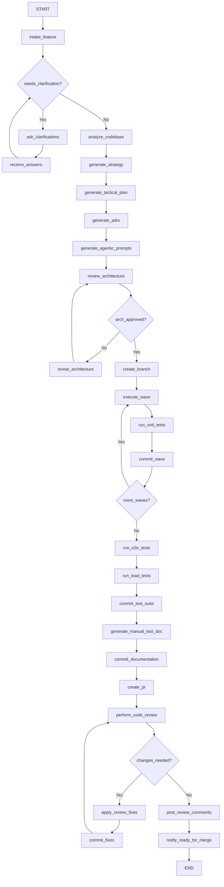

# HomeCare Agentic Code Generation Framework (LangGraph)

> **Goal:** Build a production-ready, standalone Python project that automates the full software development lifecycle — from feature branch creation through architecture design, code generation, testing, code review, and PR submission — for the HomeCare enterprise healthcare platform.

## Background & Architectural Analysis

The HomeCare application is a **production-ready enterprise healthcare management platform** with the following characteristics that the agentic framework must deeply understand and enforce:

| Layer | Technology | Key Patterns |
|---|---|---|
| **Backend** | .NET 10, ASP.NET Core | Clean Architecture (4 layers), CQRS via MediatR, Repository + UoW, FluentValidation |
| **Frontend** | Next.js 15 (App Router), React 19, TypeScript, Tailwind CSS | Server-First RSC, BFF proxy (`app/bff/`), URL-driven state, Zod validation |
| **Database** | PostgreSQL 16, EF Core Code-First | Soft delete, audit logging, xmin concurrency tokens, CHECK constraints |
| **Auth** | OIDC/PKCE, JWT Bearer | RBAC + Feature-Based Access Control (FBAC), fail-closed tenant identity |
| **Testing** | xUnit (backend), Vitest (frontend unit), Playwright (E2E), k6 (load) | Architecture tests, integration tests, PII redaction tests |
| **Compliance** | HIPAA, GDPR, PCI-DSS | No PII in logs, encrypted fields, audit trails, RFC 7807 errors |

The framework must replicate the exact **document generation pipeline** already proven in the repository:
1. **Strategy Document** → Requirements, Use Case Diagrams, Sequence Diagrams, C4 Diagrams, Gap Analysis, Risk Register
2. **Tactical Plan** → ERD, DB Schema, Component Diagrams, API Endpoints, Frontend Routes, Work Packages
3. **ADRs** → Architecture Decision Records for significant decisions
4. **Agentic Prompts** → Self-contained, parallelisable work-package prompts with file-ownership matrices
5. **Architecture Review** → Deep pre-implementation review with traceability
6. **Code Review** → Post-implementation critical review against enterprise standards

---

## User Review Required

> [!IMPORTANT]
> **Project Location:** This will be created as a **new standalone project** outside the HomeCare repository. Please confirm the desired location (e.g., `d:\WorkingFolder\HomeCareAgent\` or another path).

> [!IMPORTANT]
> **OpenRouter Model Selection:** The framework uses OpenRouter as the LLM provider (BYOK). Should we default to a specific model (e.g., `anthropic/claude-sonnet-4`, `openai/gpt-4o`) or let the user configure it during setup?

> [!WARNING]
> **GitHub Authentication:** The framework needs GitHub API access for branch creation, PR submission, and code review comments. Should this use:
> - A GitHub Personal Access Token (PAT) provided during setup?
> - GitHub App installation (more secure, scoped permissions)?
> - Both options with user choice?

---

## Open Questions

> [!IMPORTANT]
> **Q1: Target Repository Configuration** — Should the framework be hardcoded for the HomeCare repository structure, or should it be configurable to work with any repository that follows similar Clean Architecture patterns? The architecture analysis captured here is HomeCare-specific, but the document templates could be generalized.

> [!IMPORTANT]
> **Q2: Screenshot/Wireframe Input** — You mentioned screenshots/wireframes should be supported. Should these be:
> - Uploaded as image files alongside the feature request?
> - Provided as URLs?
> - Both?
> - Should the agent use vision capabilities to analyze them and extract UI requirements?

> [!IMPORTANT]
> **Q3: Interactive Clarification Mode** — You want the framework to ask questions for clarification. Should this be:
> - A CLI-based interactive session?
> - A web-based chat UI?
> - Both?

> [!NOTE]
> **Q4: Parallel Execution** — The agentic prompts are designed for parallel execution by separate team members. Should the framework execute multiple work packages concurrently (multiple LLM calls in parallel), or sequentially respecting wave dependencies?

---

## Proposed Changes

### Project Scaffolding

#### [NEW] Project Root: `homecare-agent/`

```
homecare-agent/
├── pyproject.toml                    # Python project with Poetry/uv
├── .env.example                      # Template for environment variables
├── README.md                         # Setup & usage guide
├── Dockerfile                        # Container deployment
├── docker-compose.yml                # Local dev with dependencies
│
├── src/
│   └── homecare_agent/
│       ├── __init__.py
│       ├── main.py                   # CLI entry point
│       ├── config.py                 # Configuration & environment
│       │
│       ├── graph/                    # LangGraph orchestration
│       │   ├── __init__.py
│       │   ├── state.py              # Graph state definitions
│       │   ├── main_graph.py         # Top-level workflow graph
│       │   ├── nodes/                # Individual graph nodes
│       │   │   ├── __init__.py
│       │   │   ├── intake.py         # Feature intake & clarification
│       │   │   ├── analyze.py        # Codebase analysis
│       │   │   ├── architect.py      # Strategy & tactical planning
│       │   │   ├── review_arch.py    # Architecture review
│       │   │   ├── generate_prompts.py  # Agentic prompt generation
│       │   │   ├── execute_prompt.py    # Code generation execution
│       │   │   ├── test_backend.py      # Backend test creation/execution
│       │   │   ├── test_frontend.py     # Frontend test creation/execution
│       │   │   ├── test_e2e.py          # Playwright E2E tests
│       │   │   ├── test_load.py         # k6 load testing
│       │   │   ├── code_review.py       # Automated code review
│       │   │   ├── documentation.py     # Manual test documentation
│       │   │   ├── git_ops.py           # Branch, commit, push, PR
│       │   │   └── notify.py            # Completion notification
│       │   └── edges/                # Conditional routing logic
│       │       ├── __init__.py
│       │       └── routing.py
│       │
│       ├── llm/                      # LLM provider abstraction
│       │   ├── __init__.py
│       │   ├── provider.py           # OpenRouter BYOK client
│       │   └── prompts/              # Prompt templates
│       │       ├── __init__.py
│       │       ├── architect_strategy.py
│       │       ├── architect_tactical.py
│       │       ├── architect_adr.py
│       │       ├── arch_review.py
│       │       ├── code_review.py
│       │       ├── prompt_generator.py
│       │       ├── code_generator.py
│       │       ├── test_generator.py
│       │       └── documentation.py
│       │
│       ├── tools/                    # LangGraph tool implementations
│       │   ├── __init__.py
│       │   ├── github_tools.py       # GitHub API (branch, PR, review)
│       │   ├── git_tools.py          # Local git operations
│       │   ├── file_tools.py         # File read/write/search
│       │   ├── codebase_tools.py     # AST analysis, dependency graphs
│       │   ├── build_tools.py        # dotnet build, npm build
│       │   ├── test_tools.py         # dotnet test, vitest, playwright, k6
│       │   ├── image_tools.py        # Screenshot/wireframe analysis
│       │   └── mermaid_tools.py      # Mermaid diagram generation/validation
│       │
│       ├── knowledge/                # HomeCare architecture knowledge base
│       │   ├── __init__.py
│       │   ├── architecture.py       # Embedded architecture patterns
│       │   ├── conventions.py        # Code conventions & standards
│       │   ├── templates.py          # Document templates (Strategy, Tactical, ADR, etc.)
│       │   └── enterprise_standards.py  # AI_Instructions.md internalized
│       │
│       ├── models/                   # Pydantic data models
│       │   ├── __init__.py
│       │   ├── feature_request.py    # Feature request schema
│       │   ├── architecture.py       # Architecture document schemas
│       │   ├── work_package.py       # Work package definitions
│       │   ├── test_result.py        # Test execution results
│       │   └── review.py             # Code review findings
│       │
│       └── ui/                       # Interactive interface
│           ├── __init__.py
│           ├── cli.py                # Rich CLI interface
│           └── web.py                # Optional: Gradio/Streamlit web UI
│
├── templates/                        # Document generation templates
│   ├── STRATEGY_TEMPLATE.md
│   ├── TACTICAL_PLAN_TEMPLATE.md
│   ├── ADR_TEMPLATE.md
│   ├── AGENTIC_PROMPTS_TEMPLATE.md
│   ├── ARCHITECTURE_REVIEW_TEMPLATE.md
│   ├── CODE_REVIEW_TEMPLATE.md
│   ├── PR_DESCRIPTION_TEMPLATE.md
│   ├── MANUAL_TESTING_GUIDE_TEMPLATE.md
│   └── STANDING_INSTRUCTIONS.md      # Enterprise standards injected into every prompt
│
├── tests/
│   ├── __init__.py
│   ├── test_graph.py
│   ├── test_nodes.py
│   ├── test_tools.py
│   ├── test_prompts.py
│   └── test_knowledge.py
│
└── docs/
    ├── ARCHITECTURE.md               # This framework's own architecture
    ├── CONFIGURATION.md              # Configuration reference
    └── WORKFLOW.md                   # Step-by-step workflow documentation
```

---

### Core Graph Architecture (LangGraph)

#### [NEW] `src/homecare_agent/graph/state.py`

The central state object that flows through the entire LangGraph workflow:

```python
class AgentState(TypedDict):
    # --- Input ---
    feature_name: str                          # e.g., "Order Service Request Fulfillment Workflow"
    feature_description: str                   # Natural language description
    wireframe_paths: list[str]                 # Paths to screenshot/wireframe images
    openrouter_api_key: str                    # BYOK
    github_token: str                          # GitHub PAT
    repo_path: str                             # Local repo clone path
    repo_url: str                              # GitHub repo URL
    
    # --- Clarification Loop ---
    clarification_questions: list[dict]        # Questions for user
    clarification_answers: list[dict]          # User's answers
    clarification_complete: bool               # Whether all questions resolved
    
    # --- Analysis ---
    codebase_analysis: dict                    # Deep codebase analysis results
    existing_patterns: dict                    # Detected patterns & conventions
    gap_analysis: dict                         # What exists vs. what's needed
    
    # --- Architecture ---
    strategy_document: str                     # Generated Strategy.md content
    tactical_plan: str                         # Generated Tactical Plan.md content
    adr_documents: list[dict]                  # Generated ADRs
    architecture_review: str                   # Architecture review findings
    architecture_approved: bool                # Whether review passed
    
    # --- Execution ---
    branch_name: str                           # feature/xxx
    agentic_prompts: list[dict]                # Generated work package prompts
    work_packages: list[dict]                  # Structured work package definitions
    current_wave: int                          # Current execution wave
    current_wp_index: int                      # Current work package within wave
    generated_code: dict[str, str]             # file_path -> content
    
    # --- Testing ---
    backend_test_results: dict                 # dotnet test results
    frontend_test_results: dict                # vitest results
    e2e_test_results: dict                     # Playwright results
    load_test_results: dict                    # k6 results
    
    # --- Review ---
    pr_number: int                             # Created PR number
    code_review_findings: list[dict]           # Review comments
    review_changes_needed: bool                # Whether changes required
    
    # --- Status ---
    current_step: str                          # Current workflow step name
    completed_steps: list[str]                 # Completed step names
    errors: list[dict]                         # Any errors encountered
    commit_log: list[dict]                     # Git commit history
```

#### [NEW] `src/homecare_agent/graph/main_graph.py`

The top-level LangGraph StateGraph with the following node flow:



---

### LLM Provider (OpenRouter BYOK)

#### [NEW] `src/homecare_agent/llm/provider.py`

OpenRouter integration with BYOK:

- Base URL: `https://openrouter.ai/api/v1`
- Uses `langchain-openai` `ChatOpenAI` with `openai_api_base` pointed to OpenRouter
- Model configurable (default: `anthropic/claude-sonnet-4`)
- Supports vision for screenshot/wireframe analysis
- Rate limiting and retry logic built-in
- Token usage tracking and cost estimation

---

### Knowledge Base (HomeCare-Specific)

#### [NEW] `src/homecare_agent/knowledge/architecture.py`

Embeds the deep architectural knowledge extracted from analysis:

- **Clean Architecture layers**: Domain → Application → Infrastructure → API
- **Entity patterns**: BaseEntity inheritance, soft delete, audit logging, xmin concurrency
- **CQRS pattern**: MediatR Commands/Queries/Handlers/Validators under `Features/<Feature>/`
- **Repository pattern**: Generic Repository<T> + specialized repositories, UnitOfWork
- **Frontend patterns**: App Router routes, BFF proxy, Server Components, client islands
- **Test patterns**: xUnit with mocked dependencies, Playwright E2E, k6 load tests
- **Compliance patterns**: PII redaction, HIPAA audit trails, RFC 7807 errors

#### [NEW] `src/homecare_agent/knowledge/conventions.py`

Codifies the enterprise standards from [AI_Instructions.md](file:///d:/WorkingFolder/HomeCare/HomeCare/AI_Instructions.md):

- Naming conventions (C# PascalCase, TypeScript camelCase)
- No `any` types in TypeScript
- XML comments on all public members
- FluentValidation (backend) + Zod (frontend)
- Serilog structured logging with PII filtering
- Money as integer minor units + ISO 4217 currency code

#### [NEW] `src/homecare_agent/knowledge/templates.py`

Document templates derived from the existing architecture documents:

- Strategy template derived from [STRATEGY-Vendor-Payouts-Accounting.md](file:///d:/WorkingFolder/HomeCare/HomeCare/Architecture/Vendor_Payouts_Accounting_Workflow/STRATEGY-Vendor-Payouts-Accounting.md)
- Tactical plan template derived from [TACTICAL-PLAN-Vendor-Payouts-Accounting.md](file:///d:/WorkingFolder/HomeCare/HomeCare/Architecture/Vendor_Payouts_Accounting_Workflow/TACTICAL-PLAN-Vendor-Payouts-Accounting.md)
- ADR template derived from [ADR_Template.md](file:///d:/WorkingFolder/HomeCare/HomeCare/Architecture/ADRs/ADR_Template.md)
- Agentic prompts template derived from [AGENTIC-PROMPTS-Vendor-Payouts-Accounting.md](file:///d:/WorkingFolder/HomeCare/HomeCare/Architecture/Vendor_Payouts_Accounting_Workflow/AGENTIC-PROMPTS-Vendor-Payouts-Accounting.md)
- Architecture review template derived from [Architecture_Review.md](file:///d:/WorkingFolder/HomeCare/HomeCare/Architecture/Order_Service_Request_Fulfillment_Workflow/Architecture_Review.md)
- Code review template derived from [Code_Review.md](file:///d:/WorkingFolder/HomeCare/HomeCare/Architecture/Order_Service_Request_Fulfillment_Workflow/Code_Review.md)
- PR description template derived from [PR_DESCRIPTION_ISSUE_44.md](file:///d:/WorkingFolder/HomeCare/HomeCare/code/frontend/PR_DESCRIPTION_ISSUE_44.md)

---

### Graph Nodes (Detailed)

#### Node 1: `intake_feature` (Step 1)
- Receives feature name, description, wireframes
- Analyzes wireframes using vision LLM if provided
- Extracts functional requirements from the description
- Identifies potential clarification needs

#### Node 2: `ask_clarifications` (Supports interactive Q&A)
- Generates targeted questions based on:
  - Ambiguous requirements
  - Missing non-functional requirements
  - UI/UX decisions not clear from wireframes
  - Integration points with existing modules
  - Compliance/security implications
- Presents questions via CLI or web UI
- Loops until all critical questions are resolved

#### Node 3: `analyze_codebase` (Deep Analysis)
- Scans the entire HomeCare repository structure
- Identifies relevant existing entities, controllers, features
- Maps dependency graph between modules
- Detects existing patterns (e.g., how VendorFulfillment was built)
- Produces a gap analysis: what exists vs. what's needed

#### Node 4-6: `generate_strategy` → `generate_tactical_plan` → `generate_adrs` (Steps 2-3)
- **Architect persona**: Senior Solution Architect (20+ years)
- Strategy document following the exact format of existing strategies:
  - Requirements (FR, NFR, Constraints)
  - System-wide Context Map (Mermaid Use Case Diagram)
  - Sequence Diagrams (Mermaid)
  - C4 Container/Component Diagrams (Mermaid)
  - Gap Analysis vs. existing codebase
  - Risk Register
- Tactical Plan following existing format:
  - ERD (Mermaid)
  - Physical DB Schema with all indexes, CHECK constraints
  - Component Diagram (Mermaid)
  - API Endpoint Specification
  - Frontend Routes & Components
  - Validation Rules
  - Security Controls
  - Work Package Breakdown
- ADRs for architecturally significant decisions

#### Node 7: `generate_agentic_prompts` (Step 3)
- Produces self-contained execution prompts per work package
- Includes file-ownership matrix for collision avoidance
- Organizes into waves with dependency ordering
- Each prompt includes standing instructions from enterprise standards
- Acceptance criteria for each prompt

#### Node 8: `review_architecture` (Step 4)
- **Reviewer persona**: Senior Software Architect (20+ years)
- Reviews strategy, tactical plan, ADRs, and prompts
- Checks for:
  - Consistency between documents
  - Adherence to Clean Architecture principles
  - Compliance with enterprise standards
  - Security considerations
  - Performance implications
  - Missing edge cases
- Produces a graded review with findings

#### Node 9: `create_branch` (Step 1 of execution)
- Creates `feature/<module-name-kebab-case>` branch
- Pushes to origin

#### Node 10: `execute_wave` (Steps 5, repeated per wave)
- Iterates through work packages in the current wave
- For each work package:
  - Injects standing instructions + work package prompt
  - Generates complete file contents (no truncation)
  - Writes files to the repository
  - Runs `dotnet build` / `npm run build` to validate

#### Node 11: `run_unit_tests` (Steps 6, 8)
- Backend: Generates xUnit test classes, runs `dotnet test`
- Frontend: Generates Vitest test files, runs `npm test`
- Iterates if tests fail (up to 3 attempts)

#### Node 12: `commit_wave` (Step 7)
- Stages changed files
- Creates a descriptive commit message referencing the work package
- Pushes to the feature branch

#### Node 13: `run_e2e_tests` (Step 9)
- Generates Playwright E2E test specs following existing patterns
- Runs `npx playwright test`
- Captures test reports

#### Node 14: `run_load_tests` (Step 10)
- Generates k6 load test scripts following existing patterns
- Runs `k6 run` with appropriate thresholds
- Only when applicable (e.g., new API endpoints)

#### Node 15: `commit_test_suite` (Step 11)
- Commits all test files to the branch

#### Node 16: `generate_manual_test_doc` (Step 12)
- Generates comprehensive manual testing guide following the format of [MANUAL_TESTING_GUIDE.md](file:///d:/WorkingFolder/HomeCare/HomeCare/code/MANUAL_TESTING_GUIDE.md)
- Step-by-step instructions for developer/tester

#### Node 17: `commit_documentation` (Step 13)
- Commits architecture docs + manual testing guide

#### Node 18: `create_pr` (Step 14)
- Creates a GitHub Pull Request with:
  - Detailed description (following existing PR format)
  - Files changed summary
  - Test results summary
  - Architecture decisions referenced

#### Node 19: `perform_code_review` (Steps 15-17)
- **Reviewer persona**: Senior Software Architect (20+ years)
- Reviews generated code against:
  - Enterprise Code Quality Standards (AI_Instructions.md)
  - Clean Architecture compliance
  - SOLID principles
  - Security (OWASP, HIPAA, PCI-DSS)
  - Type safety (no `any` in TypeScript)
  - Test coverage
- Posts review comments on the PR
- If changes needed, applies fixes and re-commits

#### Node 20: `notify_ready_for_merge` (Step 18)
- Posts a summary comment on the PR
- Marks the PR as ready for human review
- Outputs final status to CLI/UI

---

### Tool Implementations

#### [NEW] `src/homecare_agent/tools/github_tools.py`
- `create_branch(repo, branch_name)` — Creates and pushes a new feature branch
- `create_pull_request(repo, title, body, head, base)` — Creates a PR
- `add_review_comment(repo, pr_number, body, path, line)` — Adds review comments
- `get_pr_diff(repo, pr_number)` — Gets the PR diff for review
- `post_pr_review(repo, pr_number, body, event)` — Submits a PR review

#### [NEW] `src/homecare_agent/tools/git_tools.py`
- `git_checkout(branch)` — Switch/create branch
- `git_add(files)` — Stage files
- `git_commit(message)` — Commit with descriptive message
- `git_push(branch)` — Push to remote
- `git_status()` — Check working tree status

#### [NEW] `src/homecare_agent/tools/codebase_tools.py`
- `analyze_solution(sln_path)` — Parse .NET solution structure
- `analyze_entities(domain_path)` — Extract entity definitions
- `analyze_controllers(api_path)` — Extract API surface
- `analyze_frontend_routes(app_path)` — Map Next.js routes
- `find_related_features(feature_name)` — Find similar existing features
- `get_dependency_graph()` — Build inter-module dependency graph

#### [NEW] `src/homecare_agent/tools/build_tools.py`
- `dotnet_build(project_path)` — Build .NET solution
- `dotnet_test(project_path)` — Run backend tests
- `npm_build(frontend_path)` — Build Next.js frontend
- `npm_lint(frontend_path)` — Run ESLint
- `npm_test(frontend_path)` — Run Vitest

#### [NEW] `src/homecare_agent/tools/image_tools.py`
- `analyze_wireframe(image_path)` — Extract UI requirements from wireframe
- `extract_ui_components(image_path)` — Identify UI components/layout
- `compare_with_existing_ui(image_path, existing_screenshots)` — Ensure consistency

---

### Configuration

#### [NEW] `.env.example`

```env
# === REQUIRED ===
OPENROUTER_API_KEY=sk-or-v1-xxx          # OpenRouter API key (BYOK)
GITHUB_TOKEN=ghp_xxx                       # GitHub Personal Access Token
REPO_PATH=d:/WorkingFolder/HomeCare/HomeCare  # Local repository path
REPO_URL=https://github.com/org/HomeCare   # GitHub repository URL

# === OPTIONAL ===
OPENROUTER_MODEL=anthropic/claude-sonnet-4  # Default LLM model
OPENROUTER_VISION_MODEL=anthropic/claude-sonnet-4  # Vision model for wireframes
MAX_RETRIES=3                              # Max retries for failed operations
LOG_LEVEL=INFO                             # Logging level
```

---

### Dependencies

#### [NEW] `pyproject.toml`

Key dependencies:
- `langgraph >= 0.4` — Core workflow orchestration
- `langchain-openai >= 0.3` — OpenRouter LLM integration via OpenAI-compatible API
- `langchain-core >= 0.3` — Base abstractions
- `PyGithub >= 2.0` — GitHub API integration
- `GitPython >= 3.1` — Local git operations
- `pydantic >= 2.0` — Data validation & schemas
- `rich >= 13.0` — Beautiful CLI output
- `typer >= 0.12` — CLI framework
- `Pillow >= 10.0` — Image processing for wireframes
- `httpx >= 0.27` — HTTP client for API calls
- `python-dotenv >= 1.0` — Environment variable management
- `pytest >= 8.0` — Testing framework

---

## Verification Plan

### Automated Tests

```bash
# Run all framework tests
pytest tests/ -v

# Test individual components
pytest tests/test_graph.py -v         # Graph flow tests
pytest tests/test_nodes.py -v         # Individual node tests
pytest tests/test_tools.py -v         # Tool integration tests
pytest tests/test_prompts.py -v       # Prompt template tests
```

### Manual Verification

1. **End-to-End Smoke Test**: Run the framework with a simple feature request (e.g., "Add a health check dashboard") against a test repository
2. **Document Quality**: Verify generated Strategy, Tactical Plan, ADRs match the quality and format of existing HomeCare architecture documents
3. **Code Quality**: Verify generated code follows Clean Architecture patterns and passes `dotnet build` / `npm run build`
4. **Git Operations**: Verify branch creation, commits, and PR creation work correctly
5. **Review Quality**: Verify architecture and code review output matches the depth shown in existing reviews

### Integration Tests (requires real credentials)

```bash
# Test with real OpenRouter API
pytest tests/integration/ -v --openrouter-key=<key>

# Test with real GitHub API  
pytest tests/integration/ -v --github-token=<token>
```
