# Agentic Prompts: Orders & Services Fulfillment Workflow

**Document type:** Execution prompts
**Date:** 2026-09-14
**Companions:** [STRATEGY](STRATEGY-Order-Service-Request-Fulfillment.md) · [TACTICAL PLAN](TACTICAL-PLAN-Order-Service-Request-Fulfillment.md) · ADR 015–020

---

## How to Use This Document

Each section below is a **self-contained prompt** for one work package. Hand a section to an
engineer or an AI agent verbatim. Every prompt states its own preconditions, scope boundary,
deliverables, and exit criteria, so packages that are marked parallel can run with no
cross-talk.

### Execution Order

```mermaid
gantt
    title Work Package Scheduling
    dateFormat X
    axisFormat %s

    section Gate
    WP0 Intake and identity remediation      :crit, wp0, 0, 3

    section Foundation
    WP1 Domain, schema and DTO contract      :crit, wp1, after wp0, 2

    section Parallel wave
    WP2 Purchases backend                    :wp2, after wp1, 3
    WP3 Rentals backend                      :wp3, after wp1, 3
    WP4 Frontend shell and shared components :wp4, after wp1, 3
    WP7 Nurse provisioning placeholder       :done, wp7, after wp1, 1
    WP8 Observability and hardening          :wp8, after wp1, 2

    section Second wave
    WP5 Purchases UI                         :wp5, after wp2, 3
    WP6 Rentals UI                           :wp6, after wp3, 3

    section Verification
    WP9 E2E, a11y and responsive QA          :crit, wp9, after wp5, 2
```



| Wave | Packages | Concurrent owners |
| --- | --- | --- |
| Gate | WP0 | 1 |
| Foundation | WP1 | 1 |
| Parallel wave | WP2, WP3, WP4, WP7, WP8 | up to 5 |
| Second wave | WP5, WP6 | up to 2 |
| Verification | WP9 | 1 |

### Rules Binding Every Prompt

1. `AI_Instructions.md` **Enterprise Code Quality Standards** apply in full: SOLID, Clean
   Architecture layering, Repository and Strategy patterns where appropriate, XML
   documentation on public endpoints and interfaces, no `any` in TypeScript, FluentValidation
   server-side and Zod client-side, RFC 7807 problem responses, Serilog structured logging with
   no PII, health checks, interface-based dependency injection for testability.
2. Provide **complete code blocks**. No `// ... rest of code` placeholders.
3. Follow each major code block with a short **"Architectural Decision"** note explaining why
   the pattern, index, or structure was chosen.
4. Never invent schema, endpoints, or DTO fields not specified in the tactical plan. If
   something is missing, stop and raise it rather than improvising.
5. **Never** add fixture or fallback data to production code paths. A failed call must surface
   as a failure.
6. Do not modify files owned by another work package. Ownership is stated in each prompt.
7. Run the existing test suite before opening a pull request and leave it green.

---

## WP0 — Intake and Identity Remediation

> **BLOCKING GATE. No other package may start until every exit criterion here passes.**

### Prompt

```
ROLE
You are a senior .NET backend engineer working in the HomeCare repository at
d:\WorkingFolder\HomeCare\HomeCare.

CONTEXT
An architecture review found that the vendor order intake path is broken in ways that make the
new Orders & Services Fulfillment feature impossible to build on. Read these documents first
and treat them as binding:
  - Architecture/Order_Service_Request_Fulfillment_Workflow/STRATEGY-Order-Service-Request-Fulfillment.md, sections 2 and 14
  - Architecture/Order_Service_Request_Fulfillment_Workflow/TACTICAL-PLAN-Order-Service-Request-Fulfillment.md, sections 2.1, 2.8, 4.1
  - ADR 016 - Fail-Closed Vendor Tenant Identity Resolution.md
  - ADR 017 - Fulfillment Type Derivation and Marketplace Identity Reconciliation.md
  - ADR 020 - Vendor Data Minimisation for Buyer Information.md
  - AI_Instructions.md

OBJECTIVE
Repair order intake and vendor tenant identity so that a marketplace checkout produces a
correctly tenanted, correctly typed, payment-linked VendorOrder that the owning vendor can see.

TASKS

1. Fail-closed vendor identity.
   - Create IVendorIdentityResolver in HomeCare.Application/Interfaces and implement it in
     HomeCare.Infrastructure/Services/VendorIdentityResolver.cs.
   - Return the VendorIdentityResult record and VendorIdentityFailure enum exactly as specified
     in ADR 016 section "Decision", item 1.
   - Resolution order: subject claim (ClaimTypes.NameIdentifier, then "sub") -> Vendors lookup
     by UserId -> active and approved check. There must be NO fallback that returns the parsed
     subject id as a vendor id.
   - Support admin impersonation via the X-Impersonate-Vendor-Id header, honoured only for
     principals satisfying AdminPolicy, and write an AuditLog row naming the administrator, the
     target vendor, the endpoint, and the correlation id BEFORE the business operation runs.
   - Refactor HomeCare.API/Controllers/VendorOrderController.cs to use the resolver and DELETE
     its private GetCurrentVendorIdAsync method, including the `return parsedId;` line.
   - Map every failure to 403 with RFC 7807 ProblemDetails.

2. Marketplace vendor reconciliation.
   - Add `Guid? VendorId` to HomeCare.Domain/Entities/MarketplaceVendor.cs with an FK to Vendors
     and a unique index where not null.
   - In HomeCare.Infrastructure/Services/MarketplaceService.cs, DELETE the block that creates a
     MarketplaceVendor on the fly. Resolve the HomeCare Vendor.Id through
     MarketplaceVendor.VendorId before creating any VendorOrder. If unresolved, throw a domain
     exception that the controller maps to 422 with a clear message. Do not create an orphan.

3. Fulfillment type derivation.
   - Add a required FulfillmentIntent (Purchase | Rental) to MarketplaceOrderItemRequest.
   - Implement the derivation table in ADR 017 section "Decision", item 1, including the
     contradiction rejections. Set VendorOrder.OrderType from the resolved value.
   - Widen the OrderType CHECK constraint to admit 'DevicePurchase' and 'NurseProvisioning'
     while keeping 'DeviceRental', 'NursingService' and 'Both' legal.
   - A basket mixing purchase and rental lines for one vendor produces two sibling VendorOrders
     sharing one MarketplaceOrderId.

4. Order aggregate extensions.
   Add to HomeCare.Domain/Entities/VendorOrder.cs exactly the columns listed in the tactical
   plan section 2.1: MarketplaceOrderId, PaymentId, BuyerName, BuyerContactNumber,
   DeliveryAddressLine1, DeliveryAddressLine2, DeliveryCity, DeliveryState, DeliveryPostalCode,
   DeliveryCountry, RejectionReason, AcceptedAt, AcceptedByUserId, RejectedAt, RejectedByUserId,
   Version.
   - Map Version to the PostgreSQL xmin system column using IsRowVersion(), following the
     existing VendorListing.Version precedent.
   - REMOVE the `VendorOrder.Id = order.Id` assignment in MarketplaceService. VendorOrder gets
     its own identity; the link is MarketplaceOrderId.
   - Populate the buyer and delivery snapshot columns at order creation from the patient record.
     This is a one-time snapshot; do not add a refresh path.

5. Rejection reason.
   - Stop concatenating rejection reasons into VendorOrder.Notes in RejectOrderCommandHandler.
     Write RejectionReason, RejectedAt and RejectedByUserId instead.

6. Migration AddFulfillmentIntakeRemediation.
   Implement schema changes plus the backfill described in the tactical plan section 4.1, in the
   stated order. Deterministic matching only: MarketplaceVendors.VendorId matches on
   ContactEmail = Vendors.Email where exactly one candidate exists. Leave ambiguous and
   unmatched rows NULL. Emit a reconciliation report to the migration log with COUNTS ONLY - no
   names, no addresses. Implement a working Down method.

7. Frontend cleanup.
   - DELETE the INITIAL_SUMMARY and INITIAL_ORDERS constants from
     code/frontend/app/(protected)/vendor/orders/page.tsx.
   - DELETE the FALLBACK_ORDERS constant from code/frontend/app/bff/vendor/orders/route.ts and
     make the route relay upstream failures verbatim.
   - The existing page must render an explicit error state when the backend fails.
   - Add an ESLint rule failing the build on exported array literals of domain objects under
     app/** and components/**.

OUT OF SCOPE
Do not create any fulfillment satellite table. Do not build any new UI. Do not touch
PatientEngagement, telemetry, or nurse provisioning.

FILES YOU OWN
  backend: HomeCare.Domain/Entities/{VendorOrder,MarketplaceVendor}.cs,
           HomeCare.Application/Interfaces/IVendorIdentityResolver.cs,
           HomeCare.Infrastructure/Services/{MarketplaceService,VendorIdentityResolver}.cs,
           HomeCare.Infrastructure/Data/Configurations/*,
           HomeCare.Infrastructure/Migrations/*,
           HomeCare.API/Controllers/VendorOrderController.cs,
           HomeCare.Application/Features/VendorOrders/Handlers/RejectOrderCommandHandler.cs
  frontend: app/(protected)/vendor/orders/page.tsx, app/bff/vendor/orders/route.ts,
            eslint.config.mjs

EXIT CRITERIA - all ten must pass, each with a named test
 1. Marketplace checkout produces a VendorOrder whose VendorId is a real Vendors.Id, and the
    order appears in that vendor's queue.
 2. A principal with no Vendor row receives 403 and no query executes.
 3. An admin without X-Impersonate-Vendor-Id receives 403; with it, the request succeeds and an
    audit row exists naming both parties.
 4. A sale-only listing produces OrderType 'DevicePurchase'; a rent-only listing produces
    'DeviceRental'; a contradictory intent is rejected with 422.
 5. VendorOrder.PaymentId is populated at creation and verification derives correctly from all
    four Payment.Status values.
 6. VendorOrder.Id is independent of MarketplaceOrder.Id; the link is MarketplaceOrderId.
 7. VendorOrder carries a working xmin concurrency token.
 8. RejectionReason is a dedicated column and no handler concatenates into Notes.
 9. INITIAL_ORDERS and FALLBACK_ORDERS no longer exist; a backend 500 renders an error state.
10. Migration Up and Down both run cleanly against a restored production-shaped database, and
    the reconciliation report lists unmatched rows by count.
```

---

## WP1 — Domain, Schema and DTO Contract

### Prompt

```
ROLE
Senior .NET backend engineer, HomeCare repository.

PRECONDITION
WP0 is merged and all ten of its exit criteria pass. Verify this before starting.

CONTEXT
Read and treat as binding:
  - TACTICAL-PLAN-Order-Service-Request-Fulfillment.md sections 1, 2, 3, 4.2, 7
  - ADR 015 - Fulfillment State Ownership and Satellite Aggregates.md
  - ADR 018 - Serial Number Allocation Concurrency Control.md
  - ADR 020 - Vendor Data Minimisation for Buyer Information.md
  - AI_Instructions.md

OBJECTIVE
Create the fulfillment domain model, database schema, state machine, and the FROZEN DTO
contract that WP2, WP3 and WP4 will build against in parallel. The contract is the deliverable
that unblocks four other engineers, so publish it first and do not change it afterwards without
a broadcast.

TASKS

1. Domain entities in HomeCare.Domain/Entities/, all deriving from BaseEntity, with XML docs:
   - PurchaseShipment
   - ShipmentPrerequisiteCheck
   - RentalContract
   - FulfillmentStatusHistory
    Property lists are given verbatim in tactical plan sections 2.3, 2.4, 2.5 and 2.6. Do not add
    fields. Do not omit fields. NOTE: RentalContract.StartDate is NULLABLE — it is set during
    deployment, not at accept time. FulfillmentStatusHistory.PerformedByUserId is NOT a foreign
    key — it is a plain uuid recorded identifier. See the rationale in tactical plan section 2.6.

2. Extend existing entities exactly as specified:
   - VendorOrderLine: AllocatedSerialNumberId, ItemDisplayName, ItemModelReference, WeightGrams
     (tactical plan 2.2)
   - VendorListingSerialNumber: AllocatedToOrderLineId, BioMedStatus, LastInspectedOn, Version
     (tactical plan 2.7)

3. Status constants in HomeCare.Domain/Constants/:
   - VendorOrderStatus, PurchaseDispatchStatus, RentalDispatchStatus,
     SecurityDepositStatus, PostReturnInspectionStatus, ShipmentPrerequisiteCode,
     FulfillmentHistoryScope
   Each a static class of const string with a public static IReadOnlySet<string> All.
   Write a unit test asserting each All set is byte-identical to the corresponding database
   CHECK constraint contents.

4. FulfillmentStateMachine in HomeCare.Application/Services/:
   - Pure, no I/O, no dependencies.
   - Implements exactly the three state diagrams in tactical plan section 3.
   - Exposes CanTransition(scope, from, to) and AllowedNextStatuses(scope, from).
    - Rejects legacy statuses 'InProgress' and 'Shipped' as transition targets.
    - GUARD: PendingDispatch -> Dispatched requires StartDate to be set (non-null). Return a
      clear failure reason when violated.
    - Unit test every legal AND every illegal transition. 100 percent coverage required.

5. FulfillmentBadgeResolver in HomeCare.Application/Services/:
   - Pure function implementing tactical plan section 3.5 tables for both tabs.
    - Also computes the capability flags (canAccept, canReject, canOpenShipment/canOpenState,
      isReadOnly) and the derived payment verification status from tactical plan 3.6.
    - IMPORTANT: lifecycle chip classification for Tab B must handle null EndDate. Contracts with
      null EndDate are ACTIVE (never EXPIRING or OVERDUE). See the updated badge table in
      tactical plan section 3.5.
    - Table-driven unit test mirroring the specification tables row by row, including a test case
      for null EndDate.

6. EF Core configurations in HomeCare.Infrastructure/Data/Configurations/ using
   IEntityTypeConfiguration<T>. Register the new DbSets on HomeCareDbContext. Map every Version
   property to xmin with IsRowVersion().

7. Append-only enforcement: extend the existing EnforceAuditLogAppendOnly pattern in
   HomeCareDbContext so that any Modified or Deleted entry for FulfillmentStatusHistory throws.
   Add a test.

8. Migration AddFulfillmentSatelliteAggregates per tactical plan section 4.2. Include EVERY
    CHECK constraint and EVERY index listed in sections 2.1 through 2.7 verbatim, including:
    - CK_RentalContracts_Dispatch_Requires_Dates (StartDate must be set before leaving
      PendingDispatch)
    - CK_RentalContracts_DateOrder (updated for both dates nullable)
    - CREATE EXTENSION IF NOT EXISTS pg_trgm
    If the deployment role cannot create extensions, implement the documented B-tree fallback and
    record the reduced capability. Implement Down.

9. FROZEN DTO CONTRACT - the unblocking deliverable.
   Create HomeCare.Application/Features/VendorFulfillment/DTOs/ containing exactly the shapes in
   tactical plan section 7, translated to C#:
     DevicePurchaseCardDto, DevicePurchaseMetricsDto, DevicePurchaseDetailDto,
     ShipmentRegistryDto, DeviceRentalCardDto, DeviceRentalMetricsDto, DeviceRentalDetailDto,
     RentalDeploymentDto, AvailableUnitDto, MetricTile, BadgeDto, CapabilitiesDto,
     PagedResult<T>
   Then:
     - Generate the matching TypeScript interfaces at
       code/frontend/types/vendor-fulfillment.ts. These must be structurally identical.
     - Announce the contract as frozen. WP2, WP3 and WP4 start at this moment.

10. Register repositories and services on UnitOfWork and in ServiceCollectionExtensions.

OUT OF SCOPE
No controllers. No query or command handlers. No UI. No BFF routes.

FILES YOU OWN
  HomeCare.Domain/Entities/*, HomeCare.Domain/Constants/*,
  HomeCare.Application/Services/{FulfillmentStateMachine,FulfillmentBadgeResolver}.cs,
  HomeCare.Application/Features/VendorFulfillment/DTOs/*,
  HomeCare.Infrastructure/Data/Configurations/*, HomeCare.Infrastructure/Migrations/*,
  HomeCare.Infrastructure/Data/{HomeCareDbContext,UnitOfWork}.cs,
  code/frontend/types/vendor-fulfillment.ts

EXIT CRITERIA
 - Migration Up and Down both run against a restored production-shaped database.
 - Every CHECK constraint rejects an invalid value, proven by a Testcontainers test per
   constraint.
 - UX_VLSN_ActiveAllocation rejects a direct double-allocation attempt at the SQL level.
 - FulfillmentStateMachine has 100 percent branch coverage.
 - FulfillmentBadgeResolver output matches the specification tables exactly.
 - FulfillmentStatusHistory rejects UPDATE and DELETE through the DbContext.
 - Constant sets and CHECK constraints agree, proven by test.
 - The C# and TypeScript DTO contracts are structurally identical, proven by a contract test.
```

---

## WP2 — Device Purchases Backend

### Prompt

```
ROLE
Senior .NET backend engineer, HomeCare repository.

PRECONDITION
WP1 is merged and the DTO contract is frozen.

PARALLEL WITH
WP3, WP4, WP7, WP8. You share no files with them.

CONTEXT
Read and treat as binding:
  - STRATEGY sections 3.2, 3.3, 9.1, 9.3   (FR-10 to FR-22, FR-30 to FR-39)
  - TACTICAL-PLAN sections 3.2, 3.4, 3.5, 3.6, 6.1, 6.5, 7.1 to 7.3, 11.2
  - ADR 015, ADR 016, ADR 020
  - AI_Instructions.md

OBJECTIVE
Implement the complete backend for Tab A - Device Purchases, endpoints A1 through A9.

TASKS

1. VendorFulfillmentController in HomeCare.API/Controllers/:
   - [ApiVersion("1.0")], route api/v{version:apiVersion}/vendor/fulfillment,
     [Authorize(Policy = "VendorPolicy")].
   - Resolve the tenant ONLY through IVendorIdentityResolver. No User.FindFirst in this file.
   - Implement endpoints A1 through A9 per tactical plan section 6.1, with the exact success and
     failure codes listed.
   - XML documentation on every action. .WithOpenApi() metadata.
   - Add ConcurrencyTokenFilter: read If-Match, emit weak ETag on GET, map
     DbUpdateConcurrencyException to 412.
   Note: WP3 will add rental actions to this same controller. Keep purchase actions in a clearly
   delimited region and coordinate the merge.

2. Query handlers in HomeCare.Application/Features/VendorFulfillment/Queries/:
   - GetDevicePurchaseQueueQuery       -> PagedResult<DevicePurchaseCardDto>
   - GetDevicePurchaseMetricsQuery     -> DevicePurchaseMetricsDto
   - GetDevicePurchaseDetailQuery      -> DevicePurchaseDetailDto
   - GetShipmentRegistryQuery          -> ShipmentRegistryDto
   - ExportDevicePurchaseQueueQuery    -> streamed CSV
   Rules:
     - Every query starts from a VendorId predicate.
     - Explicit Select projections only. .Include(o => o.Patient) is FORBIDDEN (ADR 020).
     - Badge and capability flags come from FulfillmentBadgeResolver. Never persisted.
     - Payment verification derives from Payment.Status via VendorOrder.PaymentId.
     - Filtering by a derived badge translates back into an (order status, shipment status)
       predicate inside the repository, in one place.
     - Sort parameter is an allow-list: createdAt, orderNumber, buyerName. Anything else is 400.

3. Command handlers in .../Commands/:
   - AcceptPurchaseOrderCommand: guard payment verified; set Status=Confirmed, AcceptedAt,
     AcceptedByUserId; create PurchaseShipment with DispatchStatus='Registered' and a generated
     ShipmentNumber SH-{yyyy}-{seq}; seed all five ShipmentPrerequisiteChecks unattested with
     correct IsMandatory and DisplayOrder; append history. One transaction.
   - RejectPurchaseOrderCommand: require a 10 to 500 character reason; set Status=Rejected,
     RejectionReason, RejectedAt, RejectedByUserId; release any provisional serial allocation;
     append history. Irreversible.
   - SaveShipmentRegistryCommand: validate carrier and manifest present and every IsMandatory
     check attested before allowing Dispatched; set attestation provenance
     (SatisfiedAt, SatisfiedByUserId); set DispatchedAt on entry to Dispatched; on Delivered set
     DeliveredAt and VendorOrders.Status=Completed with FulfilledAt; append history.
   - DeleteShipmentRegistryCommand: refuse if already Dispatched; otherwise soft-delete the
     shipment and return the order to accepted-awaiting-registration. History is retained.
   Every command consults FulfillmentStateMachine before writing and runs in one UnitOfWork
   transaction.

4. FluentValidation validators for every command. Reason length, carrier presence, prerequisite
   completeness, paging bounds, sort allow-list.

5. FulfillmentRepository (purchase half) in HomeCare.Infrastructure/Data/Repositories/. Every
   query must use IX_VendorOrders_Vendor_Type_Status_Created or
   IX_VendorOrders_Vendor_Type_Created. Verify with EXPLAIN and record the plan in the PR.

6. Metrics: two bounded-window aggregates (current vs previous equal-length window) behind
    IMemoryCache keyed by vendor id with a 60 second TTL. Invalidate on any accept, reject, or
    dispatch for that vendor. IMPORTANT: cache invalidation MUST occur AFTER
    UnitOfWork.CommitAsync() succeeds, never before, to prevent a concurrent read from
    repopulating the cache with pre-commit data. Implement as a post-commit step.

7. CsvExportWriter: streamed, UTF-8 with BOM. Escape leading = + - @ tab and carriage return by
   prefixing a single quote. Include a test asserting a value of `=cmd|'/c calc'!A1` is
   neutralised.

8. Rate limiting: 30 requests per minute per vendor on A5 and A6.

TESTS - minimum
  Unit: every handler, tenant filtering, validation failures, badge derivation, payment gating.
  Integration (Testcontainers PostgreSQL): mandatory cases 1 to 13, 16, 18, 20, 22, 23 from
  tactical plan section 11.2.
  Coverage: >= 85 percent on Application-layer code.

OUT OF SCOPE
No rental logic. No UI. No BFF routes. No changes to WP1 domain files.

FILES YOU OWN
  HomeCare.API/Controllers/VendorFulfillmentController.cs (purchase region),
  HomeCare.API/Filters/ConcurrencyTokenFilter.cs,
  HomeCare.Application/Features/VendorFulfillment/{Queries,Commands,Validators}/*Purchase*,
  HomeCare.Application/Services/CsvExportWriter.cs,
  HomeCare.Infrastructure/Data/Repositories/FulfillmentRepository.cs (purchase methods),
  HomeCare.Tests/**/Purchase*
```

---

## WP3 — Device Rentals Backend

### Prompt

```
ROLE
Senior .NET backend engineer, HomeCare repository.

PRECONDITION
WP1 is merged and the DTO contract is frozen.

PARALLEL WITH
WP2, WP4, WP7, WP8. Coordinate with WP2 only on the shared controller file.

CONTEXT
Read and treat as binding:
  - STRATEGY sections 3.4, 3.5, 9.2   (FR-50 to FR-60, FR-70 to FR-80)
  - TACTICAL-PLAN sections 3.3, 3.5, 6.2, 6.3, 7.4, 7.5, 11.2
  - ADR 015, ADR 016, ADR 018, ADR 020
  - AI_Instructions.md

OBJECTIVE
Implement the complete backend for Tab B - Device Rentals, endpoints B1 through B9 and the
reference endpoints R1 and R2.

TASKS

1. Rental actions on VendorFulfillmentController, endpoints B1 through B9 per tactical plan
   section 6.2, plus reference endpoints R1 and R2 per section 6.3 with
   Cache-Control: public, max-age=3600. Keep them in a clearly delimited region; WP2 owns the
   purchase region of the same file.

2. Query handlers:
   - GetDeviceRentalQueueQuery      -> PagedResult<DeviceRentalCardDto>
   - GetDeviceRentalMetricsQuery    -> DeviceRentalMetricsDto
   - GetDeviceRentalDetailQuery     -> DeviceRentalDetailDto
   - GetRentalDeploymentQuery       -> RentalDeploymentDto, including allowedNextStatuses from
                                       FulfillmentStateMachine
   - GetAvailableUnitsQuery         -> AvailableUnitDto[]
                                       (Status='In-Stock' AND AllocatedToOrderLineId IS NULL,
                                        scoped to the ordered listing and the vendor)
   Rules: VendorId predicate first; explicit Select only; .Include(o => o.Patient) FORBIDDEN;
   chips and capabilities from FulfillmentBadgeResolver.

3. Lifecycle chip classification per tactical plan section 3.5:
    OVERDUE when EndDate is NOT NULL AND in the past and status is not Received.
    EXPIRING when EndDate is NOT NULL AND within 7 days and status is Delivered.
    ACTIVE when EndDate is NULL and status is Dispatched or Delivered.
    ACTIVE when status is Dispatched or Delivered (with EndDate set, not expiring/overdue).
    CLOSED when status is Received. REJECTED when the order is rejected.
    Contracts with null EndDate are NEVER classified as EXPIRING or OVERDUE.
    Compute in SQL where possible so the Expiring Soon metric and the queue agree exactly.

4. Command handlers:
    - AcceptRentalOrderCommand: set Status=Confirmed; create RentalContract with
      DispatchStatus='PendingDispatch', a generated ContractNumber RNT-{seq}-{checkChar},
      SecurityDepositCents and SecurityDepositStatus seeded from
      VendorDeviceListing.RequireSecurityDeposit / SecurityDepositCents; StartDate and EndDate
      are initially NULL (set during deployment, not accept); append history.
   - RejectRentalOrderCommand: mirror of the purchase reject. Irreversible.
    - SaveRentalDeploymentCommand: validate EndDate >= StartDate WHEN BOTH ARE SET; validate
      StartDate IS SET (non-null) when transitioning from PendingDispatch to Dispatched;
      validate the transition through FulfillmentStateMachine; handle serial allocation and
      release (see task 5); apply the side effects in the tactical plan section 3.3 state
      diagram notes for Delivered, PickedUp and Received; append history. One transaction.
   - DeleteRentalDeploymentCommand: refuse once Dispatched; otherwise soft-delete, release the
     allocated unit, return the order to accepted.

5. SerialAllocationService in HomeCare.Infrastructure/Services/ implementing ADR 018 section
   "Decision", item 2, VERBATIM:
   - One guarded UPDATE. Zero rows affected is a conflict, surfaced as 409 with
     conflictCode = "SerialAlreadyAllocated".
   - Never auto-retry. Never coerce a conflict into success.
   - Release sets AllocatedToOrderLineId = NULL and Status to In-Stock or In-Maintenance.
   - Reallocation within one save performs release then allocate inside the same transaction.
   - Write AllocatedSerialNumberId onto VendorOrderLine in the same transaction as a read-side
     convenience. The serial row remains authoritative.

6. PatientEngagement derivation - SINGLE WRITER RULE (ADR 015 item 6):
   SaveRentalDeploymentCommandHandler is the ONLY code permitted to create or close a
   rental-origin PatientEngagement.
     - On entry to Delivered: upsert an Active engagement.
     - On entry to Received: set the engagement to Completed.
   Both in the same transaction as the contract update. Add an architecture test asserting no
   other handler writes rental-origin engagements. If this rule proves difficult, STOP and
   escalate rather than adding a second writer.

7. FluentValidation validators for every command: date ordering, status membership, serial
   ownership by the vendor, paging bounds, sort allow-list.

8. FulfillmentRepository (rental half). Queries must use IX_RentalContracts_Expiry and
   IX_RentalContracts_Pickup. Verify with EXPLAIN and record the plan in the PR.

9. Metrics with the same 60 second per-vendor cache used by WP2. IMPORTANT: cache invalidation
    MUST occur AFTER UnitOfWork.CommitAsync() succeeds, not before — see WP2 task 6.

TESTS - minimum
  Unit: every handler, tenant filtering, date validation, chip classification boundary cases
  (exactly 7 days, exactly today, one day overdue).
  Integration (Testcontainers PostgreSQL): mandatory cases 1 to 6, 14, 15, 17, 19, 20, 22, 24
  from tactical plan section 11.2.
  Concurrency: two parallel allocations of one serial to different contracts produce exactly one
  200 and one 409. This test is non-waivable.
  Coverage: >= 85 percent on Application-layer code.

OUT OF SCOPE
No purchase logic. No UI. No BFF routes. No telemetry of any kind. No changes to WP1 domain
files.

FILES YOU OWN
  HomeCare.API/Controllers/VendorFulfillmentController.cs (rental region),
  HomeCare.Application/Features/VendorFulfillment/{Queries,Commands,Validators}/*Rental*,
  HomeCare.Infrastructure/Services/SerialAllocationService.cs,
  HomeCare.Infrastructure/Data/Repositories/FulfillmentRepository.cs (rental methods),
  HomeCare.Tests/**/Rental*
```

---

## WP4 — Frontend Shell and Shared Components

### Prompt

```
ROLE
Senior Next.js / React engineer, HomeCare repository, code/frontend.

PRECONDITION
WP1 has frozen the DTO contract and published code/frontend/types/vendor-fulfillment.ts.

PARALLEL WITH
WP2, WP3, WP7, WP8. You build against the frozen contract using typed fixtures under tests/.

CONTEXT
Read and treat as binding:
  - STRATEGY sections 3.1, 4.5, 4.6, 11.2   (FR-01 to FR-05, NFR-40 to NFR-55)
  - TACTICAL-PLAN sections 8, 9
  - ADR 019 - Server-First Fulfillment UI with URL-Driven View State.md
  - AI_Instructions.md section 6
  - Reference screens in Resources/

OBJECTIVE
Build the fulfillment page shell, the server data layer, and every shared component that WP5
and WP6 will compose. You own the architecture that keeps them server-first.

TASKS

1. Route segments exactly as listed in tactical plan section 8.1. Create layout.tsx, page.tsx
   (redirect to ./device-purchases), error.tsx, and per-tab loading.tsx. Create placeholder
   page.tsx files for device-purchases and device-rentals that WP5 and WP6 will fill; keep them
   minimal and do not implement their contents.

2. lib/fulfillment/server.ts - server-only module:
   - Import 'server-only'.
   - Typed read helpers over backendUrl() and getAuthHeaders() from lib/bff.ts.
   - Throw a typed FulfillmentApiError on any non-2xx.
   - NEVER substitute fixture data. This is the core rule of ADR 019.
   - Propagate X-Correlation-Id.

3. FulfillmentTabsNav (client island):
   - <nav aria-label="Fulfillment sections"> with <Link> children and aria-current="page".
   - DO NOT use role="tablist". The panels are separate documents with their own URLs.
   - Horizontal scroll with snap below the tab-strip width; no tab clipped (FR-05).

4. Shared server components:
   - FulfillmentPageHeader: title "Orders & Services Fulfillment", strapline "Fulfil clinical
     devices, schedule nurse deployment, track patient rental inventory."
   - FulfillmentMetricsHeader and MetricTileCard: four tiles, label, value, signed trend arrow,
     caption. Responsive per tactical plan 9.1.
   - QueueToolbar: composes search, filter, export and view toggle.
   - QueueEmptyState: distinguishes "no orders yet" from "no matches for this filter".

5. Shared client islands:
   - ViewModeToggle: writes ?view=card|grid, aria-pressed, inside role="group" with an
     accessible name. Hidden below md (NFR-53).
   - QueueSearchInput: 300 ms debounce, writes ?q=.
   - QueueStatusFilter: options fetched from reference endpoints R1/R2 by the server parent and
     passed as props. Do not hardcode a vocabulary.
   - QueuePagination: <Link>-based, preserves every other search parameter, renders
     "Showing n of N".
   - QueueExportButton: anchors to the export endpoint with the current query string.
   - DestructiveActionDialog (components/shared/): role="dialog" aria-modal="true", focus trap,
     Escape to close, focus restored to the invoking button, consequence text.
   - ActionStatusAnnouncer (components/shared/): aria-live="polite".

6. Skeletons in loading.tsx that match the final layout dimensions exactly so there is zero
   layout shift (NFR-45). aria-busy="true" on the region.

7. Design tokens: use the existing palette in tactical plan section 8.3. Introduce NO new
   dependency and NO new component library.

8. Responsive implementation of the full breakpoint table in tactical plan section 9.1 for every
   shared component.

RULES
  - Exactly the client islands listed above may carry "use client". Everything else is a Server
    Component.
  - No client island fetches its own initial data.
  - No global client state. No Zustand, no Context, no provider.
  - Fixtures live ONLY under tests/. Importing a fixture from app/** or components/** must fail
    lint.

TESTS
  Vitest + Testing Library for every shared component.
  Assert: toggle writes the URL and survives reload; pagination preserves other params; empty
  states differentiate correctly; dialog traps and restores focus; announcer is polite.
  axe: zero serious or critical violations on the shell at 360, 768, 1024 and 1280 px.

OUT OF SCOPE
No purchase card, no rental card, no detail screens, no BFF mutation routes. No backend changes.

FILES YOU OWN
  app/(protected)/vendor/orders/{layout,page,error}.tsx and per-tab loading.tsx,
  lib/fulfillment/server.ts,
  components/vendor/fulfillment/* (shared only),
  components/shared/{DestructiveActionDialog,ActionStatusAnnouncer}.tsx
```

---

## WP5 — Device Purchases UI and Shipment Registry

### Prompt

```
ROLE
Senior Next.js / React engineer, HomeCare repository, code/frontend.

PRECONDITION
WP2 and WP4 are merged.

PARALLEL WITH
WP6. You share no files.

CONTEXT
Read and treat as binding:
  - STRATEGY sections 3.2, 3.3   (FR-10 to FR-22, FR-30 to FR-39)
  - TACTICAL-PLAN sections 6.1, 6.6, 7.1 to 7.3, 8, 9
  - ADR 019, ADR 020
  - Resources/Device_Purchases.jpg and Resources/Shipment_Registry.jpg - match these closely
  - AI_Instructions.md section 6

OBJECTIVE
Build Tab A and the Shipment Registry detail screen.

TASKS

1. device-purchases/page.tsx (Server Component):
   - Read searchParams: view, status, q, page, pageSize, sort.
   - Fetch queue (A1) and metrics (A2) server-side in parallel via lib/fulfillment/server.ts.
   - Render FulfillmentMetricsHeader, QueueToolbar, then PurchaseOrderCard grid or
     PurchaseOrderGrid depending on ?view=, then QueuePagination.
   - On error, let it propagate to error.tsx. Do not catch and substitute data.

2. PurchaseOrderCard (Server Component), matching Device_Purchases.jpg:
   - Header row: order reference in font-mono, status badge on the right.
   - Meta blocks with uppercase 11px slate-400 labels: BUYER NAME, DEVICE ITEM, CONTACT, PAYMENT.
   - PAYMENT value coloured by verification state; text label always present (NFR-42).
   - Right column: Shipping Info (outline), Accept (teal #0d9488), Reject (outline).
   - Below md the action column becomes full-width stacked buttons, min 44px tall.
   - <article aria-labelledby="order-{id}-ref">.

3. PurchaseOrderGrid (Server Component): the SAME DTO collection in a table layout. Identical
   columns, identical actions, identical capability flags. Available only at md and above.

4. PurchaseCardActions (client island):
   - Button enabled state comes ONLY from dto.capabilities. Never infer from a status string.
   - Reject opens DestructiveActionDialog, requires a 10 to 500 character reason, states the
     action is irreversible.
   - Accept posts to the BFF, then router.refresh(), then navigates to the Shipment Registry.
   - Shipping Info navigates to the Shipment Registry with ?from= carrying the current query
     string.
   - Handle 409, 412 and 422 as distinct, explained outcomes with a refresh affordance. A
     generic error toast is not acceptable.
   - Announce every outcome through ActionStatusAnnouncer.

5. [orderId]/shipment/page.tsx (Server Component), matching Shipment_Registry.jpg:
   - Breadcrumb "Shipments / {shipmentNumber}" with a back link honouring ?from= (FR-30).
   - Left column: Buyer & Order Information panel (read-only, "Autopopulated" marker), item
     card with image, category, quantity, weight, MODEL reference; Vendor Logistics Registry
     form.
   - Right column: Dispatch Prerequisites checklist, regulatory clearance callout, Intake
     Measurements panel.
   - Header actions: Delete (rose outline), Edit Fields, Save Dispatch (blue #2563eb).
   - Below lg the two columns stack and the action bar pins to the bottom of the viewport with
     safe-area inset.

6. ShipmentRegistryForm (client island): Zod schema requiring carrierName and manifestId before
   dispatch; waybillId optional. Server errors from 422 map onto the corresponding fields.

7. DispatchPrerequisiteList (client island): checkbox group; mandatory items carry
   aria-describedby explaining they block dispatch; render satisfiedAt when present.

8. BFF mutation routes under app/bff/vendor/fulfillment/device-purchases/:
   - [orderId]/accept/route.ts, [orderId]/reject/route.ts, [orderId]/shipment/route.ts
     (PUT and DELETE).
   - Validate origin, forward If-Match, relay upstream status and ProblemDetails VERBATIM.
   - NO fixture data in any handler.

9. Remove the superseded legacy components once parity is verified: OrdersTable, OrdersStatBar,
   OrdersFilterBar, ConfirmOrderModal, RejectOrderModal, and the old
   app/bff/vendor/orders/** routes.

TESTS
  Component: card renders every DTO field; disabled states follow capabilities; reject dialog
  validates; card and grid expose identical actions for the same DTO (FR-22); a rejected card
  has every action disabled.
  BFF: token attached, origin validated, upstream error relayed unchanged.
  axe: zero serious or critical violations on both screens.
  Responsive: no horizontal overflow at 360, 768, 1024, 1280 px.

OUT OF SCOPE
No rental work. No backend changes. No shared component changes - raise a request to WP4 owner
instead.

FILES YOU OWN
  app/(protected)/vendor/orders/device-purchases/**,
  components/vendor/fulfillment/purchases/**,
  app/bff/vendor/fulfillment/device-purchases/**
```

---

## WP6 — Device Rentals UI and Deploy Rental Setup

### Prompt

```
ROLE
Senior Next.js / React engineer, HomeCare repository, code/frontend.

PRECONDITION
WP3 and WP4 are merged.

PARALLEL WITH
WP5. You share no files.

CONTEXT
Read and treat as binding:
  - STRATEGY sections 3.4, 3.5   (FR-50 to FR-60, FR-70 to FR-80)
  - TACTICAL-PLAN sections 3.3, 3.5, 6.2, 6.6, 7.4, 7.5, 8, 9
  - ADR 018, ADR 019, ADR 020
  - Resources/Device_Rentals.jpg and Resources/Deployment_Rental_Setup.jpg - match these closely
  - AI_Instructions.md section 6

OBJECTIVE
Build Tab B and the Deploy Rental Setup detail screen.

TASKS

1. device-rentals/page.tsx (Server Component):
   - Read searchParams: view, status, q, expiring, page, pageSize, sort.
   - Fetch queue (B1) and metrics (B2) server-side in parallel.
   - Render metrics header, toolbar with a "LIVE DEPLOYMENT INVENTORY" marker as shown in the
     reference, card grid or grid view, pagination.

2. RentalContractCard (Server Component), matching Device_Rentals.jpg:
   - Header row: lifecycle chip (EXPIRING / ACTIVE / OVERDUE / CLOSED / REJECTED), contract
     reference in font-mono, contract state chip on the right.
   - Meta blocks: PATIENT / CLIENT, DEVICE NAME, START DATE, END DATE, STATUS NOTE.
   - END DATE rendered in rose when the lifecycle chip is EXPIRING or OVERDUE, with a text
     label so colour is not the only signal (NFR-42).
   - Right column: Accept (teal), Reject (outline), State (outline).
   - <article aria-labelledby="rental-{id}-ref">.

3. RentalContractGrid (Server Component): same DTO, table layout, identical actions. md and
   above only.

4. RentalCardActions (client island): same rules as WP5 task 4 - capabilities-driven, dialog on
   reject, distinct handling of 409 / 412 / 422, polite announcement. "State" navigates to
   Deploy Rental Setup with ?from=.

5. [orderId]/deployment/page.tsx (Server Component), matching Deployment_Rental_Setup.jpg:
   - Top bar: back pill "Rental / {contractNumber}" honouring ?from=; Delete (rose outline) and
     Save (blue #2563eb) on the right.
   - Title "Deploy Rental Setup".
   - Read-only summary band: PATIENT / CLIENT with reference id, CONTACT NUMBER, DELIVERY
     ADDRESS, DEVICE ITEM ASSIGNED with SKU.
   - Left column: Rental Parameters & Dispatch card - Start Date, End Date, Contract Dispatch
     Status select, Delivery & Setup Notes.
   - Right column: Assigned Hardware File panel - image, model name, description, Serial Number,
     Bio-Med Status, Last Inspected.
   - Retrieval panel: scheduled pickup date, actual return date, sanitisation completion,
     inspection status and notes. Fields appear only when the current status makes them relevant.
   - Below lg the columns stack and the action bar pins to the bottom with safe-area inset.

6. RentalDeploymentForm (client island):
    - Zod: endDate >= startDate WHEN BOTH ARE SET (both are optional — StartDate is null until
      the operator configures the deployment); dispatchStatus constrained to
      dto.allowedNextStatuses, NOT to a hardcoded list.
   - The status select renders only allowedNextStatuses plus the current value.
   - Hardware selection uses endpoint B9. A 409 SerialAlreadyAllocated must re-fetch the
     available list and explain what happened - never a generic error.

7. BFF mutation routes under app/bff/vendor/fulfillment/device-rentals/:
   - [orderId]/accept/route.ts, [orderId]/reject/route.ts, [orderId]/deployment/route.ts
     (PUT and DELETE).
   - Validate origin, forward If-Match, relay upstream status and ProblemDetails VERBATIM.
   - NO fixture data.

TESTS
  Component: card renders every DTO field; chip classification matches the DTO; disabled states
  follow capabilities; date validation; status select honours allowedNextStatuses; allocation
  conflict is explained and the list refreshes.
  BFF: token attached, origin validated, upstream error relayed unchanged.
  axe: zero serious or critical violations on both screens.
  Responsive: no horizontal overflow at 360, 768, 1024, 1280 px.

OUT OF SCOPE
No purchase work. No backend changes. No telemetry UI of any kind. No shared component changes.

FILES YOU OWN
  app/(protected)/vendor/orders/device-rentals/**,
  components/vendor/fulfillment/rentals/**,
  app/bff/vendor/fulfillment/device-rentals/**
```

---

## WP7 — Nurse Provisioning Placeholder

> Small, fully parallel, zero dependencies beyond WP4. Suitable for any available engineer.

### Prompt

```
ROLE
Next.js / React engineer, HomeCare repository, code/frontend.

PRECONDITION
WP4 has created the orders layout and tab navigation.

PARALLEL WITH
Everything.

CONTEXT
  - STRATEGY section 3.6 (FR-90, FR-91)
  - ADR 019
  - AI_Instructions.md section 6

OBJECTIVE
Ship the Nurse Provisioning tab as an intentional, styled empty state with NO behaviour.

TASKS
 1. app/(protected)/vendor/orders/nurse-provisioning/page.tsx - a Server Component.
 2. NurseProvisioningPlaceholder in components/vendor/fulfillment/nursing/:
    - Centred icon in a rounded-2xl teal-50 tile.
    - Heading: "Nurse Provisioning".
    - Body: explain the capability arrives with Nurse Onboarding and that no action is required
      today.
    - Match the existing empty-state visual language used elsewhere in the portal.
    - Responsive and centred at every breakpoint.
 3. Ensure the tab is reachable from FulfillmentTabsNav and carries aria-current when active.

HARD CONSTRAINTS
  - NO data fetch. NO API call. NO BFF route. NO mock data. NO "coming soon" countdown or
    speculative UI.
  - NO backend endpoint, NO DTO, NO database column anywhere for nurse provisioning.

TESTS
  - Component test asserting the placeholder renders.
  - Test asserting ZERO network requests are issued when the page mounts. This is the point of
    the package.
  - axe: zero violations.

FILES YOU OWN
  app/(protected)/vendor/orders/nurse-provisioning/page.tsx,
  components/vendor/fulfillment/nursing/NurseProvisioningPlaceholder.tsx
```

---

## WP8 — Observability, Audit and Hardening

### Prompt

```
ROLE
Senior platform / security engineer, HomeCare repository.

PRECONDITION
WP1 is merged.

PARALLEL WITH
WP2, WP3, WP4, WP5, WP6, WP7. You add cross-cutting infrastructure and tests; you do not change
their feature code.

CONTEXT
  - STRATEGY sections 4.2, 4.3, 4.4   (NFR-10 to NFR-18, NFR-20 to NFR-24, NFR-30 to NFR-34)
  - TACTICAL-PLAN sections 11.2, 12
  - ADR 016, ADR 018, ADR 020
  - AI_Instructions.md sections 3, 4

OBJECTIVE
Make the privacy, security and observability guarantees automatically verifiable rather than
review-dependent.

TASKS

1. Correlation: generate X-Correlation-Id at the BFF, forward through lib/fulfillment/server.ts
   and every BFF route, push to the Serilog LogContext in API middleware, persist to
   FulfillmentStatusHistory.CorrelationId.

2. Structured log events with identifier-only payloads:
   FulfillmentOrderAccepted, FulfillmentOrderRejected, ShipmentDispatched,
   RentalStatusChanged, SerialAllocationConflict, VendorIdentityResolutionFailed.
   Fields: VendorId, OrderId, FromStatus, ToStatus, ActorUserId, CorrelationId. Nothing else.

3. PII guard: a Serilog enricher or destructuring policy that strips BuyerName,
   BuyerContactNumber, and every Delivery* property if they ever reach a log event. Add a test
   that runs a complete accept-and-dispatch flow against a captured sink and asserts the output
   contains no name, phone number or address.

4. ARCHITECTURE TEST - DTO minimisation (ADR 020 item 5):
   Reflect over every type in HomeCare.Application.Features.VendorFulfillment.DTOs, walk nested
   types, and FAIL if any property name matches the prohibited list in ADR 020 item 4. Add a
   CODEOWNERS rule requiring a compliance reviewer on that namespace.

5. ARCHITECTURE TEST - single writer (ADR 015 item 6):
   Assert that SaveRentalDeploymentCommandHandler is the only type writing rental-origin
   PatientEngagement rows.

6. ARCHITECTURE TEST - no claim reading in the fulfillment controller (ADR 016 item 6):
   Assert VendorFulfillmentController contains no User.FindFirst call.

7. ARCHITECTURE TEST - status vocabulary agreement:
   Assert every status constant set equals the corresponding database CHECK constraint contents.

8. Rate limiting: 30 requests per minute per vendor on every accept and reject endpoint, using
   the built-in ASP.NET Core rate limiter. Return 429 with ProblemDetails.

9. CSV injection guard: shared helper used by CsvExportWriter, escaping a leading = + - @ tab or
   carriage return. Test with `=cmd|'/c calc'!A1`, `+1+1`, `@SUM(A1)`, `-2+3`.

10. Signed media URLs: image and document references in fulfillment DTOs resolve to signed,
    expiring URLs. No object-store path or permanent identifier in any DTO.

11. Metrics: counters for accepts, rejects, dispatches, allocation conflicts and 412 responses;
    histograms for queue and metrics endpoint latency. Alert rules for allocation-conflict rate
    above baseline and for any sustained VendorIdentityResolutionFailed.

12. Confirm /health covers database reachability. Fulfillment adds no external dependency, so no
    new health check is needed - verify and state this in the PR.

OUT OF SCOPE
Do not modify feature handlers, controllers, or UI components owned by WP2 through WP7. If a
test you write fails because of their code, raise it to that owner.

FILES YOU OWN
  HomeCare.API/Middleware/*, HomeCare.Infrastructure/Logging/*,
  HomeCare.Application/Services/CsvInjectionGuard.cs,
  HomeCare.Tests/Architecture/*, CODEOWNERS
```

---

## WP9 — End-to-End, Accessibility and Responsive QA

### Prompt

```
ROLE
Senior QA automation engineer, HomeCare repository.

PRECONDITION
WP2 through WP8 are merged.

CONTEXT
  - STRATEGY sections 4.1, 4.5, 4.6
  - TACTICAL-PLAN sections 9, 11.2, 11.3, 13
  - All six ADRs

OBJECTIVE
Prove the feature meets its functional, accessibility, responsive and performance requirements
end to end, and produce the sign-off evidence pack.

TASKS

1. Seed data: a deterministic fixture set covering every state - pending, accepted, rejected,
   registered, dispatched, in transit, delivered, plus rentals in all six dispatch states, one
   expiring in 3 days, one overdue, one with null EndDate (open-ended, must show as ACTIVE not
   EXPIRING), one received and inspected. Two vendors, so isolation is testable. Seeds live
   under tests/ only.

2. Playwright journeys J1 through J8 exactly as specified in tactical plan section 11.3.

3. Viewport matrix: run J1, J4 and J8 at 360, 768, 1024 and 1280 px. Assert:
   - No horizontal page scroll at any width.
   - Grid view and the view toggle are unreachable below 768 px.
   - Detail action bars pin to the bottom below 1024 px.
   - Every interactive target is at least 44 x 44 px below md.

4. Accessibility: axe scan on all five screens at all four widths. Zero serious or critical
   violations. Additionally verify by keyboard only:
   - Full operability of every screen.
   - Dialog focus trap and focus restoration.
   - aria-current on the active tab.
   - Polite live-region announcement after accept and after reject.

5. Concurrency scenarios driven through the real API:
   - Two parallel accepts on one order -> one 200, one 412.
   - Two parallel serial allocations -> one 200, one 409.
   - Verify both surface as explained UI outcomes with a refresh affordance, not generic errors.

6. Failure-mode verification: with the backend stopped, assert every screen renders an explicit
   error state and that NO order-like data appears anywhere. This is the regression test for
   review finding M3.

7. Tenant isolation: signed in as Vendor A, attempt to open Vendor B's order detail and
   deployment URLs directly. Expect 404-equivalent not-found states, with no existence
   disclosure.

8. Performance against NFR-01 through NFR-08 using a dataset of at least 5000 orders per vendor.
   Record p95 figures per target in the evidence pack.

9. Evidence pack:
   - Requirement traceability matrix: every FR and NFR mapped to the test that proves it.
   - Coverage report per layer against the targets in tactical plan section 11.1.
   - axe reports.
   - Performance measurements.
   - Screenshots at all four widths against the four reference images.
   - The completed Definition of Done checklist from tactical plan section 13.

FILES YOU OWN
  code/frontend/tests/e2e/fulfillment/**, code/frontend/tests/fixtures/fulfillment/**,
  HomeCare.Tests/Integration/Fulfillment/**, test-results/**
```

---

## Appendix — Cross-Package Coordination Points

| Coordination point | Packages | Protocol |
| --- | --- | --- |
| `VendorFulfillmentController.cs` | WP2, WP3 | Purchase actions and rental actions live in separately delimited regions. Agree region markers before either starts; rebase rather than merge |
| `FulfillmentRepository.cs` | WP2, WP3 | Purchase methods and rental methods in separate `partial class` files: `FulfillmentRepository.Purchases.cs`, `FulfillmentRepository.Rentals.cs` |
| DTO contract | WP1 → WP2, WP3, WP4 | Frozen at the end of WP1. Any change is a broadcast to all three plus a version bump on the TypeScript file |
| Metrics cache | WP2, WP3 | One shared `IFulfillmentMetricsCache`; WP2 implements it, WP3 consumes it. Agreed in the WP1 interface set |
| Shared components | WP4 → WP5, WP6 | WP5 and WP6 must not edit WP4's files. Raise a change request to the WP4 owner |
| Architecture tests | WP8 → all | WP8 may add failing tests that expose defects in WP2–WP7 code. Those owners fix; WP8 does not edit feature code |
| Legacy component removal | WP5 | Removal of `OrdersTable`, `OrdersStatBar`, `ConfirmOrderModal`, `RejectOrderModal` and `app/bff/vendor/orders/**` happens only after parity is verified |
