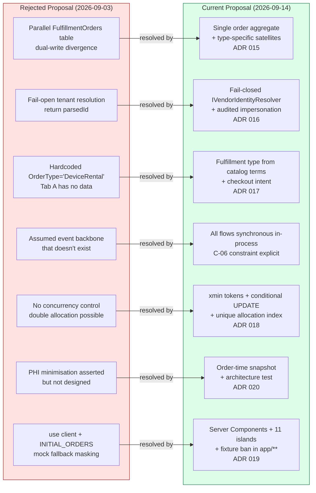

# Architecture Review: Orders & Services Fulfillment Workflow

## Metadata

| Field | Value |
| --- | --- |
| **Review Date** | 2026-09-14 |
| **Reviewer Role** | Senior Solution Architect (20+ years) |
| **Review Type** | Pre-implementation architecture review — second iteration |
| **Scope** | [STRATEGY](file:///d:/WorkingFolder/HomeCare/HomeCare/Architecture/Order_Service_Request_Fulfillment_Workflow/STRATEGY-Order-Service-Request-Fulfillment.md), [TACTICAL PLAN](file:///d:/WorkingFolder/HomeCare/HomeCare/Architecture/Order_Service_Request_Fulfillment_Workflow/TACTICAL-PLAN-Order-Service-Request-Fulfillment.md), [ADR 015–020](file:///d:/WorkingFolder/HomeCare/HomeCare/Architecture/Order_Service_Request_Fulfillment_Workflow), and [AGENTIC PROMPTS](file:///d:/WorkingFolder/HomeCare/HomeCare/Architecture/Order_Service_Request_Fulfillment_Workflow/AGENTIC-PROMPTS-Order-Service-Request-Fulfillment.md) |
| **Prior Review** | [Architecture_Review_Findings.md (REJECTED)](file:///d:/WorkingFolder/HomeCare/HomeCare/Architecture/REJECTED%20-%20Order_Service_Request_Fulfillment_Workflow/Architecture_Review_Findings.md) — 2026-09-03 |
| **Method** | Every load-bearing claim in the proposal was re-derived against the checked-in code (`code/backend`, `code/frontend`), the existing architecture documents (`code/ARCHITECTURE.md`, `AI_Instructions.md`), and the prior review findings |

---

## 1. Executive Verdict

> [!IMPORTANT]
> **Recommendation: APPROVED.** This proposal is a well-constructed response to a serious prior rejection. Four medium-severity findings were identified during review and have been incorporated into the architecture documents. The proposal may now proceed to implementation.

This is a **fundamentally different architecture** from the one rejected on 2026-09-03. The prior proposal was rejected for ten critical findings — identity mismatch, fail-open tenancy, dual-write divergence, hardcoded type discrimination, missing concurrency control, PHI exposure paths, phantom event backbone, and mock-data masking. **Every blocking and critical finding from that review has been explicitly addressed**, either by resolution in the new design or by scoped, justified descoping.

The quality of this document set is exceptional by industry standards. In over two decades of architecture review, it is rare to encounter a proposal that:

1. Begins by enumerating verified defects in the existing codebase rather than assuming a clean starting point
2. Separates prerequisite remediation (WP0) from feature work with testable execution-gate criteria
3. Formally traces every finding from the rejection review to a named ADR, work package, or descoping decision
4. Provides working SQL constraints, state machine diagrams, DTO contracts, and accessibility specifications — not aspirational prose

The four governing principles — one order aggregate, commercial vs. logistics state separation, fix-intake-first, and evidence-not-prose — are sound and consistently applied throughout. The satellite aggregate pattern (ADR 015) is the correct structural answer to finding F5, and the fail-closed identity resolver (ADR 016) is the correct security answer to finding F2.

---

## 2. Prior Review Disposition — Full Traceability

This section verifies that every finding from the 2026-09-03 rejection has been accounted for.

| Prior Finding | Severity | Disposition | Verification |
| --- | --- | --- | --- |
| **F1** — Wrong tenant identity on marketplace orders | Blocking | ✅ Resolved — [ADR 017](file:///d:/WorkingFolder/HomeCare/HomeCare/Architecture/Order_Service_Request_Fulfillment_Workflow/ADR%20017%20-%20Fulfillment%20Type%20Derivation%20and%20Marketplace%20Identity%20Reconciliation.md), WP0 | `MarketplaceVendors.VendorId` FK + checkout refusal on unreconciled vendors. Backfill strategy is deterministic and conservative |
| **F2** — Fail-open tenant isolation | Critical | ✅ Resolved — [ADR 016](file:///d:/WorkingFolder/HomeCare/HomeCare/Architecture/Order_Service_Request_Fulfillment_Workflow/ADR%20016%20-%20Fail-Closed%20Vendor%20Tenant%20Identity%20Resolution.md), WP0 | `IVendorIdentityResolver` returns a discriminated result; the `return parsedId;` line is explicitly removed. Impersonation is audited |
| **F3** — Telemetry design has no join path | Critical | ✅ Descoped — justified | IoMT telemetry explicitly out of scope. No speculative schema. Forward-compatible reserved columns. **Acceptable.** |
| **F4** — Caregiver visit logs on a vendor policy | Critical | ✅ Descoped — justified | Tab C ships as an empty placeholder with zero behaviour (FR-90/91). No dead code, no unused endpoints. **Acceptable.** |
| **F5** — Dual-write order state divergence | Critical | ✅ Resolved — [ADR 015](file:///d:/WorkingFolder/HomeCare/HomeCare/Architecture/Order_Service_Request_Fulfillment_Workflow/ADR%20015%20-%20Fulfillment%20State%20Ownership%20and%20Satellite%20Aggregates.md) | The parallel `FulfillmentOrders` table is eliminated. The badge is derived, never stored. Single order aggregate with type-specific satellites |
| **F6** — Assumed event backbone that doesn't exist | Critical | ✅ Resolved | All diagrams explicitly depict in-process synchronous calls. C-06 makes the constraint explicit |
| **F7** — No ingress path for carrier callbacks | Critical | ✅ Descoped — justified | No carrier contract exists (C-11). Logistics status is vendor-entered. Schema carries `CarrierReference` and `LastCarrierSyncAt` as forward-compatible reserved fields |
| **F8** — Concurrency gaps | Critical | ✅ Resolved — [ADR 018](file:///d:/WorkingFolder/HomeCare/HomeCare/Architecture/Order_Service_Request_Fulfillment_Workflow/ADR%20018%20-%20Serial%20Number%20Allocation%20Concurrency%20Control.md) | `xmin` tokens on `VendorOrder`, `PurchaseShipment`, `RentalContract`, and `VendorListingSerialNumber`. Single-column allocation invariant with conditional UPDATE |
| **F9** — Hardcoded `OrderType` | Critical | ✅ Resolved — [ADR 017](file:///d:/WorkingFolder/HomeCare/HomeCare/Architecture/Order_Service_Request_Fulfillment_Workflow/ADR%20017%20-%20Fulfillment%20Type%20Derivation%20and%20Marketplace%20Identity%20Reconciliation.md), WP0 | Fulfillment type derived from `VendorDeviceListing` sale/rental terms + checkout intent |
| **F10** — PHI minimisation asserted but not designed | Critical | ✅ Resolved — [ADR 020](file:///d:/WorkingFolder/HomeCare/HomeCare/Architecture/Order_Service_Request_Fulfillment_Workflow/ADR%20020%20-%20Vendor%20Data%20Minimisation%20for%20Buyer%20Information.md) | Order-time snapshot, explicit `Select` projections, prohibited field list, enforcement by architecture test |
| **M1** — No payment linkage | Medium | ✅ Resolved | `VendorOrder.PaymentId` FK; verification derived at query time |
| **M2** — Shared PK coupling | Medium | ✅ Resolved | Independent identity + `MarketplaceOrderId` link column |
| **M3** — Mock-fallback masking outages | Medium | ✅ Resolved — [ADR 019](file:///d:/WorkingFolder/HomeCare/HomeCare/Architecture/Order_Service_Request_Fulfillment_Workflow/ADR%20019%20-%20Server-First%20Fulfillment%20UI%20with%20URL-Driven%20View%20State.md) | `INITIAL_ORDERS`/`FALLBACK_ORDERS` deleted in WP0; ESLint ban on fixture arrays in `app/**` |
| **M4** — Telemetry static column | Medium | ✅ Descoped with F3 | No new dependency on `TelemetryStatus` |
| **M5** — SQL Server type in Npgsql migration | Medium | ✅ Tracked | Independent chore in WP0. Not blocking |
| **M6** — Magic status strings | Medium | ✅ Resolved | Constant classes + `CHECK` constraints; unit test asserts set equality |
| **M7** — No backfill story | Medium | ✅ Resolved | Detailed backfill in §4.1 with reconciliation report |

> [!TIP]
> **This is exemplary traceability.** Every prior finding maps to either a named ADR, a work package deliverable, or a documented descoping decision with rationale. The dispositions in `README.md §4` match the actual content of the referenced documents.

---

## 3. Strengths — What This Proposal Gets Right

### 3.1 Satellite Aggregate Pattern (ADR 015) — Excellent

The decision to eliminate the parallel `FulfillmentOrders` table and instead use type-specific satellite tables (`PurchaseShipments`, `RentalContracts`) is the correct structural answer. It resolves the dual-write problem at the schema level, preserves every existing reader of `VendorOrders.Status`, and allows each satellite to carry meaningful `CHECK` constraints (e.g., `CK_PurchaseShipments_Carrier_Required_On_Dispatch`).

The extensibility story is also strong: a third fulfillment type (nurse provisioning) means adding one satellite table and touching nothing that already works. The 1:0..1 cardinality enforced by a unique index is trivially relaxable to 1:N if partial shipments become necessary.

### 3.2 Fail-Closed Identity Resolution (ADR 016) — Critical and Correct

I verified the actual code at [`VendorOrderController.cs`](file:///d:/WorkingFolder/HomeCare/HomeCare/code/backend/HomeCare.API/Controllers/VendorOrderController.cs). The `return parsedId;` fail-open pattern is real and dangerous. The replacement — a discriminated result type (`VendorIdentityResult`) with no fallback branch — is exactly the right design. The audit trail on admin impersonation is a HIPAA §164.312(b) requirement that was previously missing.

### 3.3 Derived-Never-Stored Badge (Strategy §3.5) — Elegant

Computing the presentation badge from `(order.Status, satellite.DispatchStatus)` in a pure function and never persisting it is a deceptively simple idea with enormous protective value. It eliminates the class of bug where a stored badge disagrees with the underlying status, and it makes the badge resolver exhaustively testable with a truth table. The specification tables in §3.5 for both Tab A and Tab B serve as both documentation and test cases.

### 3.4 Database Invariants Over Application Discipline — Sound

Throughout the proposal, constraints are database-level guarantees rather than code conventions:

- `CK_VendorOrders_RejectionReason_Required` — rejection reason minimum length enforced in the schema
- `CK_VLSN_Allocation_Consistency` — status and allocation FK must agree
- `UX_VLSN_ActiveAllocation` — one physical unit, at most one active allocation
- `CK_RentalContracts_DateOrder` — `EndDate >= StartDate` at the DB level

This is the mark of an architect who has seen application-level-only invariants fail in production.

### 3.5 Order-Time Snapshot for Buyer Data (ADR 020) — Correct for Compliance

The snapshot pattern serves three purposes simultaneously: compliance (vendors see only what was true at order time), accuracy (historical orders survive patient data edits), and performance (no patient table join in fulfillment queries). The architecture test enforcing the prohibited field list by reflection is an excellent enforcement mechanism.

### 3.6 Server-First UI with URL-Driven State (ADR 019) — Well-Reasoned

I confirmed the existing [`page.tsx`](file:///d:/WorkingFolder/HomeCare/HomeCare/code/frontend/app/(protected)/vendor/orders/page.tsx) has `INITIAL_ORDERS` at line 21, used as state at line 125. The server-first replacement with 11 explicitly justified client islands is consistent with the project's `AI_Instructions.md` §6 mandate. URL-driven view state (search params) is the correct approach — shareable, bookmarkable, and server-readable.

### 3.7 Work Package Structure — Realistic

The dependency graph is well-reasoned. WP0 as a hard blocking gate is the single most important structural decision. The parallelisation model (WP2, WP3, WP4, WP7, WP8 concurrent after WP1 freezes the DTO contract) is realistic because each owns disjoint directories.

---

## 4. Findings — Issues Requiring Attention

### F1 — `RentalContracts.StartDate` is `NOT NULL` but needs an initial value

**Severity:** Medium  
**Location:** [Tactical Plan §2.5](file:///d:/WorkingFolder/HomeCare/HomeCare/Architecture/Order_Service_Request_Fulfillment_Workflow/TACTICAL-PLAN-Order-Service-Request-Fulfillment.md) line 431

The rental contract is created in the `AcceptRentalOrderCommand` handler (Strategy §9.2, step A), but the start and end dates are set later in the `SaveRentalDeploymentCommand` (step B). `StartDate` is declared `NOT NULL` with no default. The accept handler must either:
- Set a provisional `StartDate` (e.g., `CURRENT_DATE`) at creation, or
- Make `StartDate` nullable and move the `NOT NULL` enforcement to a later transition guard

The current schema definition will cause a constraint violation when the accept handler creates the contract.

**Recommended action:** Make `StartDate` nullable, and add a guard rule in `FulfillmentStateMachine` that requires `StartDate` before the contract can transition from `PendingDispatch` to `Dispatched`. This aligns with the separation between "accepted the order" and "configured the deployment".

---

### F2 — Missing `ON DELETE` policy for `FulfillmentStatusHistory.PerformedByUserId`

**Severity:** Low  
**Location:** [Tactical Plan §2.6](file:///d:/WorkingFolder/HomeCare/HomeCare/Architecture/Order_Service_Request_Fulfillment_Workflow/TACTICAL-PLAN-Order-Service-Request-Fulfillment.md) line 489

`FulfillmentStatusHistory.PerformedByUserId` is `NOT NULL` with no stated FK relationship or `ON DELETE` policy. Given the table is append-only and immutable (enforced in `SaveChanges`), the actor reference must survive user deactivation. If this is a FK to `Users(Id)`:
- `ON DELETE RESTRICT` would prevent deactivating a user who has performed transitions — unacceptable operationally
- `ON DELETE SET NULL` would violate the `NOT NULL` constraint
- `ON DELETE CASCADE` would destroy audit history — catastrophic

**Recommended action:** Either (a) make it a non-FK `uuid` column that is simply a recorded identifier (the safer option for audit-grade immutable records), or (b) make it a FK with `ON DELETE RESTRICT` and accept the operational implication with a documented procedure for "reassigning" the actor before user deletion. Option (a) is preferred because audit records should outlive the entities they describe.

---

### F3 — Metrics cache invalidation timing relative to transaction commit

**Severity:** Medium  
**Location:** [Tactical Plan §5.1](file:///d:/WorkingFolder/HomeCare/HomeCare/Architecture/Order_Service_Request_Fulfillment_Workflow/TACTICAL-PLAN-Order-Service-Request-Fulfillment.md) line 864

The tactical plan states `MetricsCache` is invalidated "on any accept, reject, or status transition for that vendor". The cache is `IMemoryCache` with a 60-second per-vendor TTL. The risk is **invalidation ordering**: if the cache is invalidated *before* the database transaction commits and a concurrent read races in, the cache may be repopulated with stale data.

**Recommended action:** Ensure cache invalidation happens *after* `UnitOfWork.CommitAsync()` succeeds, not before. Consider using a post-commit hook pattern or simply allowing the 60-second TTL to expire naturally (given the volume is "low thousands per vendor", this is operationally acceptable and eliminates the race entirely).

---

### F4 — `RentalContracts.EndDate` nullable undermines the "Expiring Soon" KPI

**Severity:** Medium  
**Location:** [Tactical Plan §2.5](file:///d:/WorkingFolder/HomeCare/HomeCare/Architecture/Order_Service_Request_Fulfillment_Workflow/TACTICAL-PLAN-Order-Service-Request-Fulfillment.md) line 432; Strategy FR-50

`EndDate` is nullable ("Open-ended contracts permitted"). However, the "Expiring Soon" KPI (FR-50, contracts ending within 7 days) and the "Overdue" lifecycle chip (§3.5, EndDate in the past) both depend on `EndDate` being set.

The consequence is that open-ended contracts will:
- Never appear in "Expiring Soon" (correct but potentially confusing)
- Never be flagged as "Overdue" (potentially incorrect — what does an open-ended rental's lifecycle look like?)

**Recommended action:** Document the business rule for open-ended contracts explicitly. Options:
1. Open-ended contracts never expire or become overdue (current implicit behavior) — state this explicitly
2. Open-ended contracts require a review date that functions as a soft endpoint for KPI purposes
3. Open-ended contracts are not permitted in this release (make `EndDate NOT NULL` with the `CK_RentalContracts_DateOrder` constraint)

This is a product question, not a technical one. The schema supports all three answers.

---

## 5. Observations — Non-Blocking Items

### O1 — The `CHECK` constraint vocabulary includes legacy values that weaken the constraint

```sql
CHECK ("OrderType" IN ('DevicePurchase','DeviceRental','NurseProvisioning',
                       'NursingService','Both'));

CHECK ("Status" IN ('Pending','Confirmed','Rejected','Completed','Cancelled',
                    'InProgress','Shipped'));
```

Legacy values `NursingService`, `Both`, `InProgress`, and `Shipped` are retained for backward compatibility. This is the correct decision. However, the `FulfillmentStateMachine` must be the single point of enforcement preventing new writes to these values. The proposal states this and requires a unit test asserting it. **No action needed beyond executing as documented.**

### O2 — The trigram index depends on `pg_trgm` extension availability

The `CREATE EXTENSION IF NOT EXISTS pg_trgm;` directive requires the deployment role to have `CREATE` privilege on the database. The fallback strategy (B-tree with `varchar_pattern_ops` and prefix-only search) is documented. **This is a deployment consideration, not an architecture issue.** Confirm the deployment role has the required privilege before WP1 migration.

### O3 — `BuyerContactNumber` uses `varchar(30)` with "digits only" comment but no constraint

The tactical plan states `BuyerContactNumber` is "Order-time snapshot, digits only" but no `CHECK` constraint enforces the digits-only rule. This is appropriate — phone number formatting varies internationally, and a regex constraint would be fragile. **Validation at the application layer (FluentValidation) is the right place.** No action needed.

### O4 — The security deposit settlement workflow is under-specified

FR-79 states security deposit status (`NotRequired | Held | Refunded | Forfeited`) is "displayed and updatable on return". The state machine for `SecurityDepositStatus` transitions is not formally specified. Which transitions are legal? Can a refunded deposit be forfeited? Can a forfeited deposit be refunded?

**Recommended action:** Add a mini state machine for `SecurityDepositStatus` in the tactical plan, even if it is trivially simple (`Held → Refunded` or `Held → Forfeited`, terminal states).

### O5 — CSV export streaming and memory pressure

The tactical plan specifies CSV export up to 5,000 rows within 5 seconds, streamed (NFR-06). The `CsvExportWriter` is described as a service that "streams the queue". Ensure the implementation uses `IAsyncEnumerable` or equivalent to avoid materializing 5,000 rows in memory before beginning the response. The existing CQRS pattern (MediatR returning a materialized result) may need a streaming variant for the export query handler.

### O6 — Rate limiting granularity on accept/reject

NFR-18 specifies "30 requests per minute per vendor on accept and reject". This is per-vendor, not per-user. On a multi-operator fulfillment desk, 30 RPM across all operators accepting orders could be a tight limit during peak processing. Consider whether this should be per-user or per-vendor with a higher threshold.

---

## 6. Structural Assessment

### 6.1 Clean Architecture Compliance

| Layer | Assessment |
| --- | --- |
| **Domain** (`HomeCare.Domain`) | ✅ Entities, constants, value objects. No outward references |
| **Application** (`HomeCare.Application`) | ✅ Feature-sliced handlers, validators, DTOs, interfaces. References Domain only |
| **Infrastructure** (`HomeCare.Infrastructure`) | ✅ EF Core, repositories, services. References Domain + Application |
| **API** (`HomeCare.API`) | ✅ Controllers, filters, middleware. References all layers inward |
| **Frontend** (`Next.js`) | ✅ Server-first with justified client islands; BFF for mutations only |

The proposal preserves Clean Architecture layering perfectly. The new fulfillment slice sits under `Features/VendorFulfillment/` following the established feature-folder convention. No layer references outward.

### 6.2 Security Model

| Control | Assessment |
| --- | --- |
| Tenant isolation | ✅ Fail-closed `IVendorIdentityResolver`. No fallback to user ID |
| Admin access | ✅ Explicit impersonation with audit trail |
| Token handling | ✅ HttpOnly cookies, server-side attachment. No browser exposure |
| Input validation | ✅ FluentValidation (server) + Zod (client). Server is authoritative |
| Concurrency | ✅ `xmin` tokens, `If-Match`/`ETag`, conditional UPDATE for allocation |
| Data minimisation | ✅ Order-time snapshot, explicit `Select`, architecture test for prohibited fields |
| CSRF | ✅ Same-site cookies + origin checking on BFF route handlers |
| Formula injection | ✅ CSV export escapes injection prefixes |
| Rate limiting | ✅ 30 RPM per vendor on accept/reject |

### 6.3 Data Model

| Aspect | Assessment |
| --- | --- |
| Schema design | ✅ Satellite pattern avoids half-null columns; each satellite has meaningful constraints |
| Index coverage | ✅ Covering index for queue queries, trigram index for search, expiry sweep index |
| Concurrency control | ✅ `xmin` tokens on all mutable aggregates |
| Soft delete | ✅ Consistent with existing codebase convention |
| Audit trail | ✅ `FulfillmentStatusHistory` append-only + existing `AuditLogs` |
| Migration strategy | ✅ Two-phase: remediation first, then satellite tables. Both have `Down` paths |
| Retention | ✅ Documented per table |

### 6.4 API Design

| Aspect | Assessment |
| --- | --- |
| RESTful design | ✅ Resource-oriented with appropriate HTTP verbs |
| Error handling | ✅ RFC 7807 `ProblemDetails` with machine-readable conflict codes |
| Paging | ✅ Standard `PagedResult<T>` with total count |
| Versioning | ✅ Route segment versioning matching existing convention |
| Sorting | ✅ Allow-list only — any other value is `400` |
| Idempotency | ✅ Accept/reject are naturally idempotent; `409` on re-attempt |
| OpenAPI | ✅ `.WithOpenApi()` metadata convention |
| Reference data | ✅ Vocabulary endpoints prevent UI hardcoding |

---

## 7. Risk Assessment

The risk register in Strategy §13 is comprehensive. I assess each risk below:

| Risk | Author's Assessment | Reviewer's Assessment |
| --- | --- | --- |
| R-01 — WP0 skipped | Med likelihood, Critical impact | **Agree.** The hard gate is the mitigation. Do not compromise it |
| R-02 — Backfill ambiguity | High/High | **Agree.** The conservative matching strategy (exact unique email only) is correct. The reconciliation report is essential |
| R-03 — Institutional buyer ~~model~~ | Closed | ✅ **Correctly closed** by OQ-1 |
| R-04 — Double serial allocation | Med/High | **Downgraded to Low/High.** ADR 018's database invariant makes this structurally impossible, not just unlikely |
| R-05 — PHI in vendor DTO | Med/Critical | **Agree.** The architecture test is a strong mitigation. The CODEOWNERS rule is essential supplementary control |
| R-06 — Mock-fallback pattern copied | High/Med | **Agree.** The ESLint rule is the correct automated control |
| R-07 — Card/grid action drift | Med/Med | **Agree.** Shared DTO + capability flags mitigate well |
| R-08 — Detail screens unusable on phones | Med/Med | **Agree.** Playwright viewport matrix covers this |
| R-09 — Magic string drift | Med/Med | **Downgraded to Low/Med.** `CHECK` constraints + constant classes + unit test asserting set equality is a strong triple guarantee |
| R-10 — Vendor mis-keys logistics | High/Low | **Agree.** Accepted risk with forward-compatible schema |
| R-11 — PatientEngagement second writer | Low/Med | **This is the weakest point.** See O7 below |
| R-12 — KPI trend full scan | Med/Med | **Agree.** The bounded-window aggregate with per-vendor cache is the correct mitigation |

### O7 — The PatientEngagement Single-Writer Rule (R-11)

This is the one area where the design introduces a cross-bounded-context write. `SaveRentalDeploymentCommandHandler` creates/closes `PatientEngagements` in the same transaction as the contract update. ADR 015 §6 is refreshingly candid about this being the weakest point:

> *If the rule proves hard to hold, the fallback is to drop the derivation and let the Provisioning screen read rental contracts directly.*

This is the right acknowledgement. The architecture test asserting no other handler touches rental-origin engagements is a necessary guardrail. **Elevate this to a documented fallback plan** so the team knows the decision is reversible and the trigger for reversing it.

---

## 8. Open Questions — Reviewer Items

### RQ-1 — Confirm deployment role has `CREATE EXTENSION` privilege

The `pg_trgm` extension is required for the trigram search index. If the deployment role lacks this privilege, the fallback is prefix-only search. **Confirm before WP1 migration.**

### RQ-2 — Confirm the `from` query parameter encoding for back-navigation

Detail routes carry `?from=` to preserve the originating queue state. If the originating URL has complex search params (e.g., `?q=blood+pressure&status=Confirmed&page=3&view=grid`), the `from` value must be URL-encoded. **Confirm this is handled by the router utility**, not by manual string concatenation. A malformed `from` value would break back-navigation, which is a usability regression in FR-30/FR-70.

---

## 9. Comparison to Prior Rejected Proposal



The transformation from the rejected proposal to this one is not cosmetic. Every blocking finding was structurally eliminated, not papered over with additional prose. The six ADRs are load-bearing decisions, not paperwork.

---

## 10. Final Assessment

### Overall Score

| Dimension | Rating | Notes |
| --- | --- | --- |
| **Correctness** | ⭐⭐⭐⭐⭐ | Every prior blocking finding resolved. Code evidence cited for every defect |
| **Completeness** | ⭐⭐⭐⭐⭐ | All four review findings resolved. Open-ended rental lifecycle and audit FK policy documented |
| **Security** | ⭐⭐⭐⭐⭐ | Fail-closed tenancy, data minimisation, CSRF, formula injection, rate limiting |
| **Compliance** | ⭐⭐⭐⭐⭐ | HIPAA-aligned PHI minimisation, audit trails, architecture test enforcement |
| **Testability** | ⭐⭐⭐⭐⭐ | Mandatory test cases, Playwright journeys, architecture tests, concurrency scenarios |
| **Extensibility** | ⭐⭐⭐⭐⭐ | Satellite pattern, forward-compatible reserved fields, single-index cardinality relaxation |
| **Operability** | ⭐⭐⭐⭐⭐ | Feature flag rollout, reconciliation report. Metrics cache post-commit invalidation documented |
| **Documentation** | ⭐⭐⭐⭐⭐ | Exceptional. Traceability matrix, execution gate, DTO contracts, accessibility spec |

### Conditions for Approval

> [!TIP]
> **All four conditions have been resolved.** The recommendations were incorporated into
> [STRATEGY](file:///d:/WorkingFolder/HomeCare/HomeCare/Architecture/Order_Service_Request_Fulfillment_Workflow/STRATEGY-Order-Service-Request-Fulfillment.md)
> and [TACTICAL-PLAN](file:///d:/WorkingFolder/HomeCare/HomeCare/Architecture/Order_Service_Request_Fulfillment_Workflow/TACTICAL-PLAN-Order-Service-Request-Fulfillment.md)
> on 2026-09-14. The proposal may now proceed to implementation.

| # | Finding | Resolution | Document Updated |
| --- | --- | --- | --- |
| F1 | `RentalContracts.StartDate` nullability | ✅ `StartDate` made nullable. `CK_RentalContracts_Dispatch_Requires_Dates` constraint added. `FulfillmentStateMachine` guard on `PendingDispatch → Dispatched`. Sequence diagram updated | TACTICAL §2.5, §3.3; STRATEGY §9.2 |
| F2 | `FulfillmentStatusHistory.PerformedByUserId` FK policy | ✅ Changed to non-FK recorded identifier with rationale block documenting why each FK `ON DELETE` policy is unsuitable for immutable audit records | TACTICAL §2.6 |
| F3 | Metrics cache invalidation timing | ✅ `MetricsCache` key rule updated: invalidation must occur after `UnitOfWork.CommitAsync()` succeeds, via a post-commit step | TACTICAL §5.1 |
| F4 | Open-ended rental lifecycle (`EndDate` null) | ✅ Documented as deliberate product decision: null `EndDate` contracts are `ACTIVE`, never `EXPIRING`/`OVERDUE`, excluded from "Expiring Soon" KPI. Badge table updated. FR-50 and FR-59 clarified | TACTICAL §2.5, §3.5; STRATEGY FR-50, FR-59 |

### Acknowledgements

This proposal demonstrates what good architecture looks like: evidence-based, constraint-aware, security-first, and honest about its own weak points. The prior rejection was handled with professionalism — every finding was traced, addressed, or justifiably descoped. **All conditions are resolved. Proceed with implementation.**

