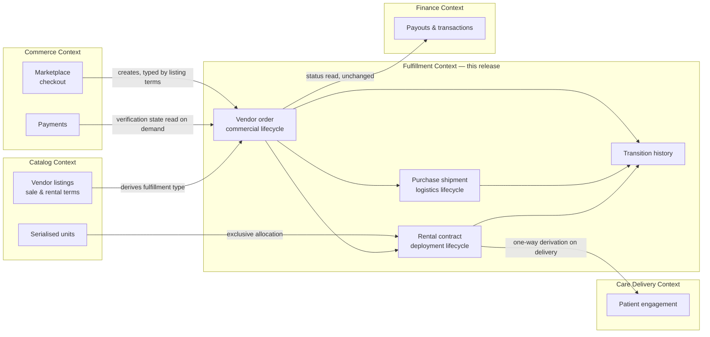
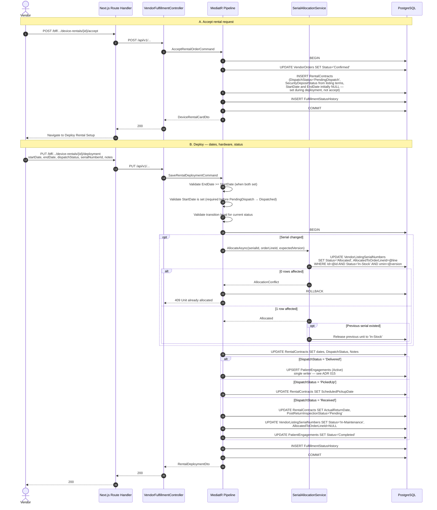

# Strategy: Orders & Services Fulfillment Workflow

**Document type:** Strategy plan
**Author:** Solution Architecture
**Date:** 2026-09-14
**Status:** Proposed
**Supersedes:** `Architecture/REJECTED - Order_Service_Request_Fulfillment_Workflow/STRATEGY-Order-Service-Request-Fulfillment.md`

---

## Table of Contents

1. [Purpose and Scope](#1-purpose-and-scope)
2. [Current-State Assessment](#2-current-state-assessment)
3. [Functional Requirements](#3-functional-requirements)
4. [Non-Functional Requirements](#4-non-functional-requirements)
5. [Constraints](#5-constraints)
6. [Assumptions](#6-assumptions)
7. [Strategic Position](#7-strategic-position)
8. [System-Wide Context Map (Use Cases)](#8-system-wide-context-map-use-cases)
9. [Sequence Diagrams](#9-sequence-diagrams)
10. [C4 — Container View](#10-c4--container-view)
11. [C4 — Component View](#11-c4--component-view)
12. [Open Questions](#12-open-questions)
13. [Risk Register](#13-risk-register)
14. [Execution Gate](#14-execution-gate)

---

## 1. Purpose and Scope

### 1.1 Business Objective

An approved vendor signs in, selects **Orders** from the portal sidebar, and lands on a single
operational control surface — **Orders & Services Fulfillment** — from which every inbound
commercial obligation is triaged, accepted or refused, and driven to physical completion.

The surface is divided into three tabs:

| Tab | Name | Release scope |
| --- | --- | --- |
| A | Device Purchases | **In scope** — full implementation |
| B | Device Rentals | **In scope** — full implementation, excluding telemetry |
| C | Nurse Provisioning | **Placeholder only** — delivered with Nurse Onboarding |

### 1.2 In Scope

- Purchase order triage queue with KPI header, search, status filter, CSV export, pagination.
- Grid ⇄ card view toggle (a new control not present in the reference screens).
- Accept / Reject decisioning with irreversible, audited outcomes.
- Shipment Registry detail screen: carrier credentials, manifest and waybill capture,
  regulatory dispatch prerequisites checklist, intake measurements.
- Rental request triage queue with KPI header, search, status filter, pagination.
- Deploy Rental Setup detail screen: contract start/end dates, dispatch status transitions,
  hardware assignment, delivery and setup notes.
- Expiring-rental flagging, courier retrieval scheduling, post-return sanitisation and
  inspection logging.
- Mobile and tablet responsive behaviour for every screen above.
- Prerequisite remediation of upstream order intake and vendor tenant identity (see §2).

### 1.3 Explicitly Out of Scope

| Item | Reason |
| --- | --- |
| IoMT telemetry tracking on rentals | Stated as beyond this release by the product owner |
| Nurse provisioning behaviour | Delivered with Nurse Onboarding |
| Carrier webhook ingestion | No carrier contract exists; logistics status is vendor-entered. Schema stays forward-compatible |
| Transactional outbox / message bus | Does not exist in the platform today. All flows in this document are in-process and synchronous |
| Payout gating changes | Existing payout logic is untouched; fulfillment evidence is recorded but not yet consumed by finance |
| Buyer-facing order tracking UI | Vendor-side only |

---

## 2. Current-State Assessment

Every statement below was verified against the checked-in code, not inferred from prior documents.

### 2.1 What Already Exists and Is Reusable

| Capability | Evidence | Verdict |
| --- | --- | --- |
| Vendor order aggregate | `HomeCare.Domain/Entities/VendorOrder.cs`, `VendorOrderLine.cs` | Reuse — extend, do not replace |
| Vendor-scoped order repository with tenant filter | `HomeCare.Infrastructure/Data/Repositories/VendorOrderRepository.cs` | Reuse — extend with fulfillment projections |
| CQRS pipeline (MediatR + `ValidationBehavior`) | `HomeCare.API/Extensions/ServiceCollectionExtensions.cs` | Reuse |
| Accept / reject / dispatch command handlers | `HomeCare.Application/Features/VendorOrders/Handlers/` | Reuse — refactor onto the new state machine |
| API versioning (`Asp.Versioning`), RFC 7807 problem details | `VendorOrderController.cs` | Reuse |
| Append-only audit enforcement | `HomeCareDbContext.EnforceAuditLogAppendOnly()` | Reuse |
| Unit of Work + repository registration | `HomeCare.Infrastructure/Data/UnitOfWork.cs` | Reuse — register new repositories here |
| EF Core migrations via `HomeCare.Migrations.Runner` | `MigrateAsync()` at startup | Reuse |
| Optimistic concurrency precedent | `VendorListing.Version` mapped to PostgreSQL `xmin` | Reuse the pattern |
| **Sale vs. rental commercial terms already modelled** | `VendorDeviceListing.IsAvailableForSale`, `SalePriceCents`, `IsAvailableForRent`, `DailyRentalRateCents`, `RequireSecurityDeposit`, `SecurityDepositCents`, `AllocatedForSale`, `AllocatedForRent` | **Reuse — this is the authoritative source for fulfillment-type derivation** |
| BFF proxy helpers | `frontend/lib/bff.ts` (`backendUrl`, `getAuthHeaders`) | Reuse for both RSC reads and route-handler writes |
| Portal shell, sidebar, Orders nav entry | `frontend/app/(protected)/vendor/layout.tsx` | Reuse — the nav item already targets `/vendor/orders` |
| Visual design tokens | Teal `#0d9488` / `#0f766e`, navy `#0d1527`, slate neutrals, rounded-2xl cards | Reuse — the reference screens match the existing system |

The discovery that `VendorDeviceListing` already carries a full sale-and-rental commercial
model is the single most important input to this design. The platform does not need a new
notion of "purchase" — it needs the checkout path to stop discarding one that already exists.

### 2.2 Defects That Block the Feature

These are **not** feature work. They are prerequisites; without them Tab A renders an empty
queue in production and the tenant boundary is unsound.

| ID | Defect | Evidence |
| --- | --- | --- |
| **P1** | `MarketplaceService.CreateOrderAsync` stamps `VendorOrder.VendorId` with a `MarketplaceVendor.Id`, while `VendorOrderController` resolves the tenant to a `Vendor.Id`. Two disjoint identity spaces | `HomeCare.Infrastructure/Services/MarketplaceService.cs` — `vendorId = mktVendor.Id;` then `new VendorOrder { VendorId = vendorId, … }` |
| **P2** | `GetCurrentVendorIdAsync` falls through to `return parsedId;` — the caller's **user** ID becomes the tenant filter when no `Vendor` row resolves. `VendorPolicy` also admits `Admin`/`SuperAdmin` | `HomeCare.API/Controllers/VendorOrderController.cs`; `ServiceCollectionExtensions.cs` `VendorPolicy` |
| **P3** | `OrderType` is hardcoded to `"DeviceRental"` on every marketplace order. Tab A therefore has no data source | `MarketplaceService.cs` — `OrderType = "DeviceRental"` |
| **P4** | `VendorOrder.Id = order.Id` shares a primary key with `MarketplaceOrder`. Breaks the moment one basket spans purchase and rental lines | `MarketplaceService.cs` |
| **P5** | No payment linkage on the order aggregate. `Payment` carries only a JSON `Metadata` blob. "Payment: Verified / Pending" on the purchase card has no source | `HomeCare.Domain/Entities/Payment.cs` |
| **P6** | `VendorOrder` and `VendorListingSerialNumber` carry no concurrency token. Two operators can double-allocate one physical serial | `VendorOrder.cs`, `VendorListingSerialNumber.cs` |
| **P7** | Rejection reasons are concatenated into the free-text `Notes` column | `RejectOrderCommandHandler` |
| **P8** | The existing vendor orders page is `'use client'`, fetches in `useEffect`, and silently substitutes a 100-line `INITIAL_ORDERS` mock when the API fails — masking outages as normal operation. The BFF route does the same with `FALLBACK_ORDERS` | `frontend/app/(protected)/vendor/orders/page.tsx`; `frontend/app/bff/vendor/orders/route.ts` |
| **P9** | Migration `20250101000000_AddVitalSignsAndDeviceReadings.cs` declares `uniqueidentifier` — a SQL Server type — in an Npgsql solution | Migration file |

P1–P8 are remediated in **WP0** and are a hard gate on all feature work. P9 is tracked as an
independent chore.

### 2.3 What Does Not Exist and Must Be Built

- A logistics state model. `VendorOrder.Status` records commercial lifecycle only; there is
  nowhere to record carrier, manifest, waybill, dispatch prerequisites, or return inspection.
- A rental contract with security-deposit state, retrieval scheduling, and sanitisation logging.
- A durable, per-transition history for fulfillment decisions.
- Serial-number allocation with an enforced uniqueness invariant.
- Any UI matching the reference screens.

---

## 3. Functional Requirements

Identifiers are referenced by the tactical plan and the agentic prompts.

### 3.1 Shell and Navigation

| ID | Requirement | Priority |
| --- | --- | --- |
| FR-01 | Selecting **Orders** in the vendor sidebar navigates to the Orders & Services Fulfillment page | Must |
| FR-02 | The page presents three tabs in fixed order: Device Purchases, Device Rentals, Nurse Provisioning | Must |
| FR-03 | Device Purchases is the default tab. Each tab has its own URL so it is bookmarkable, shareable, and survives browser back/forward | Must |
| FR-04 | The page header shows the title *Orders & Services Fulfillment* and the strapline *Fulfil clinical devices, schedule nurse deployment, track patient rental inventory.* | Must |
| FR-05 | On viewports narrower than the tab strip, tabs scroll horizontally; no tab is clipped or hidden | Must |

### 3.2 Tab A — Device Purchases

| ID | Requirement | Priority |
| --- | --- | --- |
| FR-10 | A KPI header shows four metrics with period-over-period trend: **Total Orders** (current billing cycle), **Pending Verification** (requiring medical review), **Dispatched Today** (handed to logistics), **Delivered Success** (inbound confirmation clear) | Must |
| FR-11 | Inbound purchase orders are listed for the signed-in vendor only, newest first | Must |
| FR-12 | Each order shows: order reference, status badge, buyer name, device item, contact number, and payment verification state | Must |
| FR-13 | A **view toggle** switches between *card* and *grid* presentation of the same result set. The chosen view persists across navigation and reload | Must |
| FR-14 | Free-text search matches order reference, buyer name, and device item | Must |
| FR-15 | A status filter narrows the queue to a single fulfillment state | Must |
| FR-16 | **Export** downloads the current filtered result set as CSV | Should |
| FR-17 | Results are paginated with Prev / page numbers / Next and an "Showing *n* of *N* orders" counter | Must |
| FR-18 | **Reject** requires a reason, is irreversible, and renders the card read-only. No further action is possible on that order | Must |
| FR-19 | **Accept** disables Reject, opens the Shipment Registry screen, and is itself disabled once the order is accepted | Must |
| FR-20 | **Shipping Info** opens the Shipment Registry screen populated with previously saved values | Must |
| FR-21 | Accept is refused when payment verification has not cleared, with an explanatory message | Must |
| FR-22 | Card and grid presentations expose identical actions and identical data | Must |

### 3.3 Tab A Detail — Shipment Registry

| ID | Requirement | Priority |
| --- | --- | --- |
| FR-30 | A breadcrumb shows *Shipments / {shipment reference}*; the back affordance returns to the Device Purchases queue with filters, page, and view preserved | Must |
| FR-31 | **Buyer & Order Information** is read-only and auto-populated: order id, buyer name, contact number, shipping address | Must |
| FR-32 | The ordered item is shown with image, category, quantity, weight, and model reference | Must |
| FR-33 | **Vendor Logistics Registry** captures Carrier Name, Manifest ID, and Waybill ID. Carrier Name and Manifest ID are mandatory before dispatch | Must |
| FR-34 | **Dispatch Prerequisites** presents an explicit regulatory checklist; each item is individually attestable and records who attested and when | Must |
| FR-35 | Device regulatory clearance status (for example *FDA Cleared Device*) is displayed as read-only catalog-derived information | Should |
| FR-36 | **Intake Measurements** shows storage temperature, cargo dimensions, and hazard classification | Should |
| FR-37 | **Save Dispatch** persists the registry and advances the shipment state | Must |
| FR-38 | **Delete** clears an unsent shipment registration and returns the order to *accepted, awaiting dispatch* | Should |
| FR-39 | Dispatch is refused unless every mandatory prerequisite is attested and carrier credentials are present | Must |

### 3.4 Tab B — Device Rentals

| ID | Requirement | Priority |
| --- | --- | --- |
| FR-50 | A KPI header shows **Active Rentals**, **Expiring Soon** (ending within 7 days; excludes open-ended contracts with null `EndDate`), **Returned & Cleared** (inspected and sanitised), **Pending Collection** (courier retrieval dispatched) | Must |
| FR-51 | Rental requests are listed as cards for the signed-in vendor only | Must |
| FR-52 | Each card shows: lifecycle chip (Active / Expiring / Overdue), rental reference, contract state chip, patient or client name, device name, start date, end date, and a status note | Must |
| FR-53 | **Reject** requires a reason, is irreversible, and renders the card read-only | Must |
| FR-54 | **Accept** disables Reject, opens the Deploy Rental Setup screen, and is disabled once accepted | Must |
| FR-55 | **State** opens the Deploy Rental Setup screen populated with current values | Must |
| FR-56 | Results are paginated | Must |
| FR-57 | Free-text search matches rental reference, patient or client name, and device name | Must |
| FR-58 | A status filter narrows to a single contract dispatch state | Must |
| FR-59 | Rentals ending within 7 days are visually flagged; rentals past their end date without return are flagged as overdue. Open-ended contracts (null `EndDate`) are neither expiring nor overdue | Must |
| FR-60 | The same card/grid toggle offered in Tab A is available in Tab B | Should |

### 3.5 Tab B Detail — Deploy Rental Setup

| ID | Requirement | Priority |
| --- | --- | --- |
| FR-70 | A breadcrumb shows *Rental / {contract reference}*; back returns to the Device Rentals queue with state preserved | Must |
| FR-71 | A read-only summary band shows patient or client with reference id, contact number, delivery address, and the assigned device item with SKU | Must |
| FR-72 | **Rental Parameters & Dispatch** captures Start Date, End Date, Contract Dispatch Status, and Delivery & Setup Notes | Must |
| FR-73 | Contract Dispatch Status is constrained to exactly: *Pending Dispatch*, *Dispatched*, *Delivered*, *Picked Up*, *Received*, *In Maintenance* | Must |
| FR-74 | End Date must be on or after Start Date; both are validated client-side and server-side | Must |
| FR-75 | **Assigned Hardware File** shows the allocated physical unit: image, model, serial number, bio-med status, last inspection date | Must |
| FR-76 | Allocating a serial to a contract is exclusive — one physical unit cannot be simultaneously allocated to two active contracts | Must |
| FR-77 | Transitioning to *Picked Up* records a courier retrieval date | Must |
| FR-78 | Transitioning to *Received* records the return date and opens post-return sanitisation and inspection capture | Must |
| FR-79 | Security-deposit state (*Not Required*, *Held*, *Refunded*, *Forfeited*) is displayed and updatable on return | Should |
| FR-80 | **Save** persists the setup; **Delete** removes an undeployed contract and returns the order to *accepted* | Must |

### 3.6 Tab C — Nurse Provisioning

| ID | Requirement | Priority |
| --- | --- | --- |
| FR-90 | The tab renders an intentional, styled empty state stating the capability ships with Nurse Onboarding | Must |
| FR-91 | No API call, no data fetch, no placeholder mock data | Must |

### 3.7 Cross-Cutting

| ID | Requirement | Priority |
| --- | --- | --- |
| FR-95 | Every accept, reject, dispatch, and status transition writes an immutable history record naming the actor, the transition, and the timestamp | Must |
| FR-96 | Invalid state transitions are refused by the server with a machine-readable problem response, regardless of what the UI offers | Must |
| FR-97 | Concurrent edits to the same order, shipment, or contract are detected and refused rather than silently overwritten | Must |
| FR-98 | A vendor can only ever read or mutate their own orders. This is enforced server-side, not by UI filtering | Must |

---

## 4. Non-Functional Requirements

### 4.1 Performance

| ID | Requirement | Target |
| --- | --- | --- |
| NFR-01 | Queue page server render (p95), 25 rows, warm cache | ≤ 400 ms |
| NFR-02 | Queue API response (p95) | ≤ 250 ms |
| NFR-03 | KPI header API response (p95) | ≤ 300 ms |
| NFR-04 | Accept / Reject round trip (p95) | ≤ 500 ms |
| NFR-05 | Detail screen server render (p95) | ≤ 450 ms |
| NFR-06 | CSV export, 5 000 rows | ≤ 5 s, streamed |
| NFR-07 | Largest Contentful Paint on a mid-tier tablet over 4G | ≤ 2.5 s |
| NFR-08 | No queue query may perform an unbounded scan; every filter path must be index-covered | Verified by execution plan review |

### 4.2 Security

| ID | Requirement |
| --- | --- |
| NFR-10 | Tenant resolution fails closed. An unresolvable vendor identity yields `403`, never a permissive fallback |
| NFR-11 | Administrative cross-tenant access requires an explicit, validated impersonation parameter and writes an audit record naming the administrator and the target vendor |
| NFR-12 | Access tokens never reach the browser. They remain in HttpOnly cookies and are attached server-side |
| NFR-13 | All write endpoints validate input with FluentValidation; the frontend validates with Zod. Server validation is authoritative |
| NFR-14 | All mutations are CSRF-safe: same-site cookies plus origin checking on BFF route handlers |
| NFR-15 | CSV export escapes formula-injection prefixes (`=`, `+`, `-`, `@`, tab, carriage return) |
| NFR-16 | No SQL is constructed by string concatenation. All access is through EF Core parameterised queries |
| NFR-17 | File and image references are served through signed, expiring URLs; no direct object-store paths in DTOs |
| NFR-18 | Rate limiting on accept/reject endpoints prevents automated queue manipulation |

### 4.3 Privacy and Compliance

| ID | Requirement |
| --- | --- |
| NFR-20 | Vendor-facing DTOs carry the minimum necessary buyer information for delivery: name, contact number, delivery address. No diagnoses, allergies, medications, chronic conditions, or vital measurements |
| NFR-21 | Delivery details are snapshotted on the order at creation. Vendors never read the live patient record |
| NFR-22 | Structured logs contain identifiers only. Names, phone numbers, addresses, and clinical values are never logged |
| NFR-23 | Every state-changing action is attributable to a named actor and is retained immutably |
| NFR-24 | Rejection reasons are stored in a dedicated column, not appended to a shared free-text field |

### 4.4 Reliability and Operability

| ID | Requirement |
| --- | --- |
| NFR-30 | Backend unavailability surfaces as an explicit, actionable error state. Substituting mock data for a failed call is prohibited |
| NFR-31 | All mutating handlers are idempotent under retry, keyed on the target aggregate and its concurrency token |
| NFR-32 | `/health` reports database reachability; fulfillment adds no new external dependency |
| NFR-33 | Structured logging via Serilog with correlation id propagated from the BFF through to the API |
| NFR-34 | Schema changes are forward-only EF Core migrations with a tested `Down` path |

### 4.5 Usability and Accessibility

| ID | Requirement |
| --- | --- |
| NFR-40 | WCAG 2.1 AA: contrast, focus visibility, logical tab order, and a skip link to main content |
| NFR-41 | Every screen is fully operable by keyboard. Card actions are real `<button>` elements, not click handlers on `<div>` |
| NFR-42 | Status is never conveyed by colour alone; every badge carries a text label |
| NFR-43 | Destructive and irreversible actions (Reject, Delete) require confirmation and state the consequence |
| NFR-44 | Interactive targets are at least 44 × 44 CSS pixels on touch viewports |
| NFR-45 | Loading is communicated with skeletons that match the final layout; no layout shift on data arrival |
| NFR-46 | Screen-reader announcements on action outcome via a polite live region |

### 4.6 Responsiveness

| ID | Requirement |
| --- | --- |
| NFR-50 | Supported breakpoints: ≥ 360 px (phone), ≥ 768 px (tablet), ≥ 1024 px (small laptop), ≥ 1280 px (desktop) |
| NFR-51 | Card grid: 1 column < 768 px, 2 at ≥ 768 px, 3 at ≥ 1280 px, 4 at ≥ 1536 px |
| NFR-52 | KPI header: 1 column < 640 px, 2 at ≥ 640 px, 4 at ≥ 1280 px |
| NFR-53 | Below 768 px the grid view is unavailable and the toggle is hidden; card view is the only presentation. Horizontal table scrolling on phones is prohibited |
| NFR-54 | Detail screens collapse from two columns to a single stacked column below 1024 px, with the primary action bar pinned to the bottom of the viewport |
| NFR-55 | No horizontal page scrolling at any supported width |

### 4.7 Maintainability and Testability

| ID | Requirement |
| --- | --- |
| NFR-60 | Clean Architecture layering is preserved: `Domain` → `Application` → `Infrastructure` → `API`. No layer references outward |
| NFR-61 | All external dependencies are injected via interfaces to permit mocking |
| NFR-62 | Business-logic line coverage on new Application-layer code ≥ 80 % |
| NFR-63 | No `any` in TypeScript. Strict mode enforced |
| NFR-64 | Status vocabularies are constant classes in code and `CHECK` constraints in the database. No bare string literals at call sites |
| NFR-65 | Public endpoints and interfaces carry XML documentation comments |

---

## 5. Constraints

| ID | Constraint | Implication |
| --- | --- | --- |
| C-01 | Backend is ASP.NET Core with Clean Architecture, MediatR CQRS, FluentValidation, EF Core (Npgsql) | New work must follow the existing feature-folder layout under `HomeCare.Application/Features/` |
| C-02 | Database is PostgreSQL; schema changes only via EF Core migrations applied by `HomeCare.Migrations.Runner` | No hand-written DDL, no out-of-band scripts |
| C-03 | Frontend is Next.js App Router with the server-first paradigm mandated by `AI_Instructions.md` | Reads via Server Components; `'use client'` only for genuine interactivity |
| C-04 | Access tokens live in HttpOnly cookies and are attached server-side | Client components cannot call the .NET API directly |
| C-05 | API documentation is native .NET OpenAPI, not Swashbuckle | New endpoints use `.WithOpenApi()` metadata conventions |
| C-06 | **No message bus, outbox, or domain-event dispatcher exists** | All cross-module effects are synchronous, in-process, and inside one transaction |
| C-07 | `VendorOrders.Status` is read today by KPI snapshot refresh, the vendor dashboard, and finance queries | The commercial status vocabulary must not change. Logistics state goes elsewhere |
| C-08 | `VendorOrder.PatientId` is a required FK to `Patients` | Confirmed correct by [OQ-1](#121-resolved): device purchases are **B2C only**. Buyers are always patients. No institutional buyer model is introduced |
| C-09 | HIPAA / GDPR apply; vendors are third-party commercial parties | Data minimisation is a design obligation, not a review checkbox |
| C-10 | The reference screens define the visual contract | Existing design tokens must be reused; no new component library may be introduced |
| C-11 | No carrier integration contract exists | Logistics status is vendor-entered for this release |
| C-12 | Tab C must ship with no behaviour | It must not create dead code, unused endpoints, or speculative schema |

---

## 6. Assumptions

| ID | Assumption | Risk if wrong |
| --- | --- | --- |
| A-01 | One marketplace basket resolves to at most one fulfillment type per vendor order | **Confirmed** by [OQ-5](#121-resolved). Mixed baskets are split into sibling orders at checkout |
| A-02 | A purchase order has exactly one shipment in this release | Partial shipment requires a one-to-many shipment model |
| A-03 | A rental order has exactly one contract covering all its lines | Multi-device rentals with staggered dates require per-line contracts |
| A-04 | Payment verification is derivable from the existing `Payment.Status` enum | **Confirmed** by [OQ-3](#121-resolved). No separate clinical-review gate exists |
| A-05 | Device images and datasheets already exist on `VendorListingImage` / `VendorListingDocument` | The detail panels would need placeholder artwork |
| A-06 | Queue volumes are in the low thousands per vendor | Higher volume would justify a read-model projection |

---

## 7. Strategic Position

### 7.1 Bounded Context

Fulfillment is a distinct bounded context sitting between **Commerce** (what was bought) and
**Care Delivery** (what the patient receives). It owns the physical-world lifecycle of a
commercial obligation.



### 7.2 Four Governing Principles

**1. One order, one commercial status.**
The rejected proposal introduced a parallel `FulfillmentOrders` table carrying its own
`FulfillmentStatus` alongside the live `VendorOrders.Status`, then attempted to keep them
consistent with a same-transaction rollup. That is dual-write divergence with extra steps.
This design removes the duplicate rather than reconciling it. `VendorOrders` remains the sole
order aggregate with its existing status vocabulary untouched, so every current reader — KPI
snapshot refresh, dashboard, finance — keeps working with no migration. See
[ADR 015](ADR%20015%20-%20Fulfillment%20State%20Ownership%20and%20Satellite%20Aggregates.md).

**2. Commercial state and logistics state are different things.**
*Accepted* is a commercial fact. *In transit* is a logistics fact. Conflating them is what
forced the earlier design to widen a vocabulary that other modules depend on. Logistics state
lives on the satellite aggregates — `PurchaseShipments.DispatchStatus` and
`RentalContracts.DispatchStatus` — each with its own closed vocabulary. The card badge is a
*derived presentation* of both, computed in the query handler, stored nowhere.

**3. Fix the intake before building the queue.**
A control room over an empty or mis-tenanted work queue is theatre. WP0 is a hard gate.

**4. Evidence, not prose.**
Regulatory attestations, rejection reasons, and state transitions are first-class rows with an
actor and a timestamp — never concatenated into a shared `Notes` column.

### 7.3 Options Considered and Rejected

| Option | Why rejected |
| --- | --- |
| Parallel `FulfillmentOrders` table with status rollup | Reintroduces finding F5. Two writers, guaranteed drift, no benefit once satellites carry the type-specific data |
| Widen `VendorOrders.Status` with logistics values | Breaks `KpiSnapshotRefreshService`, dashboard, and finance readers; couples logistics vocabulary to commercial reporting |
| Reuse `PatientEngagement` as the rental contract | Its `Active/Paused/Completed/Terminated` vocabulary collides with the six required dispatch states, and it is read by the existing Provisioning screen |
| Single-table inheritance for purchase and rental fulfillment | Half the columns nullable, no meaningful `CHECK` constraints, unenforceable invariants |
| Event-driven fulfillment with an outbox | No backbone exists. Introducing one is a platform-scale programme, not a feature |
| Client-side data fetching with mock fallback (status quo) | Violates `AI_Instructions.md` server-first mandate and masks outages as normal operation |

---

## 8. System-Wide Context Map (Use Cases)

```mermaid
flowchart TB
    VEN(["Vendor<br/>Fulfillment Operator"])
    ADM(["Platform<br/>Administrator"])
    BUY(["Buyer / Patient<br/>indirect"])
    COU(["Courier<br/>offline"])
    PGW(["Payment Gateway<br/>external"])

    subgraph SYS["Orders &amp; Services Fulfillment"]
        direction TB

        subgraph TabA["Tab A — Device Purchases"]
            UA1(["Review purchase queue"])
            UA2(["Verify payment state"])
            UA3(["Accept purchase order"])
            UA4(["Reject purchase order"])
            UA5(["Register shipment"])
            UA6(["Attest dispatch prerequisites"])
            UA7(["Dispatch to carrier"])
            UA8(["Record delivery"])
            UA9(["Export queue to CSV"])
            UA10(["Toggle grid / card view"])
        end

        subgraph TabB["Tab B — Device Rentals"]
            UB1(["Review rental queue"])
            UB2(["Accept rental request"])
            UB3(["Reject rental request"])
            UB4(["Set contract dates"])
            UB5(["Allocate physical unit"])
            UB6(["Change dispatch status"])
            UB7(["Flag expiring rental"])
            UB8(["Schedule courier retrieval"])
            UB9(["Log sanitisation &amp; inspection"])
            UB10(["Settle security deposit"])
        end

        subgraph TabC["Tab C — Nurse Provisioning"]
            UC1(["View placeholder"])
        end

        subgraph XC["Cross-cutting"]
            UX1(["Resolve vendor tenant"])
            UX2(["Record transition history"])
            UX3(["Impersonate vendor — audited"])
        end
    end

    VEN --- UA1
    VEN --- UA2
    VEN --- UA3
    VEN --- UA4
    VEN --- UA5
    VEN --- UA6
    VEN --- UA7
    VEN --- UA8
    VEN --- UA9
    VEN --- UA10
    VEN --- UB1
    VEN --- UB2
    VEN --- UB3
    VEN --- UB4
    VEN --- UB5
    VEN --- UB6
    VEN --- UB8
    VEN --- UB9
    VEN --- UB10
    VEN --- UC1

    ADM --- UX3

    PGW -.->|"settlement outcome"| UA2
    COU -.->|"verbal / portal confirmation<br/>keyed by vendor"| UA8
    COU -.->|"retrieval confirmation"| UB8
    BUY -.->|"receives goods"| UA8
    BUY -.->|"receives deployment"| UB6

    UA1 -.->|"includes"| UX1
    UB1 -.->|"includes"| UX1
    UA3 -.->|"includes"| UX2
    UA4 -.->|"includes"| UX2
    UA7 -.->|"includes"| UX2
    UB2 -.->|"includes"| UX2
    UB6 -.->|"includes"| UX2
    UB7 -.->|"extends"| UB1
    UA6 -.->|"precondition of"| UA7
    UA2 -.->|"precondition of"| UA3
```



**Reading notes**

- Solid lines are direct actor interactions. Dotted lines are `include` / `extend`
  relationships or influence from an external system.
- The **Courier** is drawn as an offline actor. There is no carrier API in this release
  ([C-11](#5-constraints)); delivery and retrieval confirmations are keyed by the vendor.
- **Resolve vendor tenant** is included by every read and write. It is the security boundary.
- Nurse Provisioning has exactly one use case and no system behaviour ([FR-90](#36-tab-c--nurse-provisioning)).

---

## 9. Sequence Diagrams

All interactions are synchronous and in-process. No queue, no outbox, no background worker
([C-06](#5-constraints)).

### 9.1 Purchase — Queue Load, Accept, Register, Dispatch

```mermaid
sequenceDiagram
    autonumber
    actor V as Vendor
    participant RSC as Next.js Server Component
    participant BFF as Next.js Route Handler
    participant API as VendorFulfillmentController
    participant ID as IVendorIdentityResolver
    participant MED as MediatR Pipeline
    participant REP as Fulfillment Repository
    participant DB as PostgreSQL
    participant AUD as Audit Writer

    Note over V,DB: A. Queue load — server rendered, no client fetch
    V->>RSC: GET /vendor/orders/device-purchases?page=1&view=card
    RSC->>API: GET /api/v1/vendor/fulfillment/device-purchases<br/>Bearer from HttpOnly cookie
    API->>ID: ResolveAsync(principal)
    alt No Vendor row resolves
        ID-->>API: Failure
        API-->>RSC: 403 ProblemDetails
        RSC-->>V: Explicit access-denied state
    else Resolved
        ID-->>API: Vendor.Id
        API->>MED: GetDevicePurchaseQueueQuery
        MED->>REP: Paged query, tenant-filtered
        REP->>DB: SELECT orders LEFT JOIN shipments LEFT JOIN payments
        DB-->>REP: Rows + total count
        REP-->>MED: Projection
        MED-->>API: PagedResult&lt;DevicePurchaseCardDto&gt;<br/>badge derived, not stored
        API-->>RSC: 200
        RSC-->>V: Rendered HTML + hydrated action islands
    end

    Note over V,AUD: B. Accept — client island, BFF proxied
    V->>BFF: POST /bff/.../device-purchases/{id}/accept<br/>If-Match: rowVersion
    BFF->>API: POST /api/v1/... (token attached server-side)
    API->>MED: AcceptPurchaseOrderCommand
    MED->>MED: FluentValidation
    MED->>DB: BEGIN
    MED->>REP: Load order FOR UPDATE
    alt Payment not verified
        MED-->>API: 422 Payment verification incomplete
    else Already accepted or rejected
        MED-->>API: 409 Invalid transition
    else Concurrency token stale
        MED-->>API: 412 Precondition Failed
    else Valid
        MED->>DB: UPDATE VendorOrders SET Status='Confirmed', AcceptedAt, AcceptedByUserId
        MED->>DB: INSERT PurchaseShipments (DispatchStatus='Registered')
        MED->>DB: INSERT ShipmentPrerequisiteChecks (5 unattested rows)
        MED->>DB: INSERT FulfillmentStatusHistory
        MED->>AUD: AuditLog — identifiers only, no PII
        MED->>DB: COMMIT
        MED-->>API: DevicePurchaseCardDto
    end
    API-->>BFF: 200
    BFF-->>V: 200
    V->>RSC: router.refresh() then navigate to Shipment Registry

    Note over V,DB: C. Register &amp; dispatch
    V->>BFF: PUT /bff/.../device-purchases/{id}/shipment<br/>carrier, manifest, waybill, attestations
    BFF->>API: PUT /api/v1/...
    API->>MED: SaveShipmentRegistryCommand
    MED->>MED: Validate carrier + manifest present
    MED->>MED: Validate every mandatory prerequisite attested
    alt Prerequisite unattested
        MED-->>API: 422 with the failing check codes
    else Complete
        MED->>DB: BEGIN
        MED->>DB: UPDATE PurchaseShipments SET DispatchStatus='Dispatched', DispatchedAt
        MED->>DB: UPDATE ShipmentPrerequisiteChecks SET IsSatisfied, SatisfiedAt, SatisfiedByUserId
        MED->>DB: INSERT FulfillmentStatusHistory
        MED->>DB: COMMIT
        MED-->>API: ShipmentRegistryDto
    end
    API-->>BFF: 200
    BFF-->>V: 200 — redirect to queue, filters preserved
```

### 9.2 Rental — Accept, Allocate, Deploy, Return



### 9.3 Reject — Irreversible Outcome

```mermaid
sequenceDiagram
    autonumber
    actor V as Vendor
    participant UI as Client Island
    participant BFF as Next.js Route Handler
    participant API as VendorFulfillmentController
    participant MED as MediatR Pipeline
    participant DB as PostgreSQL

    V->>UI: Click Reject
    UI->>V: Confirmation dialog stating the action is irreversible
    V->>UI: Enter reason, confirm
    UI->>BFF: POST /bff/.../{track}/{id}/reject { reason }<br/>If-Match: rowVersion

    alt Reason blank
        BFF-->>UI: 422 — never reaches the API
    else
        BFF->>API: POST /api/v1/...
        API->>MED: RejectFulfillmentOrderCommand
        MED->>MED: FluentValidation — reason 10..500 chars
        MED->>DB: BEGIN
        MED->>DB: SELECT order FOR UPDATE

        alt Status not 'Pending'
            MED->>DB: ROLLBACK
            MED-->>API: 409 — already decided
        else
            MED->>DB: UPDATE VendorOrders<br/>SET Status='Rejected', RejectionReason=@reason,<br/>RejectedAt, RejectedByUserId
            MED->>DB: INSERT FulfillmentStatusHistory
            opt Serial was provisionally allocated
                MED->>DB: Release unit to 'In-Stock'
            end
            MED->>DB: COMMIT
            MED-->>API: Dto with isReadOnly = true
        end
    end

    API-->>BFF: Response
    BFF-->>UI: Response
    UI->>UI: Card renders read-only; every action disabled
    UI->>V: Polite live-region announcement
```

---

## 10. C4 — Container View

```mermaid
C4Container
    title Container View — Orders &amp; Services Fulfillment

    Person(vendor, "Vendor Operator", "Fulfils device purchases and rentals")
    Person(admin, "Platform Administrator", "Audited cross-tenant support access")

    System_Boundary(hc, "HomeCare Platform") {
        Container(web, "Next.js Web Application", "Next.js App Router, React, TypeScript, Tailwind", "Server Components render the fulfillment queues and detail screens. Client islands handle interaction only.")
        Container(bff, "BFF Route Handlers", "Next.js Route Handlers, Node.js", "Server-only proxy for client-initiated mutations. Attaches the bearer token from the HttpOnly cookie; never exposes it to the browser.")
        Container(api, "HomeCare API", "ASP.NET Core, MediatR, FluentValidation", "Versioned REST surface. Fail-closed tenant resolution, fulfillment state machines, RFC 7807 problem responses.")
        ContainerDb(db, "HomeCare Database", "PostgreSQL", "Orders, shipments, rental contracts, prerequisite attestations, transition history, catalog, serialised inventory.")
        Container(mig, "Migrations Runner", ".NET console", "Applies EF Core migrations at deploy time.")
        Container(logs, "Observability", "Serilog structured logs", "Identifier-only logs with correlation ids. No PII.")
    }

    System_Ext(pay, "Payment Gateway", "Razorpay / PayU — settlement outcomes recorded on Payment")
    System_Ext(mail, "Resend", "Transactional email notifications")

    Rel(vendor, web, "Uses", "HTTPS")
    Rel(admin, web, "Uses with impersonation parameter", "HTTPS")
    Rel(web, api, "Server-side reads for initial render", "HTTPS / JSON")
    Rel(web, bff, "Client-island mutations", "HTTPS / JSON")
    Rel(bff, api, "Proxies with bearer token", "HTTPS / JSON")
    Rel(api, db, "Reads and writes", "Npgsql / TCP 5432")
    Rel(mig, db, "Applies schema", "Npgsql")
    Rel(api, logs, "Emits", "Structured events")
    Rel(pay, api, "Settlement webhook — existing path", "HTTPS")
    Rel(api, mail, "Decision notifications — existing path", "HTTPS")

    UpdateLayoutConfig($c4ShapeInRow="3", $c4BoundaryInRow="1")
```

**Container notes**

| Container | Fulfillment-specific responsibility |
| --- | --- |
| Next.js Web Application | Owns route segments `/vendor/orders/{device-purchases,device-rentals,nurse-provisioning}` and the two detail routes. All initial data arrives through Server Components ([ADR 019](ADR%20019%20-%20Server-First%20Fulfillment%20UI%20with%20URL-Driven%20View%20State.md)) |
| BFF Route Handlers | Exist **only** for mutations raised by client islands. No read route may duplicate what a Server Component can fetch directly |
| HomeCare API | Adds one controller, `VendorFulfillmentController`, mounted at `/api/v1/vendor/fulfillment` |
| HomeCare Database | Adds four tables and extends three; no new datastore |
| Migrations Runner | Unchanged mechanism; one new migration |

---

## 11. C4 — Component View

### 11.1 API and Application Layer

```mermaid
C4Component
    title Component View — HomeCare API, Fulfillment Slice

    Container_Boundary(api, "HomeCare API") {
        Component(ctrl, "VendorFulfillmentController", "ASP.NET Controller", "Routes /api/v1/vendor/fulfillment/**. Authorize(VendorPolicy). Translates results to RFC 7807 on failure.")
        Component(ident, "VendorIdentityResolver", "Scoped service", "Resolves Vendor.Id from the principal. Fails closed. Handles audited admin impersonation. ADR 016.")
        Component(etag, "ConcurrencyTokenFilter", "Action filter", "Reads If-Match, writes ETag, maps concurrency failures to 412.")
    }

    Container_Boundary(app, "HomeCare.Application") {
        Component(qPur, "Device Purchase Queries", "MediatR handlers", "Queue, metrics, detail, shipment registry, CSV export projection.")
        Component(qRnt, "Device Rental Queries", "MediatR handlers", "Queue, metrics, detail, deployment projection, expiry classification.")
        Component(cPur, "Device Purchase Commands", "MediatR handlers", "Accept, Reject, SaveShipmentRegistry, DeleteShipmentRegistry.")
        Component(cRnt, "Device Rental Commands", "MediatR handlers", "Accept, Reject, SaveRentalDeployment, DeleteRentalDeployment.")
        Component(sm, "FulfillmentStateMachine", "Domain service", "Single authority on legal transitions for order, shipment, and contract status.")
        Component(badge, "FulfillmentBadgeResolver", "Pure function", "Derives the presentation badge from order status plus satellite status. Never persisted.")
        Component(val, "FluentValidation Validators", "Pipeline behaviour", "Reason length, date ordering, status membership, required carrier credentials.")
        Component(csv, "CsvExportWriter", "Service", "Streams the queue. Escapes formula-injection prefixes. NFR-15.")
        Component(hist, "TransitionHistoryWriter", "Service", "Appends an immutable record for every transition. FR-95.")
    }

    Container_Boundary(infra, "HomeCare.Infrastructure") {
        Component(repoF, "FulfillmentRepository", "EF Core", "Tenant-filtered paged projections across orders, shipments, contracts, payments.")
        Component(repoS, "SerialAllocationService", "EF Core", "Conditional UPDATE allocation with xmin guard. ADR 018.")
        Component(uow, "UnitOfWork", "EF Core", "Transaction boundary shared by all handlers.")
        Component(ctx, "HomeCareDbContext", "EF Core", "Entity configurations, query filters, append-only audit enforcement.")
    }

    ContainerDb(db, "PostgreSQL", "Database", "")

    Rel(ctrl, ident, "Resolves tenant per request")
    Rel(ctrl, etag, "Applies")
    Rel(ctrl, qPur, "Sends queries")
    Rel(ctrl, qRnt, "Sends queries")
    Rel(ctrl, cPur, "Sends commands")
    Rel(ctrl, cRnt, "Sends commands")
    Rel(cPur, val, "Validated by")
    Rel(cRnt, val, "Validated by")
    Rel(cPur, sm, "Asks for transition legality")
    Rel(cRnt, sm, "Asks for transition legality")
    Rel(cRnt, repoS, "Allocates and releases units")
    Rel(cPur, hist, "Appends transition")
    Rel(cRnt, hist, "Appends transition")
    Rel(qPur, badge, "Derives badge")
    Rel(qRnt, badge, "Derives badge")
    Rel(qPur, csv, "Streams export")
    Rel(qPur, repoF, "Reads")
    Rel(qRnt, repoF, "Reads")
    Rel(cPur, uow, "Commits")
    Rel(cRnt, uow, "Commits")
    Rel(repoF, ctx, "Uses")
    Rel(repoS, ctx, "Uses")
    Rel(uow, ctx, "Owns")
    Rel(ctx, db, "Npgsql")

    UpdateLayoutConfig($c4ShapeInRow="3", $c4BoundaryInRow="1")
```



### 11.2 Frontend Composition

```mermaid
C4Component
    title Component View — Next.js Fulfillment Surface

    Container_Boundary(web, "Next.js Web Application") {
        Component(layout, "orders/layout.tsx", "Server Component", "Page shell, title, strapline, tab navigation. No client JavaScript.")
        Component(tabs, "FulfillmentTabsNav", "Client island", "Route-based tabs. aria-current, horizontal scroll below the tab-strip width.")
        Component(pPur, "device-purchases/page.tsx", "Server Component", "Reads searchParams, fetches queue and metrics server-side, renders.")
        Component(pRnt, "device-rentals/page.tsx", "Server Component", "Same shape for rentals.")
        Component(pNur, "nurse-provisioning/page.tsx", "Server Component", "Static empty state. No fetch. FR-91.")
        Component(pShip, "device-purchases/[orderId]/shipment/page.tsx", "Server Component", "Shipment Registry.")
        Component(pDep, "device-rentals/[orderId]/deployment/page.tsx", "Server Component", "Deploy Rental Setup.")

        Component(kpi, "FulfillmentMetricsHeader", "Server Component", "Four KPI tiles with trend. Pure presentation.")
        Component(toggle, "ViewModeToggle", "Client island", "Writes ?view=card|grid to the URL. Hidden below 768 px. FR-13, NFR-53.")
        Component(filter, "QueueFilterBar", "Client island", "Debounced search and status select. Writes searchParams.")
        Component(pager, "QueuePagination", "Client island", "Link-based paging. Preserves every other searchParam.")
        Component(cardP, "PurchaseOrderCard", "Server Component", "Renders one order. Embeds the action island.")
        Component(cardR, "RentalContractCard", "Server Component", "Renders one contract with lifecycle and state chips.")
        Component(gridv, "FulfillmentGrid", "Server Component", "Tabular presentation of the identical result set. FR-22.")
        Component(actP, "PurchaseCardActions", "Client island", "Accept / Reject / Shipping Info. Disabled state driven by server-supplied capability flags.")
        Component(actR, "RentalCardActions", "Client island", "Accept / Reject / State.")
        Component(formS, "ShipmentRegistryForm", "Client island", "Zod-validated. Carrier, manifest, waybill, prerequisite attestations.")
        Component(formD, "RentalDeploymentForm", "Client island", "Zod-validated. Dates, dispatch status, hardware, notes.")
        Component(confirm, "DestructiveActionDialog", "Client island", "Consequence-stating confirmation for Reject and Delete. NFR-43.")
        Component(live, "ActionStatusAnnouncer", "Client island", "Polite live region. NFR-46.")
        Component(err, "error.tsx / not-found.tsx", "Server Component", "Explicit failure states. Mock fallback prohibited. NFR-30.")
    }

    Container_Boundary(bffb, "BFF Route Handlers") {
        Component(bffP, "bff/vendor/fulfillment/device-purchases/**", "Route Handler", "Accept, reject, shipment save and delete.")
        Component(bffR, "bff/vendor/fulfillment/device-rentals/**", "Route Handler", "Accept, reject, deployment save and delete.")
    }

    Component(srv, "lib/fulfillment/server.ts", "Server-only module", "Typed read helpers over backendUrl + getAuthHeaders. Throws on non-2xx; never substitutes data.")

    Container_Ext(api, "HomeCare API", "ASP.NET Core", "")

    Rel(layout, tabs, "Renders")
    Rel(layout, pPur, "Slots")
    Rel(layout, pRnt, "Slots")
    Rel(layout, pNur, "Slots")
    Rel(pPur, srv, "Fetches queue and metrics")
    Rel(pRnt, srv, "Fetches queue and metrics")
    Rel(pShip, srv, "Fetches registry")
    Rel(pDep, srv, "Fetches deployment")
    Rel(srv, api, "HTTPS, token attached server-side")
    Rel(pPur, kpi, "Renders")
    Rel(pPur, toggle, "Renders")
    Rel(pPur, filter, "Renders")
    Rel(pPur, pager, "Renders")
    Rel(pPur, cardP, "Renders when view=card")
    Rel(pPur, gridv, "Renders when view=grid")
    Rel(pRnt, cardR, "Renders")
    Rel(cardP, actP, "Embeds")
    Rel(cardR, actR, "Embeds")
    Rel(actP, confirm, "Opens for Reject")
    Rel(actR, confirm, "Opens for Reject")
    Rel(actP, bffP, "POST")
    Rel(actR, bffR, "POST")
    Rel(formS, bffP, "PUT / DELETE")
    Rel(formD, bffR, "PUT / DELETE")
    Rel(bffP, api, "Proxies")
    Rel(bffR, api, "Proxies")
    Rel(actP, live, "Announces outcome")
    Rel(actR, live, "Announces outcome")

    UpdateLayoutConfig($c4ShapeInRow="4", $c4BoundaryInRow="1")
```



**Composition rules**

1. A component is a Server Component unless it needs an event handler, browser state, or a
   browser API. There are exactly eleven client islands and each is justified above.
2. No client island fetches its own initial data. Islands receive props from their server
   parent and issue mutations only.
3. Capability flags (`canAccept`, `canReject`, `canOpenShipment`, `isReadOnly`) are computed
   **server-side** by the query handler and passed down. The client never infers permission
   from status strings.
4. `lib/fulfillment/server.ts` throws on a non-2xx response. The nearest `error.tsx` renders
   an explicit, actionable failure. Substituting fixture data is prohibited ([NFR-30](#44-reliability-and-operability)).

---

## 12. Open Questions

**Four questions were answered by the product owner on 2026-09-14 and are now binding
decisions.** The remainder retain a working assumption so design review is not blocked; answers
are required before WP1 begins.

### 12.1 Resolved

| ID | Question | **Decision** | Effect on this design |
| --- | --- | --- | --- |
| **OQ-1** | The purchase reference screen shows institutional buyers ("Dr. Helen Vance, Chief of Surgery", "St. Jude Medical Center"). Are device purchases B2C, B2B, or both? | **B2C only.** Buyers are always patients; the screenshot content is illustrative | `VendorOrder.PatientId` stays a required FK. No polymorphic buyer reference, no `InstitutionId`. The order-time buyer snapshot columns are **retained** — they serve data minimisation and historical accuracy ([ADR 020](ADR%20020%20-%20Vendor%20Data%20Minimisation%20for%20Buyer%20Information.md)), not institutional identity. **No schema change from the plan as written.** [Risk R-03](#13-risk-register) is closed |
| **OQ-3** | Is "Pending Verification — requiring medical review" a clinical gate distinct from payment settlement? | **Payment settlement only.** The caption is loose wording | The metric counts orders whose linked `Payment.Status` is not `Completed`. No clinical-review state, no reviewer role, no additional audit trail. [Assumption A-04](#6-assumptions) is confirmed |
| **OQ-5** | Can one basket contain both purchase and rental lines for the same vendor? | **No.** Mixed baskets are split into sibling vendor orders at checkout | `OrderType` remains a single discriminator on `VendorOrder`. The line-level discriminator alternative is dropped. [Assumption A-01](#6-assumptions) is confirmed; [ADR 017](ADR%20017%20-%20Fulfillment%20Type%20Derivation%20and%20Marketplace%20Identity%20Reconciliation.md) sibling-order rule stands |
| **OQ-10** | Is logistics status vendor-entered, with no carrier API this release? | **Confirmed.** Manual entry only | No webhook endpoint, no signature verification, no replay protection. `PurchaseShipments.CarrierReference` and `LastCarrierSyncAt` remain reserved and unused so later ingestion needs no schema change. [Constraint C-11](#5-constraints) and [Risk R-10](#13-risk-register) stand as written |

### 12.2 Outstanding

| ID | Question | Working assumption | Impact if the answer differs |
| --- | --- | --- | --- |
| **OQ-2** | Reference screens show US formatting and USD-shaped values, while `VendorOrder.Currency` defaults to `INR` and `Vendor.Country` defaults to `India`. Which market ships first? | Currency is per-order and already stored; the UI formats from `order.currency` with no hardcoded symbol | Low — formatting only, provided no symbol is hardcoded |
| **OQ-4** | Must a purchase order support partial or split shipments? | No — one shipment per order in this release ([A-02](#6-assumptions)) | Medium — `PurchaseShipments` becomes one-to-many and the dispatch state machine becomes per-shipment |
| **OQ-6** | Who supplies Storage Temperature, Cargo Dimensions, and Hazard Classification — the catalog listing or the vendor at dispatch time? | Catalog-derived with a vendor override captured on the shipment | Low |
| **OQ-7** | Is CSV the required export format, or is XLSX/PDF expected? | CSV, UTF-8 with BOM, streamed | Low |
| **OQ-8** | Is post-return sanitisation and inspection a vendor self-attestation, or does it need a certificate artefact? | Vendor self-attestation with an optional free-text note | Medium — a certificate needs document upload and retention rules |
| **OQ-9** | Should rejecting an order notify the buyer by email? | Yes, reusing the existing Resend notification path, triggered synchronously in the same request | Low |

---

## 13. Risk Register

| ID | Risk | Likelihood | Impact | Mitigation | Owner |
| --- | --- | --- | --- | --- | --- |
| R-01 | WP0 remediation is skipped or trimmed; the queue ships empty in production | Medium | Critical | WP0 is a hard gate with named, testable exit criteria ([§14](#14-execution-gate)). No feature branch merges until they pass | Backend lead |
| R-02 | Backfilling `MarketplaceVendor` → `Vendor` produces ambiguous or unmatched rows | High | High | Match deterministically on `UserId`/`Email`; leave ambiguous rows unmapped and emit a reconciliation report for manual resolution. Never guess | Backend lead |
| R-03 | ~~Institutional buyer model proves mandatory mid-build~~ | — | — | **Closed.** [OQ-1](#121-resolved) confirms purchases are B2C only; buyers are always patients | Architect |
| R-04 | Double allocation of a physical serial unit | Medium | High | Single-column allocation invariant with a conditional `UPDATE` guarded by `xmin`; concurrency integration test required ([ADR 018](ADR%20018%20-%20Serial%20Number%20Allocation%20Concurrency%20Control.md)) | Backend lead |
| R-05 | PHI reaches a vendor DTO through an over-eager `Include` | Medium | Critical | Explicit `Select` projections only; an architecture test asserts no vendor DTO exposes a clinical property ([ADR 020](ADR%20020%20-%20Vendor%20Data%20Minimisation%20for%20Buyer%20Information.md)) | Compliance owner |
| R-06 | Developers reproduce the existing mock-fallback pattern by copying neighbouring code | High | Medium | Lint rule banning fixture arrays in `app/**`; the WP0 cleanup deletes `FALLBACK_ORDERS` and `INITIAL_ORDERS` before UI work begins | Frontend lead |
| R-07 | Card and grid presentations drift apart in data or available actions | Medium | Medium | Both consume the identical DTO and the identical server-computed capability flags. A shared test asserts action parity ([FR-22](#32-tab-a--device-purchases)) | Frontend lead |
| R-08 | Detail screens are unusable on phones | Medium | Medium | Responsive acceptance criteria per screen; Playwright viewport matrix at 360/768/1024/1280 px | QA lead |
| R-09 | Status vocabulary drifts back to magic strings | Medium | Medium | Constant classes plus DB `CHECK` constraints; a unit test asserts the C# set equals the constraint set | Backend lead |
| R-10 | Vendors mis-key logistics status because there is no carrier feed | High | Low | Accepted for this release. `PurchaseShipments` carries `CarrierReference` and `LastCarrierSyncAt`, unused today, so webhook ingestion needs no schema change later | Product owner |
| R-11 | Deriving `PatientEngagement` from rental deployment creates a second writer | Low | Medium | Exactly one handler may write rental-origin engagements; enforced by code review and an architecture test ([ADR 015](ADR%20015%20-%20Fulfillment%20State%20Ownership%20and%20Satellite%20Aggregates.md)) | Architect |
| R-12 | KPI trend computation scans the full order history each request | Medium | Medium | Two bounded-window aggregates behind a 60-second per-vendor memory cache; covered by index `(VendorId, OrderType, Status, CreatedAt DESC)` | Backend lead |

---

## 14. Execution Gate

Feature work (WP1 onward) may begin only when **all** of the following are demonstrably true.

| # | Exit criterion | Verified by |
| --- | --- | --- |
| 1 | A marketplace checkout produces a `VendorOrder` whose `VendorId` is a real `Vendors.Id` | Integration test: checkout → query the vendor queue → the order is present |
| 2 | Vendor identity resolution returns `403` when no `Vendor` row resolves, and never substitutes a user id | Negative-path integration test |
| 3 | Administrative cross-tenant access requires an explicit impersonation parameter and writes an audit record | Integration test asserting both the 403 without the parameter and the audit row with it |
| 4 | `VendorOrder.OrderType` reflects genuine purchase or rental intent derived from the catalog listing | Integration test: a sale-only listing produces `DevicePurchase`; a rent-only listing produces `DeviceRental` |
| 5 | `VendorOrder.PaymentId` is populated at creation and verification status is derived from `Payment.Status` | Integration test across all four payment states |
| 6 | `VendorOrder.Id` is independent of `MarketplaceOrder.Id`; the link is `MarketplaceOrderId` | Schema assertion plus checkout test |
| 7 | `VendorOrder` and `VendorListingSerialNumber` carry concurrency tokens | Schema assertion |
| 8 | `RejectionReason` exists as a dedicated column and no handler concatenates into `Notes` | Code review plus unit test |
| 9 | `INITIAL_ORDERS` and `FALLBACK_ORDERS` are deleted; the vendor orders route surfaces backend failure explicitly | Code review plus a test asserting an error state on a 500 |
| 10 | Existing `VendorOrders` rows are backfilled, and unmatched rows are enumerated in a reconciliation report | Migration run report |

Criteria 1, 2, and 4 are the ones that previously failed review. They are non-negotiable.
