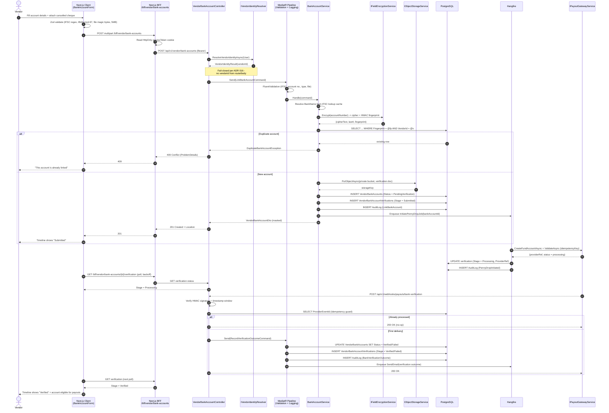
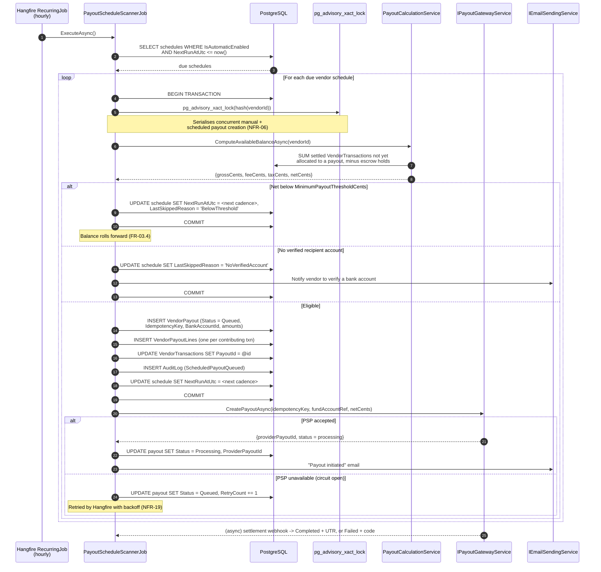
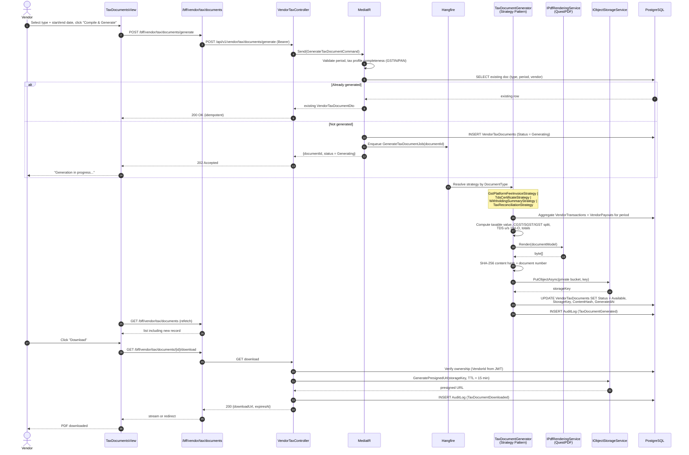
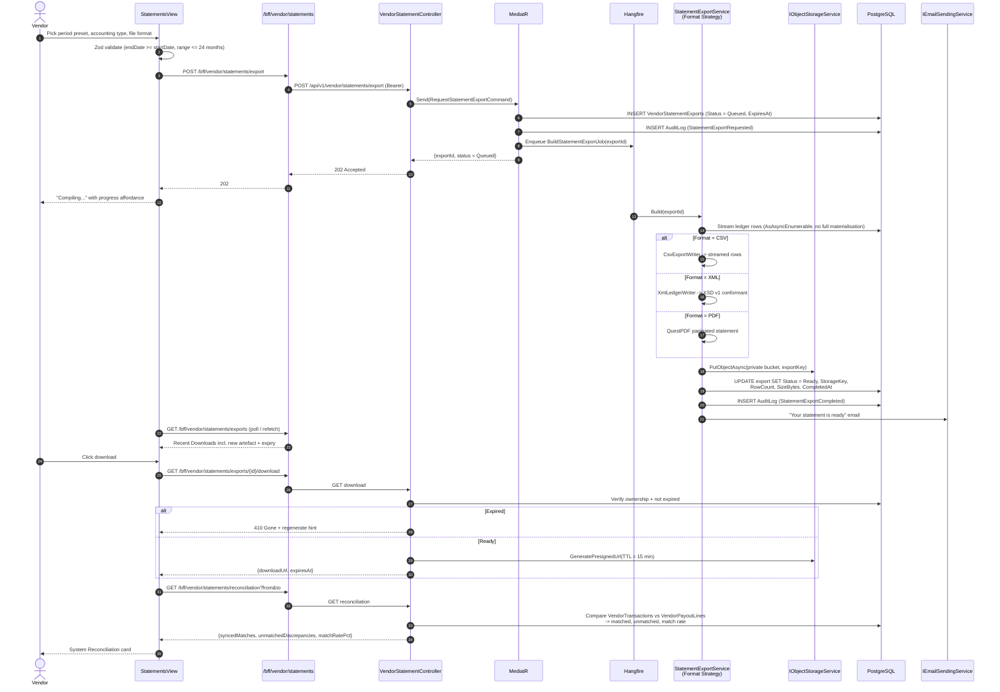
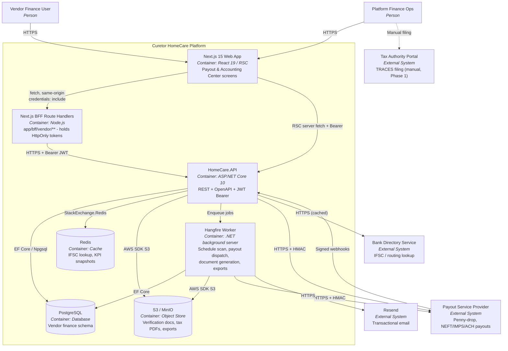
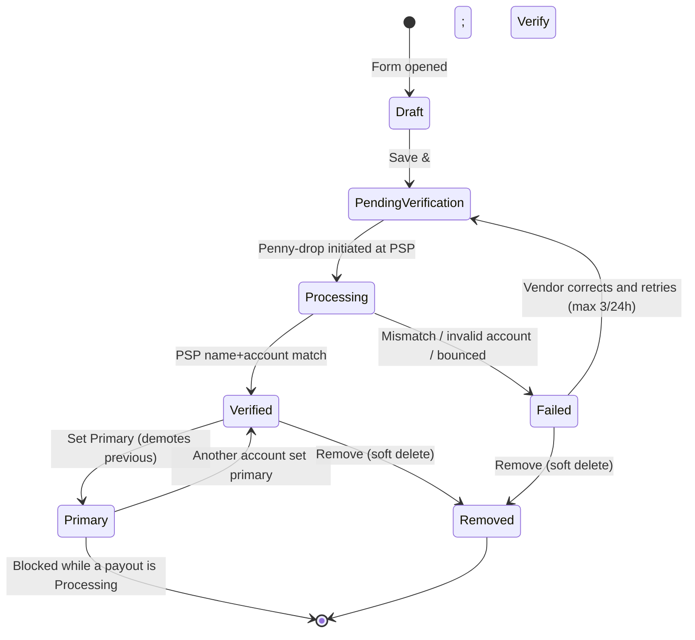
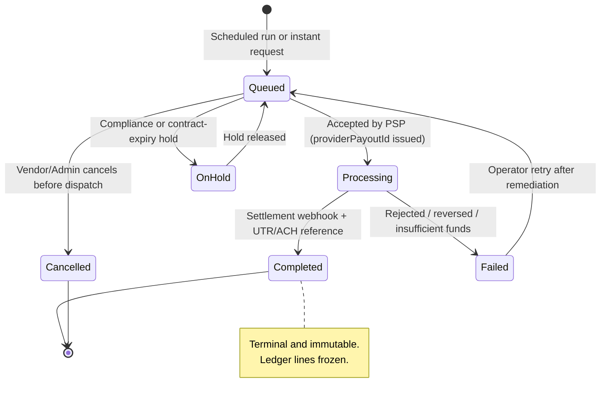
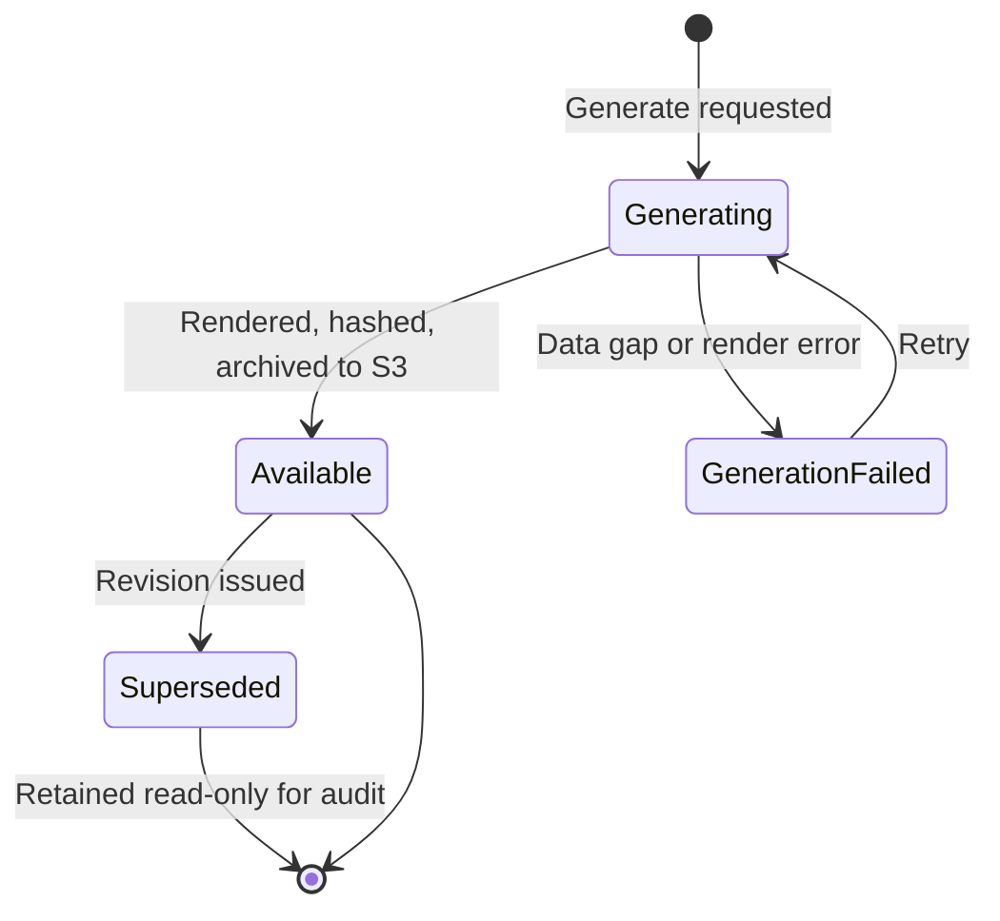

# Vendor Payouts & Accounting Workflow — Strategy Document

**Feature:** Vendor Payout & Accounting Center (Financials)
**Version:** 1.0
**Date:** 2026-09-15
**Author:** Senior Solution Architect
**Status:** APPROVED FOR DESIGN
**Related ADRs:** ADR 004 (Data Access), ADR 005 (Compliance & Audit), ADR 006 (Payment Gateway), ADR 008 (Marketplace), ADR 011 (Contract Signature & Archival), ADR 012 (Vendor Dashboard), ADR 016 (Fail-Closed Tenant Identity), ADR 019 (Server-First URL-Driven UI), ADR 020 (Vendor Data Minimisation), **ADR 021 (this feature — see `ADR-021-Vendor-Payouts-Accounting-Architecture.md`)**

---

## Table of Contents

1. [Executive Summary](#1-executive-summary)
2. [Requirements](#2-requirements)
   - 2.1 [Functional Requirements](#21-functional-requirements)
   - 2.2 [Non-Functional Requirements](#22-non-functional-requirements)
   - 2.3 [Constraints](#23-constraints)
   - 2.4 [Assumptions & Out of Scope](#24-assumptions--out-of-scope)
3. [Strategy](#3-strategy)
   - 3.1 [System-Wide Context Map (Use Case Diagram)](#31-system-wide-context-map-use-case-diagram)
   - 3.2 [Sequence Diagrams](#32-sequence-diagrams)
   - 3.3 [C4 Container Diagram (Level 2)](#33-c4-container-diagram-level-2)
   - 3.4 [C4 Component Diagram (Level 3)](#34-c4-component-diagram-level-3)
   - 3.5 [Domain State Machines](#35-domain-state-machines)
   - 3.6 [Gap Analysis vs. Existing Codebase](#36-gap-analysis-vs-existing-codebase)
   - 3.7 [Risk Register](#37-risk-register)

---

## 1. Executive Summary

The Curetor Marketplace already settles vendor revenue through two existing aggregates — `VendorTransaction` (itemised ledger of gross / commission / net per order) and `VendorPayout` (period settlement header) — surfaced via `VendorFinanceController` (`api/v{version}/vendor/payouts`) and `VendorTransactionController` (`api/v{version}/vendor/transactions`). The current implementation is **settlement-reporting only**: it can list payouts, compute summaries, and trigger a stub disbursement, but it has **no banking instrument, no schedule configuration, no statutory tax artefacts, and no reconciliation/export pipeline**.

This strategy extends the existing Vendor Finance bounded context into a complete **Payout & Accounting Center** with five capability pillars:

| Pillar | Capability | Build Posture |
|---|---|---|
| **P1** | Bank Account Linking & Penny-Drop Verification | **New** — new aggregate + PSP verification adapter |
| **P2** | Payout Schedule Configuration | **New** — new aggregate + Hangfire recurring scheduler |
| **P3** | Disbursement Tracking & Payout History | **Extend** — existing `VendorPayout` + new payout lines/breakdown |
| **P4** | Tax Document Generation (GST / TDS) | **New** — new aggregate + QuestPDF renderer + S3 archival |
| **P5** | Statement Download & ERP Reconciliation | **New** — new aggregate + multi-format (PDF/CSV/XML) export pipeline |

The delivery is deliberately **additive and non-breaking**: no existing endpoint contract changes, no existing table is dropped, and the vendor sidebar keeps a single `Payouts` entry that expands into a URL-driven tabbed workspace consistent with ADR 019.

---

## 2. Requirements

### 2.1 Functional Requirements

#### FR-01: Payout & Accounting Center Shell

- **FR-01.1:** Clicking **Payouts** in the vendor left sidebar must land the vendor on `/vendor/payouts` rendering the **Payout & Accounting Center**.
- **FR-01.2:** The Center must present five URL-addressable views, each deep-linkable and browser-back safe:
  | View | Route |
  |---|---|
  | Overview / Dashboard | `/vendor/payouts` |
  | Bank Accounts | `/vendor/payouts/bank-accounts` |
  | Payout Schedule | `/vendor/payouts/schedule` |
  | Payout History & Disbursements | `/vendor/payouts/history` |
  | Tax Documents & Invoicing | `/vendor/payouts/tax-documents` |
  | Statements & Reconciliation | `/vendor/payouts/statements` |
- **FR-01.3:** A persistent header must render the page title, sub-caption, and a primary `📥 Download Statement` action that deep-links to the Statements view.
- **FR-01.4:** The Overview must render a **Balance & Payout Schedule Summary** band with four metric tiles: `Total Earned`, `Available For Payout (Pending Balance)`, `In Escrow`, `Last Payout Amount`, plus `Next Scheduled Payout` (date + cadence) and `Disbursed This Month` (amount + transfer count).
- **FR-01.5:** The Overview must expose an `Initiate Instant Payout` action, disabled with an explanatory tooltip when (a) no verified primary bank account exists, (b) available balance is below the configured minimum floor, or (c) an in-flight payout is already `Processing`.

#### FR-02: Bank Account Linking & Verification

- **FR-02.1:** Vendors must be able to add a corporate bank account capturing: Account Holder Name, Bank Name (auto-detected from IFSC/routing lookup), IFSC / Routing Code, Account Number / IBAN, Account Type (`Current`, `Savings`).
- **FR-02.2:** The Bank Name field must be auto-populated from the IFSC/routing code via a server-side lookup, displaying an `Auto-Detected` affordance; the field remains editable for international routing codes not covered by the lookup.
- **FR-02.3:** Vendors must upload a verification document (cancelled cheque or bank statement) — accepted formats `PDF`, `PNG`, `JPEG`, max **5 MB**.
- **FR-02.4:** On submit (`Save & Verify`), the platform must initiate an automated **micro-deposit / penny-drop** verification with the payment service provider (PSP) and present a live status timeline with stages `Submitted` → `Processing` → `Verified` (or `Failed`), each stamped with date/time.
- **FR-02.5:** Verification outcome must be delivered asynchronously via PSP webhook; the UI must reflect the change without a manual page refresh (polling with backoff; SignalR optional enhancement).
- **FR-02.6:** A `Linked Accounts` table must list all accounts with Bank Name, masked account number (`•••• 9874`), Type, Status badge (`Verified` / `Pending` / `Failed`), and actions (`Set Primary`, `Remove`). The primary account renders a non-actionable `Primary Account` chip.
- **FR-02.7:** Exactly one account may be `Primary` at any time. Only a `Verified` account may be set primary. Setting a new primary atomically demotes the previous one.
- **FR-02.8:** An account that is referenced by a payout in `Processing` state must not be removable; removal is a **soft delete** that preserves historical payout linkage.
- **FR-02.9:** Full account numbers must never be returned by any API. Only the last 4 digits (`AccountNumberLast4`) and a deterministic fingerprint are readable. The full number is stored encrypted at rest.
- **FR-02.10:** A contextual panel must state the expected verification SLA ("typically concludes within 4 hours") and the consequence of verification ("eligible for immediate disbursements").

#### FR-03: Payout Schedule Configuration

- **FR-03.1:** Vendors must be able to toggle **Automatic Disbursements** on/off.
- **FR-03.2:** Vendors must select a **Disbursement Frequency** from `Weekly`, `Bi-weekly`, `Monthly` rendered as a segmented control.
- **FR-03.3:** Vendors must select a **Preferred Disbursal Day**: day-of-week (`Monday`…`Sunday`) for Weekly/Bi-weekly; day-of-month (`1`…`28`, plus `Last Day`) for Monthly.
- **FR-03.4:** Vendors must set a **Minimum Payout Threshold** (minor-unit currency amount). Auto-payouts are skipped when the available balance is below this floor; the balance rolls forward.
- **FR-03.5:** Vendors must select the **Default Recipient** bank account from their verified accounts (defaults to the primary account).
- **FR-03.6:** `Save Configuration` persists changes with optimistic concurrency; `Discard Changes` reverts to the last persisted state without a server round-trip.
- **FR-03.7:** A right-rail **Next Scheduled Payout** card must display the projected amount, the computed next run date, and the destination account.
- **FR-03.8:** An **Active Rules Summary** card must mirror the persisted configuration (Status, Frequency, Minimum Threshold, Default Recipient) so the vendor can distinguish saved vs. dirty state.

#### FR-04: Disbursement Tracking & Payout History

- **FR-04.1:** A metric band must display `Total Earned`, `Pending Balance`, `In Escrow`, and `Last Payout Amount`.
- **FR-04.2:** An `All Disbursements` table must list Date, Amount, Status badge (`Completed` / `Processing` / `Queued` / `Failed` / `OnHold` / `Cancelled`), Recipient Bank (masked), and Reference Number (UTR / ACH ID). Failed rows show the failure code in place of the reference (e.g., `ERR-INSUFFICIENT-FUNDS`); processing rows show `Pending Bank Clearance`.
- **FR-04.3:** The table must be server-side paginated with an explicit `Showing X-Y of N payouts` caption and numbered pagination controls.
- **FR-04.4:** The table must be filterable by status and date range, and sortable by date and amount.
- **FR-04.5:** An `Upcoming Disbursements` rail must list projected future payouts with date, amount (marked `(Est.)` when projected), destination bank, and a `QUEUED` badge.
- **FR-04.6:** Each payout row must expose a **View Breakdown** action revealing the settlement arithmetic: Gross Sales → Platform Fee (commission %) → Taxes Withheld (TDS/GST) → Adjustments/Refunds → **Net Payout**, plus the itemised contributing transactions.
- **FR-04.7:** Every disbursement must carry an immutable bank transfer reference (UTR for IMPS/NEFT/RTGS, ACH trace ID for US rails) once the PSP confirms settlement.

#### FR-05: Tax Document Generation (GST / TDS)

- **FR-05.1:** Vendors must maintain a **Tax Profile**: GSTIN, PAN, legal registered name, place of supply/state code, and TDS applicability flag.
- **FR-05.2:** The Tax Documents view must list **Available Tax Records** filtered by Financial Year and Document Type, each showing title, covered period, generation date, and a type chip.
- **FR-05.3:** The platform must support these document types:
  | Type | Description | Cadence |
  |---|---|---|
  | `GstPlatformFeeInvoice` | GST-compliant tax invoice for the platform commission charged to the vendor | Monthly |
  | `TdsCertificate` | Form 16A — TDS deducted u/s 194-O | Quarterly |
  | `WithholdingSummary` | Aggregate withholding statement | Half-yearly / Annual |
  | `TaxReconciliationSummary` | YTD tax reconciliation workbook | On demand |
- **FR-05.4:** Vendors must be able to download any listed record as a PDF (or Excel/CSV for the reconciliation summary) via a short-lived pre-signed URL.
- **FR-05.5:** A **Generate Statement** panel must let the vendor select Document Type + Start Date + End Date and trigger `Compile & Generate`; generation runs asynchronously and the new record appears in the list on completion.
- **FR-05.6:** The UI must surface an **Auto-TDS Certificate Sync** informational panel explaining that quarterly Form 16A certificates are generated systematically and filed to the government TRACES portal.
- **FR-05.7:** Generated tax documents are **immutable**. Corrections are issued as a new revision document that references the superseded document; the original remains downloadable for audit.
- **FR-05.8:** Every document must embed a content hash and a document number for legal defensibility (mirroring the `VendorContractAcceptance` pattern from ADR 011).

#### FR-06: Statement Download & ERP Reconciliation

- **FR-06.1:** Vendors must select a period via quick presets (`Last 7 Days`, `Last Month`, `Last Quarter`, `Custom Range`) with explicit Start/End date inputs.
- **FR-06.2:** Vendors must select an **Accounting Type**: `Payout Statements`, `Fee Invoices`, or `Accounting Ledger`.
- **FR-06.3:** Vendors must select a **File Extension Format**: `PDF` (human-readable audit), `CSV` (Excel/Numbers), or `XML` (Tally / SAP / ERP integration).
- **FR-06.4:** `Compile & Export Document` must enqueue an asynchronous export job and return `202 Accepted` with a job handle; the vendor is notified on completion.
- **FR-06.5:** A **System Reconciliation** card must display `Synced Ledger Matches`, `Unmatched Discrepancies`, and a computed `Ledger Balance Match Rate` percentage for the selected period.
- **FR-06.6:** A **Recent Downloads** rail must list previously generated exports with filename, generation timestamp, and expiry countdown (`Expires in 24h` / `Expires in 5 days`), each with a re-download action.
- **FR-06.7:** Export artefacts must expire and be purged per a configurable retention window; expired artefacts return `410 Gone` and offer regeneration.
- **FR-06.8:** The XML format must conform to a published, versioned XSD so ERP integrations remain stable across releases.

#### FR-07: Cross-Cutting Functional Requirements

- **FR-07.1:** Every mutating operation (bank account CRUD, schedule change, disbursement trigger, document generation, statement export) must emit an `AuditLog` entry via the existing `IAuditLogService`.
- **FR-07.2:** All money is transported as **integer minor units** (`…Cents` / paise) plus an ISO 4217 `Currency` code. Floating-point money is prohibited end to end.
- **FR-07.3:** Vendors must receive email notifications (via the existing Resend integration, ADR 009) for: bank verification success/failure, payout initiated, payout completed, payout failed, and tax document availability.
- **FR-07.4:** All list endpoints must be scoped by the vendor identity resolved **fail-closed from JWT claims** (ADR 016) — never from a route or query parameter.

---

### 2.2 Non-Functional Requirements

| ID | Requirement | Target | Rationale |
|---|---|---|---|
| **NFR-01** | **Responsiveness** | Fully functional at Mobile ≥320px, Tablet ≥768px, Desktop ≥1280px. Tables degrade to stacked cards below `md`; the 2-column form/right-rail layout collapses to a single column. | Vendors approve payouts from the field; matches reference screenshots |
| **NFR-02** | **API Latency (read)** | p95 < 300 ms for summary/list endpoints at 10k payouts per vendor | Dashboard must feel instant |
| **NFR-03** | **API Latency (write)** | p95 < 500 ms for configuration mutations; long-running work (generation, export, disbursement) returns `202 Accepted` within 200 ms | No synchronous blocking on PSP or PDF rendering |
| **NFR-04** | **Financial Accuracy** | Zero tolerance. All monetary arithmetic on `bigint` minor units; ledger invariant `Gross − PlatformFee − TaxWithheld − Adjustments = Net` enforced by a database `CHECK` constraint | Statutory/audit exposure |
| **NFR-05** | **Idempotency** | Disbursement initiation and PSP webhook ingestion must be idempotent via a unique `IdempotencyKey` / `ProviderEventId`; duplicate delivery must never double-pay | PSPs deliver at-least-once |
| **NFR-06** | **Concurrency** | Optimistic concurrency via PostgreSQL `xmin` on `VendorPayout`, `VendorBankAccount`, `VendorPayoutSchedule`; payout creation guarded by a transactional advisory lock per vendor | Prevent double disbursement from multi-user vendor accounts |
| **NFR-07** | **Encryption at Rest** | Full bank account / IBAN number encrypted with AES-256-GCM using a key from the configured secret store; only `Last4` + HMAC fingerprint are queryable | PCI-adjacent / RBI data protection |
| **NFR-08** | **Secrets** | No PSP keys, encryption keys, or webhook signing secrets in source or `appsettings.json`. User Secrets (dev) / environment variables / Key Vault (prod) only | AI_INSTRUCTIONS.md §3 |
| **NFR-09** | **PII/PHI in Logs** | Structured Serilog logs must never contain account numbers, IFSC codes, PAN, GSTIN, patient names, or any PHI. Log identifiers only | HIPAA/GDPR; AI_INSTRUCTIONS.md §4 |
| **NFR-10** | **Audit Immutability** | `AuditLog` remains append-only (enforced by `HomeCareDbContext.EnforceAuditLogAppendOnly`). Tax documents and executed payouts are immutable after terminal state | ADR 005 |
| **NFR-11** | **Tenant Isolation** | Every query filtered by `VendorId` resolved from JWT; cross-tenant access returns `404` (not `403`) to prevent enumeration | ADR 016 |
| **NFR-12** | **Webhook Security** | PSP webhooks verified by HMAC signature + timestamp replay window (≤5 min) + allow-listed source; unsigned requests rejected `401` | OWASP A07 |
| **NFR-13** | **Rate Limiting** | 10 req/min per vendor on disbursement trigger, document generation, and statement export; 60 req/min on reads | Prevent PSP cost abuse & DoS |
| **NFR-14** | **File Upload Safety** | Magic-byte content sniffing (not extension trust), 5 MB cap, AV scan hook, stored to private S3/MinIO buckets, served only via short-lived pre-signed URLs (≤15 min) | OWASP A03/A08 |
| **NFR-15** | **Export Scalability** | CSV/XML exports stream (no full-materialisation) and must handle ≥250k ledger rows within 60 s | ERP year-end exports |
| **NFR-16** | **Accessibility** | WCAG 2.1 AA: labelled form controls, `role="status"` on the verification timeline, `role="alert"` on errors, visible focus rings, ≥4.5:1 contrast on status badges | Healthcare accessibility mandate |
| **NFR-17** | **Observability** | Serilog structured logs with `CorrelationId`; dedicated health check for PSP payout connectivity at `/health`; metrics for payout success rate, verification latency, export duration | AI_INSTRUCTIONS.md §4 |
| **NFR-18** | **Retention** | Payout & ledger records retained ≥8 years (Indian statutory); export artefacts purged after a configurable TTL (default 7 days) | Compliance |
| **NFR-19** | **Resilience** | PSP calls wrapped in `Microsoft.Extensions.Http.Resilience` (retry with jittered backoff + circuit breaker); PSP outage degrades to `Queued`, never data loss | Existing resilience package already referenced |
| **NFR-20** | **Test Coverage** | ≥85% line coverage on `HomeCare.Application.Features.VendorPayouts` handlers and domain services; 100% branch coverage on settlement arithmetic | AI_INSTRUCTIONS.md §5 |

---

### 2.3 Constraints

| ID | Constraint | Detail |
|---|---|---|
| **C-01** | **Technology Stack** | Next.js 15 App Router + React 19 + Tailwind CSS v4 (frontend); .NET 10 ASP.NET Core, MediatR, FluentValidation, AutoMapper, EF Core + Npgsql (backend); PostgreSQL (database); Hangfire (background jobs); QuestPDF Community (PDF); AWS SDK S3 / MinIO (object storage); Serilog (logging) |
| **C-02** | **Architecture** | Clean Architecture layering — `HomeCare.Domain` → `HomeCare.Application` → `HomeCare.Infrastructure` → `HomeCare.API`. CQRS via MediatR. Repository + Unit of Work. BFF route handlers under `app/bff/**` |
| **C-03** | **Code Quality** | Strict adherence to `AI_Instructions.md`: SOLID, XML docs on all public APIs/interfaces, `_camelCase` private fields, no `any` in TypeScript, FluentValidation (server) + Zod (client), RFC 7807 Problem Details, structured logging with zero PII |
| **C-04** | **Must Extend, Not Replace** | `VendorPayout`, `VendorTransaction`, `IVendorFinanceRepository`, `VendorFinanceRepository`, `VendorFinanceController`, `VendorTransactionController` already exist and are covered by `VendorFinanceApiTests`. Existing routes and DTO contracts must remain backward compatible |
| **C-05** | **Existing Route Prefix** | New payout endpoints live under `api/v{version:apiVersion}/vendor/payouts/**`; new sibling controllers use `api/v{version:apiVersion}/vendor/bank-accounts`, `…/vendor/tax`, `…/vendor/statements` |
| **C-06** | **Auth Policy** | Reuse `[Authorize(Policy = "VendorPolicy")]`. Vendor identity resolved through `IVendorIdentityResolver` (fail-closed, ADR 016), replacing the ad-hoc claim parsing currently inlined in `VendorFinanceController` |
| **C-07** | **Object Storage** | Reuse the existing `IObjectStorageService` / `S3ObjectStorageService` abstraction and `ObjectStorageOptions` configuration. No new storage abstraction |
| **C-08** | **PDF Rendering** | Reuse `IPdfRenderingService` (QuestPDF Community licence already configured in `ServiceCollectionExtensions`) |
| **C-09** | **Email** | Reuse `IEmailSendingService` (Resend, ADR 009). No new transport |
| **C-10** | **Background Jobs** | Reuse the configured Hangfire server (`RecurringJob.AddOrUpdate` pattern already used by `CheckContractExpirationsJob`). No new scheduler |
| **C-11** | **Sidebar Real Estate** | The vendor sidebar must retain a single `Payouts` entry; the five capability screens are sub-navigation within the Payout & Accounting Center (URL-driven, per ADR 019) |
| **C-12** | **Money Representation** | Integer minor units (`long` / `bigint`) + ISO 4217 code. Default currency `INR`; the UI must format per the tenant's currency, never hard-code `$` or `₹` |
| **C-13** | **Regulatory Scope** | Phase 1 targets Indian statutory artefacts (GST tax invoice, TDS Form 16A u/s 194-O). The document-type model must be extensible to US (1099-K) and EU without schema change |
| **C-14** | **No Money Movement in Platform Code** | The platform never touches funds directly; all disbursement executes through a licensed PSP behind `IPayoutGatewayService`. The platform records intent, reconciles outcome, and never simulates settlement in production |
| **C-15** | **Reuse the Existing Payment Provider Assets** | `IPaymentService` with `RazorpayPaymentService`, `PayUPaymentService`, `PaymentServiceFactory`, the `PaymentProviderType` enum, the `PaymentProvider` reference entity, and the `PaymentProviders:{Provider}:*` configuration section already exist. Payout adapters must **reuse the enum, the factory shape, the configuration namespace, and the reference entity**, and must target **Razorpay and PayU first** (Stripe deferred, matching the existing `NotImplementedException`). Payouts get a separate port because `IPaymentService` is pay-in only — see ADR 021 D-02 |

---

### 2.4 Assumptions & Out of Scope

**Assumptions**

- Payout rails will be contracted with the **same two providers already integrated for collections** — **RazorpayX Payouts** and **PayU Payouts** — reusing the existing `PaymentProviderType` enum and `PaymentProviders:{Provider}` configuration section. These are separate provider *products* from the Payments APIs wired into `RazorpayPaymentService` / `PayUPaymentService` and require their own credentials and endpoints. Stripe remains deferred, consistent with the existing `PaymentServiceFactory`. Phase 1 codes against `IPayoutGatewayService` with a `SandboxPayoutGatewayService` for non-production environments.
- Commission percentage per vendor is already authoritative in `IndividualVendorContract.CommissionPct` and is the single source of truth for platform fee arithmetic.
- Escrow balance is derivable from `VendorTransaction` rows in non-terminal settlement states linked to orders not yet in a fulfilment-complete state.
- The government TRACES portal filing for Form 16A is performed by the platform's finance operations team; the platform stores and serves the resulting certificate.

**Out of Scope (Phase 1)**

- Multi-currency FX conversion and hedging.
- Vendor-initiated dispute/chargeback workflow (tracked separately).
- Direct ERP push (SAP/Tally API). Phase 1 delivers file-based XML export only.
- Automated e-filing to the tax authority.
- Admin-side bulk payout console (a thin admin read-only view is included; bulk operations are deferred).

---

## 3. Strategy

### 3.1 System-Wide Context Map (Use Case Diagram)

```mermaid
graph TB
    subgraph Actors["Actors"]
        V["Vendor Finance User"]
        A["Platform Admin / Finance Ops"]
        SCH["Scheduler<br/>(Hangfire)"]
        PSP["Payout Service Provider<br/>(External)"]
        TAX["Tax Authority Portal<br/>(External)"]
    end

    subgraph Center["Payout &amp; Accounting Center"]
        subgraph P1["P1 - Bank Account Linking"]
            UC01["UC-01 Add Bank Account"]
            UC02["UC-02 Upload Verification Document"]
            UC03["UC-03 Run Penny-Drop Verification"]
            UC04["UC-04 Set Primary / Remove Account"]
        end

        subgraph P2["P2 - Payout Schedule"]
            UC05["UC-05 Configure Frequency and Day"]
            UC06["UC-06 Set Minimum Payout Threshold"]
            UC07["UC-07 Toggle Automatic Disbursement"]
        end

        subgraph P3["P3 - Disbursement Tracking"]
            UC08["UC-08 View Balance and Escrow"]
            UC09["UC-09 Initiate Instant Payout"]
            UC10["UC-10 Browse Payout History"]
            UC11["UC-11 View Settlement Breakdown"]
            UC12["UC-12 Track UTR / ACH Reference"]
            UC13["UC-13 Execute Scheduled Payout Run"]
        end

        subgraph P4["P4 - Tax Documentation"]
            UC14["UC-14 Maintain Tax Profile (GSTIN / PAN)"]
            UC15["UC-15 Generate GST Fee Invoice"]
            UC16["UC-16 Generate TDS Form 16A"]
            UC17["UC-17 Download Tax Document"]
        end

        subgraph P5["P5 - Statements and Reconciliation"]
            UC18["UC-18 Select Period and Accounting Type"]
            UC19["UC-19 Export PDF / CSV / XML"]
            UC20["UC-20 View Reconciliation Match Rate"]
            UC21["UC-21 Re-download Recent Export"]
        end

        subgraph XC["Cross-Cutting"]
            UC22["UC-22 Emit Audit Log"]
            UC23["UC-23 Send Notification Email"]
        end
    end

    V --> UC01
    V --> UC02
    V --> UC04
    V --> UC05
    V --> UC06
    V --> UC07
    V --> UC08
    V --> UC09
    V --> UC10
    V --> UC11
    V --> UC12
    V --> UC14
    V --> UC15
    V --> UC16
    V --> UC17
    V --> UC18
    V --> UC19
    V --> UC20
    V --> UC21

    A --> UC10
    A --> UC12
    A --> UC16

    SCH --> UC13
    SCH --> UC15
    SCH --> UC16

    UC01 --> UC03
    UC03 --> PSP
    UC09 --> PSP
    UC13 --> PSP
    PSP -->|"settlement webhook"| UC12
    UC16 -.-> TAX

    UC01 --> UC22
    UC04 --> UC22
    UC05 --> UC22
    UC09 --> UC22
    UC15 --> UC22
    UC19 --> UC22

    UC03 --> UC23
    UC09 --> UC23
    UC13 --> UC23
    UC15 --> UC23
```

---

### 3.2 Sequence Diagrams

#### 3.2.1 Bank Account Linking with Penny-Drop Verification

#### 3.2.2 Scheduled Automatic Disbursement Run

#### 3.2.3 Tax Document Generation & Download

#### 3.2.4 Statement Export & Reconciliation

---

### 3.3 C4 Container Diagram (Level 2)

---

### 3.4 C4 Component Diagram (Level 3)

Components inside the **HomeCare.API** container (plus the Hangfire worker components that share the Application/Infrastructure assemblies).

```mermaid
graph TB
    subgraph APILayer["HomeCare.API - Presentation Layer"]
        C1["VendorBankAccountController<br/><i>api/v1/vendor/bank-accounts</i>"]
        C2["VendorFinanceController (extended)<br/><i>api/v1/vendor/payouts</i>"]
        C3["VendorTaxController<br/><i>api/v1/vendor/tax</i>"]
        C4["VendorStatementController<br/><i>api/v1/vendor/statements</i>"]
        C5["PayoutWebhookController<br/><i>api/v1/webhooks/payouts</i>"]
        MW["GlobalExceptionMiddleware<br/>RFC 7807 Problem Details"]
        RL["Rate Limiter<br/>payout-mutations policy"]
    end

    subgraph AppLayer["HomeCare.Application - Use Case Layer"]
        MEDP["MediatR Pipeline<br/>ValidationBehavior + LoggingBehavior"]

        subgraph Cmds["Commands"]
            CM1["LinkBankAccountCommand"]
            CM2["SetPrimaryBankAccountCommand"]
            CM3["RemoveBankAccountCommand"]
            CM4["UpsertPayoutScheduleCommand"]
            CM5["InitiateInstantPayoutCommand"]
            CM6["RecordPayoutOutcomeCommand"]
            CM7["RecordVerificationOutcomeCommand"]
            CM8["UpsertTaxProfileCommand"]
            CM9["GenerateTaxDocumentCommand"]
            CM10["RequestStatementExportCommand"]
        end

        subgraph Qrys["Queries"]
            Q1["GetBankAccountsQuery"]
            Q2["GetVerificationTimelineQuery"]
            Q3["GetPayoutScheduleQuery"]
            Q4["GetPayoutBalanceQuery"]
            Q5["GetPayoutHistoryQuery (existing)"]
            Q6["GetPayoutBreakdownQuery"]
            Q7["GetUpcomingPayoutsQuery"]
            Q8["GetTaxDocumentsQuery"]
            Q9["GetStatementExportsQuery"]
            Q10["GetReconciliationSummaryQuery"]
        end

        subgraph Svcs["Domain / Application Services"]
            S1["PayoutCalculationService<br/><i>settlement arithmetic, invariant guard</i>"]
            S2["PayoutScheduleCalculator<br/><i>next-run cadence resolution</i>"]
            S3["PayoutEligibilityPolicy<br/><i>threshold, verified account, in-flight</i>"]
            S4["TaxDocumentGeneratorFactory<br/><i>Factory + Strategy</i>"]
            S5["StatementFormatWriterFactory<br/><i>PDF / CSV / XML strategies</i>"]
            S6["ReconciliationService"]
        end

        subgraph Ports["Ports (Interfaces)"]
            I1["IVendorBankAccountRepository"]
            I2["IVendorPayoutScheduleRepository"]
            I3["IVendorFinanceRepository (extended)"]
            I4["IVendorTaxRepository"]
            I5["IVendorStatementRepository"]
            I6["IPayoutGatewayService"]
            I7["IFieldEncryptionService"]
            I8["IBankDirectoryService"]
            I9["IObjectStorageService (existing)"]
            I10["IPdfRenderingService (existing)"]
            I11["IAuditLogService (existing)"]
            I12["IEmailSendingService (existing)"]
            I13["IVendorIdentityResolver (existing)"]
        end
    end

    subgraph InfraLayer["HomeCare.Infrastructure - Adapters"]
        R1["VendorBankAccountRepository"]
        R2["VendorPayoutScheduleRepository"]
        R3["VendorFinanceRepository (extended)"]
        R4["VendorTaxRepository"]
        R5["VendorStatementRepository"]
        A1["RazorpayXPayoutGatewayService<br/>PayUPayoutGatewayService<br/>SandboxPayoutGatewayService<br/><i>via IPayoutGatewayFactory</i>"]
        A2["AesGcmFieldEncryptionService"]
        A3["CachedBankDirectoryService"]
        A4["S3ObjectStorageService (existing)"]
        A5["QuestPdfRenderingService (existing)"]
        A6["AuditLogService (existing)"]
        A7["ResendEmailSendingService (existing)"]
        CTX["HomeCareDbContext<br/>+ EF Configurations"]

        subgraph Jobs["Hangfire Jobs"]
            J1["PayoutScheduleScannerJob<br/><i>recurring - hourly</i>"]
            J2["DispatchQueuedPayoutsJob<br/><i>recurring - 5 min</i>"]
            J3["InitiatePennyDropJob<br/><i>fire-and-forget</i>"]
            J4["GenerateTaxDocumentJob<br/><i>fire-and-forget + monthly/quarterly recurring</i>"]
            J5["BuildStatementExportJob<br/><i>fire-and-forget</i>"]
            J6["PurgeExpiredExportsJob<br/><i>recurring - daily</i>"]
        end
    end

    subgraph DomainLayer["HomeCare.Domain - Entities"]
        E1["VendorBankAccount"]
        E2["VendorBankAccountVerification"]
        E3["VendorPayoutSchedule"]
        E4["VendorPayout (extended)"]
        E5["VendorPayoutLine"]
        E6["VendorTransaction (existing)"]
        E7["VendorTaxProfile"]
        E8["VendorTaxDocument"]
        E9["VendorStatementExport"]
    end

    C1 --> MEDP
    C2 --> MEDP
    C3 --> MEDP
    C4 --> MEDP
    C5 --> MEDP
    C1 --> I13
    C2 --> I13
    C3 --> I13
    C4 --> I13
    MW -.-> C1
    RL -.-> C2

    MEDP --> Cmds
    MEDP --> Qrys
    Cmds --> Svcs
    Qrys --> Svcs
    Svcs --> Ports
    Cmds --> Ports
    Qrys --> Ports

    I1 --> R1
    I2 --> R2
    I3 --> R3
    I4 --> R4
    I5 --> R5
    I6 --> A1
    I7 --> A2
    I8 --> A3
    I9 --> A4
    I10 --> A5
    I11 --> A6
    I12 --> A7

    R1 --> CTX
    R2 --> CTX
    R3 --> CTX
    R4 --> CTX
    R5 --> CTX
    CTX --> DomainLayer

    J1 --> S2
    J1 --> S3
    J1 --> S1
    J2 --> I6
    J3 --> I6
    J4 --> S4
    J5 --> S5
    J6 --> I9
```

---

### 3.5 Domain State Machines

#### Bank Account Verification

#### Payout Lifecycle

#### Tax Document Lifecycle

---

### 3.6 Gap Analysis vs. Existing Codebase

| Capability | Existing Asset | Gap | Strategy |
|---|---|---|---|
| Payout header record | `VendorPayout` entity, `VendorPayouts` DbSet | No bank account link, no schedule link, no tax withheld, no idempotency key, no failure code, no currency, no concurrency token | **Extend** entity + additive migration |
| Payout ↔ transaction linkage | `VendorTransaction.OrderId` only | No allocation of transactions to a payout; breakdown cannot be computed | **New** `VendorPayoutLine` join aggregate + `VendorTransaction.PayoutId` |
| Payout API | `VendorFinanceController` (list, summary, byId, disburse) | `TriggerDisbursementCommandHandler` creates a payout with **zero amounts** and no PSP call — a stub | **Replace handler internals** with `PayoutCalculationService` + `IPayoutGatewayService`; keep route/DTO contract |
| Payment provider integration | `IPaymentService`, `RazorpayPaymentService`, `PayUPaymentService`, `PaymentServiceFactory`, `PaymentProviderType` enum, `PaymentProvider` reference entity, `PaymentProviders:*` config | Pay-in only (`ProcessPayment`/`HandleWebhook`/`RefundPayment`). No fund-account, penny-drop, or transfer capability. Razorpay adapter also has three defects: `new HttpClient()` in a scoped ctor, per-call mutation of `DefaultRequestHeaders`, and non-constant-time signature comparison with no replay window | **Reuse** the enum, factory shape, config namespace, and reference entity. **Add** a separate `IPayoutGatewayService` port with Razorpay/PayU/Sandbox adapters built on `IHttpClientFactory` + resilience, and correct all three defects in the new adapters (ADR 021 D-02) |
| Vendor identity | `IVendorIdentityResolver` exists | `VendorFinanceController` / `VendorTransactionController` still parse claims inline | **Refactor** both controllers onto the resolver (ADR 016 compliance) |
| Bank accounts | — | Entirely absent | **New** aggregate, repository, controller, UI |
| Payout schedule | — | Entirely absent | **New** aggregate + Hangfire scanner |
| Tax profile & documents | — | Entirely absent | **New** aggregates + QuestPDF strategies |
| Statement export | `CsvExportWriter`, `ExportTransactionLedgerQuery` (sync CSV) | No async pipeline, no PDF/XML, no artefact retention, no reconciliation | **New** async export aggregate reusing `CsvExportWriter` |
| Object storage | `IObjectStorageService` / `S3ObjectStorageService` | None | **Reuse** |
| PDF rendering | `IPdfRenderingService` (QuestPDF) | Contract-specific implementation | **Reuse interface**, add tax/statement document strategies |
| Background jobs | Hangfire configured; `CheckContractExpirationsJob` pattern | None | **Reuse** |
| Frontend payouts page | `app/(protected)/vendor/payouts/page.tsx` | Client component with **hard-coded mock arrays** and USD-hardcoded formatting; no sub-navigation | **Rewrite** as a server-first tabbed workspace; delete mock constants |
| BFF routes | `app/bff/vendor/payouts/**` | Fallback mock data masks backend failures (violates explicit-error-state expectations) | **Rewrite** to proxy faithfully and surface RFC 7807 errors |
| Sidebar | `Payouts` + `Transactions` entries exist | `Transactions` becomes a sub-view of the Center | **Keep** `Payouts`; retain `Transactions` route as a redirect to `/vendor/payouts/history?view=ledger` |

---

### 3.7 Risk Register

| ID | Risk | Likelihood | Impact | Mitigation |
|---|---|---|---|---|
| **R-01** | Duplicate disbursement from concurrent manual + scheduled trigger | Medium | **Critical** (financial loss) | `pg_advisory_xact_lock(vendorId)` around payout creation + unique `IdempotencyKey` index + PSP-side idempotency key |
| **R-02** | PSP webhook replayed or spoofed | Medium | Critical | HMAC signature verification, ≤5 min timestamp window, unique `ProviderEventId` index, IP allow-list |
| **R-03** | Bank account number leakage via logs or API response | Low | Critical | AES-256-GCM at rest, `Last4` only in DTOs, Serilog destructuring policy that redacts the field, static-analysis rule |
| **R-04** | Settlement arithmetic drift (rounding) | Medium | High | Integer minor units only, banker's-rounding helper used exactly once per computation, DB `CHECK` invariant, 100% branch coverage on `PayoutCalculationService` |
| **R-05** | Tax document generated with an incomplete tax profile | High | High | Server-side precondition validation (GSTIN/PAN mandatory) returning `422` with field-level Problem Details; UI blocks generation and deep-links to the Tax Profile form |
| **R-06** | Large ERP export exhausts memory | Medium | High | `AsAsyncEnumerable` streaming writers, chunked S3 multipart upload, hard row cap with pagination guidance |
| **R-07** | PSP outage stalls payouts | Medium | Medium | Circuit breaker + `Queued` state + `DispatchQueuedPayoutsJob` retry; vendor-visible status, no silent failure. `IPayoutGatewayFactory` allows failing over between the Razorpay and PayU rails |
| **R-11** | Payout adapters inherit the defects present in the existing pay-in adapters (`new HttpClient()` socket exhaustion, per-call `DefaultRequestHeaders` mutation, non-constant-time signature compare) | High | High | Payout adapters mandated to use `IHttpClientFactory` + resilience pipeline, per-request `Authorization` headers, and `CryptographicOperations.FixedTimeEquals` with a timestamp replay window. Code-review checklist item in WP3 |
| **R-08** | Vendor contract expired / commission rate ambiguous at settlement time | Medium | High | Snapshot `CommissionRate` onto each `VendorPayoutLine` at allocation time; `VendorContractExpiryMiddleware` already gates vendor endpoints |
| **R-09** | Mock/fallback data reaching production UI | High | Medium | Remove all fallback constants from BFF routes and pages; explicit `error.tsx` boundaries with retry (pattern already used by `/vendor/orders`) |
| **R-10** | Regulatory divergence (India vs. US) hard-codes into the schema | Medium | Medium | `DocumentType` + `JurisdictionCode` as extensible reference values; generator resolved via Factory so new jurisdictions add a strategy, not a migration |

---

**End of Strategy Document.** Tactical execution detail — ERD, physical schema, component design, API contracts, and work packages — is specified in `TACTICAL-PLAN-Vendor-Payouts-Accounting.md`. The single consolidated decision record is `ADR-021-Vendor-Payouts-Accounting-Architecture.md`.
