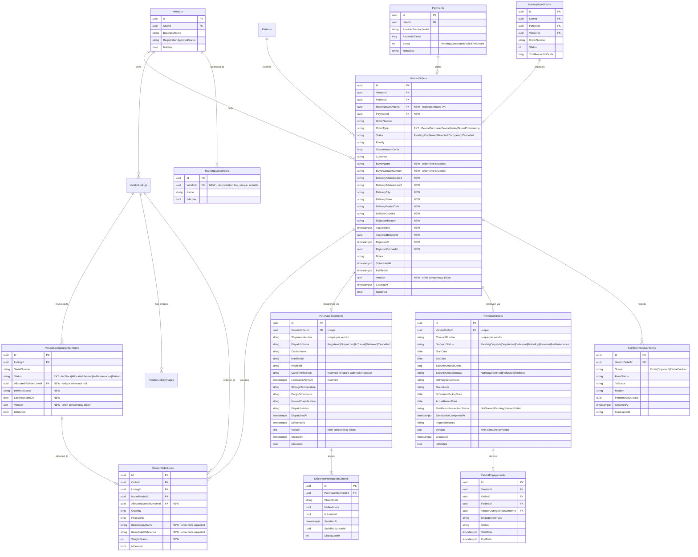
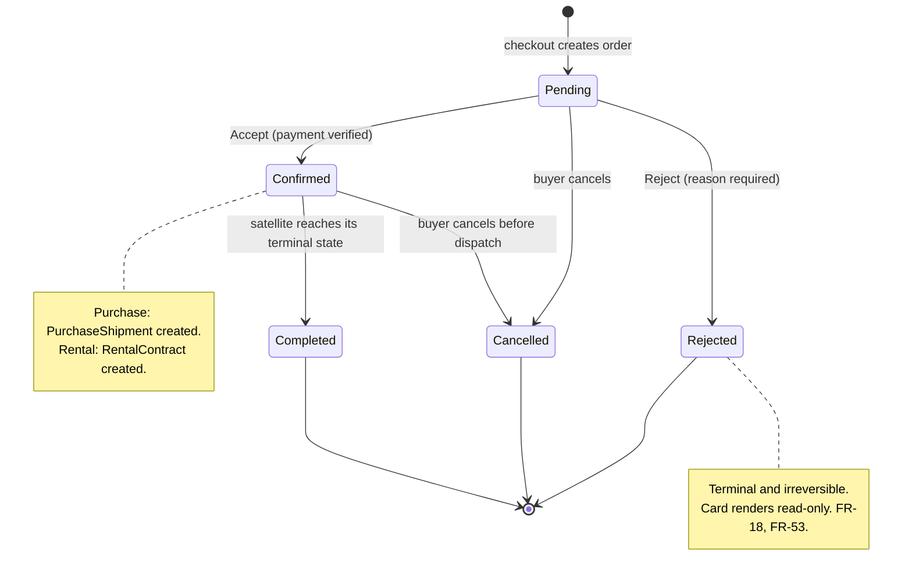
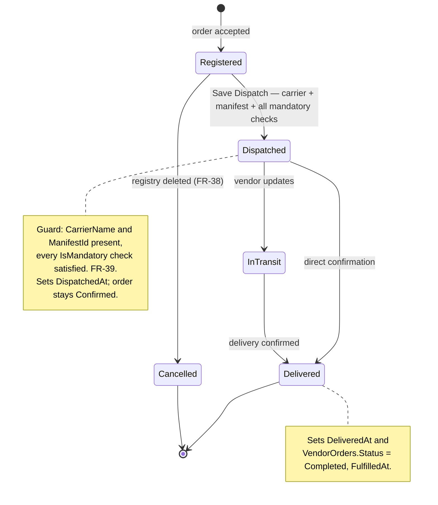
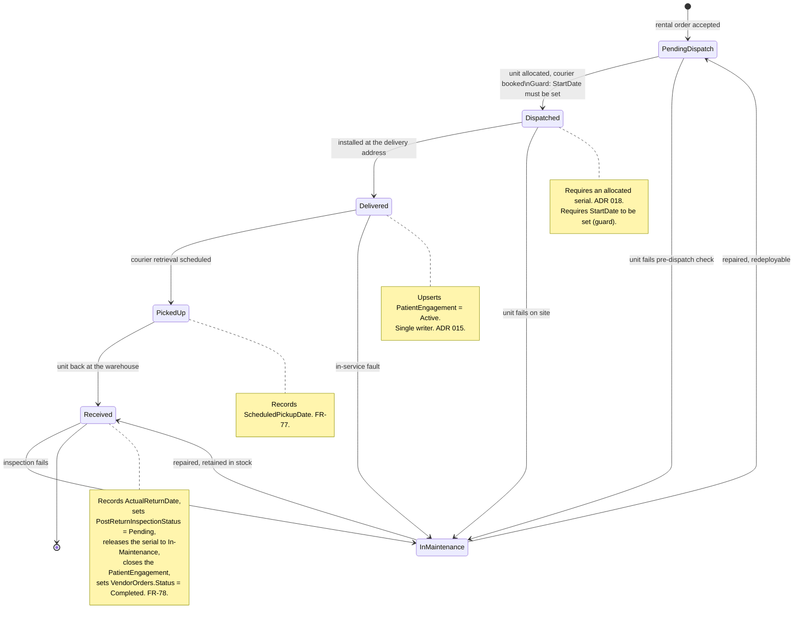
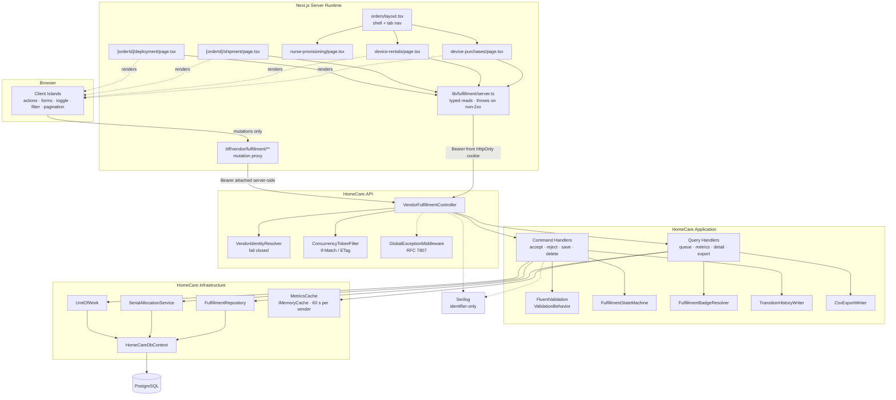
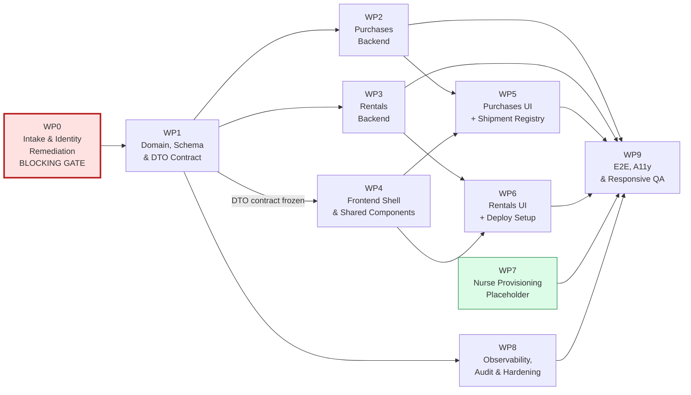

# Tactical Plan: Orders & Services Fulfillment Workflow

**Document type:** Tactical plan
**Author:** Solution Architecture
**Date:** 2026-09-14
**Status:** Proposed
**Companion:** [STRATEGY-Order-Service-Request-Fulfillment.md](STRATEGY-Order-Service-Request-Fulfillment.md)

---

## Table of Contents

1. [Entity Relationship Diagram](#1-entity-relationship-diagram)
2. [Database Schema Details](#2-database-schema-details)
3. [Status Vocabularies and State Machines](#3-status-vocabularies-and-state-machines)
4. [Migration Plan](#4-migration-plan)
5. [High-Level Design — Component Diagram](#5-high-level-design--component-diagram)
6. [API Endpoints](#6-api-endpoints)
7. [Data Transfer Objects](#7-data-transfer-objects)
8. [Frontend Route and Component Map](#8-frontend-route-and-component-map)
9. [Responsive and Accessibility Specification](#9-responsive-and-accessibility-specification)
10. [Work Package Breakdown](#10-work-package-breakdown)
11. [Test Strategy](#11-test-strategy)
12. [Observability](#12-observability)
13. [Definition of Done](#13-definition-of-done)

---

## 1. Entity Relationship Diagram

Legend: **[NEW]** table created by this release · **[EXT]** existing table extended ·
plain = existing and untouched.



### 1.1 Cardinality Rationale

| Relationship | Cardinality | Why |
| --- | --- | --- |
| `VendorOrders` → `PurchaseShipments` | 0..1 | One shipment per purchase order in this release ([A-02](STRATEGY-Order-Service-Request-Fulfillment.md#6-assumptions)). A unique index on `VendorOrderId` enforces it, so relaxing to one-to-many later is a single index drop |
| `VendorOrders` → `RentalContracts` | 0..1 | One contract per rental order ([A-03](STRATEGY-Order-Service-Request-Fulfillment.md#6-assumptions)). Same relaxation path |
| `PurchaseShipments` → `ShipmentPrerequisiteChecks` | 1..N | Each regulatory check is an independently attestable row with its own actor and timestamp ([FR-34](STRATEGY-Order-Service-Request-Fulfillment.md#33-tab-a-detail--shipment-registry)). A JSON blob or bitmask cannot carry per-item provenance |
| `VendorListingSerialNumbers` → `VendorOrderLines` | 0..1 | The allocation lives as a **single nullable column on the serial row**, made unique. This makes "at most one active allocation per unit" a database invariant rather than application discipline ([ADR 018](ADR%20018%20-%20Serial%20Number%20Allocation%20Concurrency%20Control.md)) |
| `Payments` → `VendorOrders` | 0..1 | Verification state is **derived** from `Payment.Status` at query time. Nothing is duplicated onto the order, so nothing can drift |
| `RentalContracts` → `PatientEngagements` | 0..1 | One-way derivation with exactly one writer. The care-delivery view stays current without becoming a second source of truth |

---

## 2. Database Schema Details

PostgreSQL. All identifiers are `PascalCase` and quoted, matching the existing schema. All
timestamps are `timestamp with time zone`. All monetary values are `bigint` minor units.
Concurrency tokens map to the PostgreSQL system column `xmin` via
`.IsRowVersion().HasColumnName("xmin").HasColumnType("xid")`, following the
`VendorListing.Version` precedent.

### 2.1 `VendorOrders` — Extended

| Column | Type | Null | Default | Notes |
| --- | --- | --- | --- | --- |
| `MarketplaceOrderId` | `uuid` | Yes | — | FK → `MarketplaceOrders(Id)`, `ON DELETE SET NULL`. Replaces the shared primary key (defect P4) |
| `PaymentId` | `uuid` | Yes | — | FK → `Payments(Id)`, `ON DELETE SET NULL`. Resolves defect P5 |
| `OrderType` | `varchar(30)` | No | — | Vocabulary widened. `CHECK` constraint below |
| `BuyerName` | `varchar(200)` | Yes | — | Order-time snapshot. Minimum necessary for delivery ([ADR 020](ADR%20020%20-%20Vendor%20Data%20Minimisation%20for%20Buyer%20Information.md)) |
| `BuyerContactNumber` | `varchar(30)` | Yes | — | Order-time snapshot, digits only |
| `DeliveryAddressLine1` | `varchar(250)` | Yes | — | Order-time snapshot |
| `DeliveryAddressLine2` | `varchar(250)` | Yes | — | |
| `DeliveryCity` | `varchar(100)` | Yes | — | |
| `DeliveryState` | `varchar(100)` | Yes | — | |
| `DeliveryPostalCode` | `varchar(20)` | Yes | — | |
| `DeliveryCountry` | `varchar(100)` | Yes | `'India'` | |
| `RejectionReason` | `varchar(500)` | Yes | — | Dedicated column. Resolves defect P7 |
| `AcceptedAt` | `timestamptz` | Yes | — | |
| `AcceptedByUserId` | `uuid` | Yes | — | FK → `Users(Id)`, `ON DELETE SET NULL` |
| `RejectedAt` | `timestamptz` | Yes | — | |
| `RejectedByUserId` | `uuid` | Yes | — | FK → `Users(Id)`, `ON DELETE SET NULL` |
| `Version` | `xid` | No | system | `xmin` concurrency token. Resolves defect P6 |

**Constraints**

```sql
ALTER TABLE "VendorOrders" ADD CONSTRAINT "CK_VendorOrders_OrderType"
    CHECK ("OrderType" IN ('DevicePurchase','DeviceRental','NurseProvisioning',
                           'NursingService','Both'));

ALTER TABLE "VendorOrders" ADD CONSTRAINT "CK_VendorOrders_Status"
    CHECK ("Status" IN ('Pending','Confirmed','Rejected','Completed','Cancelled',
                        'InProgress','Shipped'));

ALTER TABLE "VendorOrders" ADD CONSTRAINT "CK_VendorOrders_RejectionReason_Required"
    CHECK ("Status" <> 'Rejected'
           OR ("RejectionReason" IS NOT NULL AND length(btrim("RejectionReason")) >= 10));
```

`NursingService` and `Both` remain legal so pre-existing rows stay valid. `InProgress` and
`Shipped` are legacy statuses retained for the same reason; **no new write may use them**,
enforced by the `FulfillmentStateMachine` and asserted by a unit test.

**Indexes**

```sql
-- Primary queue path: tenant + tab + status + recency. Covers FR-11, FR-15, FR-17.
CREATE INDEX "IX_VendorOrders_Vendor_Type_Status_Created"
    ON "VendorOrders" ("VendorId", "OrderType", "Status", "CreatedAt" DESC)
    WHERE "IsDeleted" = false;

-- KPI trend windows. Covers FR-10, FR-50, R-12.
CREATE INDEX "IX_VendorOrders_Vendor_Type_Created"
    ON "VendorOrders" ("VendorId", "OrderType", "CreatedAt" DESC)
    WHERE "IsDeleted" = false;

-- Free-text search on order number and buyer. Covers FR-14, FR-57.
CREATE INDEX "IX_VendorOrders_Search_Trgm"
    ON "VendorOrders" USING gin (
        (lower("OrderNumber") || ' ' || lower(coalesce("BuyerName",''))) gin_trgm_ops
    ) WHERE "IsDeleted" = false;

CREATE INDEX "IX_VendorOrders_PaymentId" ON "VendorOrders" ("PaymentId")
    WHERE "PaymentId" IS NOT NULL;

CREATE UNIQUE INDEX "UX_VendorOrders_MarketplaceOrder_Vendor"
    ON "VendorOrders" ("MarketplaceOrderId", "VendorId")
    WHERE "MarketplaceOrderId" IS NOT NULL AND "IsDeleted" = false;
```

> The trigram index requires `CREATE EXTENSION IF NOT EXISTS pg_trgm;`, issued in the same
> migration. If the deployment role cannot create extensions, fall back to a
> `lower("OrderNumber") varchar_pattern_ops` B-tree plus prefix-only search and record the
> reduced capability against FR-14.

### 2.2 `VendorOrderLines` — Extended

| Column | Type | Null | Notes |
| --- | --- | --- | --- |
| `AllocatedSerialNumberId` | `uuid` | Yes | FK → `VendorListingSerialNumbers(Id)`, `ON DELETE SET NULL`. Read-side convenience; the authoritative allocation invariant lives on the serial row |
| `ItemDisplayName` | `varchar(200)` | Yes | Order-time snapshot so historical orders survive catalog edits |
| `ItemModelReference` | `varchar(100)` | Yes | Shown as `MODEL SC-500` on the Shipment Registry ([FR-32](STRATEGY-Order-Service-Request-Fulfillment.md#33-tab-a-detail--shipment-registry)) |
| `WeightGrams` | `integer` | Yes | Shown as shipping weight |

```sql
CREATE INDEX "IX_VendorOrderLines_Order" ON "VendorOrderLines" ("OrderId")
    WHERE "IsDeleted" = false;
```

### 2.3 `PurchaseShipments` — New

| Column | Type | Null | Default | Notes |
| --- | --- | --- | --- | --- |
| `Id` | `uuid` | No | — | PK |
| `VendorOrderId` | `uuid` | No | — | FK → `VendorOrders(Id)`, `ON DELETE RESTRICT`, **unique** |
| `ShipmentNumber` | `varchar(50)` | No | — | `SH-{yyyy}-{seq}`. Unique per vendor |
| `DispatchStatus` | `varchar(30)` | No | `'Registered'` | Closed vocabulary, see [§3.2](#32-purchase-shipment-dispatch-status) |
| `CarrierName` | `varchar(150)` | Yes | — | Mandatory before `Dispatched` |
| `ManifestId` | `varchar(100)` | Yes | — | Mandatory before `Dispatched` |
| `WaybillId` | `varchar(100)` | Yes | — | Optional |
| `CarrierReference` | `varchar(200)` | Yes | — | **Reserved.** Future webhook idempotency key. Unused this release |
| `LastCarrierSyncAt` | `timestamptz` | Yes | — | **Reserved.** Unused this release |
| `StorageTemperature` | `varchar(100)` | Yes | — | e.g. `Controlled: 65-72°F` |
| `CargoDimensions` | `varchar(100)` | Yes | — | e.g. `22 x 16 x 14 in` |
| `HazardClassification` | `varchar(150)` | Yes | — | e.g. `None (Battery Uninstalled)` |
| `DispatchNotes` | `varchar(1000)` | Yes | — | |
| `DispatchedAt` | `timestamptz` | Yes | — | Set on entry to `Dispatched` |
| `DeliveredAt` | `timestamptz` | Yes | — | Set on entry to `Delivered` |
| `Version` | `xid` | No | system | Concurrency token |
| `CreatedAt`, `UpdatedAt`, `IsDeleted`, `DeletedAt` | | | | `BaseEntity` convention |

```sql
ALTER TABLE "PurchaseShipments" ADD CONSTRAINT "CK_PurchaseShipments_DispatchStatus"
    CHECK ("DispatchStatus" IN ('Registered','Dispatched','InTransit','Delivered','Cancelled'));

-- Carrier credentials are mandatory once the shipment leaves the warehouse. FR-33, FR-39.
ALTER TABLE "PurchaseShipments" ADD CONSTRAINT "CK_PurchaseShipments_Carrier_Required_On_Dispatch"
    CHECK ("DispatchStatus" IN ('Registered','Cancelled')
           OR ("CarrierName" IS NOT NULL AND "ManifestId" IS NOT NULL));

ALTER TABLE "PurchaseShipments" ADD CONSTRAINT "CK_PurchaseShipments_Delivery_After_Dispatch"
    CHECK ("DeliveredAt" IS NULL OR "DispatchedAt" IS NULL OR "DeliveredAt" >= "DispatchedAt");

CREATE UNIQUE INDEX "UX_PurchaseShipments_VendorOrder"
    ON "PurchaseShipments" ("VendorOrderId") WHERE "IsDeleted" = false;

CREATE UNIQUE INDEX "UX_PurchaseShipments_ShipmentNumber"
    ON "PurchaseShipments" ("ShipmentNumber");

CREATE INDEX "IX_PurchaseShipments_Status_Dispatched"
    ON "PurchaseShipments" ("DispatchStatus", "DispatchedAt" DESC)
    WHERE "IsDeleted" = false;
```

**Why a satellite table rather than columns on `VendorOrders`:** thirteen columns that are
meaningless for rentals and nursing would otherwise be permanently nullable on the shared
order table, making every invariant unenforceable. Isolating them lets the `CHECK` constraints
above be real ([ADR 015](ADR%20015%20-%20Fulfillment%20State%20Ownership%20and%20Satellite%20Aggregates.md)).

### 2.4 `ShipmentPrerequisiteChecks` — New

| Column | Type | Null | Notes |
| --- | --- | --- | --- |
| `Id` | `uuid` | No | PK |
| `PurchaseShipmentId` | `uuid` | No | FK → `PurchaseShipments(Id)`, `ON DELETE CASCADE` |
| `CheckCode` | `varchar(60)` | No | Closed vocabulary, see [§3.4](#34-dispatch-prerequisite-check-codes) |
| `IsMandatory` | `boolean` | No | Seeded from the check definition |
| `IsSatisfied` | `boolean` | No | Default `false` |
| `SatisfiedAt` | `timestamptz` | Yes | |
| `SatisfiedByUserId` | `uuid` | Yes | FK → `Users(Id)`, `ON DELETE SET NULL` |
| `DisplayOrder` | `integer` | No | Presentation order on the registry screen |

```sql
ALTER TABLE "ShipmentPrerequisiteChecks"
    ADD CONSTRAINT "CK_ShipmentPrereq_CheckCode"
    CHECK ("CheckCode" IN ('SterilePackagingSealIntact',
                           'CalibrationCertificatesEnclosed',
                           'ClassIISafetyHazardCheckPassed',
                           'ShockDetectorSensorActivated',
                           'HospitalIntakeDocumentPrepared'));

-- An attestation without provenance is not an attestation.
ALTER TABLE "ShipmentPrerequisiteChecks"
    ADD CONSTRAINT "CK_ShipmentPrereq_Provenance"
    CHECK ("IsSatisfied" = false
           OR ("SatisfiedAt" IS NOT NULL AND "SatisfiedByUserId" IS NOT NULL));

CREATE UNIQUE INDEX "UX_ShipmentPrereq_Shipment_Code"
    ON "ShipmentPrerequisiteChecks" ("PurchaseShipmentId", "CheckCode");
```

Rows are seeded — all five, unattested — in the same transaction that creates the shipment,
so the registry screen never has to invent its checklist client-side.

### 2.5 `RentalContracts` — New

| Column | Type | Null | Default | Notes |
| --- | --- | --- | --- | --- |
| `Id` | `uuid` | No | — | PK |
| `VendorOrderId` | `uuid` | No | — | FK → `VendorOrders(Id)`, `ON DELETE RESTRICT`, **unique** |
| `ContractNumber` | `varchar(50)` | No | — | `RNT-{seq}-{checkChar}`. Unique |
| `DispatchStatus` | `varchar(30)` | No | `'PendingDispatch'` | Exactly the six values in [FR-73](STRATEGY-Order-Service-Request-Fulfillment.md#35-tab-b-detail--deploy-rental-setup) |
| `StartDate` | `date` | Yes | — | Set during deployment, not at accept time. `FulfillmentStateMachine` requires `StartDate` before `PendingDispatch → Dispatched` |
| `EndDate` | `date` | Yes | — | Open-ended contracts permitted. Contracts with null `EndDate` are excluded from "Expiring Soon" KPI and never flagged as `OVERDUE` — see [§3.5](#35-derived-presentation-badges) |
| `SecurityDepositCents` | `bigint` | No | `0` | Seeded from `VendorDeviceListing.SecurityDepositCents` |
| `SecurityDepositStatus` | `varchar(20)` | No | `'NotRequired'` | |
| `DeliverySetupNotes` | `varchar(1000)` | Yes | — | [FR-72](STRATEGY-Order-Service-Request-Fulfillment.md#35-tab-b-detail--deploy-rental-setup) |
| `StatusNote` | `varchar(250)` | Yes | — | Short line shown on the card ([FR-52](STRATEGY-Order-Service-Request-Fulfillment.md#34-tab-b--device-rentals)) |
| `ScheduledPickupDate` | `date` | Yes | — | [FR-77](STRATEGY-Order-Service-Request-Fulfillment.md#35-tab-b-detail--deploy-rental-setup) |
| `ActualReturnDate` | `date` | Yes | — | [FR-78](STRATEGY-Order-Service-Request-Fulfillment.md#35-tab-b-detail--deploy-rental-setup) |
| `PostReturnInspectionStatus` | `varchar(20)` | No | `'NotStarted'` | |
| `SanitizationCompletedAt` | `timestamptz` | Yes | — | |
| `InspectionNotes` | `varchar(1000)` | Yes | — | |
| `Version` | `xid` | No | system | Concurrency token |
| `CreatedAt`, `UpdatedAt`, `IsDeleted`, `DeletedAt` | | | | `BaseEntity` convention |

```sql
ALTER TABLE "RentalContracts" ADD CONSTRAINT "CK_RentalContracts_DispatchStatus"
    CHECK ("DispatchStatus" IN ('PendingDispatch','Dispatched','Delivered',
                                'PickedUp','Received','InMaintenance'));

ALTER TABLE "RentalContracts" ADD CONSTRAINT "CK_RentalContracts_DepositStatus"
    CHECK ("SecurityDepositStatus" IN ('NotRequired','Held','Refunded','Forfeited'));

ALTER TABLE "RentalContracts" ADD CONSTRAINT "CK_RentalContracts_InspectionStatus"
    CHECK ("PostReturnInspectionStatus" IN ('NotStarted','Pending','Passed','Failed'));

-- FR-74. Both dates may be null (contract accepted but not yet configured);
-- once set, EndDate must be on or after StartDate.
ALTER TABLE "RentalContracts" ADD CONSTRAINT "CK_RentalContracts_DateOrder"
    CHECK ("EndDate" IS NULL OR "StartDate" IS NULL OR "EndDate" >= "StartDate");

-- Guard: dispatch requires dates. Enforced in FulfillmentStateMachine;
-- the CHECK below provides a belt-and-suspenders database-level backstop.
ALTER TABLE "RentalContracts" ADD CONSTRAINT "CK_RentalContracts_Dispatch_Requires_Dates"
    CHECK ("DispatchStatus" = 'PendingDispatch'
           OR ("StartDate" IS NOT NULL));

ALTER TABLE "RentalContracts" ADD CONSTRAINT "CK_RentalContracts_Return_Requires_Received"
    CHECK ("ActualReturnDate" IS NULL OR "DispatchStatus" IN ('Received','InMaintenance'));

CREATE UNIQUE INDEX "UX_RentalContracts_VendorOrder"
    ON "RentalContracts" ("VendorOrderId") WHERE "IsDeleted" = false;

CREATE UNIQUE INDEX "UX_RentalContracts_ContractNumber"
    ON "RentalContracts" ("ContractNumber");

-- Expiry sweep and the "Expiring Soon" KPI. FR-50, FR-59.
CREATE INDEX "IX_RentalContracts_Expiry"
    ON "RentalContracts" ("DispatchStatus", "EndDate")
    WHERE "IsDeleted" = false AND "EndDate" IS NOT NULL;

CREATE INDEX "IX_RentalContracts_Pickup"
    ON "RentalContracts" ("ScheduledPickupDate")
    WHERE "IsDeleted" = false AND "ScheduledPickupDate" IS NOT NULL;
```

### 2.6 `FulfillmentStatusHistory` — New, Append-Only

| Column | Type | Null | Notes |
| --- | --- | --- | --- |
| `Id` | `uuid` | No | PK |
| `VendorOrderId` | `uuid` | No | FK → `VendorOrders(Id)`, `ON DELETE RESTRICT` |
| `Scope` | `varchar(20)` | No | `Order` \| `Shipment` \| `RentalContract` |
| `FromStatus` | `varchar(30)` | Yes | Null on the creating transition |
| `ToStatus` | `varchar(30)` | No | |
| `Reason` | `varchar(500)` | Yes | Populated for rejections |
| `PerformedByUserId` | `uuid` | No | **Not a foreign key.** Recorded identifier only — see rationale below |
| `OccurredAt` | `timestamptz` | No | |
| `CorrelationId` | `varchar(64)` | Yes | Ties the row to the request trace |

> **Rationale — `PerformedByUserId` is not a FK.** This table is append-only and immutable
> (enforced in `SaveChanges`). Audit records must outlive the entities they describe. A FK to
> `Users(Id)` with `ON DELETE RESTRICT` would prevent deactivating a user who has performed
> transitions; `ON DELETE SET NULL` would violate the `NOT NULL` constraint; `ON DELETE CASCADE`
> would destroy audit history. The column is therefore a plain `uuid` carrying a recorded
> identifier that is resolved at write time but has no referential constraint. The same
> principle applies to the existing `AuditLogs` table.

```sql
ALTER TABLE "FulfillmentStatusHistory" ADD CONSTRAINT "CK_FulfillmentStatusHistory_Scope"
    CHECK ("Scope" IN ('Order','Shipment','RentalContract'));

CREATE INDEX "IX_FulfillmentStatusHistory_Order_Occurred"
    ON "FulfillmentStatusHistory" ("VendorOrderId", "OccurredAt" DESC);
```

Immutability is enforced in `HomeCareDbContext.SaveChanges*` alongside the existing
`EnforceAuditLogAppendOnly()` — any `Modified` or `Deleted` entry on this type throws. This is
domain evidence queried per order; the generic `AuditLogs` table remains the platform-wide
compliance record and is written in addition, not instead.

### 2.7 `VendorListingSerialNumbers` — Extended

| Column | Type | Null | Notes |
| --- | --- | --- | --- |
| `AllocatedToOrderLineId` | `uuid` | Yes | FK → `VendorOrderLines(Id)`, `ON DELETE SET NULL`. **Unique when not null** — this single index is the double-allocation defence |
| `BioMedStatus` | `varchar(50)` | Yes | e.g. `Certified Sterile`. Shown on the Assigned Hardware File panel ([FR-75](STRATEGY-Order-Service-Request-Fulfillment.md#35-tab-b-detail--deploy-rental-setup)) |
| `LastInspectedOn` | `date` | Yes | Shown on the same panel |
| `Version` | `xid` | No | `xmin` concurrency token |

```sql
ALTER TABLE "VendorListingSerialNumbers" ADD CONSTRAINT "CK_VLSN_Status"
    CHECK ("Status" IN ('In-Stock','Allocated','Rented','In-Maintenance','Retired'));

-- The invariant that makes FR-76 a database guarantee rather than a code convention.
CREATE UNIQUE INDEX "UX_VLSN_ActiveAllocation"
    ON "VendorListingSerialNumbers" ("AllocatedToOrderLineId")
    WHERE "AllocatedToOrderLineId" IS NOT NULL;

ALTER TABLE "VendorListingSerialNumbers" ADD CONSTRAINT "CK_VLSN_Allocation_Consistency"
    CHECK (("Status" IN ('Allocated','Rented')) = ("AllocatedToOrderLineId" IS NOT NULL));

CREATE INDEX "IX_VLSN_Listing_Status"
    ON "VendorListingSerialNumbers" ("ListingId", "Status")
    WHERE "IsDeleted" = false;
```

### 2.8 `MarketplaceVendors` — Extended

| Column | Type | Null | Notes |
| --- | --- | --- | --- |
| `VendorId` | `uuid` | Yes | FK → `Vendors(Id)`, `ON DELETE RESTRICT`. Unique when not null. The reconciliation link that fixes defect P1 |

```sql
CREATE UNIQUE INDEX "UX_MarketplaceVendors_VendorId"
    ON "MarketplaceVendors" ("VendorId") WHERE "VendorId" IS NOT NULL;
```

Nullable because backfill cannot deterministically match every legacy row. Unmatched rows are
enumerated in a reconciliation report; **checkout refuses to create a `VendorOrder` for an
unreconciled marketplace vendor** rather than silently writing an orphan.

### 2.9 Retention

| Table | Retention | Mechanism |
| --- | --- | --- |
| `VendorOrders`, `VendorOrderLines` | Soft delete, indefinite | Existing `IsDeleted` convention |
| `PurchaseShipments`, `RentalContracts` | Soft delete, indefinite | Same |
| `ShipmentPrerequisiteChecks` | Cascade with parent shipment | Regulatory evidence lives with its shipment |
| `FulfillmentStatusHistory` | **Never deleted or updated** | Append-only enforcement in `SaveChanges` |

---

## 3. Status Vocabularies and State Machines

Every vocabulary exists in exactly two places: a `static class` of `const string` in
`HomeCare.Domain/Constants/`, and a `CHECK` constraint in the database. A unit test asserts the
two sets are identical ([NFR-64](STRATEGY-Order-Service-Request-Fulfillment.md#47-maintainability-and-testability), [R-09](STRATEGY-Order-Service-Request-Fulfillment.md#13-risk-register)).

### 3.1 `VendorOrder.Status` — Commercial Lifecycle

Unchanged vocabulary. This is what preserves every existing reader ([C-07](STRATEGY-Order-Service-Request-Fulfillment.md#5-constraints)).



Legacy values `InProgress` and `Shipped` remain readable but are never written.

### 3.2 Purchase Shipment Dispatch Status



### 3.3 Rental Contract Dispatch Status

The six values are fixed by [FR-73](STRATEGY-Order-Service-Request-Fulfillment.md#35-tab-b-detail--deploy-rental-setup).



### 3.4 Dispatch Prerequisite Check Codes

| `CheckCode` | Label on screen | Mandatory |
| --- | --- | --- |
| `SterilePackagingSealIntact` | Sterile packaging seal intact | Yes |
| `CalibrationCertificatesEnclosed` | Calibration certificates enclosed | Yes |
| `ClassIISafetyHazardCheckPassed` | Class-II safety hazard check passed | Yes |
| `ShockDetectorSensorActivated` | Shock-detector sensor activated | No |
| `HospitalIntakeDocumentPrepared` | Hospital intake document prepared | No |

Mandatory flags are seeded at shipment creation. Making them data rather than code allows
regulatory policy to change without a deployment; making them rows rather than a blob is what
gives each attestation an actor and a timestamp.

### 3.5 Derived Presentation Badges

Badges are computed by `FulfillmentBadgeResolver` in the query handler and are **never
persisted**. This is the mechanism that lets logistics detail stay off the commercial status
column ([ADR 015](ADR%20015%20-%20Fulfillment%20State%20Ownership%20and%20Satellite%20Aggregates.md)).

**Tab A**

| Order status | Shipment dispatch status | Badge | Tone |
| --- | --- | --- | --- |
| `Pending` | — | `PROCESSING` | amber |
| `Confirmed` | `Registered` | `ACCEPTED` | slate |
| `Confirmed` | `Dispatched` | `DISPATCHED` | blue |
| `Confirmed` | `InTransit` | `IN-TRANSIT` | indigo |
| `Completed` | `Delivered` | `DELIVERED` | emerald |
| `Rejected` | — | `REJECTED` | rose |
| `Cancelled` | any | `CANCELLED` | slate |

**Tab B** — two chips. The lifecycle chip on the left, the contract-state chip on the right.

| Condition | Lifecycle chip | Tone |
| --- | --- | --- |
| `EndDate` is not null, in the past, and status ∉ {`Received`} | `OVERDUE` | rose |
| `EndDate` is not null, within 7 days, and status = `Delivered` | `EXPIRING` | amber |
| `EndDate` is null and status ∈ {`Dispatched`, `Delivered`} | `ACTIVE` | emerald |
| status ∈ {`Dispatched`, `Delivered`} (with `EndDate` set, not expiring/overdue) | `ACTIVE` | emerald |
| status = `Received` | `CLOSED` | slate |
| order status = `Rejected` | `REJECTED` | rose |

> **Open-ended contracts** (`EndDate IS NULL`): contracts without an end date are treated as
> `ACTIVE` while dispatched or delivered and are **never** classified as `EXPIRING` or
> `OVERDUE`. They are excluded from the "Expiring Soon" KPI count (FR-50). This is a deliberate
> product decision: an open-ended rental has no date to expire against. If a review date is
> needed for operational visibility, it should be introduced as a separate optional column in a
> future release.

The contract-state chip is the `DispatchStatus` rendered in title case.

### 3.6 Payment Verification — Derived, Never Stored

| `VendorOrder.PaymentId` | `Payment.Status` | Card shows | Accept permitted |
| --- | --- | --- | --- |
| null | — | `Pending` | No |
| set | `Pending` | `Pending` | No |
| set | `Completed` | `Verified` | Yes |
| set | `Failed` | `Failed` | No |
| set | `Refunded` | `Refunded` | No |

Deriving rather than duplicating is the direct lesson of finding F5: a field copied into a
second table is a field that will eventually disagree with its source.

---

## 4. Migration Plan

Two EF Core migrations, applied in order by `HomeCare.Migrations.Runner`.

### 4.1 `AddFulfillmentIntakeRemediation` (WP0)

1. `ALTER TABLE "MarketplaceVendors" ADD COLUMN "VendorId" uuid NULL` + FK + unique partial index.
2. `ALTER TABLE "VendorOrders"` — add `MarketplaceOrderId`, `PaymentId`, `RejectionReason`,
   `AcceptedAt`, `AcceptedByUserId`, `RejectedAt`, `RejectedByUserId`, buyer and delivery
   snapshot columns, `Version`.
3. Widen the `OrderType` `CHECK` to admit `DevicePurchase` and `NurseProvisioning`.
4. **Data backfill**, in this order:
   - `MarketplaceVendors.VendorId` ← deterministic match on `ContactEmail` = `Vendors.Email`
     where exactly one candidate exists. Ambiguous and unmatched rows are left `NULL`.
   - `VendorOrders.MarketplaceOrderId` ← `Id` where a `MarketplaceOrders` row shares that `Id`
     (the legacy shared-PK convention), then re-key `VendorOrders.VendorId` from
     `MarketplaceVendors.VendorId` where the link resolved.
   - `VendorOrders.BuyerName` / `BuyerContactNumber` / delivery columns ← the corresponding
     `Patients` fields, as a one-time snapshot.
   - `VendorOrders.OrderType` ← `'DevicePurchase'` where every line's listing has
     `IsAvailableForSale = true AND IsAvailableForRent = false`; `'DeviceRental'` otherwise.
     Rows that cannot be classified keep their existing value.
5. Emit a reconciliation report to the migration log: unmatched marketplace vendors,
   re-keyed orders, unclassifiable orders. Counts only — no names, no addresses ([NFR-22](STRATEGY-Order-Service-Request-Fulfillment.md#43-privacy-and-compliance)).

`Down` drops the added columns and constraints. Backfilled values are not reversible; this is
stated in the migration's XML comment.

### 4.2 `AddFulfillmentSatelliteAggregates` (WP1)

1. `CREATE EXTENSION IF NOT EXISTS pg_trgm;`
2. Create `PurchaseShipments`, `ShipmentPrerequisiteChecks`, `RentalContracts`,
   `FulfillmentStatusHistory` with all constraints and indexes from [§2](#2-database-schema-details).
3. Extend `VendorOrderLines` and `VendorListingSerialNumbers`.
4. Create the `VendorOrders` indexes from [§2.1](#21-vendororders--extended).
5. **No backfill.** Historic orders have no shipment or contract; the UI renders that as
   "not yet registered", which is accurate.

### 4.3 Rollout

| Step | Action | Rollback |
| --- | --- | --- |
| 1 | Deploy WP0 migration | `Down` restores the prior schema |
| 2 | Deploy the WP0 API build (fail-closed identity, typed checkout) | Redeploy the previous image |
| 3 | Verify the execution-gate criteria against staging data | Halt |
| 4 | Deploy WP1 migration | `Down` drops the new tables; no existing table loses data |
| 5 | Deploy the fulfillment API and UI behind a per-vendor feature flag | Disable the flag |
| 6 | Enable for pilot vendors, then general availability | Disable the flag |

Steps 1 and 2 are separable from 4–6, so the intake fix can ship and soak independently of the
feature.

---

## 5. High-Level Design — Component Diagram



### 5.1 Component Responsibilities

| Component | Layer | Responsibility | Key rule |
| --- | --- | --- | --- |
| `VendorFulfillmentController` | API | Route, authorise, resolve tenant, dispatch, map failures to RFC 7807 | Contains no business logic and no EF query |
| `VendorIdentityResolver` | API | Resolve `Vendor.Id` from the principal | Returns failure — never a fallback id ([ADR 016](ADR%20016%20-%20Fail-Closed%20Vendor%20Tenant%20Identity%20Resolution.md)) |
| `ConcurrencyTokenFilter` | API | `If-Match` in, `ETag` out, `DbUpdateConcurrencyException` → `412` | Applied to every mutating action |
| Query handlers | Application | Tenant-filtered projections | Explicit `Select` only. `Include` of a patient graph is forbidden ([ADR 020](ADR%20020%20-%20Vendor%20Data%20Minimisation%20for%20Buyer%20Information.md)) |
| Command handlers | Application | Orchestrate one transaction | Consult `FulfillmentStateMachine` before every write |
| `FulfillmentStateMachine` | Application | Sole authority on transition legality | Pure, no I/O, exhaustively unit-tested |
| `FulfillmentBadgeResolver` | Application | Derive presentation badge and capability flags | Pure function; output never persisted |
| `TransitionHistoryWriter` | Application | Append the history row | Called inside the caller's transaction |
| `CsvExportWriter` | Application | Stream the export | Escapes `= + - @ \t \r` ([NFR-15](STRATEGY-Order-Service-Request-Fulfillment.md#42-security)) |
| `FulfillmentRepository` | Infrastructure | Paged, index-covered queries | Every query starts from a `VendorId` predicate |
| `SerialAllocationService` | Infrastructure | Conditional allocation and release | Single guarded `UPDATE`; zero rows affected is a conflict ([ADR 018](ADR%20018%20-%20Serial%20Number%20Allocation%20Concurrency%20Control.md)) |
| `MetricsCache` | Infrastructure | 60-second per-vendor KPI cache | Invalidated on any accept, reject, or status transition for that vendor. **Invalidation must occur after `UnitOfWork.CommitAsync()` succeeds**, never before, to prevent a concurrent read from repopulating the cache with pre-commit data. Command handlers call `_metricsCache.Invalidate(vendorId)` as a post-commit step |
| `lib/fulfillment/server.ts` | Frontend | Typed server-only reads | Throws on non-2xx. Fixture fallback is prohibited ([NFR-30](STRATEGY-Order-Service-Request-Fulfillment.md#44-reliability-and-operability)) |

---

## 6. API Endpoints

Base path `/api/v1/vendor/fulfillment`. All endpoints carry `[Authorize(Policy = "VendorPolicy")]`
and resolve the tenant through `VendorIdentityResolver`. All responses are `application/json`
except the export. All failures are RFC 7807 `ProblemDetails`.

### 6.1 Tab A — Device Purchases

| # | Method | Path | Purpose | Success | Failures |
| --- | --- | --- | --- | --- | --- |
| A1 | `GET` | `/device-purchases` | Paged queue. Query: `status`, `search`, `page`, `pageSize`, `sort` | `200 PagedResult<DevicePurchaseCardDto>` | `400` invalid paging, `403` unresolved tenant |
| A2 | `GET` | `/device-purchases/metrics` | Four KPI tiles with trend | `200 DevicePurchaseMetricsDto` | `403` |
| A3 | `GET` | `/device-purchases/export` | CSV of the filtered set. Query mirrors A1 | `200 text/csv` streamed | `403` |
| A4 | `GET` | `/device-purchases/{orderId}` | Full order detail | `200 DevicePurchaseDetailDto` + `ETag` | `403`, `404` |
| A5 | `POST` | `/device-purchases/{orderId}/accept` | Accept. Creates the shipment and seeds prerequisites | `200 DevicePurchaseCardDto` | `403`, `404`, `409` already decided, `412` stale `If-Match`, `422` payment unverified |
| A6 | `POST` | `/device-purchases/{orderId}/reject` | Reject with reason. Irreversible | `200 DevicePurchaseCardDto` | `403`, `404`, `409`, `412`, `422` reason invalid |
| A7 | `GET` | `/device-purchases/{orderId}/shipment` | Shipment Registry payload | `200 ShipmentRegistryDto` + `ETag` | `403`, `404` not accepted yet |
| A8 | `PUT` | `/device-purchases/{orderId}/shipment` | Save Dispatch | `200 ShipmentRegistryDto` | `403`, `404`, `409` illegal transition, `412`, `422` missing carrier or unattested mandatory check |
| A9 | `DELETE` | `/device-purchases/{orderId}/shipment` | Delete an unsent registration | `204` | `403`, `404`, `409` already dispatched, `412` |

### 6.2 Tab B — Device Rentals

| # | Method | Path | Purpose | Success | Failures |
| --- | --- | --- | --- | --- | --- |
| B1 | `GET` | `/device-rentals` | Paged queue. Query: `status`, `search`, `expiring`, `page`, `pageSize`, `sort` | `200 PagedResult<DeviceRentalCardDto>` | `400`, `403` |
| B2 | `GET` | `/device-rentals/metrics` | Four KPI tiles with trend | `200 DeviceRentalMetricsDto` | `403` |
| B3 | `GET` | `/device-rentals/{orderId}` | Full rental detail | `200 DeviceRentalDetailDto` + `ETag` | `403`, `404` |
| B4 | `POST` | `/device-rentals/{orderId}/accept` | Accept. Creates the contract | `200 DeviceRentalCardDto` | `403`, `404`, `409`, `412`, `422` |
| B5 | `POST` | `/device-rentals/{orderId}/reject` | Reject with reason. Irreversible | `200 DeviceRentalCardDto` | `403`, `404`, `409`, `412`, `422` |
| B6 | `GET` | `/device-rentals/{orderId}/deployment` | Deploy Rental Setup payload | `200 RentalDeploymentDto` + `ETag` | `403`, `404` not accepted yet |
| B7 | `PUT` | `/device-rentals/{orderId}/deployment` | Save dates, status, hardware, notes | `200 RentalDeploymentDto` | `403`, `404`, `409` illegal transition or unit already allocated, `412`, `422` date order |
| B8 | `DELETE` | `/device-rentals/{orderId}/deployment` | Delete an undeployed contract, releasing the unit | `204` | `403`, `404`, `409` already dispatched, `412` |
| B9 | `GET` | `/device-rentals/{orderId}/available-units` | Allocatable serials for the ordered listing | `200 AvailableUnitDto[]` | `403`, `404` |

### 6.3 Reference Data

| # | Method | Path | Purpose | Cache |
| --- | --- | --- | --- | --- |
| R1 | `GET` | `/reference/rental-dispatch-statuses` | The six values with display labels | `Cache-Control: public, max-age=3600` |
| R2 | `GET` | `/reference/shipment-prerequisites` | Check codes, labels, mandatory flags, display order | Same |

Reference endpoints exist so the UI never hardcodes a vocabulary that the database constrains.

### 6.4 Tab C

No endpoints. [FR-91](STRATEGY-Order-Service-Request-Fulfillment.md#36-tab-c--nurse-provisioning) prohibits speculative surface area.

### 6.5 Conventions

| Concern | Rule |
| --- | --- |
| Versioning | `Asp.Versioning` route segment `v{version:apiVersion}`, matching `VendorOrderController` |
| Paging | `page` ≥ 1, `pageSize` ∈ [1, 100], default 12 (card) / 25 (grid). `PagedResult<T>` carries `items`, `page`, `pageSize`, `totalCount`, `totalPages` |
| Sorting | Allow-list only: `createdAt`, `orderNumber`, `buyerName`, `endDate`. Any other value is `400` |
| Concurrency | `GET` of a mutable resource returns a weak `ETag` from `Version`. `PUT`/`POST`/`DELETE` require `If-Match`; mismatch is `412` |
| Idempotency | `POST` accept and reject are naturally idempotent: repeating on an already-decided order returns `409`, never a duplicate effect |
| Rate limit | 30 requests per minute per vendor on accept and reject ([NFR-18](STRATEGY-Order-Service-Request-Fulfillment.md#42-security)) |
| OpenAPI | `.WithOpenApi()` metadata; schema served at `/openapi/v1.json` in development |
| Errors | `ProblemDetails` with `type`, `title`, `status`, `detail`, `instance`, plus `errors` for validation and `conflictCode` for `409` |

### 6.6 BFF Route Handlers

Mutations only. Reads are performed by Server Components through `lib/fulfillment/server.ts`.

| BFF path | Proxies to |
| --- | --- |
| `POST /bff/vendor/fulfillment/device-purchases/[orderId]/accept` | A5 |
| `POST /bff/vendor/fulfillment/device-purchases/[orderId]/reject` | A6 |
| `PUT` \| `DELETE` `/bff/vendor/fulfillment/device-purchases/[orderId]/shipment` | A8, A9 |
| `POST /bff/vendor/fulfillment/device-rentals/[orderId]/accept` | B4 |
| `POST /bff/vendor/fulfillment/device-rentals/[orderId]/reject` | B5 |
| `PUT` \| `DELETE` `/bff/vendor/fulfillment/device-rentals/[orderId]/deployment` | B7, B8 |

Each handler validates the origin, forwards `If-Match`, relays the upstream status verbatim,
and returns the upstream `ProblemDetails` unaltered. **No handler may contain fixture data.**

---

## 7. Data Transfer Objects

Contract-first: these shapes are frozen at the end of WP1 so backend and frontend work
packages can proceed in parallel ([§10](#10-work-package-breakdown)).

### 7.1 `DevicePurchaseCardDto`

```ts
interface DevicePurchaseCardDto {
  orderId: string;
  orderNumber: string;               // "MP-3841"
  badge: { code: string; label: string; tone: BadgeTone };  // derived, §3.5
  buyerName: string | null;
  buyerContactNumber: string | null;
  deviceItemName: string | null;
  paymentVerification: 'Pending' | 'Verified' | 'Failed' | 'Refunded';  // derived, §3.6
  grossAmountMinor: number;
  currency: string;
  createdAt: string;                 // ISO 8601
  shipmentNumber: string | null;
  rowVersion: string;                // ETag value for If-Match
  capabilities: {                    // server-computed; the client never infers
    canAccept: boolean;
    canReject: boolean;
    canOpenShipment: boolean;
    isReadOnly: boolean;
  };
}
```

### 7.2 `DevicePurchaseMetricsDto`

```ts
interface MetricTile {
  value: number;
  trendPercent: number | null;   // vs the previous equal-length window
  caption: string;
}

interface DevicePurchaseMetricsDto {
  totalOrders: MetricTile;        // "In current billing cycle"
  pendingVerification: MetricTile;// "Requiring medical review"
  dispatchedToday: MetricTile;    // "Handed over to logistics"
  deliveredSuccess: MetricTile;   // "Inbound confirmation clear"
  currency: string;
  calculatedAt: string;
}
```

### 7.3 `ShipmentRegistryDto`

```ts
interface ShipmentRegistryDto {
  orderId: string;
  shipmentNumber: string;
  dispatchStatus: 'Registered' | 'Dispatched' | 'InTransit' | 'Delivered' | 'Cancelled';
  buyerAndOrder: {                 // read-only, autopopulated — FR-31
    orderNumber: string;
    buyerName: string | null;
    contactNumber: string | null;
    shippingAddress: string | null;
  };
  item: {                          // FR-32
    displayName: string;
    category: string | null;
    modelReference: string | null;
    quantity: number;
    weightGrams: number | null;
    imageUrl: string | null;       // signed, expiring — NFR-17
    regulatoryClearance: string | null;
  };
  logistics: {                     // FR-33
    carrierName: string | null;
    manifestId: string | null;
    waybillId: string | null;
  };
  prerequisites: Array<{           // FR-34
    checkCode: string;
    label: string;
    isMandatory: boolean;
    isSatisfied: boolean;
    satisfiedAt: string | null;
  }>;
  intakeMeasurements: {            // FR-36
    storageTemperature: string | null;
    cargoDimensions: string | null;
    hazardClassification: string | null;
  };
  rowVersion: string;
  capabilities: { canSaveDispatch: boolean; canDelete: boolean; isReadOnly: boolean };
}
```

### 7.4 `DeviceRentalCardDto`

```ts
interface DeviceRentalCardDto {
  orderId: string;
  contractNumber: string;          // "RL-8821"
  lifecycleChip: { code: 'ACTIVE'|'EXPIRING'|'OVERDUE'|'CLOSED'|'REJECTED'; label: string; tone: BadgeTone };
  stateChip: { code: string; label: string; tone: BadgeTone };
  patientOrClientName: string | null;
  deviceName: string | null;
  startDate: string | null;        // ISO date
  endDate: string | null;
  statusNote: string | null;
  rowVersion: string;
  capabilities: { canAccept: boolean; canReject: boolean; canOpenState: boolean; isReadOnly: boolean };
}
```

### 7.5 `RentalDeploymentDto`

```ts
interface RentalDeploymentDto {
  orderId: string;
  contractNumber: string;
  summary: {                       // read-only band — FR-71
    patientOrClientName: string | null;
    patientReference: string | null;
    contactNumber: string | null;
    deliveryAddress: string | null;
    assignedItemName: string | null;
    assignedItemSku: string | null;
  };
  parameters: {                    // FR-72
    startDate: string | null;
    endDate: string | null;
    dispatchStatus: RentalDispatchStatus;
    deliverySetupNotes: string | null;
  };
  assignedHardware: {              // FR-75
    serialNumberId: string | null;
    serialNumber: string | null;
    modelName: string | null;
    description: string | null;
    bioMedStatus: string | null;
    lastInspectedOn: string | null;
    imageUrl: string | null;       // signed, expiring
  } | null;
  retrieval: {                     // FR-77, FR-78
    scheduledPickupDate: string | null;
    actualReturnDate: string | null;
    postReturnInspectionStatus: 'NotStarted' | 'Pending' | 'Passed' | 'Failed';
    sanitizationCompletedAt: string | null;
    inspectionNotes: string | null;
  };
  securityDeposit: {               // FR-79
    amountMinor: number;
    currency: string;
    status: 'NotRequired' | 'Held' | 'Refunded' | 'Forfeited';
  };
  allowedNextStatuses: RentalDispatchStatus[];   // from FulfillmentStateMachine
  rowVersion: string;
  capabilities: { canSave: boolean; canDelete: boolean; isReadOnly: boolean };
}
```

**Prohibited in every vendor DTO** ([ADR 020](ADR%20020%20-%20Vendor%20Data%20Minimisation%20for%20Buyer%20Information.md)): `Allergies`, `ChronicConditions`,
`CurrentMedications`, `BloodType`, `DateOfBirth`, `Email`, `EmergencyContact*`, any
`DeviceReading` value, any `VitalAlert`. An architecture test asserts this by reflection.

---

## 8. Frontend Route and Component Map

### 8.1 Routes

```
app/(protected)/vendor/orders/
├── layout.tsx                                   RSC  shell, title, strapline, tab nav
├── page.tsx                                     RSC  redirect → ./device-purchases
├── error.tsx                                    RSC  explicit failure state (NFR-30)
├── device-purchases/
│   ├── page.tsx                                 RSC  Tab A queue
│   ├── loading.tsx                              RSC  skeleton matching final layout
│   └── [orderId]/shipment/
│       ├── page.tsx                             RSC  Shipment Registry
│       └── not-found.tsx                        RSC
├── device-rentals/
│   ├── page.tsx                                 RSC  Tab B queue
│   ├── loading.tsx                              RSC
│   └── [orderId]/deployment/
│       ├── page.tsx                             RSC  Deploy Rental Setup
│       └── not-found.tsx                        RSC
└── nurse-provisioning/
    └── page.tsx                                 RSC  static empty state (FR-90)
```

URL state, all server-readable: `?view=card|grid` · `?status=` · `?q=` · `?page=` ·
`?pageSize=` · `?sort=`. Detail routes preserve the originating query string in a `from`
parameter so Back restores the exact queue view ([FR-30](STRATEGY-Order-Service-Request-Fulfillment.md#33-tab-a-detail--shipment-registry), [FR-70](STRATEGY-Order-Service-Request-Fulfillment.md#35-tab-b-detail--deploy-rental-setup)).

### 8.2 Components

| Component | Path | Kind | Notes |
| --- | --- | --- | --- |
| `FulfillmentPageHeader` | `components/vendor/fulfillment/` | RSC | Title and strapline |
| `FulfillmentTabsNav` | same | Client | `<nav aria-label="Fulfillment sections">` with `aria-current="page"`. Route links, **not** ARIA tabs — the panels are separate documents |
| `FulfillmentMetricsHeader` | same | RSC | Four `MetricTileCard` children |
| `MetricTileCard` | same | RSC | Label, value, trend arrow with sign, caption |
| `QueueToolbar` | same | RSC | Composes search, filter, export, view toggle |
| `QueueSearchInput` | same | Client | 300 ms debounce → `?q=` |
| `QueueStatusFilter` | same | Client | Options from reference endpoint R1/R2 |
| `ViewModeToggle` | same | Client | `?view=` . `aria-pressed`. Hidden below `md` ([NFR-53](STRATEGY-Order-Service-Request-Fulfillment.md#46-responsiveness)) |
| `QueueExportButton` | same | Client | Anchors to A3 with the current query string |
| `QueuePagination` | same | Client | `<Link>`-based; preserves all other params |
| `QueueEmptyState` | same | RSC | Distinguishes "no orders" from "no matches" |
| `PurchaseOrderCard` | `.../purchases/` | RSC | Reference layout: reference + badge, buyer, device, contact, payment; actions on the right |
| `PurchaseOrderGrid` | same | RSC | Same data, same actions ([FR-22](STRATEGY-Order-Service-Request-Fulfillment.md#32-tab-a--device-purchases)) |
| `PurchaseCardActions` | same | Client | Accept, Reject, Shipping Info; disabled from `capabilities` |
| `ShipmentRegistryForm` | same | Client | Zod; carrier, manifest, waybill |
| `DispatchPrerequisiteList` | same | Client | Checkbox group; `aria-describedby` on mandatory items |
| `IntakeMeasurementsPanel` | same | RSC | Read-only |
| `RentalContractCard` | `.../rentals/` | RSC | Two chips, dates, status note |
| `RentalContractGrid` | same | RSC | |
| `RentalCardActions` | same | Client | Accept, Reject, State |
| `RentalDeploymentForm` | same | Client | Zod; dates, status select, notes |
| `AssignedHardwarePanel` | same | RSC | Image, model, serial, bio-med status, last inspection |
| `RetrievalPanel` | same | Client | Pickup date, return date, sanitisation, inspection |
| `DestructiveActionDialog` | `components/shared/` | Client | Focus trap, `Escape` to close, consequence text ([NFR-43](STRATEGY-Order-Service-Request-Fulfillment.md#45-usability-and-accessibility)) |
| `ActionStatusAnnouncer` | same | Client | `aria-live="polite"` ([NFR-46](STRATEGY-Order-Service-Request-Fulfillment.md#45-usability-and-accessibility)) |
| `NurseProvisioningPlaceholder` | `.../nursing/` | RSC | Icon, heading, explanatory copy. No fetch |

Eleven client islands. Every other component renders on the server.

### 8.3 Design Tokens

Reused from the existing system; the reference screens already match it.

| Token | Value | Used for |
| --- | --- | --- |
| Primary action | `#0d9488` → hover `#0f766e` | Accept buttons |
| Secondary action | `#2563eb` | Save Dispatch, Save |
| Destructive | `rose-600` / `rose-50` | Reject, Delete |
| Surface | `white`, `rounded-2xl`, `border-slate-200`, `shadow-xs` | Cards and panels |
| Page background | `slate-50` | Content area |
| Heading | `text-slate-900 font-bold tracking-tight` | Titles |
| Meta label | `text-[11px] uppercase tracking-wider text-slate-400 font-bold` | `BUYER NAME`, `DEVICE ITEM` |
| Badge tones | amber · blue · indigo · emerald · rose · slate — `50` bg / `800` text / `200` border | Status chips |
| Monospace | `font-mono` | Order references, serials, manifest ids |

No new dependency. No new component library ([C-10](STRATEGY-Order-Service-Request-Fulfillment.md#5-constraints)).

---

## 9. Responsive and Accessibility Specification

### 9.1 Breakpoint Behaviour

| Region | < 640 px | 640–767 | 768–1023 | 1024–1279 | ≥ 1280 |
| --- | --- | --- | --- | --- | --- |
| KPI header | 1 col | 2 col | 2 col | 2 col | 4 col |
| Card queue | 1 col | 1 col | 2 col | 2 col | 3 col (4 at ≥ 1536) |
| Grid view | hidden | hidden | available | available | available |
| View toggle | hidden | hidden | visible | visible | visible |
| Toolbar | stacked, full-width controls | stacked | inline wrap | inline | inline |
| Tab nav | horizontal scroll, snap | scroll | inline | inline | inline |
| Shipment Registry | 1 col stacked | 1 col | 1 col | 2 col (2fr / 1fr) | 2 col |
| Deploy Rental Setup | 1 col stacked | 1 col | 1 col | 2 col (2fr / 1fr) | 2 col |
| Detail action bar | fixed bottom, safe-area inset | fixed bottom | fixed bottom | inline top-right | inline top-right |
| Card actions | full-width stacked buttons | stacked | right column | right column | right column |

Below 768 px the grid view is unreachable and the toggle is hidden; card view is the only
presentation. Horizontally scrolling a data table on a phone is not an acceptable degradation
([NFR-53](STRATEGY-Order-Service-Request-Fulfillment.md#46-responsiveness)).

### 9.2 Accessibility Checklist

| Item | Implementation |
| --- | --- |
| Tabs | `<nav aria-label="Fulfillment sections">` + `aria-current="page"`. Not `role="tablist"` — each tab is a distinct document |
| Cards | `<article aria-labelledby="order-{id}-ref">` |
| Actions | Real `<button>` with `aria-label` naming the order, e.g. `Accept order MP-3841` |
| Disabled actions | `disabled` **and** `aria-disabled`, with `title` explaining why (for example "Payment verification incomplete") |
| Badges | Text label always present; colour is supplementary only ([NFR-42](STRATEGY-Order-Service-Request-Fulfillment.md#45-usability-and-accessibility)) |
| View toggle | `aria-pressed` on each option, grouped in `role="group"` with an accessible name |
| Dialogs | `role="dialog" aria-modal="true"`, focus trapped, focus restored to the invoking button on close |
| Forms | Every input has a `<label>`; errors use `aria-invalid` + `aria-describedby`; the first invalid field receives focus on submit |
| Outcome | Announced in a polite live region; never only a transient toast |
| Skeletons | `aria-busy="true"` on the region; dimensions match the final layout to prevent shift ([NFR-45](STRATEGY-Order-Service-Request-Fulfillment.md#45-usability-and-accessibility)) |
| Touch targets | Minimum 44 × 44 px below `md` ([NFR-44](STRATEGY-Order-Service-Request-Fulfillment.md#45-usability-and-accessibility)) |
| Contrast | ≥ 4.5:1 body, ≥ 3:1 large text and UI boundaries; verified in CI |
| Motion | All transitions respect `prefers-reduced-motion` |

---

## 10. Work Package Breakdown

### 10.1 Dependency Graph



### 10.2 Packages

| WP | Title | Depends on | Parallelisable with | Primary deliverables |
| --- | --- | --- | --- | --- |
| **WP0** | Intake & identity remediation | — | Nothing. **Hard gate** | Marketplace ↔ vendor reconciliation, typed `OrderType` from catalog terms, `PaymentId` linkage, `MarketplaceOrderId` replacing the shared PK, fail-closed `VendorIdentityResolver`, audited impersonation, removal of `INITIAL_ORDERS`/`FALLBACK_ORDERS`, backfill migration + reconciliation report |
| **WP1** | Domain, schema & DTO contract | WP0 | — | Four new entities, three extended, EF configurations, migration `AddFulfillmentSatelliteAggregates`, status constant classes, `FulfillmentStateMachine`, `FulfillmentBadgeResolver`, **frozen DTO/OpenAPI contract** |
| **WP2** | Device purchases backend | WP1 | WP3, WP4, WP7, WP8 | Endpoints A1–A9, query and command handlers, validators, `CsvExportWriter`, metrics + cache, unit and integration tests |
| **WP3** | Device rentals backend | WP1 | WP2, WP4, WP7, WP8 | Endpoints B1–B9, R1–R2, `SerialAllocationService`, expiry classification, one-way `PatientEngagement` derivation, unit and integration tests |
| **WP4** | Frontend shell & shared components | WP1 (contract) | WP2, WP3, WP7, WP8 | Route segments, `layout.tsx`, tab nav, `lib/fulfillment/server.ts`, metrics header, toolbar, view toggle, pagination, empty and error states, dialog, announcer, skeletons |
| **WP5** | Purchases UI + Shipment Registry | WP2, WP4 | WP6 | Tab A card and grid, action island, registry screen, prerequisite list, BFF mutation routes, component tests |
| **WP6** | Rentals UI + Deploy Rental Setup | WP3, WP4 | WP5 | Tab B card and grid, action island, deployment screen, hardware panel, retrieval panel, BFF mutation routes, component tests |
| **WP7** | Nurse provisioning placeholder | WP4 | Everything | Static empty state, one component test asserting no network call |
| **WP8** | Observability, audit & hardening | WP1 | WP2–WP7 | Correlation id propagation, PII-free log enrichers, rate limiting, CSV injection guard, signed image URLs, architecture tests for DTO minimisation and single-writer rules |
| **WP9** | E2E, accessibility & responsive QA | All | — | Playwright journeys, viewport matrix, axe scans, concurrency scenarios, performance verification against NFR targets |

### 10.3 Parallelisation Notes

- WP2, WP3, WP4, WP7 and WP8 run concurrently once WP1 freezes the DTO contract — four to
  five engineers with no merge contention, because each owns disjoint directories.
- WP4 develops against typed fixtures derived from the frozen contract. Those fixtures live
  **only** under `tests/`; importing them from `app/**` fails lint ([R-06](STRATEGY-Order-Service-Request-Fulfillment.md#13-risk-register)).
- WP5 and WP6 are independent and touch no shared files.
- WP7 is a genuine quick win and can be assigned to whoever is free.
- WP0 cannot be parallelised or trimmed. It is the finding that sank the previous proposal.

---

## 11. Test Strategy

### 11.1 Coverage by Layer

| Layer | Framework | Target | Focus |
| --- | --- | --- | --- |
| Domain constants and state machine | xUnit | 100 % | Every legal and illegal transition, both directions |
| Application handlers | xUnit + Moq | ≥ 85 % | Tenant filtering, validation, transaction boundaries, badge derivation |
| Infrastructure repositories | xUnit + Testcontainers PostgreSQL | ≥ 70 % | Real index usage, constraint enforcement, concurrency |
| API controllers | `WebApplicationFactory` | ≥ 80 % | Status codes, `ProblemDetails` shape, `ETag` / `If-Match` |
| React components | Vitest + Testing Library | ≥ 80 % | Rendering, capability-driven disabled states, validation |
| BFF route handlers | Vitest | ≥ 80 % | Token attachment, origin check, verbatim error relay |
| End to end | Playwright | Key journeys | Full flows across the viewport matrix |

### 11.2 Mandatory Test Cases

**Security and tenancy**

1. Vendor A cannot read Vendor B's orders — `404`, not `403`, to avoid existence disclosure.
2. Vendor A cannot accept, reject, or mutate Vendor B's order.
3. A principal with no `Vendor` row receives `403`, and no query executes.
4. An admin without the impersonation parameter receives `403`.
5. An admin with the impersonation parameter succeeds **and** writes an audit row naming both parties.
6. An expired token yields `401`.

**State machine**

7. Accept on an already-accepted order → `409`.
8. Accept on a rejected order → `409`.
9. Reject on an accepted order → `409`.
10. Reject with a blank or under-length reason → `422`.
11. Accept with unverified payment → `422` naming the payment state.
12. Dispatch with a missing carrier → `422` listing the missing fields.
13. Dispatch with an unattested mandatory prerequisite → `422` listing the failing check codes.
14. Every illegal rental dispatch transition → `409`.
15. `EndDate` before `StartDate` → `422`, and the DB `CHECK` rejects it independently.

**Concurrency**

16. Two parallel accepts on one order: one `200`, one `412`.
17. Two parallel allocations of one serial to different contracts: one `200`, one `409`.
18. A stale `If-Match` on shipment save → `412`.
19. The unique allocation index rejects a direct double-allocation attempt at the database level.

**Privacy**

20. No vendor DTO contains a clinical property — asserted by reflection over the DTO assembly.
21. Log output for a full accept flow contains no name, phone number, or address — asserted
    against a captured Serilog sink.

**Data integrity**

22. Rejecting releases any provisional serial allocation.
23. Deleting a shipment registration returns the order to accepted and leaves history intact.
24. `FulfillmentStatusHistory` rejects `UPDATE` and `DELETE`.
25. The backfill leaves no `VendorOrder` pointing at a `MarketplaceVendor.Id`.

**Frontend**

26. Card and grid render identical data and identical enabled actions for the same DTO.
27. The view toggle writes `?view=` and survives a full reload.
28. Pagination preserves every other search parameter.
29. A rejected card renders every action disabled.
30. A backend `500` renders an explicit error state — never fixture data.
31. Back from a detail screen restores the exact queue filters, page, and view.
32. Axe reports zero serious or critical violations on all five screens.
33. No horizontal overflow at 360, 768, 1024, 1280 px.

### 11.3 Playwright Journeys

| Journey | Steps |
| --- | --- |
| J1 Purchase happy path | Sign in → Orders → Device Purchases → Accept → Shipment Registry → fill carrier and manifest → attest mandatory checks → Save Dispatch → verify `DISPATCHED` badge |
| J2 Purchase rejection | Accept queue → Reject → confirm dialog → enter reason → verify card read-only and actions disabled after reload |
| J3 View toggle | Toggle to grid → verify identical rows and actions → reload → verify persistence |
| J4 Rental deployment | Device Rentals → Accept → Deploy Rental Setup → set dates → allocate hardware → set `Dispatched` → Save → verify chips |
| J5 Rental return | Open a delivered contract → `Picked Up` → `Received` → record sanitisation → verify unit released and order completed |
| J6 Expiry flag | Seed a contract ending in 3 days → verify `EXPIRING` chip and the Expiring Soon KPI |
| J7 Mobile | Repeat J1 and J4 at 360 px → verify card-only presentation, no toggle, pinned action bar, no horizontal scroll |
| J8 Nurse provisioning | Open Tab C → verify the placeholder and assert zero network requests |

---

## 12. Observability

| Signal | Implementation |
| --- | --- |
| Correlation | `X-Correlation-Id` generated at the BFF, forwarded to the API, pushed to the Serilog `LogContext`, written to `FulfillmentStatusHistory.CorrelationId` |
| Structured events | `FulfillmentOrderAccepted`, `FulfillmentOrderRejected`, `ShipmentDispatched`, `RentalStatusChanged`, `SerialAllocationConflict`, `VendorIdentityResolutionFailed` |
| Log fields | `VendorId`, `OrderId`, `FromStatus`, `ToStatus`, `ActorUserId`, `CorrelationId`. **Never** `BuyerName`, `BuyerContactNumber`, any delivery field, or any clinical value ([NFR-22](STRATEGY-Order-Service-Request-Fulfillment.md#43-privacy-and-compliance)) |
| Metrics | Counters for accepts, rejects, dispatches, allocation conflicts, `412` responses; histograms for queue and metrics endpoint latency |
| Health | Existing `/health`; fulfillment adds no external dependency |
| Alerts | Allocation-conflict rate above baseline; `VendorIdentityResolutionFailed` above zero sustained (indicates an onboarding or backfill gap) |

---

## 13. Definition of Done

A work package is complete when **all** of the following hold.

**Code**
- [ ] Clean Architecture layering preserved; no outward references.
- [ ] SOLID observed; dependencies injected through interfaces.
- [ ] XML documentation on every public endpoint and interface.
- [ ] No `any` in TypeScript; strict mode passes.
- [ ] No magic status strings; constants plus `CHECK` constraints in agreement.
- [ ] An "Architectural Decision" note accompanies each major code block, per `AI_Instructions.md`.

**Security and privacy**
- [ ] Tenant isolation proven by a negative-path test.
- [ ] FluentValidation server-side and Zod client-side on every input.
- [ ] No PII in logs, verified against a captured sink.
- [ ] No secret is hardcoded.

**Quality**
- [ ] Coverage targets met.
- [ ] All mandatory test cases in [§11.2](#112-mandatory-test-cases) pass.
- [ ] Axe reports zero serious or critical violations.
- [ ] No horizontal overflow at any supported width.
- [ ] NFR performance targets verified under a representative dataset.

**Operations**
- [ ] Migration `Up` and `Down` both tested against a restored production-shaped database.
- [ ] Feature flag verified in both positions.
- [ ] Structured log events emitted and queryable.
- [ ] Backend failure renders an explicit error state; no fixture fallback anywhere in `app/**`.
