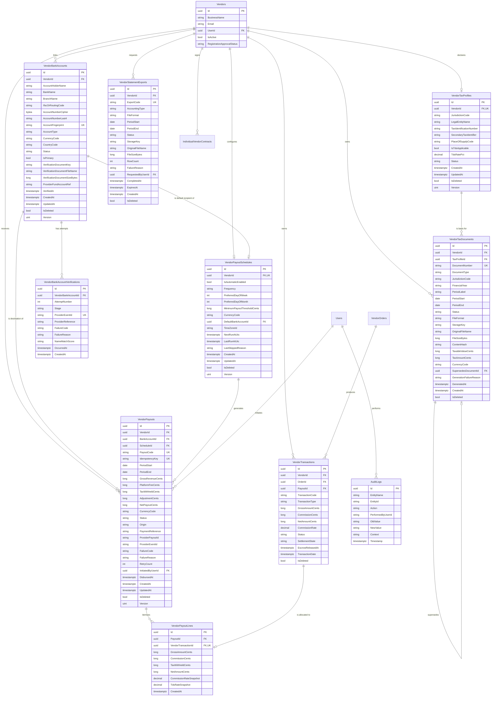
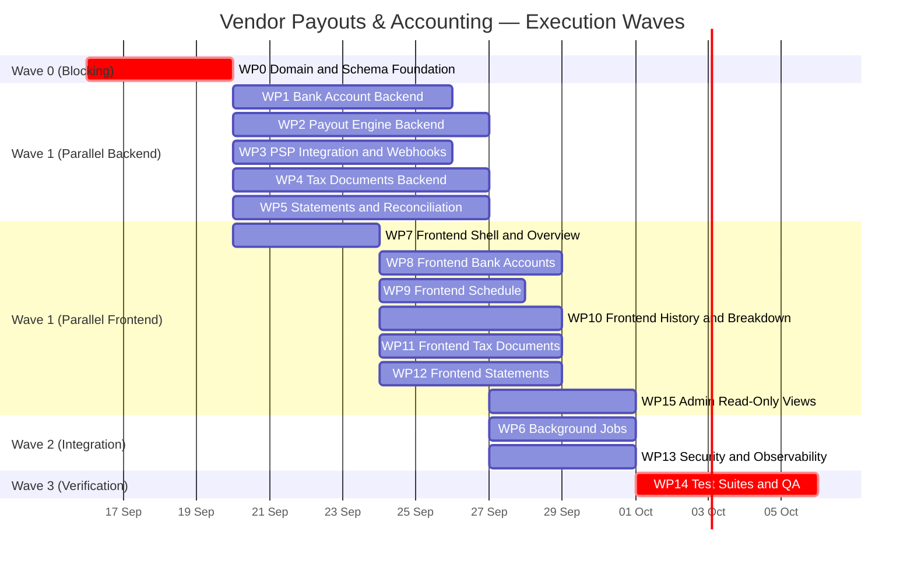

# Vendor Payouts & Accounting Workflow — Tactical Plan

**Feature:** Vendor Payout & Accounting Center (Financials)
**Version:** 1.0
**Date:** 2026-09-15
**Author:** Senior Solution Architect
**Status:** APPROVED FOR IMPLEMENTATION
**Companion Documents:** `STRATEGY-Vendor-Payouts-Accounting.md`, `ADR-021-Vendor-Payouts-Accounting-Architecture.md`, `AGENTIC-PROMPTS-Vendor-Payouts-Accounting.md`

---

## Table of Contents

1. [Entity Relationship Diagram](#1-entity-relationship-diagram)
2. [Database Schema Details](#2-database-schema-details)
3. [High-Level Design (Component Diagram)](#3-high-level-design-component-diagram)
4. [API Endpoint Specification](#4-api-endpoint-specification)
5. [Frontend Design](#5-frontend-design)
6. [Validation Rules](#6-validation-rules)
7. [Security Controls](#7-security-controls)
8. [Background Jobs](#8-background-jobs)
9. [Testing Strategy](#9-testing-strategy)
10. [Work Package Breakdown & Sequencing](#10-work-package-breakdown--sequencing)
11. [Rollout & Migration Plan](#11-rollout--migration-plan)

---

## 1. Entity Relationship Diagram



---

## 2. Database Schema Details

> **Conventions.** All tables inherit `BaseEntity` (`Id uuid PK`, `CreatedAt timestamptz NOT NULL`, `UpdatedAt timestamptz NULL`, `IsDeleted boolean NOT NULL DEFAULT false`, `DeletedAt timestamptz NULL`) and carry a global query filter `WHERE NOT "IsDeleted"`, matching the existing `Vendor`/`VendorListing` pattern in `HomeCareDbContext`. Money columns are `bigint` minor units. `Version` maps to the PostgreSQL `xmin` system column as an EF Core concurrency token (same technique as `VendorOrder.Version`).

### 2.1 `VendorBankAccounts` — **NEW**

| Column | Type | Null | Default | Notes |
|---|---|---|---|---|
| `Id` | `uuid` | NO | — | PK |
| `VendorId` | `uuid` | NO | — | FK → `Vendors(Id)` `ON DELETE RESTRICT` |
| `AccountHolderName` | `varchar(200)` | NO | — | Legal registered name |
| `BankName` | `varchar(200)` | NO | — | Auto-detected, vendor-editable |
| `BranchName` | `varchar(200)` | YES | — | From directory lookup |
| `IfscOrRoutingCode` | `varchar(34)` | NO | — | IFSC (11 chars), ABA (9), SWIFT/BIC (8–11) |
| `AccountNumberCipher` | `bytea` | NO | — | **AES-256-GCM** ciphertext (nonce ‖ tag ‖ payload) |
| `AccountNumberLast4` | `varchar(4)` | NO | — | Display only |
| `AccountFingerprint` | `varchar(64)` | NO | — | HMAC-SHA256(accountNo ‖ ifsc) — duplicate detection without decryption |
| `AccountType` | `varchar(20)` | NO | `'Current'` | `Current`, `Savings` |
| `CurrencyCode` | `char(3)` | NO | `'INR'` | ISO 4217 |
| `CountryCode` | `char(2)` | NO | `'IN'` | ISO 3166-1 alpha-2 |
| `Status` | `varchar(24)` | NO | `'PendingVerification'` | `PendingVerification`, `Processing`, `Verified`, `Failed` |
| `IsPrimary` | `boolean` | NO | `false` | Max one `true` per vendor |
| `VerificationDocumentKey` | `varchar(512)` | YES | — | S3/MinIO object key (private bucket) |
| `VerificationDocumentFileName` | `varchar(255)` | YES | — | Original upload name |
| `VerificationDocumentSizeBytes` | `bigint` | YES | — | ≤ 5 242 880 |
| `ProviderFundAccountRef` | `varchar(128)` | YES | — | PSP fund-account handle |
| `VerifiedAt` | `timestamptz` | YES | — | Set on `Verified` |
| `Version` | `uint` (xmin) | NO | — | Concurrency token |

**Indexes & Constraints**

```sql
CREATE UNIQUE INDEX "UX_VendorBankAccounts_Vendor_Fingerprint"
    ON "VendorBankAccounts" ("VendorId", "AccountFingerprint")
    WHERE NOT "IsDeleted";

CREATE UNIQUE INDEX "UX_VendorBankAccounts_Vendor_Primary"
    ON "VendorBankAccounts" ("VendorId")
    WHERE "IsPrimary" AND NOT "IsDeleted";          -- enforces FR-02.7

CREATE INDEX "IX_VendorBankAccounts_Vendor_Status"
    ON "VendorBankAccounts" ("VendorId", "Status")
    WHERE NOT "IsDeleted";

ALTER TABLE "VendorBankAccounts"
    ADD CONSTRAINT "CK_VendorBankAccounts_Status"
    CHECK ("Status" IN ('PendingVerification','Processing','Verified','Failed')),
    ADD CONSTRAINT "CK_VendorBankAccounts_PrimaryRequiresVerified"
    CHECK (NOT "IsPrimary" OR "Status" = 'Verified'),
    ADD CONSTRAINT "CK_VendorBankAccounts_DocSize"
    CHECK ("VerificationDocumentSizeBytes" IS NULL
           OR "VerificationDocumentSizeBytes" <= 5242880);
```

> **Architectural Decision.** The partial unique index `UX_VendorBankAccounts_Vendor_Primary` moves the "exactly one primary" invariant into the database rather than application code. Application-level enforcement is racy under concurrent `Set Primary` calls from two vendor users; a partial unique index makes the race impossible and costs nothing at read time. `CK_..._PrimaryRequiresVerified` similarly guarantees that a payout can never be routed to an unverified instrument even if a service-layer bug slips through.

### 2.2 `VendorBankAccountVerifications` — **NEW (append-only)**

| Column | Type | Null | Notes |
|---|---|---|---|
| `Id` | `uuid` | NO | PK |
| `VendorBankAccountId` | `uuid` | NO | FK → `VendorBankAccounts(Id)` `ON DELETE CASCADE` |
| `AttemptNumber` | `int` | NO | 1-based; max 3 per rolling 24 h |
| `Stage` | `varchar(24)` | NO | `Submitted`, `Processing`, `Verified`, `Failed` |
| `ProviderEventId` | `varchar(128)` | YES | PSP event id — webhook idempotency guard |
| `ProviderReference` | `varchar(128)` | YES | PSP validation/transaction id |
| `FailureCode` | `varchar(64)` | YES | e.g. `NAME_MISMATCH`, `ACCOUNT_CLOSED` |
| `FailureReason` | `varchar(500)` | YES | Vendor-safe message (no PII) |
| `NameMatchScore` | `varchar(16)` | YES | PSP fuzzy-match verdict |
| `OccurredAt` | `timestamptz` | NO | PSP-reported event time |

```sql
CREATE UNIQUE INDEX "UX_VendorBankAccountVerifications_ProviderEventId"
    ON "VendorBankAccountVerifications" ("ProviderEventId")
    WHERE "ProviderEventId" IS NOT NULL;            -- NFR-05 webhook idempotency

CREATE INDEX "IX_VendorBankAccountVerifications_Account_OccurredAt"
    ON "VendorBankAccountVerifications" ("VendorBankAccountId", "OccurredAt" DESC);
```

> **Architectural Decision.** Verification history is modelled as an append-only child collection rather than mutable columns on the parent. The UI must render a **timeline** (FR-02.4), regulators require evidence of *when* each verification stage occurred, and PSP webhooks arrive out of order. An event log satisfies all three; the parent's `Status` is a denormalised projection of the latest terminal event, kept for cheap filtering.

### 2.3 `VendorPayoutSchedules` — **NEW**

| Column | Type | Null | Default | Notes |
|---|---|---|---|---|
| `Id` | `uuid` | NO | — | PK |
| `VendorId` | `uuid` | NO | — | FK → `Vendors(Id)`, **unique** (one schedule per vendor) |
| `IsAutomaticEnabled` | `boolean` | NO | `true` | FR-03.1 |
| `Frequency` | `varchar(16)` | NO | `'Weekly'` | `Weekly`, `BiWeekly`, `Monthly` |
| `PreferredDayOfWeek` | `smallint` | YES | `1` | 1=Mon … 7=Sun (ISO-8601); required for Weekly/BiWeekly |
| `PreferredDayOfMonth` | `smallint` | YES | — | 1–28, or `99` = last day; required for Monthly |
| `MinimumPayoutThresholdCents` | `bigint` | NO | `50000` | FR-03.4; ≥ 0 |
| `CurrencyCode` | `char(3)` | NO | `'INR'` | |
| `DefaultBankAccountId` | `uuid` | YES | — | FK → `VendorBankAccounts(Id)` `ON DELETE SET NULL` |
| `TimeZoneId` | `varchar(64)` | NO | `'Asia/Kolkata'` | IANA id — cadence computed in vendor-local time |
| `NextRunAtUtc` | `timestamptz` | YES | — | Scanner predicate |
| `LastRunAtUtc` | `timestamptz` | YES | — | |
| `LastSkippedReason` | `varchar(64)` | YES | — | `BelowThreshold`, `NoVerifiedAccount`, `PayoutInFlight` |
| `Version` | `uint` (xmin) | NO | — | |

```sql
CREATE UNIQUE INDEX "UX_VendorPayoutSchedules_VendorId"
    ON "VendorPayoutSchedules" ("VendorId") WHERE NOT "IsDeleted";

CREATE INDEX "IX_VendorPayoutSchedules_DueRuns"
    ON "VendorPayoutSchedules" ("NextRunAtUtc")
    WHERE "IsAutomaticEnabled" AND NOT "IsDeleted";   -- scanner hot path

ALTER TABLE "VendorPayoutSchedules"
    ADD CONSTRAINT "CK_VendorPayoutSchedules_Frequency"
    CHECK ("Frequency" IN ('Weekly','BiWeekly','Monthly')),
    ADD CONSTRAINT "CK_VendorPayoutSchedules_DayCoherence"
    CHECK (
        ("Frequency" IN ('Weekly','BiWeekly')
            AND "PreferredDayOfWeek" BETWEEN 1 AND 7)
        OR ("Frequency" = 'Monthly'
            AND ("PreferredDayOfMonth" BETWEEN 1 AND 28 OR "PreferredDayOfMonth" = 99))
    ),
    ADD CONSTRAINT "CK_VendorPayoutSchedules_Threshold"
    CHECK ("MinimumPayoutThresholdCents" >= 0);
```

> **Architectural Decision.** `PreferredDayOfMonth` is capped at 28 (with a `99` sentinel for "last day") instead of allowing 29–31. A vendor selecting "the 30th" creates undefined behaviour in February; capping at 28 plus an explicit last-day sentinel removes an entire class of calendar bugs while covering every practical cadence. `NextRunAtUtc` is materialised rather than computed per scan so the scanner uses a covering partial index instead of evaluating cadence arithmetic across every vendor row.

### 2.4 `VendorPayouts` — **EXTEND EXISTING**

Additive columns only; all existing columns and the current API contract are preserved.

| New Column | Type | Null | Default | Notes |
|---|---|---|---|---|
| `BankAccountId` | `uuid` | YES | — | FK → `VendorBankAccounts(Id)` `ON DELETE RESTRICT` |
| `ScheduleId` | `uuid` | YES | — | FK → `VendorPayoutSchedules(Id)` `ON DELETE SET NULL`; `NULL` for instant payouts |
| `IdempotencyKey` | `varchar(80)` | NO | back-filled | Unique; PSP-safe request key |
| `TaxWithheldCents` | `bigint` | NO | `0` | TDS/withholding |
| `AdjustmentCents` | `bigint` | NO | `0` | Refunds/chargebacks (signed) |
| `CurrencyCode` | `char(3)` | NO | `'INR'` | |
| `Origin` | `varchar(16)` | NO | `'Scheduled'` | `Scheduled`, `Instant`, `AdminManual` |
| `ProviderPayoutId` | `varchar(128)` | YES | — | PSP payout id |
| `ProviderEventId` | `varchar(128)` | YES | — | Settlement webhook idempotency |
| `FailureCode` | `varchar(64)` | YES | — | e.g. `ERR-INSUFFICIENT-FUNDS` |
| `FailureReason` | `varchar(500)` | YES | — | Vendor-safe text |
| `RetryCount` | `int` | NO | `0` | |
| `InitiatedByUserId` | `uuid` | YES | — | FK → `Users(Id)`; `NULL` when system-scheduled |
| `Version` | `uint` (xmin) | NO | — | Concurrency token |

Existing `PaymentReference` is repurposed as the **bank transfer reference (UTR / ACH trace id)** — FR-04.7 — and is set only on transition to `Completed`.

```sql
CREATE UNIQUE INDEX "UX_VendorPayouts_IdempotencyKey"
    ON "VendorPayouts" ("IdempotencyKey");

CREATE UNIQUE INDEX "UX_VendorPayouts_ProviderEventId"
    ON "VendorPayouts" ("ProviderEventId") WHERE "ProviderEventId" IS NOT NULL;

CREATE INDEX "IX_VendorPayouts_Vendor_Status_Created"
    ON "VendorPayouts" ("VendorId", "Status", "CreatedAt" DESC)
    WHERE NOT "IsDeleted";                           -- history grid + filters

CREATE INDEX "IX_VendorPayouts_Dispatchable"
    ON "VendorPayouts" ("Status", "CreatedAt")
    WHERE "Status" IN ('Queued','Processing') AND NOT "IsDeleted";

ALTER TABLE "VendorPayouts"
    ADD CONSTRAINT "CK_VendorPayouts_Status"
    CHECK ("Status" IN ('Queued','Processing','Completed','Failed','OnHold','Cancelled')),
    ADD CONSTRAINT "CK_VendorPayouts_LedgerInvariant"
    CHECK ("NetPayoutCents" =
           "GrossRevenueCents" - "PlatformFeeCents" - "TaxWithheldCents" + "AdjustmentCents"),
    ADD CONSTRAINT "CK_VendorPayouts_NonNegative"
    CHECK ("GrossRevenueCents" >= 0 AND "PlatformFeeCents" >= 0
           AND "TaxWithheldCents" >= 0 AND "NetPayoutCents" >= 0),
    ADD CONSTRAINT "CK_VendorPayouts_CompletedHasReference"
    CHECK ("Status" <> 'Completed' OR "PaymentReference" IS NOT NULL);
```

> **Architectural Decision.** `CK_VendorPayouts_LedgerInvariant` encodes the settlement equation as a database constraint. This is the single most valuable control in the schema: it makes any rounding bug, partial update, or hand-edited row fail loudly at write time rather than silently mis-paying a vendor and surfacing months later during a statutory audit. `CK_..._CompletedHasReference` guarantees FR-04.7 — a payout can never claim `Completed` without a bank reference.

### 2.5 `VendorPayoutLines` — **NEW**

| Column | Type | Null | Notes |
|---|---|---|---|
| `Id` | `uuid` | NO | PK |
| `PayoutId` | `uuid` | NO | FK → `VendorPayouts(Id)` `ON DELETE CASCADE` |
| `VendorTransactionId` | `uuid` | NO | FK → `VendorTransactions(Id)` `ON DELETE RESTRICT`, **unique** |
| `GrossAmountCents` | `bigint` | NO | Snapshot |
| `CommissionCents` | `bigint` | NO | Snapshot |
| `TaxWithheldCents` | `bigint` | NO | Snapshot |
| `NetAmountCents` | `bigint` | NO | Snapshot |
| `CommissionRateSnapshot` | `numeric(6,4)` | NO | Contract rate at allocation time |
| `TdsRateSnapshot` | `numeric(6,4)` | NO | Withholding rate at allocation time |

```sql
CREATE UNIQUE INDEX "UX_VendorPayoutLines_Transaction"
    ON "VendorPayoutLines" ("VendorTransactionId");   -- a txn settles exactly once

CREATE INDEX "IX_VendorPayoutLines_Payout"
    ON "VendorPayoutLines" ("PayoutId");
```

> **Architectural Decision.** The unique index on `VendorTransactionId` is the double-payment guard at the *line* level: even if two payout runs race past the advisory lock, the second insert violates the unique constraint and the whole transaction rolls back. Rates are **snapshotted** rather than joined to `IndividualVendorContract` because a contract renewal (which changes `CommissionPct`) must never retroactively alter an already-settled payout's arithmetic (Risk R-08).

### 2.6 `VendorTransactions` — **EXTEND EXISTING**

| New Column | Type | Null | Default | Notes |
|---|---|---|---|---|
| `PayoutId` | `uuid` | YES | — | FK → `VendorPayouts(Id)` `ON DELETE SET NULL`; `NULL` = unsettled |
| `SettlementState` | `varchar(20)` | NO | `'Escrow'` | `Escrow`, `Available`, `Allocated`, `Settled`, `Reversed` |
| `EscrowReleasedAt` | `timestamptz` | YES | — | Set when the order reaches fulfilment-complete |
| `TaxWithheldCents` | `bigint` | NO | `0` | |
| `CurrencyCode` | `char(3)` | NO | `'INR'` | |

```sql
CREATE INDEX "IX_VendorTransactions_Vendor_Settlement"
    ON "VendorTransactions" ("VendorId", "SettlementState", "TransactionDate")
    WHERE NOT "IsDeleted";                            -- balance computation hot path

CREATE INDEX "IX_VendorTransactions_Payout"
    ON "VendorTransactions" ("PayoutId") WHERE "PayoutId" IS NOT NULL;
```

> **Architectural Decision.** `SettlementState` is introduced as a first-class column rather than derived at query time from order fulfilment status. Deriving it would force every balance computation to join `VendorOrders` → `PurchaseShipments`/`RentalContracts`, which is exactly the kind of wide join that destroys p95 latency (NFR-02) at scale. A denormalised, indexed state column driven by domain events keeps the balance query to a single-table indexed aggregate.

### 2.7 `VendorTaxProfiles` — **NEW**

| Column | Type | Null | Default | Notes |
|---|---|---|---|---|
| `Id` | `uuid` | NO | — | PK |
| `VendorId` | `uuid` | NO | — | FK → `Vendors(Id)`, **unique** |
| `JurisdictionCode` | `char(2)` | NO | `'IN'` | Drives generator strategy selection |
| `LegalEntityName` | `varchar(200)` | NO | — | |
| `TaxIdentificationNumber` | `varchar(32)` | NO | — | GSTIN (IN) / EIN (US) / VAT (EU) |
| `SecondaryTaxIdentifier` | `varchar(32)` | YES | — | PAN (IN) |
| `PlaceOfSupplyCode` | `varchar(8)` | YES | — | State code for CGST/SGST vs IGST split |
| `IsTdsApplicable` | `boolean` | NO | `true` | |
| `TdsRatePct` | `numeric(5,2)` | NO | `1.00` | Sec 194-O default |
| `Status` | `varchar(20)` | NO | `'Draft'` | `Draft`, `Complete`, `VerificationPending` |
| `Version` | `uint` (xmin) | NO | — | |

```sql
CREATE UNIQUE INDEX "UX_VendorTaxProfiles_VendorId"
    ON "VendorTaxProfiles" ("VendorId") WHERE NOT "IsDeleted";

ALTER TABLE "VendorTaxProfiles"
    ADD CONSTRAINT "CK_VendorTaxProfiles_TdsRate"
    CHECK ("TdsRatePct" >= 0 AND "TdsRatePct" <= 100);
```

> **Architectural Decision.** Tax identifiers are stored in generic columns (`TaxIdentificationNumber`, `SecondaryTaxIdentifier`) keyed by `JurisdictionCode` rather than as `GSTIN`/`PAN` columns. Constraint C-13 requires extending to US 1099-K and EU VAT without a migration; jurisdiction-specific *format* validation lives in FluentValidation rules selected by `JurisdictionCode`, not in the schema.

### 2.8 `VendorTaxDocuments` — **NEW (immutable)**

| Column | Type | Null | Notes |
|---|---|---|---|
| `Id` | `uuid` | NO | PK |
| `VendorId` | `uuid` | NO | FK → `Vendors(Id)` |
| `TaxProfileId` | `uuid` | NO | FK → `VendorTaxProfiles(Id)` |
| `DocumentNumber` | `varchar(64)` | NO | Unique, human-readable (e.g. `GST-INV-2026-000184`) |
| `DocumentType` | `varchar(40)` | NO | `GstPlatformFeeInvoice`, `TdsCertificate`, `WithholdingSummary`, `TaxReconciliationSummary` |
| `JurisdictionCode` | `char(2)` | NO | |
| `FinancialYear` | `varchar(10)` | NO | e.g. `2026-27` |
| `PeriodLabel` | `varchar(40)` | NO | e.g. `Q2 FY 2026-27`, `July 2026` |
| `PeriodStart` / `PeriodEnd` | `date` | NO | |
| `Status` | `varchar(20)` | NO | `Generating`, `Available`, `GenerationFailed`, `Superseded` |
| `FileFormat` | `varchar(8)` | NO | `PDF`, `XLSX`, `CSV` |
| `StorageKey` | `varchar(512)` | YES | Private bucket object key |
| `OriginalFileName` | `varchar(255)` | YES | |
| `FileSizeBytes` | `bigint` | YES | |
| `ContentHash` | `char(64)` | YES | SHA-256 hex |
| `TaxableValueCents` / `TaxAmountCents` | `bigint` | NO | Summary figures for list rendering |
| `CurrencyCode` | `char(3)` | NO | |
| `SupersedesDocumentId` | `uuid` | YES | Self-FK for revisions |
| `GenerationFailureReason` | `varchar(500)` | YES | |
| `GeneratedAt` | `timestamptz` | YES | |

```sql
CREATE UNIQUE INDEX "UX_VendorTaxDocuments_DocumentNumber"
    ON "VendorTaxDocuments" ("DocumentNumber");

CREATE UNIQUE INDEX "UX_VendorTaxDocuments_Vendor_Type_Period"
    ON "VendorTaxDocuments" ("VendorId", "DocumentType", "PeriodStart", "PeriodEnd")
    WHERE "Status" IN ('Generating','Available') AND NOT "IsDeleted";

CREATE INDEX "IX_VendorTaxDocuments_Vendor_FY_Type"
    ON "VendorTaxDocuments" ("VendorId", "FinancialYear", "DocumentType")
    WHERE NOT "IsDeleted";

ALTER TABLE "VendorTaxDocuments"
    ADD CONSTRAINT "CK_VendorTaxDocuments_Status"
    CHECK ("Status" IN ('Generating','Available','GenerationFailed','Superseded')),
    ADD CONSTRAINT "CK_VendorTaxDocuments_AvailableHasArtefact"
    CHECK ("Status" <> 'Available'
           OR ("StorageKey" IS NOT NULL AND "ContentHash" IS NOT NULL));
```

> **Architectural Decision.** `UX_VendorTaxDocuments_Vendor_Type_Period` makes generation naturally idempotent (FR-05.5 can be pressed repeatedly without producing duplicates), while excluding `Superseded` rows so a legitimate revision can be issued for the same period. `ContentHash` mirrors the legal-defensibility pattern already established by `VendorContractAcceptance` in ADR 011 — a downloaded PDF can be proven byte-identical to what the platform issued.

### 2.9 `VendorStatementExports` — **NEW**

| Column | Type | Null | Default | Notes |
|---|---|---|---|---|
| `Id` | `uuid` | NO | — | PK |
| `VendorId` | `uuid` | NO | — | FK → `Vendors(Id)` |
| `ExportCode` | `varchar(40)` | NO | — | Unique |
| `AccountingType` | `varchar(24)` | NO | — | `PayoutStatements`, `FeeInvoices`, `AccountingLedger` |
| `FileFormat` | `varchar(8)` | NO | — | `PDF`, `CSV`, `XML` |
| `PeriodStart` / `PeriodEnd` | `date` | NO | — | |
| `Status` | `varchar(16)` | NO | `'Queued'` | `Queued`, `Building`, `Ready`, `Failed`, `Expired` |
| `StorageKey` | `varchar(512)` | YES | — | |
| `OriginalFileName` | `varchar(255)` | YES | — | e.g. `Oct_2026_Payout_Statement.csv` |
| `FileSizeBytes` | `bigint` | YES | — | |
| `RowCount` | `int` | YES | — | |
| `FailureReason` | `varchar(500)` | YES | — | |
| `RequestedByUserId` | `uuid` | YES | — | FK → `Users(Id)` |
| `CompletedAt` | `timestamptz` | YES | — | |
| `ExpiresAt` | `timestamptz` | NO | `now() + 7d` | NFR-18; drives purge job |

```sql
CREATE UNIQUE INDEX "UX_VendorStatementExports_ExportCode"
    ON "VendorStatementExports" ("ExportCode");

CREATE INDEX "IX_VendorStatementExports_Vendor_Created"
    ON "VendorStatementExports" ("VendorId", "CreatedAt" DESC)
    WHERE NOT "IsDeleted";                            -- Recent Downloads rail

CREATE INDEX "IX_VendorStatementExports_Purge"
    ON "VendorStatementExports" ("ExpiresAt")
    WHERE "Status" = 'Ready';

ALTER TABLE "VendorStatementExports"
    ADD CONSTRAINT "CK_VendorStatementExports_Period"
    CHECK ("PeriodEnd" >= "PeriodStart");
```

### 2.10 Migration Plan

Two additive EF Core migrations, applied in order. The project auto-migrates in Development/Docker (`dbContext.Database.Migrate()` in `Program.cs`); production uses explicit scripts.

| # | Migration Name | Contents |
|---|---|---|
| 1 | `AddVendorPayoutAccountingCore` | Create `VendorBankAccounts`, `VendorBankAccountVerifications`, `VendorPayoutSchedules`, `VendorPayoutLines`; alter `VendorPayouts` (+13 cols, indexes, CHECKs); alter `VendorTransactions` (+5 cols, indexes) |
| 2 | `AddVendorTaxAndStatementArtefacts` | Create `VendorTaxProfiles`, `VendorTaxDocuments`, `VendorStatementExports` with indexes and CHECKs |

**Back-fill script (runs inside migration 1, before constraints are enabled):**

```sql
-- 1. Idempotency keys for pre-existing payouts
UPDATE "VendorPayouts"
   SET "IdempotencyKey" = 'legacy-' || "Id"::text
 WHERE "IdempotencyKey" IS NULL;

-- 2. Reconcile the ledger invariant on legacy rows before the CHECK is added
UPDATE "VendorPayouts"
   SET "AdjustmentCents" = "NetPayoutCents"
                         - ("GrossRevenueCents" - "PlatformFeeCents" - "TaxWithheldCents")
 WHERE "NetPayoutCents" <>
       ("GrossRevenueCents" - "PlatformFeeCents" - "TaxWithheldCents" + "AdjustmentCents");

-- 3. Legacy transactions are treated as already settled to avoid re-paying history
UPDATE "VendorTransactions"
   SET "SettlementState" = 'Settled'
 WHERE "Status" = 'Completed' AND "PayoutId" IS NULL;

-- 4. Seed a disabled default schedule so the UI always has a row to render
INSERT INTO "VendorPayoutSchedules"
    ("Id","VendorId","IsAutomaticEnabled","Frequency","PreferredDayOfWeek",
     "MinimumPayoutThresholdCents","CurrencyCode","TimeZoneId","CreatedAt","IsDeleted")
SELECT gen_random_uuid(), v."Id", false, 'Weekly', 1, 50000, 'INR', 'Asia/Kolkata', now(), false
  FROM "Vendors" v
 WHERE NOT v."IsDeleted"
   AND NOT EXISTS (SELECT 1 FROM "VendorPayoutSchedules" s WHERE s."VendorId" = v."Id");
```

> **Architectural Decision.** Step 3 deliberately marks all historical completed transactions as `Settled` rather than `Available`. Marking them `Available` would make the first scheduled run after deployment attempt to disburse the vendor's entire historical revenue — a catastrophic, irreversible financial event. Defaulting to `Settled` is the fail-safe direction; genuinely unpaid historical balances are reconciled by Finance Ops through an explicit, audited admin adjustment.

---

## 3. High-Level Design (Component Diagram)

```mermaid
graph TB
    subgraph Browser["Browser - Next.js 15 App Router"]
        direction TB
        LAY["app/(protected)/vendor/payouts/layout.tsx<br/><i>RSC - Center shell + tab nav</i>"]
        V0["page.tsx<br/><i>Overview - RSC</i>"]
        V1["bank-accounts/page.tsx<br/><i>RSC shell + client form</i>"]
        V2["schedule/page.tsx"]
        V3["history/page.tsx"]
        V4["tax-documents/page.tsx"]
        V5["statements/page.tsx"]

        subgraph Comp["components/vendor/payouts/**"]
            CB["BalanceSummaryBand"]
            CC["BankAccountForm ('use client')"]
            CD["VerificationTimeline ('use client')"]
            CE["LinkedAccountsTable"]
            CF["ScheduleRulesForm ('use client')"]
            CG["NextPayoutCard"]
            CH["DisbursementHistoryTable"]
            CI["PayoutBreakdownDrawer ('use client')"]
            CJ["UpcomingDisbursementsRail"]
            CK["TaxRecordsList"]
            CL["GenerateStatementPanel ('use client')"]
            CM["ExportLedgerForm ('use client')"]
            CN["ReconciliationCard"]
            CO["RecentDownloadsRail"]
        end
    end

    subgraph BFF["Next.js BFF - app/bff/vendor/**"]
        B1["bank-accounts/route.ts<br/>+ [id]/route.ts<br/>+ [id]/verification/route.ts<br/>+ [id]/set-primary/route.ts"]
        B2["payouts/schedule/route.ts"]
        B3["payouts/route.ts, summary, balance,<br/>[id]/breakdown, upcoming, disburse"]
        B4["tax/profile, tax/documents,<br/>tax/documents/[id]/download"]
        B5["statements/export, statements/exports,<br/>statements/reconciliation"]
    end

    subgraph API["HomeCare.API - Controllers"]
        A1["VendorBankAccountController"]
        A2["VendorFinanceController (extended)"]
        A3["VendorTaxController"]
        A4["VendorStatementController"]
        A5["PayoutWebhookController<br/><i>AllowAnonymous + HMAC filter</i>"]
    end

    subgraph APP["HomeCare.Application"]
        P["MediatR Pipeline<br/>ValidationBehavior -> LoggingBehavior -> Handler"]
        SC1["PayoutCalculationService"]
        SC2["PayoutScheduleCalculator"]
        SC3["PayoutEligibilityPolicy"]
        SC4["TaxDocumentGeneratorFactory"]
        SC5["StatementFormatWriterFactory"]
        SC6["ReconciliationService"]
    end

    subgraph INFRA["HomeCare.Infrastructure"]
        RP["Repositories<br/>BankAccount | Schedule | Finance | Tax | Statement"]
        GW["IPayoutGatewayService<br/>RazorpayX | PayU | Sandbox<br/><i>via IPayoutGatewayFactory</i>"]
        EN["AesGcmFieldEncryptionService"]
        BD["CachedBankDirectoryService"]
        OS["S3ObjectStorageService"]
        PR["QuestPdfRenderingService"]
        AU["AuditLogService"]
        EM["ResendEmailSendingService"]
        HF["Hangfire Jobs<br/>Scanner | Dispatch | PennyDrop |<br/>TaxDoc | Export | Purge"]
    end

    DB[("PostgreSQL")]
    S3[("S3 / MinIO")]
    RD[("Redis")]
    EXT["PSP / Bank Directory / Resend"]

    LAY --> V0 & V1 & V2 & V3 & V4 & V5
    V0 --> CB & CG & CJ
    V1 --> CC & CD & CE
    V2 --> CF & CG
    V3 --> CH & CI & CJ
    V4 --> CK & CL
    V5 --> CM & CN & CO

    V0 -.->|"RSC server fetch"| A2
    CC --> B1
    CD --> B1
    CE --> B1
    CF --> B2
    CH --> B3
    CI --> B3
    CL --> B4
    CK --> B4
    CM --> B5
    CN --> B5
    CO --> B5

    B1 --> A1
    B2 --> A2
    B3 --> A2
    B4 --> A3
    B5 --> A4

    A1 & A2 & A3 & A4 & A5 --> P
    P --> SC1 & SC2 & SC3 & SC4 & SC5 & SC6
    SC1 & SC2 & SC3 & SC4 & SC5 & SC6 --> RP
    P --> AU

    RP --> DB
    GW --> EXT
    BD --> RD
    BD --> EXT
    OS --> S3
    PR --> OS
    EM --> EXT
    HF --> SC1 & SC2 & SC4 & SC5
    HF --> GW
    HF --> OS
    EXT -.->|"signed webhook"| A5
    EN -.-> RP
```



### 3.1 Design Patterns Applied

| Pattern | Applied To | Rationale |
|---|---|---|
| **Repository + Unit of Work** | All five new repositories | Consistent with the existing codebase; keeps EF Core out of the Application layer and enables handler unit tests with mocked `I*Repository` |
| **CQRS (MediatR)** | Every command/query | Matches the existing `VendorFinance.Commands` / `.Queries` structure; gives cross-cutting validation and logging via pipeline behaviours for free |
| **Factory** | Both factories above; `IPayoutGatewayFactory` (Razorpay / PayU / Sandbox by configuration) | Selection logic is centralised and testable; non-production environments never reach a real provider. `IPayoutGatewayFactory` **mirrors the existing `PaymentServiceFactory`** — same `IServiceProvider.GetRequiredService<T>()` switch, same `PaymentProviderType` enum — so there is one provider taxonomy across pay-in and pay-out |
| **Adapter (Ports & Adapters)** | `IPayoutGatewayService`, `IBankDirectoryService`, `IFieldEncryptionService` | Isolates the provider contract so switching or adding a rail is an Infrastructure-only change (C-14). A **separate port from the existing `IPaymentService`** because that interface is pay-in only (`ProcessPayment`/`HandleWebhook`/`RefundPayment`) and Razorpay Payments ≠ RazorpayX Payouts — see ADR 021 D-02 |
| **Policy Object** | `PayoutEligibilityPolicy` | Concentrates the FR-01.5 / FR-03.4 gating rules in one unit-testable place, used identically by the instant-payout handler and the scheduler job |
| **State Machine** | `PayoutStateMachine` (mirrors existing `FulfillmentStateMachine`) | Illegal transitions (`Completed` → `Queued`) are rejected centrally rather than re-checked in every handler |
| **Outbox-lite / Job Queue** | Hangfire fire-and-forget + recurring | Long-running work leaves the request thread, satisfying NFR-03 without introducing a message broker |

---

## 4. API Endpoint Specification

**Global conventions**

- Base: `/api/v{version:apiVersion}` (`v1`), `[Authorize(Policy = "VendorPolicy")]` unless noted.
- `vendorId` resolved **exclusively** via `IVendorIdentityResolver` from JWT (ADR 016, NFR-11). Never accepted from the client.
- Errors: RFC 7807 `ProblemDetails`. Cross-tenant access → `404`.
- Money in responses: `{ "amountMinor": 1425000, "currency": "INR" }` shape or flat `…Cents` + `currencyCode`.
- Mutating endpoints require `Idempotency-Key` header where noted; reads support `page`/`pageSize`.

### 4.1 Bank Accounts — `VendorBankAccountController` (`api/v1/vendor/bank-accounts`) — **NEW**

| # | Method & Route | Purpose | Request | Success | Errors |
|---|---|---|---|---|---|
| 1 | `GET /` | List linked accounts (masked) | `?status=` | `200 PagedResult<VendorBankAccountDto>` | 401, 403 |
| 2 | `GET /{id:guid}` | Single account detail | — | `200 VendorBankAccountDto` | 404 |
| 3 | `POST /` | Link account + upload verification doc | `multipart/form-data`: `accountHolderName`, `bankName`, `branchName?`, `ifscOrRoutingCode`, `accountNumber`, `accountType`, `currencyCode`, `verificationDocument` (file) | `201 Created` + `Location`, `VendorBankAccountDto` | 400 validation, 409 duplicate, 413 too large, 415 bad type, 429 |
| 4 | `PUT /{id:guid}` | Correct a `Failed`/`PendingVerification` account | `UpdateBankAccountRequest` + `If-Match` | `200 VendorBankAccountDto` | 400, 404, 409 concurrency, 422 (verified accounts are immutable) |
| 5 | `DELETE /{id:guid}` | Soft-delete account | — | `204 No Content` | 404, 409 (referenced by in-flight payout) |
| 6 | `POST /{id:guid}/set-primary` | Promote to primary | — | `200 VendorBankAccountDto` | 404, 422 (not `Verified`) |
| 7 | `POST /{id:guid}/reverify` | Retry penny-drop | — | `202 Accepted` | 404, 422 (already verified), 429 (>3 per 24 h) |
| 8 | `GET /{id:guid}/verification` | Verification timeline | — | `200 VerificationTimelineDto` | 404 |
| 9 | `GET /{id:guid}/verification-document` | Stream uploaded proof | — | `200 application/pdf\|image/*` | 404, 410 |
| 10 | `GET /bank-lookup?code={ifsc}` | Resolve bank/branch from IFSC/routing | — | `200 BankDirectoryEntryDto` | 404, 429 |

**`VendorBankAccountDto`** — `id`, `accountHolderName`, `bankName`, `branchName`, `ifscOrRoutingCode`, `accountNumberLast4`, `maskedAccountNumber` (`"•••• 9874"`), `accountType`, `currencyCode`, `status`, `isPrimary`, `hasVerificationDocument`, `verifiedAt`, `createdAt`, `rowVersion`. **The full account number is never present in any response.**

### 4.2 Payouts — `VendorFinanceController` (`api/v1/vendor/payouts`) — **EXTENDED**

| # | Method & Route | Purpose | Status |
|---|---|---|---|
| 11 | `GET /` | Payout history, paged + filtered (`status`, `dateFrom`, `dateTo`, `sort`, `page`, `pageSize`) | **Existing — extend DTO** |
| 12 | `GET /summary` | Aggregate tiles: total earned, pending, escrow, last payout, disbursed-this-month, transfer count, next scheduled date/cadence | **Existing — extend DTO** |
| 13 | `GET /{id:guid}` | Payout header detail | **Existing** |
| 14 | `POST /disburse` | Instant payout. Requires `Idempotency-Key`. Body `{ "bankAccountId": "…" }` (optional; defaults to primary) | **Existing — reimplement handler** |
| 15 | `GET /balance` | `{ totalEarnedCents, availableForPayoutCents, inEscrowCents, lastPayoutAmountCents, lastPayoutDate, currencyCode, canInitiateInstantPayout, blockedReason }` | **NEW** |
| 16 | `GET /{id:guid}/breakdown` | Settlement arithmetic + contributing transaction lines | **NEW** |
| 17 | `GET /upcoming` | Projected future disbursements (`?limit=5`) | **NEW** |
| 18 | `GET /export` | Payout history CSV (streamed) | **NEW** |
| 19 | `GET /schedule` | Current payout schedule configuration | **NEW** |
| 20 | `PUT /schedule` | Upsert schedule. `If-Match` for concurrency | **NEW** |
| 21 | `POST /{id:guid}/cancel` | Cancel a `Queued` payout | **NEW** |

**`PayoutBreakdownDto`** — `payoutId`, `payoutCode`, `periodLabel`, `grossRevenueCents`, `platformFeeCents`, `commissionRatePct`, `taxWithheldCents`, `tdsRatePct`, `adjustmentCents`, `netPayoutCents`, `currencyCode`, `status`, `paymentReference` (UTR/ACH), `destinationBankMasked`, `disbursedAt`, `lines[]` (`transactionCode`, `orderNumber`, `transactionType`, `transactionDate`, `grossAmountCents`, `commissionCents`, `taxWithheldCents`, `netAmountCents`).

> **Architectural Decision.** Endpoints 11–14 keep their exact existing routes, verbs, and response shapes; only *additive* fields are introduced. `VendorFinanceApiTests` already asserts these contracts, so extending rather than versioning avoids a breaking change for the live vendor portal while the new capability lands incrementally.

### 4.3 Transactions — `VendorTransactionController` (`api/v1/vendor/transactions`) — **EXTENDED**

| # | Method & Route | Purpose | Status |
|---|---|---|---|
| 22 | `GET /` | Ledger, paged/filtered | **Existing — add `settlementState` filter** |
| 23 | `GET /summary` | Ledger summary | **Existing** |
| 24 | `GET /{id:guid}` | Transaction detail | **Existing** |
| 25 | `GET /export` | Streaming CSV | **Existing** |

### 4.4 Tax — `VendorTaxController` (`api/v1/vendor/tax`) — **NEW**

| # | Method & Route | Purpose | Success | Errors |
|---|---|---|---|---|
| 26 | `GET /profile` | Read tax profile | `200 VendorTaxProfileDto` | 404 (not yet created) |
| 27 | `PUT /profile` | Upsert tax profile (`If-Match`) | `200 VendorTaxProfileDto` | 400, 409, 422 (jurisdiction format) |
| 28 | `GET /documents` | List tax records (`?financialYear=&documentType=&page=&pageSize=`) | `200 PagedResult<VendorTaxDocumentDto>` | 401 |
| 29 | `GET /documents/{id:guid}` | Document metadata | `200 VendorTaxDocumentDto` | 404 |
| 30 | `POST /documents/generate` | Compile & generate. Body `{ documentType, periodStart, periodEnd, fileFormat? }`. Idempotent | `202 Accepted` (new) / `200 OK` (existing) | 422 (incomplete tax profile — field-level), 429 |
| 31 | `GET /documents/{id:guid}/download` | Pre-signed URL (15 min TTL) | `200 { downloadUrl, expiresAt, fileName, contentHash }` | 404, 409 (`Generating`), 410 |
| 32 | `GET /financial-years` | Selectable FY options for the filter | `200 string[]` | — |

### 4.5 Statements & Reconciliation — `VendorStatementController` (`api/v1/vendor/statements`) — **NEW**

| # | Method & Route | Purpose | Success | Errors |
|---|---|---|---|---|
| 33 | `POST /export` | Request export. Body `{ accountingType, fileFormat, periodStart, periodEnd }`. Requires `Idempotency-Key` | `202 Accepted { exportId, status, exportCode }` | 400, 422 (range > 24 months), 429 |
| 34 | `GET /exports` | Recent downloads (`?limit=10`) | `200 VendorStatementExportDto[]` | 401 |
| 35 | `GET /exports/{id:guid}` | Export job status (poll) | `200 VendorStatementExportDto` | 404 |
| 36 | `GET /exports/{id:guid}/download` | Pre-signed URL | `200 { downloadUrl, expiresAt, fileName }` | 404, 409 (`Building`), 410 (`Expired`) |
| 37 | `GET /reconciliation` | `?periodStart=&periodEnd=` → `{ syncedLedgerMatches, unmatchedDiscrepancies, ledgerBalanceMatchRatePct, discrepancies[] }` | `200 ReconciliationSummaryDto` | 400 |
| 38 | `GET /schema/ledger-export.xsd` | Published, versioned XSD for ERP integrators | `200 application/xml` | — |

### 4.6 Webhooks — `PayoutWebhookController` (`api/v1/webhooks/payouts`) — **NEW**

| # | Method & Route | Purpose | Auth | Success |
|---|---|---|---|---|
| 39 | `POST /bank-verification` | Penny-drop outcome | `[AllowAnonymous]` + `PspSignatureFilter` (HMAC-SHA256, ≤5 min skew) | `200 OK` (always, after idempotent processing) |
| 40 | `POST /payout-status` | Settlement outcome: `Completed` + UTR, or `Failed` + code | Same | `200 OK` |

The route carries a `{provider}` discriminator (`/webhooks/payouts/{provider}/payout-status`) so `PspSignatureFilter` can resolve the correct signing secret from `PaymentProviders:{Provider}:Payouts:WebhookSecret` — reusing the existing configuration namespace rather than introducing a new one.

> **Architectural Decision.** Webhook endpoints always answer `200` once the event is durably recorded, even for duplicates or events referencing unknown entities (logged and parked). PSPs treat any non-2xx as a delivery failure and enter aggressive retry storms; acknowledging fast and reconciling asynchronously is the correct posture. Signature verification failures are the sole exception and return `401`.
>
> `PspSignatureFilter` takes the HMAC-SHA256 algorithm from the proven `RazorpayPaymentService.HandleWebhookAsync` implementation but corrects two weaknesses in it: the comparison uses `CryptographicOperations.FixedTimeEquals` instead of `==` on lowercased hex (which leaks timing information), and a `≤ 300 s` timestamp window is enforced (the existing implementation has no replay protection at all). Centralising verification in a filter also means the payload is validated **before** model binding, which the existing inline approach cannot guarantee.

### 4.7 Admin (read-only, Phase 1) — `api/v1/admin/payouts` — **NEW**

| # | Method & Route | Purpose | Policy |
|---|---|---|---|
| 41 | `GET /` | Cross-vendor payout register (filter by vendor, status, date) | `AdminPolicy` |
| 42 | `GET /{id:guid}/breakdown` | Settlement audit view | `AdminPolicy` |
| 43 | `POST /{id:guid}/hold` | Place compliance hold | `AdminPolicy` |
| 44 | `POST /{id:guid}/release` | Release hold | `AdminPolicy` |

---

## 5. Frontend Design

### 5.1 Route & File Structure

```
code/frontend/
├─ app/(protected)/vendor/payouts/
│  ├─ layout.tsx                 # RSC — Center shell, header, Download Statement CTA, tab nav
│  ├─ page.tsx                   # RSC — Overview
│  ├─ error.tsx                  # Explicit error boundary + "Retry Connection"
│  ├─ loading.tsx                # Skeleton
│  ├─ bank-accounts/page.tsx
│  ├─ schedule/page.tsx
│  ├─ history/page.tsx
│  ├─ tax-documents/page.tsx
│  └─ statements/page.tsx
├─ app/bff/vendor/
│  ├─ bank-accounts/route.ts | [id]/route.ts | [id]/verification/route.ts
│  │                         | [id]/set-primary/route.ts | [id]/reverify/route.ts
│  │                         | bank-lookup/route.ts
│  ├─ payouts/route.ts | summary | balance | upcoming | disburse
│  │                   | schedule/route.ts | [id]/breakdown/route.ts | export/route.ts
│  ├─ tax/profile/route.ts | tax/documents/route.ts
│  │                       | tax/documents/generate/route.ts
│  │                       | tax/documents/[id]/download/route.ts
│  └─ statements/export/route.ts | statements/exports/route.ts
│                                | statements/exports/[id]/download/route.ts
│                                | statements/reconciliation/route.ts
├─ features/vendor-payouts/
│  ├─ api/vendorPayoutsApi.ts
│  ├─ hooks/useBankAccounts.ts | usePayoutSchedule.ts | usePayoutHistory.ts
│  │        | useTaxDocuments.ts | useStatementExports.ts
│  ├─ schemas/bankAccountSchema.ts | payoutScheduleSchema.ts
│  │          | taxProfileSchema.ts | statementExportSchema.ts
│  └─ components/**            # See §3 HLD component list
└─ types/vendor-payouts.ts     # Strict interfaces — no `any`
```

### 5.2 Server/Client Split (AI_INSTRUCTIONS.md §6)

| Concern | Rendering |
|---|---|
| Center shell, tab navigation, page headers, summary bands, history table, tax record list, recent downloads | **React Server Component** — data fetched server-side with `getAuthHeaders()` + `backendUrl()` |
| Forms with state (bank account, schedule rules, generate panel, export form), verification timeline polling, breakdown drawer, toasts | **`'use client'`** — minimum necessary interactivity |
| Mutations | TanStack Query mutations against BFF routes, invalidating server data via `router.refresh()` |

### 5.3 Design System Alignment

Derived from the reference screenshots and existing vendor components (`KpiMetricCard`, `PayoutSummaryCards`, `GenericSidebar`):

| Token | Value | Usage |
|---|---|---|
| Page background | `bg-[#f8fafc]` | `PortalLayout` main |
| Card | `bg-white rounded-2xl border border-slate-200/80 shadow-sm` | All panels |
| Primary action | `bg-blue-600 hover:bg-blue-700 text-white rounded-xl font-bold` | Save & Verify, Save Configuration, Compile & Export |
| Accent card (Next Payout) | `bg-blue-600 text-white rounded-2xl` | Right-rail highlight |
| Page title | `text-2xl font-bold text-slate-900 tracking-tight` | |
| Sub-caption | `text-xs text-slate-500 font-medium` | |
| Table header | `text-[11px] font-bold uppercase tracking-wider text-slate-400` | |
| Status — Verified/Completed | `bg-emerald-50 text-emerald-700 border-emerald-200` | |
| Status — Pending/Processing | `bg-amber-50 text-amber-700 border-amber-200` | |
| Status — Failed | `bg-rose-50 text-rose-700 border-rose-200` | |
| Status — Queued | `bg-blue-50 text-blue-700 border-blue-200` | |
| Segmented control (active) | `bg-blue-600 text-white` / inactive `bg-white border-slate-200 text-slate-600` | Frequency, period presets |
| Radio card (selected) | `border-blue-600 bg-blue-50/40` | File format selector |
| Timeline connector | `border-l-2 border-emerald-500` with `w-2 h-2 rounded-full` nodes | Verification timeline |

### 5.4 Responsive Behaviour (NFR-01)

| Breakpoint | Layout |
|---|---|
| **< 640px (Mobile)** | Single column. Tab nav becomes a horizontally scrollable pill strip. All tables become stacked cards (label/value rows). Metric band is a 1-column stack. Right rails move below the primary panel. Sidebar is the existing slide-over drawer. |
| **640–1023px (Tablet)** | Metric band 2-up. Forms 2-column. Right rails still stack below. Tables keep primary columns; secondary columns (`Recipient Bank`, `Ref Number`) collapse into an expandable row. |
| **≥ 1024px (Desktop)** | Full reference layout: 4-up metric band, `lg:grid-cols-3` with `lg:col-span-2` main panel + 1-column right rail, full-width tables. |

Tables use the `hidden md:table` + `md:hidden` card-list dual-render technique already used elsewhere in the vendor portal, so no horizontal scrolling is required on mobile.

### 5.5 Explicit Error & Empty States

Per the `/vendor/orders` precedent (ADR 019), **all mock/fallback data currently embedded in `app/(protected)/vendor/payouts/page.tsx` and `app/bff/vendor/payouts/**` must be deleted.** Failures surface as:

- `error.tsx` boundary with `role="alert"`, the RFC 7807 `title`/`detail`, and a **Retry Connection** button.
- Empty states per view: "No bank accounts linked yet" + primary CTA; "No payouts yet — your first disbursement appears after your first settled order"; "No tax documents for FY 2026-27".
- Inline field errors from `ProblemDetails.errors`, rendered adjacent to the offending control with `aria-describedby`.

---

## 6. Validation Rules

### 6.1 Server — FluentValidation

| Validator | Rules |
|---|---|
| `LinkBankAccountCommandValidator` | `AccountHolderName` 2–200, letters/spaces/`.&-` only. `IfscOrRoutingCode` matches jurisdiction regex — IN: `^[A-Z]{4}0[A-Z0-9]{6}$`; US ABA: `^\d{9}$` + checksum; IBAN: mod-97. `AccountNumber` 6–34 alphanumeric. `AccountType` ∈ {`Current`,`Savings`}. `CurrencyCode` ISO 4217. Document: required, MIME ∈ {`application/pdf`,`image/png`,`image/jpeg`}, ≤ 5 MB, **magic-byte sniffed** |
| `UpsertPayoutScheduleCommandValidator` | `Frequency` ∈ enum. `PreferredDayOfWeek` 1–7 required for Weekly/BiWeekly. `PreferredDayOfMonth` 1–28 or 99 required for Monthly. `MinimumPayoutThresholdCents` ≥ 0 and ≤ 100 000 000. `DefaultBankAccountId` must exist, belong to the vendor, and be `Verified`. `TimeZoneId` resolvable |
| `InitiateInstantPayoutCommandValidator` | `Idempotency-Key` present, 16–80 chars. Target bank account verified. Available balance > 0 and ≥ threshold. No payout in `Queued`/`Processing` |
| `UpsertTaxProfileCommandValidator` | IN: GSTIN `^\d{2}[A-Z]{5}\d{4}[A-Z]{1}[A-Z\d]{1}Z[A-Z\d]{1}$` + checksum; PAN `^[A-Z]{5}\d{4}[A-Z]$`. `TdsRatePct` 0–100. `LegalEntityName` 2–200 |
| `GenerateTaxDocumentCommandValidator` | `DocumentType` ∈ enum. `PeriodEnd` ≥ `PeriodStart`. Period not in the future. Tax profile `Status = Complete` (else `422` with `errors["taxProfile"]`) |
| `RequestStatementExportCommandValidator` | `AccountingType`/`FileFormat` ∈ enums. `PeriodEnd` ≥ `PeriodStart`. Span ≤ 24 months. Not more than 5 `Queued`/`Building` exports outstanding |

### 6.2 Client — Zod (mirrors server, never replaces it)

`bankAccountSchema`, `payoutScheduleSchema`, `taxProfileSchema`, `statementExportSchema` in `features/vendor-payouts/schemas/`, wired through `react-hook-form` + `@hookform/resolvers/zod` — identical to the `deviceWizardSchema` pattern already in `features/vendor-catalog`.

---

## 7. Security Controls

| Control | Implementation | OWASP |
|---|---|---|
| **Tenant isolation** | `IVendorIdentityResolver` on every endpoint; all repository queries `WHERE VendorId = @vendorId AND NOT IsDeleted`; cross-tenant → `404` | A01 |
| **Field encryption** | `AesGcmFieldEncryptionService` — AES-256-GCM, per-record nonce, key from `VendorPayouts:EncryptionKey` (User Secrets / env / Key Vault). Key rotation via versioned key id prefix | A02 |
| **No secrets in source** | `appsettings.json` contains only non-secret keys; PSP credentials, HMAC secret, and encryption key injected at runtime; startup `ValidateOnStart()` fails fast if absent outside Development | A05 |
| **Webhook authenticity** | `PspSignatureFilter` — constant-time HMAC-SHA256 compare, `X-Timestamp` skew ≤ 300 s, replay guard via unique `ProviderEventId` | A07 |
| **Idempotency** | Unique indexes on `VendorPayouts.IdempotencyKey`, `VendorPayouts.ProviderEventId`, `VendorBankAccountVerifications.ProviderEventId`, `VendorPayoutLines.VendorTransactionId` | A04 |
| **Upload safety** | Magic-byte sniffing (not extension/`Content-Type` trust), 5 MB cap, AV scan hook, private bucket, randomised object key, never served from a public URL | A03/A08 |
| **Pre-signed URL scope** | TTL ≤ 15 min, single object, `GET` only, issued only after server-side ownership verification | A01 |
| **Rate limiting** | `payout-mutations` policy: 10/min/vendor on `/disburse`, `/documents/generate`, `/statements/export`, `/reverify`. Extends the existing `AddHomeCareRateLimiting()` | A04 |
| **Mass assignment** | Explicit request DTOs; entities never model-bound. `VendorId`, `Status`, `PaymentReference`, `NetPayoutCents` are server-computed and rejected if client-supplied | A08 |
| **Log hygiene** | Serilog destructuring policy redacting `AccountNumber*`, `IfscOrRoutingCode`, `TaxIdentificationNumber`, `SecondaryTaxIdentifier`; unit test asserts no bank digits reach the sink | A09 |
| **Audit trail** | `IAuditLogService.LogAsync` on every mutation; `AuditLog` append-only via `EnforceAuditLogAppendOnly` | A09 |
| **SSRF/injection** | Bank directory lookups restricted to an allow-listed host; EF Core parameterised queries only; XML export written with `XmlWriter` (no string concatenation, DTD processing disabled) | A03/A10 |

---

## 8. Background Jobs

| Job | Type | Cadence | Responsibility |
|---|---|---|---|
| `PayoutScheduleScannerJob` | Recurring | Hourly | Find due schedules, apply `PayoutEligibilityPolicy`, create `Queued` payouts + lines under advisory lock, advance `NextRunAtUtc` |
| `DispatchQueuedPayoutsJob` | Recurring | Every 5 min | Submit `Queued` payouts to the PSP with the stored idempotency key; honour circuit breaker; increment `RetryCount` |
| `InitiatePennyDropJob` | Fire-and-forget | On demand | Create PSP fund account + trigger validation; record `Processing` stage |
| `GenerateTaxDocumentJob` | Fire-and-forget **and** recurring | On demand; monthly (GST, day 3) and quarterly (TDS, 15th of Jul/Oct/Jan/Apr) | Aggregate, render, hash, archive, mark `Available`, notify |
| `BuildStatementExportJob` | Fire-and-forget | On demand | Stream rows, write PDF/CSV/XML, upload, mark `Ready`, notify |
| `PurgeExpiredExportsJob` | Recurring | Daily | Delete S3 objects past `ExpiresAt`, mark rows `Expired` (metadata retained for audit) |
| `ReleaseEscrowJob` | Recurring | Every 15 min | Transition `VendorTransaction.SettlementState` `Escrow` → `Available` once the linked order reaches a fulfilment-complete state |

All registered in `Program.cs` alongside the existing `check-contract-expirations-daily` job, using the same `RecurringJob.AddOrUpdate<T>` + try/catch pattern.

---

## 9. Testing Strategy

| Layer | Framework | Coverage Target | Key Cases |
|---|---|---|---|
| **Domain/Service unit** | xUnit + FluentAssertions | **100% branch** on `PayoutCalculationService`, `PayoutScheduleCalculator`, `PayoutEligibilityPolicy`, `PayoutStateMachine` | Ledger invariant across rounding boundaries; month-end and leap-day cadence; DST transitions; below-threshold skip; last-day-of-month sentinel |
| **Handler unit** | xUnit + Moq | ≥ 85% line | All repositories/gateways mocked via interfaces; asserts audit log written, correct DTO shape, exceptions mapped |
| **Validator unit** | xUnit | 100% rule coverage | Valid/invalid IFSC, IBAN mod-97, GSTIN checksum, PAN, oversized/wrong-MIME uploads |
| **Integration** | `WebApplicationFactory` (extends existing `IntegrationTestBase`) | All 44 endpoints | 401 unauthenticated; 404 cross-tenant; 409 duplicate account; 202 async; `If-Match` concurrency; webhook signature rejection; webhook replay no-op; `410` expired export |
| **Concurrency** | xUnit + parallel tasks against real Postgres | — | Two simultaneous `POST /disburse` → exactly one payout; two `set-primary` → exactly one primary |
| **Security** | Integration | — | Account number absent from every response body and every log sink; pre-signed URL expiry honoured; rate limiter returns `429` |
| **Frontend unit** | Vitest + React Testing Library | ≥ 80% | Zod schemas, currency/date formatters, timeline state rendering, disabled-CTA reasons |
| **E2E** | Playwright | Happy paths | Link account → verify (stubbed webhook) → set primary → configure schedule → instant payout → view breakdown → generate tax doc → export statement |
| **Accessibility** | `axe-core` via Playwright | Zero serious/critical | Every one of the six views at 320px / 768px / 1280px |
| **Performance** | k6 (`tests/load/`) | NFR-02/03 | 10k payouts/vendor list p95 < 300 ms; 250k-row CSV export < 60 s |

---

## 10. Work Package Breakdown & Sequencing

| WP | Title | Scope | Depends On | Parallel-Safe |
|---|---|---|---|---|
| **WP0** | Domain & Schema Foundation | 7 new entities, 2 entity extensions, EF configurations, 2 migrations, back-fill script, `DbSet` registrations, `UnitOfWork` wiring | — | No — **blocker for all** |
| **WP1** | Bank Account Backend | Repository, commands/queries/handlers/validators, `VendorBankAccountController`, `IFieldEncryptionService` + AES-GCM adapter, `IBankDirectoryService` + cached adapter | WP0 | Yes |
| **WP2** | Payout Engine Backend | `PayoutCalculationService`, `PayoutScheduleCalculator`, `PayoutEligibilityPolicy`, `PayoutStateMachine`, schedule repository, reimplemented `TriggerDisbursementCommandHandler`, new payout endpoints, `IVendorIdentityResolver` refactor of the two existing controllers | WP0 | Yes |
| **WP3** | PSP Integration & Webhooks | `IPayoutGatewayService` + `IPayoutGatewayFactory`, RazorpayX / PayU / Sandbox adapters (reusing `PaymentProviderType` and the `PaymentProviders:*` config section), resilience pipeline, `PspSignatureFilter`, `PayoutWebhookController`, outcome handlers | WP0 (contract-first: interface defined in WP0) | Yes |
| **WP4** | Tax Documents Backend | Tax repository, profile + document commands/queries, `TaxDocumentGeneratorFactory` + 4 strategies, QuestPDF templates, `VendorTaxController` | WP0 | Yes |
| **WP5** | Statements & Reconciliation Backend | Statement repository, export commands/queries, `StatementFormatWriterFactory` + 3 writers, XSD, `ReconciliationService`, `VendorStatementController` | WP0 | Yes |
| **WP6** | Background Jobs | 7 Hangfire jobs + registration + job-level integration tests | WP2, WP3, WP4, WP5 | No |
| **WP7** | Frontend Shell & Overview | Center layout, tab nav, `error.tsx`/`loading.tsx`, Overview RSC, balance band, next-payout card, upcoming rail, **mock-data removal** | WP0 (contracts) | Yes |
| **WP8** | Frontend Bank Accounts | Form, Zod schema, upload control, verification timeline with polling, linked accounts table, BFF routes | WP7 | Yes |
| **WP9** | Frontend Schedule | Rules form, segmented control, threshold input, active-rules summary, BFF routes | WP7 | Yes |
| **WP10** | Frontend History & Breakdown | Metric band, paginated table, filters, breakdown drawer, upcoming rail, BFF routes | WP7 | Yes |
| **WP11** | Frontend Tax Documents | FY/type filters, records list, generate panel, download flow, auto-sync info panel, BFF routes | WP7 | Yes |
| **WP12** | Frontend Statements | Period presets, accounting type + format selectors, export form, reconciliation card, recent downloads rail, BFF routes | WP7 | Yes |
| **WP13** | Security Hardening & Observability | Rate-limit policy, Serilog redaction policy, `/health` PSP check, metrics, security integration tests | WP1–WP5 | Yes |
| **WP14** | Test Suites & QA | Concurrency tests, E2E, accessibility, k6 load, coverage gates | WP6–WP12 | No |
| **WP15** | Admin Read-Only Views | Admin payout register + hold/release endpoints and minimal UI | WP2 | Yes |

### Execution Waves



**Team allocation.** WP0 is a single-owner task. Wave 1 supports up to **seven concurrent owners** (five backend, two-plus frontend) because every work package touches disjoint files — separate entities, separate feature folders under `HomeCare.Application/Features/`, separate controllers, and separate route folders under `app/(protected)/vendor/payouts/`. The only shared files are `ServiceCollectionExtensions.cs`, `HomeCareDbContext.cs`, `UnitOfWork.cs`, and the vendor `layout.tsx` — all of which are fully edited in WP0/WP7 so Wave 1 owners never touch them.

---

## 11. Rollout & Migration Plan

| Phase | Action | Gate |
|---|---|---|
| **1. Schema** | Apply both migrations to staging; run back-fill; verify ledger-invariant CHECK holds on all legacy rows | Zero constraint violations |
| **2. Backend dark launch** | Deploy all controllers with the feature gated behind `Features:VendorPayoutCenter=false`; PSP bound to `SandboxPayoutGatewayService` | Integration suite green; `/health` PSP check passing |
| **3. Job dry-run** | Enable `PayoutScheduleScannerJob` in **plan-only** mode (compute + log, no writes) for 7 days | Computed amounts reconcile against manual finance calculation for a 10-vendor sample |
| **4. Pilot** | Enable the flag for 3 pilot vendors with a real PSP in live mode and a low payout ceiling | Pilot payouts settle with correct UTR; zero duplicate payouts; audit log complete |
| **5. General availability** | Enable for all vendors; switch `PayoutScheduleScannerJob` to live mode; remove the flag after 2 stable weeks | Payout success rate ≥ 99.5%; no P1 incidents |
| **Rollback** | Set the flag to `false` (UI hidden, endpoints return `404`); jobs disabled via Hangfire dashboard. Migrations are purely additive and are **not** rolled back — no data loss path | — |

**Deprecations on GA**

- Remove all mock/fallback constants from `app/(protected)/vendor/payouts/page.tsx` and `app/bff/vendor/payouts/**`.
- Redirect `/vendor/transactions` → `/vendor/payouts/history?view=ledger`; retain the sidebar entry for one release, then remove.
- Retire the inline JWT-claim parsing in `VendorFinanceController.GetCurrentVendorIdAsync` and `VendorTransactionController.GetCurrentVendorIdAsync` in favour of `IVendorIdentityResolver` (ADR 016 compliance).

---

**End of Tactical Plan.** Per-owner executable briefs are in `AGENTIC-PROMPTS-Vendor-Payouts-Accounting.md`.
