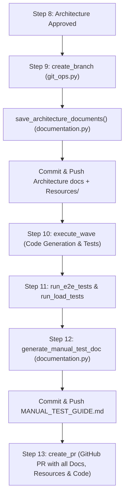

# Implementation Plan: Architecture Documentation & Visual Resources Persistence

## Problem Statement
1. **Missing Git Check-in**: Architecture documents (`STRATEGY.md`, `TACTICAL-PLAN.md`, `ADR-*.md`, and manual testing guides) and uploaded wireframes/screenshots are generated in-memory or stored in temporary paths, but are never written to the target repository filesystem or committed to Git.
2. **Timing Vulnerability**: Waiting until Step 16 to persist architecture documentation means that if code generation (Step 10) encounters build failures, retries, or interruptions, the architecture blueprints are lost from the branch.
3. **Missing Visual Assets**: Uploaded screenshots and wireframes are analyzed by vision models but never archived into the repository for human review.
4. **User Visibility**: The Crucible Web UI needs to provide clear visual feedback confirming where the architecture artifacts were written and committed on the branch.
5. **Documentation Alignment**: `README.md`, `docs/ARCHITECTURE.md`, `docs/CONFIGURATION.md`, and `docs/WORKFLOW.md` must be updated to document this feature-slug folder structure and persistence lifecycle.

---

## Architectural Solution

Use [`documentation.py`](file:///c:/WorkingFolder/homecare-af/src/homecare_agent/graph/nodes/documentation.py) as the centralized documentation persistence engine:
1. **Early Branch Persistence (Step 9)**: Immediately upon branch creation, persist all architectural documents, ADRs, and visual resources into `docs/architecture/<feature-slug>/` (with visual assets in `Resources/`), and commit them to Git as the first commit on the feature branch.
2. **Fault-Tolerant Safety**: Even if code generation in Step 10 encounters compilation errors or timeouts, the architectural foundation and visual mockups are already safely committed on the feature branch.
3. **Late Addition of QA Testing Guide (Step 12)**: After test execution, append `MANUAL_TEST_GUIDE.md` into the same folder and commit it before the PR opens.
4. **Live UI Status Notification**: The Crucible web UI console provides immediate feedback with the path to the checked-in architecture folder and resource files.



---

## Target Directory Structure
```
<repo_path>/
└── docs/
    └── architecture/
        └── <feature-slug>/
            ├── STRATEGY.md
            ├── TACTICAL-PLAN.md
            ├── MANUAL_TEST_GUIDE.md
            ├── adrs/
            │   ├── ADR-001.md
            │   ├── ADR-002.md
            │   └── ...
            └── Resources/
                ├── wireframe_01.png
                ├── mockup_dashboard.png
                └── ...
```

---

## Proposed Changes

### 1. Central Documentation Module ([documentation.py](file:///c:/WorkingFolder/homecare-af/src/homecare_agent/graph/nodes/documentation.py))
- Implement `get_feature_docs_dir(repo_path: Path, feature_name: str) -> Path`:
  - Derives clean kebab-case slug from `feature_name` (e.g. `order-fulfillment-workflow`).
  - Returns `<repo_path>/docs/architecture/<feature-slug>/`.
- Implement `save_architecture_documents(state: AgentState, settings: Settings) -> list[str]`:
  - Creates `<repo_path>/docs/architecture/<feature-slug>/` with subdirectories `adrs/` and `Resources/`.
  - Writes `STRATEGY.md` from `state.get("strategy_document", "")`.
  - Writes `TACTICAL-PLAN.md` from `state.get("tactical_plan", "")`.
  - Writes each ADR to `adrs/ADR-xxx.md` from `state.get("adr_documents", [])`.
  - Copies local screenshot images from `state.get("wireframe_paths", [])` into `Resources/`.
  - Validates all destination paths via `validate_safe_path` to prevent path traversal attacks.
- Implement `save_manual_test_doc(state: AgentState, settings: Settings, content: str) -> str`:
  - Writes `MANUAL_TEST_GUIDE.md` into `<repo_path>/docs/architecture/<feature-slug>/`.
- Update `generate_manual_test_doc`:
  - Stores QA guide in `state["manual_test_doc"]` and calls `save_manual_test_doc`.

---

### 2. Early Branch Commit Flow ([git_ops.py](file:///c:/WorkingFolder/homecare-af/src/homecare_agent/graph/nodes/git_ops.py))
- In `create_branch`:
  - Right after checkout of `branch_name`, call `save_architecture_documents(state, settings)` from `documentation.py`.
  - Stage `docs/architecture/<feature-slug>/`.
  - Commit with message:
    ```
    docs(architecture): add strategy, tactical plan, ADRs, and visual resources for <feature-name>
    ```
  - Push commit to remote (if remote is configured).
  - Return `arch_docs_dir` and `written_doc_files` in the state update.

---

### 3. UI Enhancements ([web.py](file:///c:/WorkingFolder/homecare-af/src/homecare_agent/ui/web.py))
- **Live Execution Console Feedback**:
  - When `create_branch` finishes, display the path confirmation:
    ```
    • ✅ Step completed: create_branch
    📁 Architecture committed to branch: docs/architecture/<feature-slug>/
       ├── STRATEGY.md
       ├── TACTICAL-PLAN.md
       ├── adrs/ (ADRs committed)
       └── Resources/ (Wireframes archived)
    ```
  - When the pipeline completes, output a final summary listing all checked-in artifacts and the PR link.
- **Architecture Tab Reference**:
  - In the **📐 Architecture** tab, add a **QA Testing Guide** subtab alongside *Strategy*, *Tactical Plan*, *ADRs*, and *Architecture Review*.
  - Display the active repository path `docs/architecture/<feature-slug>/` for the current feature.

---

### 4. Framework Documentation Updates

#### [docs/ARCHITECTURE.md](file:///c:/WorkingFolder/homecare-af/docs/ARCHITECTURE.md)
- Update Mermaid diagram and component descriptions to include the documentation node and early architecture persistence.
- Document the feature-scoped architecture folder layout (`docs/architecture/<feature-slug>/`) and asset management in `Resources/`.

#### [docs/CONFIGURATION.md](file:///c:/WorkingFolder/homecare-af/docs/CONFIGURATION.md)
- Document repository output options, path resolutions, and wireframe storage behavior.
- Clarify `REPO_PATH` and documentation persistence behavior.

#### [docs/WORKFLOW.md](file:///c:/WorkingFolder/homecare-af/docs/WORKFLOW.md)
- Update Step 9 (`create_branch`) to document that architectural blueprints, ADRs, and visual mockups in `Resources/` are committed immediately upon branch creation.
- Update Step 15 & 16 to document `MANUAL_TEST_GUIDE.md` persistence and commit.

#### [README.md](file:///c:/WorkingFolder/homecare-af/README.md)
- Update the Architecture and Workflow sections of the root `README.md` to highlight:
  - Feature-scoped architecture packages (`docs/architecture/<feature-slug>/`).
  - Automatic archiving of UI wireframes and screenshots under `Resources/`.
  - Early Git branch commit to protect architecture blueprints from code generation failures.

---

### 5. Automated Tests

#### [tests/test_documentation.py](file:///c:/WorkingFolder/homecare-af/tests/test_documentation.py) & [tests/test_nodes.py](file:///c:/WorkingFolder/homecare-af/tests/test_nodes.py)
- Unit tests for:
  - `save_architecture_documents`: Verifies directory structure, files written, ADR enumeration, and screenshot copying to `Resources/`.
  - `save_manual_test_doc`: Verifies `MANUAL_TEST_GUIDE.md` writing.
  - Slug generation for various feature names.
  - Path traversal security checks.
  - Integration with `create_branch` ensuring early commit on branch.

---

## Verification Plan

### Automated Tests
- `pytest tests/test_documentation.py`
- `pytest tests/test_nodes.py`
- `pytest tests/test_security.py`
- `pytest tests/test_theme.py`
- Full test suite regression run: `pytest` (108+ tests passing).

### Manual Verification
- Verify generated documentation files in `docs/architecture/<feature-slug>/`.
- Launch Crucible UI on port 7860 and verify the updated Architecture tab and live console feedback.
- Confirm `git log` on test feature branch displays:
  1. `docs(architecture): add strategy, tactical plan, ADRs, and visual resources...`
  2. `feat(...): ...` (code wave commits)
  3. `docs(testing): add manual testing guide...`
